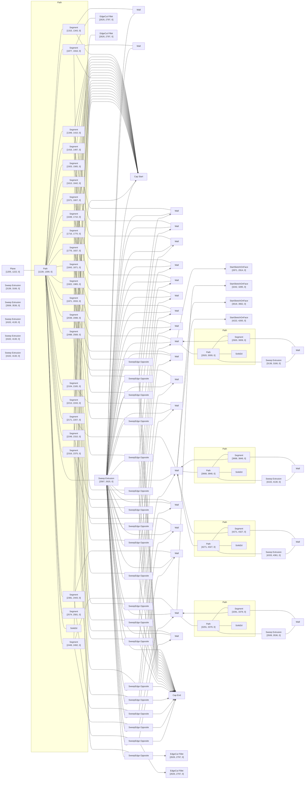

```mermaid
flowchart LR
  subgraph path2 [Path]
    2["Path<br>[1228, 1309, 0]"]
    3["Segment<br>[1315, 1343, 0]"]
    4["Segment<br>[1349, 1410, 0]"]
    5["Segment<br>[1416, 1497, 0]"]
    6["Segment<br>[1503, 1565, 0]"]
    7["Segment<br>[1571, 1607, 0]"]
    8["Segment<br>[1613, 1642, 0]"]
    9["Segment<br>[1648, 1710, 0]"]
    10["Segment<br>[1716, 1770, 0]"]
    11["Segment<br>[1776, 1837, 0]"]
    12["Segment<br>[1843, 1871, 0]"]
    13["Segment<br>[1877, 1916, 0]"]
    14["Segment<br>[1922, 1965, 0]"]
    15["Segment<br>[1971, 2033, 0]"]
    16["Segment<br>[2039, 2098, 0]"]
    17["Segment<br>[2104, 2165, 0]"]
    18["Segment<br>[2171, 2207, 0]"]
    19["Segment<br>[2213, 2243, 0]"]
    20["Segment<br>[2249, 2310, 0]"]
    21["Segment<br>[2316, 2375, 0]"]
    22["Segment<br>[2381, 2443, 0]"]
    23["Segment<br>[2449, 2492, 0]"]
    24["Segment<br>[2498, 2568, 0]"]
    25["Segment<br>[2574, 2581, 0]"]
    26[Solid2d]
  end
  subgraph path73 [Path]
    73["Path<br>[2920, 3009, 0]"]
    74["Segment<br>[2920, 3009, 0]"]
    75[Solid2d]
  end
  subgraph path79 [Path]
    79["Path<br>[3291, 3379, 0]"]
    80["Segment<br>[3291, 3379, 0]"]
    81[Solid2d]
  end
  subgraph path85 [Path]
    85["Path<br>[3668, 3848, 0]"]
    86["Segment<br>[3668, 3848, 0]"]
    87[Solid2d]
  end
  subgraph path93 [Path]
    93["Path<br>[4271, 4327, 0]"]
    94["Segment<br>[4271, 4327, 0]"]
    95[Solid2d]
  end
  1["Plane<br>[1205, 1222, 0]"]
  27["Sweep Extrusion<br>[2587, 2620, 0]"]
  28[Wall]
  29[Wall]
  30[Wall]
  31[Wall]
  32[Wall]
  33[Wall]
  34[Wall]
  35[Wall]
  36[Wall]
  37[Wall]
  38[Wall]
  39[Wall]
  40[Wall]
  41[Wall]
  42[Wall]
  43[Wall]
  44[Wall]
  45[Wall]
  46[Wall]
  47[Wall]
  48["Cap Start"]
  49["Cap End"]
  50["SweepEdge Opposite"]
  51["SweepEdge Opposite"]
  52["SweepEdge Opposite"]
  53["SweepEdge Opposite"]
  54["SweepEdge Opposite"]
  55["SweepEdge Opposite"]
  56["SweepEdge Opposite"]
  57["SweepEdge Opposite"]
  58["SweepEdge Opposite"]
  59["SweepEdge Opposite"]
  60["SweepEdge Opposite"]
  61["SweepEdge Opposite"]
  62["SweepEdge Opposite"]
  63["SweepEdge Opposite"]
  64["SweepEdge Opposite"]
  65["SweepEdge Opposite"]
  66["SweepEdge Opposite"]
  67["SweepEdge Opposite"]
  68["SweepEdge Opposite"]
  69["EdgeCut Fillet<br>[2626, 2797, 0]"]
  70["EdgeCut Fillet<br>[2626, 2797, 0]"]
  71["EdgeCut Fillet<br>[2626, 2797, 0]"]
  72["EdgeCut Fillet<br>[2626, 2797, 0]"]
  76["Sweep Extrusion<br>[3138, 3166, 0]"]
  77[Wall]
  78["Sweep Extrusion<br>[3138, 3166, 0]"]
  82["Sweep Extrusion<br>[3508, 3536, 0]"]
  83[Wall]
  84["Sweep Extrusion<br>[3508, 3536, 0]"]
  88["Sweep Extrusion<br>[4102, 4130, 0]"]
  89[Wall]
  90["Sweep Extrusion<br>[4102, 4130, 0]"]
  91["Sweep Extrusion<br>[4102, 4130, 0]"]
  92["Sweep Extrusion<br>[4102, 4130, 0]"]
  96["Sweep Extrusion<br>[4333, 4361, 0]"]
  97[Wall]
  98["StartSketchOnFace<br>[2871, 2914, 0]"]
  99["StartSketchOnFace<br>[3242, 3285, 0]"]
  100["StartSketchOnFace<br>[3619, 3662, 0]"]
  101["StartSketchOnFace<br>[4222, 4265, 0]"]
  1 --- 2
  2 --- 3
  2 --- 4
  2 --- 5
  2 --- 6
  2 --- 7
  2 --- 8
  2 --- 9
  2 --- 10
  2 --- 11
  2 --- 12
  2 --- 13
  2 --- 14
  2 --- 15
  2 --- 16
  2 --- 17
  2 --- 18
  2 --- 19
  2 --- 20
  2 --- 21
  2 --- 22
  2 --- 23
  2 --- 24
  2 --- 25
  2 ---- 27
  2 --- 26
  3 --- 28
  3 x--> 48
  4 --- 29
  4 --- 50
  4 x--> 48
  5 --- 30
  5 --- 51
  5 x--> 48
  6 --- 31
  6 --- 52
  6 x--> 48
  7 --- 32
  7 --- 53
  7 x--> 48
  9 --- 33
  9 --- 54
  9 x--> 48
  10 --- 34
  10 --- 55
  10 x--> 48
  11 --- 35
  11 --- 56
  11 x--> 48
  12 --- 36
  12 --- 57
  12 x--> 48
  13 --- 37
  13 --- 58
  13 --- 69
  13 x--> 48
  14 --- 38
  14 --- 59
  14 x--> 48
  15 --- 39
  15 --- 60
  15 x--> 48
  16 --- 40
  16 --- 61
  16 x--> 48
  17 --- 41
  17 --- 62
  17 x--> 48
  18 --- 42
  18 --- 63
  18 x--> 48
  20 --- 43
  20 --- 64
  20 x--> 48
  21 --- 44
  21 --- 65
  21 x--> 48
  22 --- 45
  22 --- 66
  22 x--> 48
  23 --- 46
  23 --- 67
  23 x--> 48
  24 --- 47
  24 --- 68
  24 --- 71
  24 x--> 48
  27 --- 28
  27 --- 29
  27 --- 30
  27 --- 31
  27 --- 32
  27 --- 33
  27 --- 34
  27 --- 35
  27 --- 36
  27 --- 37
  27 --- 38
  27 --- 39
  27 --- 40
  27 --- 41
  27 --- 42
  27 --- 43
  27 --- 44
  27 --- 45
  27 --- 46
  27 --- 47
  27 --- 48
  27 --- 49
  27 --- 50
  27 --- 51
  27 --- 52
  27 --- 53
  27 --- 54
  27 --- 55
  27 --- 56
  27 --- 57
  27 --- 58
  27 --- 59
  27 --- 60
  27 --- 61
  27 --- 62
  27 --- 63
  27 --- 64
  27 --- 65
  27 --- 66
  27 --- 67
  27 --- 68
  38 --- 73
  42 --- 85
  42 --- 93
  46 --- 79
  50 <--x 29
  50 <--x 49
  51 <--x 30
  51 <--x 49
  52 <--x 31
  52 <--x 49
  53 <--x 32
  53 <--x 49
  54 <--x 33
  54 <--x 49
  55 <--x 34
  55 <--x 49
  56 <--x 35
  56 <--x 49
  57 <--x 36
  57 <--x 49
  59 <--x 38
  59 <--x 49
  60 <--x 39
  60 <--x 49
  61 <--x 40
  61 <--x 49
  62 <--x 41
  62 <--x 49
  63 <--x 42
  63 <--x 49
  64 <--x 43
  64 <--x 49
  65 <--x 44
  65 <--x 49
  66 <--x 45
  66 <--x 49
  67 <--x 46
  67 <--x 49
  68 <--x 47
  68 <--x 49
  58 <--x 70
  68 <--x 72
  73 --- 74
  73 ---- 76
  73 --- 75
  74 --- 77
  74 <--x 38
  76 --- 77
  79 --- 80
  79 ---- 82
  79 --- 81
  80 --- 83
  80 <--x 46
  82 --- 83
  85 --- 86
  85 ---- 88
  85 --- 87
  86 --- 89
  86 <--x 42
  88 --- 89
  93 --- 94
  93 ---- 96
  93 --- 95
  94 --- 97
  94 <--x 42
  96 --- 97
  38 <--x 98
  46 <--x 99
  42 <--x 100
  42 <--x 101
```
