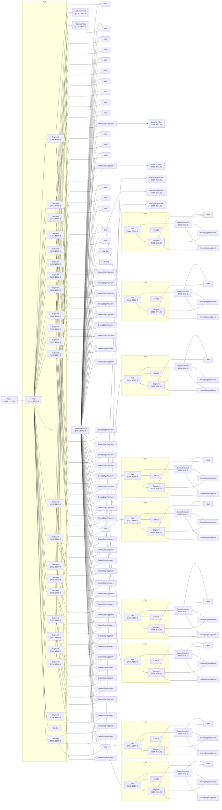

```mermaid
flowchart LR
  subgraph path2 [Path]
    2["Path<br>[1219, 1300, 0]"]
    3["Segment<br>[1306, 1334, 0]"]
    4["Segment<br>[1340, 1428, 0]"]
    5["Segment<br>[1434, 1494, 0]"]
    6["Segment<br>[1500, 1589, 0]"]
    7["Segment<br>[1595, 1631, 0]"]
    8["Segment<br>[1637, 1666, 0]"]
    9["Segment<br>[1672, 1761, 0]"]
    10["Segment<br>[1767, 1809, 0]"]
    11["Segment<br>[1815, 1903, 0]"]
    12["Segment<br>[1909, 1937, 0]"]
    13["Segment<br>[1943, 1982, 0]"]
    14["Segment<br>[1988, 2031, 0]"]
    15["Segment<br>[2037, 2126, 0]"]
    16["Segment<br>[2132, 2179, 0]"]
    17["Segment<br>[2185, 2273, 0]"]
    18["Segment<br>[2279, 2315, 0]"]
    19["Segment<br>[2321, 2351, 0]"]
    20["Segment<br>[2357, 2445, 0]"]
    21["Segment<br>[2451, 2498, 0]"]
    22["Segment<br>[2504, 2593, 0]"]
    23["Segment<br>[2599, 2642, 0]"]
    24["Segment<br>[2648, 2718, 0]"]
    25["Segment<br>[2724, 2731, 0]"]
    26[Solid2d]
  end
  subgraph path94 [Path]
    94["Path<br>[3054, 3197, 0]"]
    95["Segment<br>[3054, 3197, 0]"]
    96[Solid2d]
  end
  subgraph path97 [Path]
    97["Path<br>[3211, 3310, 0]"]
    98["Segment<br>[3211, 3310, 0]"]
    99[Solid2d]
  end
  subgraph path108 [Path]
    108["Path<br>[3486, 3586, 0]"]
    109["Segment<br>[3486, 3586, 0]"]
    110[Solid2d]
  end
  subgraph path111 [Path]
    111["Path<br>[3600, 3744, 0]"]
    112["Segment<br>[3600, 3744, 0]"]
    113[Solid2d]
  end
  subgraph path122 [Path]
    122["Path<br>[3929, 4092, 0]"]
    123["Segment<br>[3929, 4092, 0]"]
    124[Solid2d]
  end
  subgraph path125 [Path]
    125["Path<br>[4106, 4268, 0]"]
    126["Segment<br>[4106, 4268, 0]"]
    127[Solid2d]
  end
  subgraph path128 [Path]
    128["Path<br>[4282, 4444, 0]"]
    129["Segment<br>[4282, 4444, 0]"]
    130[Solid2d]
  end
  subgraph path131 [Path]
    131["Path<br>[4458, 4619, 0]"]
    132["Segment<br>[4458, 4619, 0]"]
    133[Solid2d]
  end
  subgraph path134 [Path]
    134["Path<br>[4633, 4699, 0]"]
    135["Segment<br>[4633, 4699, 0]"]
    136[Solid2d]
  end
  1["Plane<br>[1196, 1213, 0]"]
  27["Sweep Extrusion<br>[2737, 2770, 0]"]
  28[Wall]
  29[Wall]
  30[Wall]
  31[Wall]
  32[Wall]
  33[Wall]
  34[Wall]
  35[Wall]
  36[Wall]
  37[Wall]
  38[Wall]
  39[Wall]
  40[Wall]
  41[Wall]
  42[Wall]
  43[Wall]
  44[Wall]
  45[Wall]
  46[Wall]
  47[Wall]
  48["Cap Start"]
  49["Cap End"]
  50["SweepEdge Opposite"]
  51["SweepEdge Adjacent"]
  52["SweepEdge Opposite"]
  53["SweepEdge Adjacent"]
  54["SweepEdge Opposite"]
  55["SweepEdge Adjacent"]
  56["SweepEdge Opposite"]
  57["SweepEdge Adjacent"]
  58["SweepEdge Opposite"]
  59["SweepEdge Adjacent"]
  60["SweepEdge Opposite"]
  61["SweepEdge Adjacent"]
  62["SweepEdge Opposite"]
  63["SweepEdge Adjacent"]
  64["SweepEdge Opposite"]
  65["SweepEdge Adjacent"]
  66["SweepEdge Opposite"]
  67["SweepEdge Adjacent"]
  68["SweepEdge Opposite"]
  69["SweepEdge Adjacent"]
  70["SweepEdge Opposite"]
  71["SweepEdge Adjacent"]
  72["SweepEdge Opposite"]
  73["SweepEdge Adjacent"]
  74["SweepEdge Opposite"]
  75["SweepEdge Adjacent"]
  76["SweepEdge Opposite"]
  77["SweepEdge Adjacent"]
  78["SweepEdge Opposite"]
  79["SweepEdge Adjacent"]
  80["SweepEdge Opposite"]
  81["SweepEdge Adjacent"]
  82["SweepEdge Opposite"]
  83["SweepEdge Adjacent"]
  84["SweepEdge Opposite"]
  85["SweepEdge Adjacent"]
  86["SweepEdge Opposite"]
  87["SweepEdge Adjacent"]
  88["SweepEdge Opposite"]
  89["SweepEdge Adjacent"]
  90["EdgeCut Fillet<br>[2776, 2947, 0]"]
  91["EdgeCut Fillet<br>[2776, 2947, 0]"]
  92["EdgeCut Fillet<br>[2776, 2947, 0]"]
  93["EdgeCut Fillet<br>[2776, 2947, 0]"]
  100["Sweep Extrusion<br>[3324, 3378, 0]"]
  101[Wall]
  102["SweepEdge Opposite"]
  103["SweepEdge Adjacent"]
  104["Sweep Extrusion<br>[3324, 3378, 0]"]
  105[Wall]
  106["SweepEdge Opposite"]
  107["SweepEdge Adjacent"]
  114["Sweep Extrusion<br>[3758, 3812, 0]"]
  115[Wall]
  116["SweepEdge Opposite"]
  117["SweepEdge Adjacent"]
  118["Sweep Extrusion<br>[3758, 3812, 0]"]
  119[Wall]
  120["SweepEdge Opposite"]
  121["SweepEdge Adjacent"]
  137["Sweep Extrusion<br>[4713, 4834, 0]"]
  138[Wall]
  139["SweepEdge Opposite"]
  140["SweepEdge Adjacent"]
  141["Sweep Extrusion<br>[4713, 4834, 0]"]
  142[Wall]
  143["SweepEdge Opposite"]
  144["SweepEdge Adjacent"]
  145["Sweep Extrusion<br>[4713, 4834, 0]"]
  146[Wall]
  147["SweepEdge Opposite"]
  148["SweepEdge Adjacent"]
  149["Sweep Extrusion<br>[4713, 4834, 0]"]
  150[Wall]
  151["SweepEdge Opposite"]
  152["SweepEdge Adjacent"]
  153["Sweep Extrusion<br>[4713, 4834, 0]"]
  154[Wall]
  155["SweepEdge Opposite"]
  156["SweepEdge Adjacent"]
  157["StartSketchOnFace<br>[3009, 3040, 0]"]
  158["StartSketchOnFace<br>[3441, 3472, 0]"]
  159["StartSketchOnFace<br>[3884, 3915, 0]"]
  1 --- 2
  2 --- 3
  2 --- 4
  2 --- 5
  2 --- 6
  2 --- 7
  2 --- 8
  2 --- 9
  2 --- 10
  2 --- 11
  2 --- 12
  2 --- 13
  2 --- 14
  2 --- 15
  2 --- 16
  2 --- 17
  2 --- 18
  2 --- 19
  2 --- 20
  2 --- 21
  2 --- 22
  2 --- 23
  2 --- 24
  2 --- 25
  2 ---- 27
  2 --- 26
  3 --- 28
  3 --- 50
  3 --- 51
  4 --- 29
  4 --- 52
  4 --- 53
  5 --- 30
  5 --- 54
  5 --- 55
  6 --- 31
  6 --- 56
  6 --- 57
  7 --- 32
  7 --- 58
  7 --- 59
  9 --- 33
  9 --- 60
  9 --- 61
  10 --- 34
  10 --- 62
  10 --- 63
  11 --- 35
  11 --- 64
  11 --- 65
  12 --- 36
  12 --- 66
  12 --- 67
  13 --- 37
  13 --- 68
  13 --- 69
  13 --- 90
  14 --- 38
  14 --- 70
  14 --- 71
  15 --- 39
  15 --- 72
  15 --- 73
  16 --- 40
  16 --- 74
  16 --- 75
  17 --- 41
  17 --- 76
  17 --- 77
  18 --- 42
  18 --- 78
  18 --- 79
  20 --- 43
  20 --- 80
  20 --- 81
  21 --- 44
  21 --- 82
  21 --- 83
  22 --- 45
  22 --- 84
  22 --- 85
  23 --- 46
  23 --- 86
  23 --- 87
  24 --- 47
  24 --- 88
  24 --- 89
  24 --- 92
  27 --- 28
  27 --- 29
  27 --- 30
  27 --- 31
  27 --- 32
  27 --- 33
  27 --- 34
  27 --- 35
  27 --- 36
  27 --- 37
  27 --- 38
  27 --- 39
  27 --- 40
  27 --- 41
  27 --- 42
  27 --- 43
  27 --- 44
  27 --- 45
  27 --- 46
  27 --- 47
  27 --- 48
  27 --- 49
  27 --- 50
  27 --- 51
  27 --- 52
  27 --- 53
  27 --- 54
  27 --- 55
  27 --- 56
  27 --- 57
  27 --- 58
  27 --- 59
  27 --- 60
  27 --- 61
  27 --- 62
  27 --- 63
  27 --- 64
  27 --- 65
  27 --- 66
  27 --- 67
  27 --- 68
  27 --- 69
  27 --- 70
  27 --- 71
  27 --- 72
  27 --- 73
  27 --- 74
  27 --- 75
  27 --- 76
  27 --- 77
  27 --- 78
  27 --- 79
  27 --- 80
  27 --- 81
  27 --- 82
  27 --- 83
  27 --- 84
  27 --- 85
  27 --- 86
  27 --- 87
  27 --- 88
  27 --- 89
  38 --- 108
  38 --- 111
  42 --- 122
  42 --- 125
  42 --- 128
  42 --- 131
  42 --- 134
  46 --- 94
  46 --- 97
  68 <--x 91
  88 <--x 93
  94 --- 95
  94 ---- 100
  94 --- 96
  95 --- 101
  95 --- 102
  95 --- 103
  97 --- 98
  97 ---- 104
  97 --- 99
  98 --- 105
  98 --- 106
  98 --- 107
  100 --- 101
  100 --- 102
  100 --- 103
  104 --- 105
  104 --- 106
  104 --- 107
  108 --- 109
  108 ---- 114
  108 --- 110
  109 --- 115
  109 --- 116
  109 --- 117
  111 --- 112
  111 ---- 118
  111 --- 113
  112 --- 119
  112 --- 120
  112 --- 121
  114 --- 115
  114 --- 116
  114 --- 117
  118 --- 119
  118 --- 120
  118 --- 121
  122 --- 123
  122 ---- 137
  122 --- 124
  123 --- 138
  123 --- 139
  123 --- 140
  125 --- 126
  125 ---- 141
  125 --- 127
  126 --- 142
  126 --- 143
  126 --- 144
  128 --- 129
  128 ---- 145
  128 --- 130
  129 --- 146
  129 --- 147
  129 --- 148
  131 --- 132
  131 ---- 149
  131 --- 133
  132 --- 150
  132 --- 151
  132 --- 152
  134 --- 135
  134 ---- 153
  134 --- 136
  135 --- 154
  135 --- 155
  135 --- 156
  137 --- 138
  137 --- 139
  137 --- 140
  141 --- 142
  141 --- 143
  141 --- 144
  145 --- 146
  145 --- 147
  145 --- 148
  149 --- 150
  149 --- 151
  149 --- 152
  153 --- 154
  153 --- 155
  153 --- 156
  46 <--x 157
  38 <--x 158
  42 <--x 159
```
