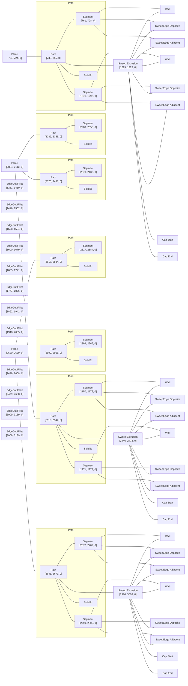

```mermaid
flowchart LR
  subgraph path2 [Path]
    2["Path<br>[730, 755, 0]"]
    3["Segment<br>[761, 798, 0]"]
    4["Segment<br>[1276, 1293, 0]"]
    5[Solid2d]
  end
  subgraph path16 [Path]
    16["Path<br>[2119, 2144, 0]"]
    17["Segment<br>[2150, 2175, 0]"]
    26["Segment<br>[2271, 2278, 0]"]
    27[Solid2d]
  end
  subgraph path28 [Path]
    28["Path<br>[2289, 2355, 0]"]
    29["Segment<br>[2289, 2355, 0]"]
    30[Solid2d]
  end
  subgraph path31 [Path]
    31["Path<br>[2370, 2436, 0]"]
    32["Segment<br>[2370, 2436, 0]"]
    33[Solid2d]
  end
  subgraph path44 [Path]
    44["Path<br>[2645, 2671, 0]"]
    45["Segment<br>[2677, 2702, 0]"]
    48["Segment<br>[2799, 2806, 0]"]
    49[Solid2d]
  end
  subgraph path50 [Path]
    50["Path<br>[2817, 2884, 0]"]
    51["Segment<br>[2817, 2884, 0]"]
    52[Solid2d]
  end
  subgraph path53 [Path]
    53["Path<br>[2899, 2966, 0]"]
    54["Segment<br>[2899, 2966, 0]"]
    55[Solid2d]
  end
  1["Plane<br>[704, 724, 0]"]
  6["Sweep Extrusion<br>[1299, 1325, 0]"]
  7[Wall]
  8[Wall]
  9["Cap Start"]
  10["Cap End"]
  11["SweepEdge Opposite"]
  12["SweepEdge Adjacent"]
  13["SweepEdge Opposite"]
  14["SweepEdge Adjacent"]
  15["Plane<br>[2094, 2113, 0]"]
  18["EdgeCut Fillet<br>[1331, 1410, 0]"]
  19["EdgeCut Fillet<br>[1416, 1502, 0]"]
  20["EdgeCut Fillet<br>[1508, 1594, 0]"]
  21["EdgeCut Fillet<br>[1600, 1679, 0]"]
  22["EdgeCut Fillet<br>[1685, 1771, 0]"]
  23["EdgeCut Fillet<br>[1777, 1856, 0]"]
  24["EdgeCut Fillet<br>[1862, 1942, 0]"]
  25["EdgeCut Fillet<br>[1948, 2035, 0]"]
  34["Sweep Extrusion<br>[2446, 2473, 0]"]
  35[Wall]
  36[Wall]
  37["Cap Start"]
  38["Cap End"]
  39["SweepEdge Opposite"]
  40["SweepEdge Adjacent"]
  41["SweepEdge Opposite"]
  42["SweepEdge Adjacent"]
  43["Plane<br>[2620, 2639, 0]"]
  46["EdgeCut Fillet<br>[2479, 2608, 0]"]
  47["EdgeCut Fillet<br>[2479, 2608, 0]"]
  56["Sweep Extrusion<br>[2976, 3003, 0]"]
  57[Wall]
  58[Wall]
  59["Cap Start"]
  60["Cap End"]
  61["SweepEdge Opposite"]
  62["SweepEdge Adjacent"]
  63["SweepEdge Opposite"]
  64["SweepEdge Adjacent"]
  65["EdgeCut Fillet<br>[3009, 3139, 0]"]
  66["EdgeCut Fillet<br>[3009, 3139, 0]"]
  1 --- 2
  2 --- 3
  2 --- 4
  2 ---- 6
  2 --- 5
  3 --- 8
  3 --- 13
  3 --- 14
  4 --- 7
  4 --- 11
  4 --- 12
  6 --- 7
  6 --- 8
  6 --- 9
  6 --- 10
  6 --- 11
  6 --- 12
  6 --- 13
  6 --- 14
  15 --- 16
  15 --- 28
  15 --- 31
  16 --- 17
  16 --- 26
  16 ---- 34
  16 --- 27
  17 --- 36
  17 --- 41
  17 --- 42
  26 --- 35
  26 --- 39
  26 --- 40
  28 --- 29
  28 --- 30
  31 --- 32
  31 --- 33
  34 --- 35
  34 --- 36
  34 --- 37
  34 --- 38
  34 --- 39
  34 --- 40
  34 --- 41
  34 --- 42
  43 --- 44
  43 --- 50
  43 --- 53
  44 --- 45
  44 --- 48
  44 ---- 56
  44 --- 49
  45 --- 57
  45 --- 61
  45 --- 62
  48 --- 58
  48 --- 63
  48 --- 64
  50 --- 51
  50 --- 52
  53 --- 54
  53 --- 55
  56 --- 57
  56 --- 58
  56 --- 59
  56 --- 60
  56 --- 61
  56 --- 62
  56 --- 63
  56 --- 64
```
