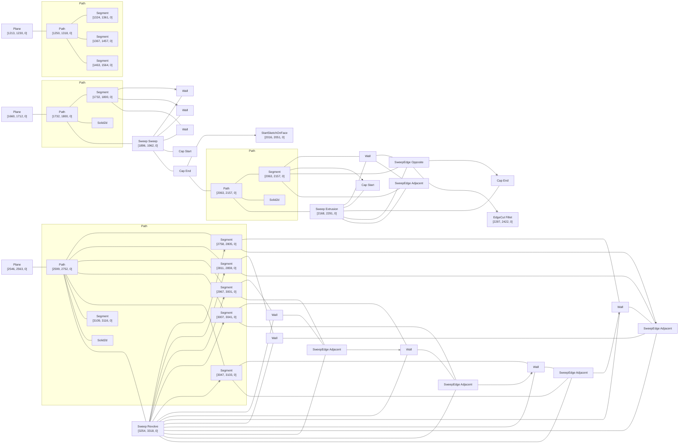

```mermaid
flowchart LR
  subgraph path5 [Path]
    5["Path<br>[1250, 1318, 0]"]
      %% [ProgramBodyItem { index: 16 }, VariableDeclarationDeclaration, VariableDeclarationInit, PipeBodyItem { index: 0 }]
    9["Segment<br>[1324, 1361, 0]"]
      %% [ProgramBodyItem { index: 16 }, VariableDeclarationDeclaration, VariableDeclarationInit, PipeBodyItem { index: 1 }]
    10["Segment<br>[1367, 1457, 0]"]
      %% [ProgramBodyItem { index: 16 }, VariableDeclarationDeclaration, VariableDeclarationInit, PipeBodyItem { index: 2 }]
    11["Segment<br>[1463, 1564, 0]"]
      %% [ProgramBodyItem { index: 16 }, VariableDeclarationDeclaration, VariableDeclarationInit, PipeBodyItem { index: 3 }]
  end
  subgraph path6 [Path]
    6["Path<br>[1732, 1800, 0]"]
      %% [ProgramBodyItem { index: 18 }, VariableDeclarationDeclaration, VariableDeclarationInit]
    12["Segment<br>[1732, 1800, 0]"]
      %% [ProgramBodyItem { index: 18 }, VariableDeclarationDeclaration, VariableDeclarationInit]
    22[Solid2d]
  end
  subgraph path7 [Path]
    7["Path<br>[2063, 2157, 0]"]
      %% [ProgramBodyItem { index: 21 }, VariableDeclarationDeclaration, VariableDeclarationInit]
    13["Segment<br>[2063, 2157, 0]"]
      %% [ProgramBodyItem { index: 21 }, VariableDeclarationDeclaration, VariableDeclarationInit]
    21[Solid2d]
  end
  subgraph path8 [Path]
    8["Path<br>[2599, 2752, 0]"]
      %% [ProgramBodyItem { index: 24 }, VariableDeclarationDeclaration, VariableDeclarationInit, PipeBodyItem { index: 0 }]
    14["Segment<br>[2758, 2805, 0]"]
      %% [ProgramBodyItem { index: 24 }, VariableDeclarationDeclaration, VariableDeclarationInit, PipeBodyItem { index: 1 }]
    15["Segment<br>[2811, 2859, 0]"]
      %% [ProgramBodyItem { index: 24 }, VariableDeclarationDeclaration, VariableDeclarationInit, PipeBodyItem { index: 2 }]
    16["Segment<br>[2967, 3001, 0]"]
      %% [ProgramBodyItem { index: 24 }, VariableDeclarationDeclaration, VariableDeclarationInit, PipeBodyItem { index: 4 }]
    17["Segment<br>[3007, 3041, 0]"]
      %% [ProgramBodyItem { index: 24 }, VariableDeclarationDeclaration, VariableDeclarationInit, PipeBodyItem { index: 5 }]
    18["Segment<br>[3047, 3103, 0]"]
      %% [ProgramBodyItem { index: 24 }, VariableDeclarationDeclaration, VariableDeclarationInit, PipeBodyItem { index: 6 }]
    19["Segment<br>[3109, 3116, 0]"]
      %% [ProgramBodyItem { index: 24 }, VariableDeclarationDeclaration, VariableDeclarationInit, PipeBodyItem { index: 7 }]
    20[Solid2d]
  end
  1["Plane<br>[1213, 1230, 0]"]
    %% [ProgramBodyItem { index: 15 }, VariableDeclarationDeclaration, VariableDeclarationInit]
  2["Plane<br>[1660, 1712, 0]"]
    %% [ProgramBodyItem { index: 17 }, VariableDeclarationDeclaration, VariableDeclarationInit]
  3["Plane<br>[2546, 2563, 0]"]
    %% [ProgramBodyItem { index: 23 }, VariableDeclarationDeclaration, VariableDeclarationInit]
  4["StartSketchOnFace<br>[2016, 2051, 0]"]
    %% [ProgramBodyItem { index: 20 }, VariableDeclarationDeclaration, VariableDeclarationInit]
  23["Sweep Sweep<br>[1896, 1962, 0]"]
    %% [ProgramBodyItem { index: 19 }, VariableDeclarationDeclaration, VariableDeclarationInit]
  24["Sweep Extrusion<br>[2168, 2291, 0]"]
    %% [ProgramBodyItem { index: 22 }, VariableDeclarationDeclaration, VariableDeclarationInit, PipeBodyItem { index: 0 }]
  25["Sweep Revolve<br>[3254, 3318, 0]"]
    %% [ProgramBodyItem { index: 25 }, VariableDeclarationDeclaration, VariableDeclarationInit]
  26[Wall]
    %% face_code_ref=Missing NodePath
  27[Wall]
    %% face_code_ref=Missing NodePath
  28[Wall]
    %% face_code_ref=Missing NodePath
  29[Wall]
    %% face_code_ref=Missing NodePath
  30[Wall]
    %% face_code_ref=Missing NodePath
  31[Wall]
    %% face_code_ref=Missing NodePath
  32[Wall]
    %% face_code_ref=Missing NodePath
  33[Wall]
    %% face_code_ref=Missing NodePath
  34[Wall]
    %% face_code_ref=Missing NodePath
  35["Cap Start"]
    %% face_code_ref=Missing NodePath
  36["Cap Start"]
    %% face_code_ref=Missing NodePath
  37["Cap End"]
    %% face_code_ref=Missing NodePath
  38["Cap End"]
    %% face_code_ref=[ProgramBodyItem { index: 20 }, VariableDeclarationDeclaration, VariableDeclarationInit]
  39["SweepEdge Opposite"]
  40["SweepEdge Adjacent"]
  41["SweepEdge Adjacent"]
  42["SweepEdge Adjacent"]
  43["SweepEdge Adjacent"]
  44["SweepEdge Adjacent"]
  45["EdgeCut Fillet<br>[2297, 2422, 0]"]
    %% [ProgramBodyItem { index: 22 }, VariableDeclarationDeclaration, VariableDeclarationInit, PipeBodyItem { index: 1 }]
  1 --- 5
  2 --- 6
  3 --- 8
  38 x--> 4
  5 --- 9
  5 --- 10
  5 --- 11
  6 --- 12
  6 --- 22
  6 ---- 23
  7 --- 13
  7 --- 21
  7 ---- 24
  38 --- 7
  8 --- 14
  8 --- 15
  8 --- 16
  8 --- 17
  8 --- 18
  8 --- 19
  8 --- 20
  8 ---- 25
  12 <--x 32
  12 <--x 33
  12 --- 34
  13 --- 31
  13 x--> 35
  13 --- 39
  13 --- 44
  25 <--x 14
  14 --- 28
  14 x--> 40
  25 <--x 15
  15 --- 29
  15 --- 40
  25 <--x 16
  16 --- 26
  16 --- 41
  25 <--x 17
  17 --- 27
  17 --- 42
  25 <--x 18
  18 --- 30
  18 --- 43
  23 --- 32
  23 --- 33
  23 --- 34
  23 --- 36
  23 --- 38
  24 --- 31
  24 --- 35
  24 --- 37
  24 --- 39
  24 --- 44
  25 --- 26
  25 --- 27
  25 --- 28
  25 --- 29
  25 --- 30
  25 --- 40
  25 --- 41
  25 --- 42
  25 --- 43
  26 --- 41
  41 <--x 27
  27 --- 42
  28 --- 40
  43 <--x 28
  29 --- 40
  42 <--x 30
  30 --- 43
  31 --- 39
  31 --- 44
  39 <--x 37
  39 <--x 45
```
