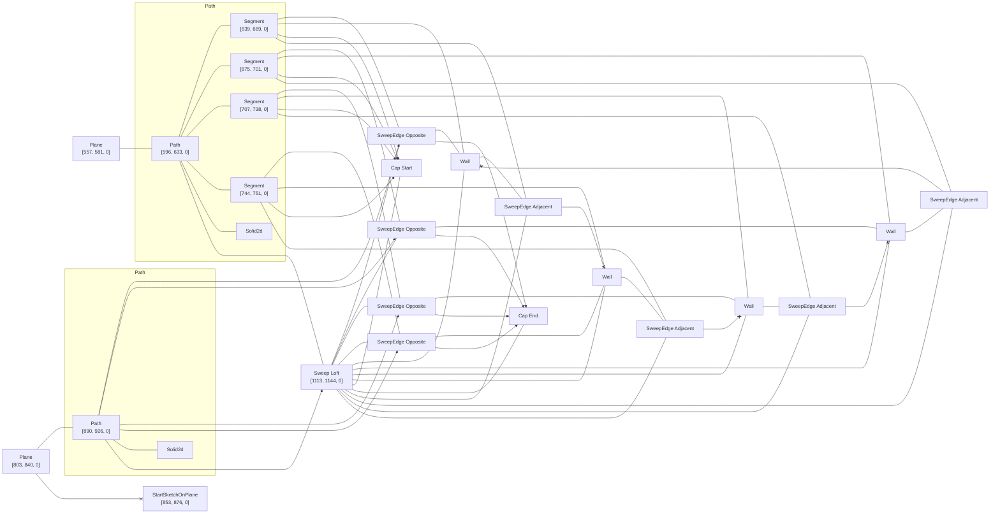

```mermaid
flowchart LR
  subgraph path2 [Path]
    2["Path<br>[596, 633, 0]"]
      %% [ProgramBodyItem { index: 6 }, VariableDeclarationDeclaration, VariableDeclarationInit, PipeBodyItem { index: 0 }]
    3["Segment<br>[639, 669, 0]"]
      %% [ProgramBodyItem { index: 6 }, VariableDeclarationDeclaration, VariableDeclarationInit, PipeBodyItem { index: 1 }]
    4["Segment<br>[675, 701, 0]"]
      %% [ProgramBodyItem { index: 6 }, VariableDeclarationDeclaration, VariableDeclarationInit, PipeBodyItem { index: 2 }]
    5["Segment<br>[707, 738, 0]"]
      %% [ProgramBodyItem { index: 6 }, VariableDeclarationDeclaration, VariableDeclarationInit, PipeBodyItem { index: 3 }]
    6["Segment<br>[744, 751, 0]"]
      %% [ProgramBodyItem { index: 6 }, VariableDeclarationDeclaration, VariableDeclarationInit, PipeBodyItem { index: 4 }]
    7[Solid2d]
  end
  subgraph path9 [Path]
    9["Path<br>[890, 926, 0]"]
      %% [ProgramBodyItem { index: 9 }, VariableDeclarationDeclaration, VariableDeclarationInit, PipeBodyItem { index: 0 }]
    14[Solid2d]
  end
  1["Plane<br>[557, 581, 0]"]
    %% [ProgramBodyItem { index: 5 }, VariableDeclarationDeclaration, VariableDeclarationInit]
  8["Plane<br>[803, 840, 0]"]
    %% [ProgramBodyItem { index: 7 }, VariableDeclarationDeclaration, VariableDeclarationInit]
  10["SweepEdge Opposite"]
  11["SweepEdge Opposite"]
  12["SweepEdge Opposite"]
  13["SweepEdge Opposite"]
  15["Sweep Loft<br>[1113, 1144, 0]"]
    %% [ProgramBodyItem { index: 10 }, VariableDeclarationDeclaration, VariableDeclarationInit]
  16[Wall]
    %% face_code_ref=Missing NodePath
  17[Wall]
    %% face_code_ref=Missing NodePath
  18[Wall]
    %% face_code_ref=Missing NodePath
  19[Wall]
    %% face_code_ref=Missing NodePath
  20["Cap Start"]
    %% face_code_ref=Missing NodePath
  21["Cap End"]
    %% face_code_ref=Missing NodePath
  22["SweepEdge Adjacent"]
  23["SweepEdge Adjacent"]
  24["SweepEdge Adjacent"]
  25["SweepEdge Adjacent"]
  26["StartSketchOnPlane<br>[853, 876, 0]"]
    %% [ProgramBodyItem { index: 8 }, VariableDeclarationDeclaration, VariableDeclarationInit]
  1 --- 2
  2 --- 3
  2 --- 4
  2 --- 5
  2 --- 6
  2 --- 7
  2 ---- 15
  3 --- 10
  3 --- 16
  3 x--> 20
  3 --- 22
  4 --- 11
  4 --- 17
  4 x--> 20
  4 --- 23
  5 --- 12
  5 --- 18
  5 x--> 20
  5 --- 24
  6 --- 13
  6 --- 19
  6 x--> 20
  6 --- 25
  8 --- 9
  8 <--x 26
  9 x--> 10
  9 x--> 11
  9 x--> 12
  9 x--> 13
  9 --- 14
  9 x---> 15
  15 --- 10
  10 --- 16
  10 x--> 21
  15 --- 11
  11 --- 17
  11 x--> 21
  15 --- 12
  12 --- 18
  12 x--> 21
  15 --- 13
  13 --- 19
  13 x--> 21
  15 --- 16
  15 --- 17
  15 --- 18
  15 --- 19
  15 --- 20
  15 --- 21
  15 --- 22
  15 --- 23
  15 --- 24
  15 --- 25
  16 --- 22
  23 <--x 16
  17 --- 23
  24 <--x 17
  18 --- 24
  25 <--x 18
  22 <--x 19
  19 --- 25
```
