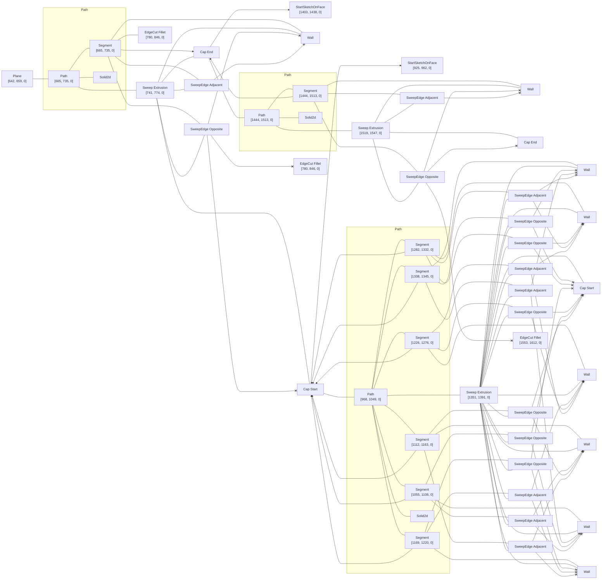

```mermaid
flowchart LR
  subgraph path4 [Path]
    4["Path<br>[665, 735, 0]"]
    7["Segment<br>[665, 735, 0]"]
    16[Solid2d]
  end
  subgraph path5 [Path]
    5["Path<br>[968, 1049, 0]"]
    8["Segment<br>[1055, 1106, 0]"]
    9["Segment<br>[1112, 1163, 0]"]
    10["Segment<br>[1169, 1220, 0]"]
    11["Segment<br>[1226, 1276, 0]"]
    12["Segment<br>[1282, 1332, 0]"]
    13["Segment<br>[1338, 1345, 0]"]
    15[Solid2d]
  end
  subgraph path6 [Path]
    6["Path<br>[1444, 1513, 0]"]
    14["Segment<br>[1444, 1513, 0]"]
    17[Solid2d]
  end
  1["Plane<br>[642, 659, 0]"]
  2["StartSketchOnFace<br>[925, 962, 0]"]
  3["StartSketchOnFace<br>[1403, 1438, 0]"]
  18["Sweep Extrusion<br>[741, 774, 0]"]
  19["Sweep Extrusion<br>[1351, 1391, 0]"]
  20["Sweep Extrusion<br>[1519, 1547, 0]"]
  21[Wall]
  22[Wall]
  23[Wall]
  24[Wall]
  25[Wall]
  26[Wall]
  27[Wall]
  28[Wall]
  29["Cap End"]
  30["Cap Start"]
  31["Cap Start"]
  32["Cap End"]
  33["SweepEdge Opposite"]
  34["SweepEdge Adjacent"]
  35["SweepEdge Opposite"]
  36["SweepEdge Adjacent"]
  37["SweepEdge Opposite"]
  38["SweepEdge Adjacent"]
  39["SweepEdge Opposite"]
  40["SweepEdge Adjacent"]
  41["SweepEdge Opposite"]
  42["SweepEdge Adjacent"]
  43["SweepEdge Opposite"]
  44["SweepEdge Adjacent"]
  45["SweepEdge Opposite"]
  46["SweepEdge Adjacent"]
  47["SweepEdge Opposite"]
  48["SweepEdge Adjacent"]
  49["EdgeCut Fillet<br>[780, 846, 0]"]
  50["EdgeCut Fillet<br>[780, 846, 0]"]
  51["EdgeCut Fillet<br>[1553, 1612, 0]"]
  1 --- 4
  31 x--> 2
  32 x--> 3
  4 --- 7
  4 --- 16
  4 ---- 18
  5 --- 8
  5 --- 9
  5 --- 10
  5 --- 11
  5 --- 12
  5 --- 13
  5 --- 15
  5 ---- 19
  31 --- 5
  6 --- 14
  6 --- 17
  6 ---- 20
  32 --- 6
  7 --- 28
  7 x--> 32
  7 --- 47
  7 --- 48
  7 --- 49
  8 --- 26
  8 x--> 31
  8 --- 43
  8 --- 44
  9 --- 27
  9 x--> 31
  9 --- 45
  9 --- 46
  10 --- 24
  10 x--> 31
  10 --- 39
  10 --- 40
  11 --- 25
  11 x--> 31
  11 --- 41
  11 --- 42
  12 --- 23
  12 x--> 31
  12 --- 37
  12 --- 38
  13 --- 22
  13 x--> 31
  13 --- 35
  13 --- 36
  14 --- 21
  14 x--> 32
  14 --- 33
  14 --- 34
  18 --- 28
  18 --- 31
  18 --- 32
  18 --- 47
  18 --- 48
  19 --- 22
  19 --- 23
  19 --- 24
  19 --- 25
  19 --- 26
  19 --- 27
  19 --- 30
  19 --- 35
  19 --- 36
  19 --- 37
  19 --- 38
  19 --- 39
  19 --- 40
  19 --- 41
  19 --- 42
  19 --- 43
  19 --- 44
  19 --- 45
  19 --- 46
  20 --- 21
  20 --- 29
  20 --- 33
  20 --- 34
  33 <--x 21
  34 <--x 21
  35 <--x 22
  36 <--x 22
  38 <--x 22
  37 <--x 23
  38 <--x 23
  42 <--x 23
  39 <--x 24
  40 <--x 24
  46 <--x 24
  40 <--x 25
  41 <--x 25
  42 <--x 25
  36 <--x 26
  43 <--x 26
  44 <--x 26
  44 <--x 27
  45 <--x 27
  46 <--x 27
  47 <--x 28
  48 <--x 28
  33 <--x 29
  35 <--x 30
  37 <--x 30
  39 <--x 30
  41 <--x 30
  43 <--x 30
  45 <--x 30
  47 <--x 31
  33 <--x 51
  47 <--x 50
```
