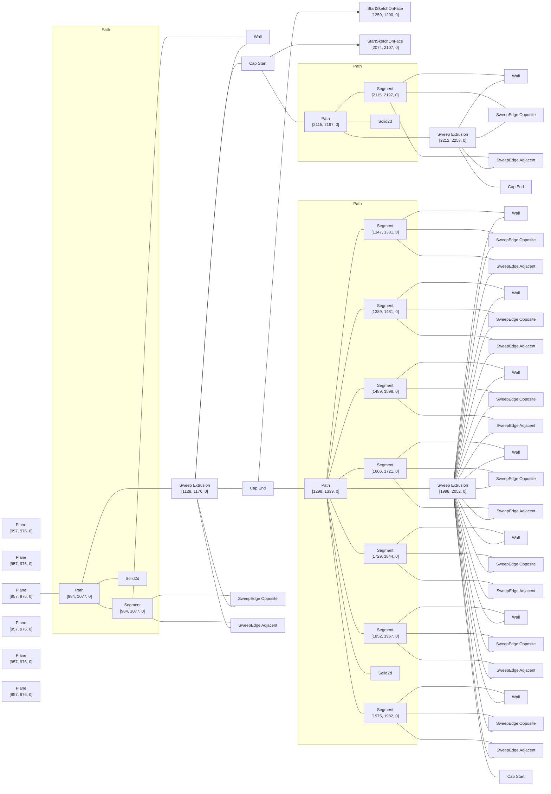

```mermaid
flowchart LR
  subgraph path7 [Path]
    7["Path<br>[984, 1077, 0]"]
    8["Segment<br>[984, 1077, 0]"]
    9[Solid2d]
  end
  subgraph path16 [Path]
    16["Path<br>[1298, 1339, 0]"]
    17["Segment<br>[1347, 1381, 0]"]
    18["Segment<br>[1389, 1481, 0]"]
    19["Segment<br>[1489, 1598, 0]"]
    20["Segment<br>[1606, 1721, 0]"]
    21["Segment<br>[1729, 1844, 0]"]
    22["Segment<br>[1852, 1967, 0]"]
    23["Segment<br>[1975, 1982, 0]"]
    24[Solid2d]
  end
  subgraph path48 [Path]
    48["Path<br>[2115, 2197, 0]"]
    49["Segment<br>[2115, 2197, 0]"]
    50[Solid2d]
  end
  1["Plane<br>[957, 976, 0]"]
  2["Plane<br>[957, 976, 0]"]
  3["Plane<br>[957, 976, 0]"]
  4["Plane<br>[957, 976, 0]"]
  5["Plane<br>[957, 976, 0]"]
  6["Plane<br>[957, 976, 0]"]
  10["Sweep Extrusion<br>[1128, 1176, 0]"]
  11[Wall]
  12["Cap Start"]
  13["Cap End"]
  14["SweepEdge Opposite"]
  15["SweepEdge Adjacent"]
  25["Sweep Extrusion<br>[1998, 2052, 0]"]
  26[Wall]
  27[Wall]
  28[Wall]
  29[Wall]
  30[Wall]
  31[Wall]
  32[Wall]
  33["Cap Start"]
  34["SweepEdge Opposite"]
  35["SweepEdge Adjacent"]
  36["SweepEdge Opposite"]
  37["SweepEdge Adjacent"]
  38["SweepEdge Opposite"]
  39["SweepEdge Adjacent"]
  40["SweepEdge Opposite"]
  41["SweepEdge Adjacent"]
  42["SweepEdge Opposite"]
  43["SweepEdge Adjacent"]
  44["SweepEdge Opposite"]
  45["SweepEdge Adjacent"]
  46["SweepEdge Opposite"]
  47["SweepEdge Adjacent"]
  51["Sweep Extrusion<br>[2212, 2253, 0]"]
  52[Wall]
  53["Cap End"]
  54["SweepEdge Opposite"]
  55["SweepEdge Adjacent"]
  56["StartSketchOnFace<br>[1259, 1290, 0]"]
  57["StartSketchOnFace<br>[2074, 2107, 0]"]
  3 --- 7
  7 --- 8
  7 ---- 10
  7 --- 9
  8 --- 11
  8 --- 14
  8 --- 15
  10 --- 11
  10 --- 12
  10 --- 13
  10 --- 14
  10 --- 15
  12 --- 48
  13 --- 16
  16 --- 17
  16 --- 18
  16 --- 19
  16 --- 20
  16 --- 21
  16 --- 22
  16 --- 23
  16 ---- 25
  16 --- 24
  17 --- 32
  17 --- 46
  17 --- 47
  18 --- 31
  18 --- 44
  18 --- 45
  19 --- 30
  19 --- 42
  19 --- 43
  20 --- 29
  20 --- 40
  20 --- 41
  21 --- 28
  21 --- 38
  21 --- 39
  22 --- 27
  22 --- 36
  22 --- 37
  23 --- 26
  23 --- 34
  23 --- 35
  25 --- 26
  25 --- 27
  25 --- 28
  25 --- 29
  25 --- 30
  25 --- 31
  25 --- 32
  25 --- 33
  25 --- 34
  25 --- 35
  25 --- 36
  25 --- 37
  25 --- 38
  25 --- 39
  25 --- 40
  25 --- 41
  25 --- 42
  25 --- 43
  25 --- 44
  25 --- 45
  25 --- 46
  25 --- 47
  48 --- 49
  48 ---- 51
  48 --- 50
  49 --- 52
  49 --- 54
  49 --- 55
  51 --- 52
  51 --- 53
  51 --- 54
  51 --- 55
  13 <--x 56
  12 <--x 57
```
