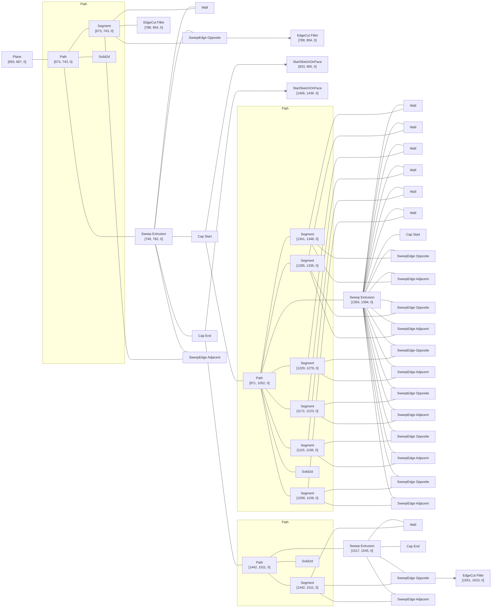

```mermaid
flowchart LR
  subgraph path2 [Path]
    2["Path<br>[673, 743, 0]"]
    3["Segment<br>[673, 743, 0]"]
    4[Solid2d]
  end
  subgraph path13 [Path]
    13["Path<br>[971, 1052, 0]"]
    14["Segment<br>[1058, 1109, 0]"]
    15["Segment<br>[1115, 1166, 0]"]
    16["Segment<br>[1172, 1223, 0]"]
    17["Segment<br>[1229, 1279, 0]"]
    18["Segment<br>[1285, 1335, 0]"]
    19["Segment<br>[1341, 1348, 0]"]
    20[Solid2d]
  end
  subgraph path41 [Path]
    41["Path<br>[1442, 1511, 0]"]
    42["Segment<br>[1442, 1511, 0]"]
    43[Solid2d]
  end
  1["Plane<br>[650, 667, 0]"]
  5["Sweep Extrusion<br>[749, 782, 0]"]
  6[Wall]
  7["Cap Start"]
  8["Cap End"]
  9["SweepEdge Opposite"]
  10["SweepEdge Adjacent"]
  11["EdgeCut Fillet<br>[788, 854, 0]"]
  12["EdgeCut Fillet<br>[788, 854, 0]"]
  21["Sweep Extrusion<br>[1354, 1394, 0]"]
  22[Wall]
  23[Wall]
  24[Wall]
  25[Wall]
  26[Wall]
  27[Wall]
  28["Cap Start"]
  29["SweepEdge Opposite"]
  30["SweepEdge Adjacent"]
  31["SweepEdge Opposite"]
  32["SweepEdge Adjacent"]
  33["SweepEdge Opposite"]
  34["SweepEdge Adjacent"]
  35["SweepEdge Opposite"]
  36["SweepEdge Adjacent"]
  37["SweepEdge Opposite"]
  38["SweepEdge Adjacent"]
  39["SweepEdge Opposite"]
  40["SweepEdge Adjacent"]
  44["Sweep Extrusion<br>[1517, 1545, 0]"]
  45[Wall]
  46["Cap End"]
  47["SweepEdge Opposite"]
  48["SweepEdge Adjacent"]
  49["EdgeCut Fillet<br>[1551, 1610, 0]"]
  50["StartSketchOnFace<br>[933, 965, 0]"]
  51["StartSketchOnFace<br>[1406, 1436, 0]"]
  1 --- 2
  2 --- 3
  2 ---- 5
  2 --- 4
  3 --- 6
  3 --- 9
  3 --- 10
  3 --- 11
  5 --- 6
  5 --- 7
  5 --- 8
  5 --- 9
  5 --- 10
  7 --- 13
  8 --- 41
  9 <--x 12
  13 --- 14
  13 --- 15
  13 --- 16
  13 --- 17
  13 --- 18
  13 --- 19
  13 ---- 21
  13 --- 20
  14 --- 27
  14 --- 39
  14 --- 40
  15 --- 26
  15 --- 37
  15 --- 38
  16 --- 25
  16 --- 35
  16 --- 36
  17 --- 24
  17 --- 33
  17 --- 34
  18 --- 23
  18 --- 31
  18 --- 32
  19 --- 22
  19 --- 29
  19 --- 30
  21 --- 22
  21 --- 23
  21 --- 24
  21 --- 25
  21 --- 26
  21 --- 27
  21 --- 28
  21 --- 29
  21 --- 30
  21 --- 31
  21 --- 32
  21 --- 33
  21 --- 34
  21 --- 35
  21 --- 36
  21 --- 37
  21 --- 38
  21 --- 39
  21 --- 40
  41 --- 42
  41 ---- 44
  41 --- 43
  42 --- 45
  42 --- 47
  42 --- 48
  44 --- 45
  44 --- 46
  44 --- 47
  44 --- 48
  47 <--x 49
  7 <--x 50
  8 <--x 51
```
