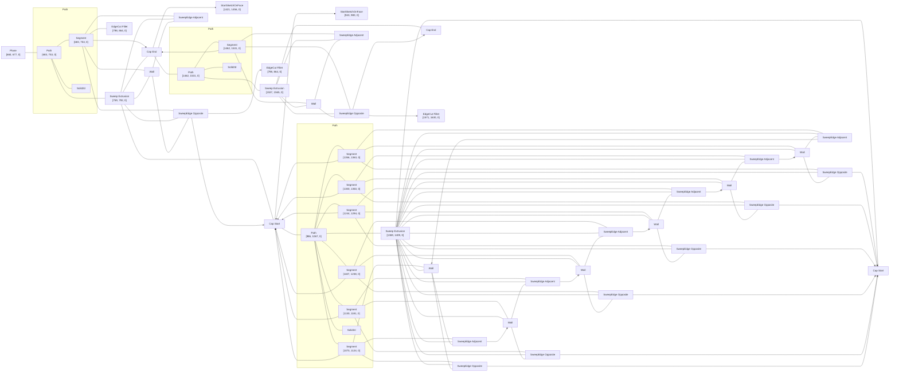

```mermaid
flowchart LR
  subgraph path4 [Path]
    4["Path<br>[683, 753, 0]"]
      %% [ProgramBodyItem { index: 6 }, VariableDeclarationDeclaration, VariableDeclarationInit, PipeBodyItem { index: 1 }]
    7["Segment<br>[683, 753, 0]"]
      %% [ProgramBodyItem { index: 6 }, VariableDeclarationDeclaration, VariableDeclarationInit, PipeBodyItem { index: 1 }]
    15[Solid2d]
  end
  subgraph path5 [Path]
    5["Path<br>[986, 1067, 0]"]
      %% [ProgramBodyItem { index: 7 }, VariableDeclarationDeclaration, VariableDeclarationInit, PipeBodyItem { index: 1 }]
    8["Segment<br>[1073, 1124, 0]"]
      %% [ProgramBodyItem { index: 7 }, VariableDeclarationDeclaration, VariableDeclarationInit, PipeBodyItem { index: 2 }]
    9["Segment<br>[1130, 1181, 0]"]
      %% [ProgramBodyItem { index: 7 }, VariableDeclarationDeclaration, VariableDeclarationInit, PipeBodyItem { index: 3 }]
    10["Segment<br>[1187, 1238, 0]"]
      %% [ProgramBodyItem { index: 7 }, VariableDeclarationDeclaration, VariableDeclarationInit, PipeBodyItem { index: 4 }]
    11["Segment<br>[1244, 1294, 0]"]
      %% [ProgramBodyItem { index: 7 }, VariableDeclarationDeclaration, VariableDeclarationInit, PipeBodyItem { index: 5 }]
    12["Segment<br>[1300, 1350, 0]"]
      %% [ProgramBodyItem { index: 7 }, VariableDeclarationDeclaration, VariableDeclarationInit, PipeBodyItem { index: 6 }]
    13["Segment<br>[1356, 1363, 0]"]
      %% [ProgramBodyItem { index: 7 }, VariableDeclarationDeclaration, VariableDeclarationInit, PipeBodyItem { index: 7 }]
    17[Solid2d]
  end
  subgraph path6 [Path]
    6["Path<br>[1462, 1531, 0]"]
      %% [ProgramBodyItem { index: 8 }, VariableDeclarationDeclaration, VariableDeclarationInit, PipeBodyItem { index: 1 }]
    14["Segment<br>[1462, 1531, 0]"]
      %% [ProgramBodyItem { index: 8 }, VariableDeclarationDeclaration, VariableDeclarationInit, PipeBodyItem { index: 1 }]
    16[Solid2d]
  end
  1["Plane<br>[660, 677, 0]"]
    %% [ProgramBodyItem { index: 6 }, VariableDeclarationDeclaration, VariableDeclarationInit, PipeBodyItem { index: 0 }]
  2["StartSketchOnFace<br>[943, 980, 0]"]
    %% [ProgramBodyItem { index: 7 }, VariableDeclarationDeclaration, VariableDeclarationInit, PipeBodyItem { index: 0 }]
  3["StartSketchOnFace<br>[1421, 1456, 0]"]
    %% [ProgramBodyItem { index: 8 }, VariableDeclarationDeclaration, VariableDeclarationInit, PipeBodyItem { index: 0 }]
  18["Sweep Extrusion<br>[759, 792, 0]"]
    %% [ProgramBodyItem { index: 6 }, VariableDeclarationDeclaration, VariableDeclarationInit, PipeBodyItem { index: 2 }]
  19["Sweep Extrusion<br>[1369, 1409, 0]"]
    %% [ProgramBodyItem { index: 7 }, VariableDeclarationDeclaration, VariableDeclarationInit, PipeBodyItem { index: 8 }]
  20["Sweep Extrusion<br>[1537, 1565, 0]"]
    %% [ProgramBodyItem { index: 8 }, VariableDeclarationDeclaration, VariableDeclarationInit, PipeBodyItem { index: 2 }]
  21[Wall]
  22[Wall]
  23[Wall]
  24[Wall]
  25[Wall]
  26[Wall]
  27[Wall]
  28[Wall]
  29["Cap Start"]
  30["Cap Start"]
  31["Cap End"]
  32["Cap End"]
  33["SweepEdge Opposite"]
  34["SweepEdge Opposite"]
  35["SweepEdge Opposite"]
  36["SweepEdge Opposite"]
  37["SweepEdge Opposite"]
  38["SweepEdge Opposite"]
  39["SweepEdge Opposite"]
  40["SweepEdge Opposite"]
  41["SweepEdge Adjacent"]
  42["SweepEdge Adjacent"]
  43["SweepEdge Adjacent"]
  44["SweepEdge Adjacent"]
  45["SweepEdge Adjacent"]
  46["SweepEdge Adjacent"]
  47["SweepEdge Adjacent"]
  48["SweepEdge Adjacent"]
  49["EdgeCut Fillet<br>[798, 864, 0]"]
    %% [ProgramBodyItem { index: 6 }, VariableDeclarationDeclaration, VariableDeclarationInit, PipeBodyItem { index: 3 }]
  50["EdgeCut Fillet<br>[798, 864, 0]"]
    %% [ProgramBodyItem { index: 6 }, VariableDeclarationDeclaration, VariableDeclarationInit, PipeBodyItem { index: 3 }]
  51["EdgeCut Fillet<br>[1571, 1630, 0]"]
    %% [ProgramBodyItem { index: 8 }, VariableDeclarationDeclaration, VariableDeclarationInit, PipeBodyItem { index: 3 }]
  1 --- 4
  29 x--> 2
  31 x--> 3
  4 --- 7
  4 --- 15
  4 ---- 18
  5 --- 8
  5 --- 9
  5 --- 10
  5 --- 11
  5 --- 12
  5 --- 13
  5 --- 17
  5 ---- 19
  29 --- 5
  6 --- 14
  6 --- 16
  6 ---- 20
  31 --- 6
  7 --- 28
  7 x--> 31
  7 --- 40
  7 --- 48
  7 --- 50
  8 --- 26
  8 x--> 29
  8 --- 39
  8 --- 47
  9 --- 23
  9 x--> 29
  9 --- 38
  9 --- 46
  10 --- 27
  10 x--> 29
  10 --- 37
  10 --- 45
  11 --- 22
  11 x--> 29
  11 --- 36
  11 --- 44
  12 --- 24
  12 x--> 29
  12 --- 35
  12 --- 43
  13 --- 25
  13 x--> 29
  13 --- 34
  13 --- 42
  14 --- 21
  14 x--> 31
  14 --- 33
  14 --- 41
  18 --- 28
  18 --- 29
  18 --- 31
  18 --- 40
  18 --- 48
  19 --- 22
  19 --- 23
  19 --- 24
  19 --- 25
  19 --- 26
  19 --- 27
  19 --- 30
  19 --- 34
  19 --- 35
  19 --- 36
  19 --- 37
  19 --- 38
  19 --- 39
  19 --- 42
  19 --- 43
  19 --- 44
  19 --- 45
  19 --- 46
  19 --- 47
  20 --- 21
  20 --- 32
  20 --- 33
  20 --- 41
  21 --- 33
  21 --- 41
  22 --- 36
  22 --- 44
  45 <--x 22
  23 --- 38
  23 --- 46
  47 <--x 23
  24 --- 35
  24 --- 43
  44 <--x 24
  25 --- 34
  25 --- 42
  43 <--x 25
  26 --- 39
  42 <--x 26
  26 --- 47
  27 --- 37
  27 --- 45
  46 <--x 27
  28 --- 40
  28 --- 48
  40 <--x 29
  34 <--x 30
  35 <--x 30
  36 <--x 30
  37 <--x 30
  38 <--x 30
  39 <--x 30
  33 <--x 32
  33 <--x 51
  40 <--x 49
```
