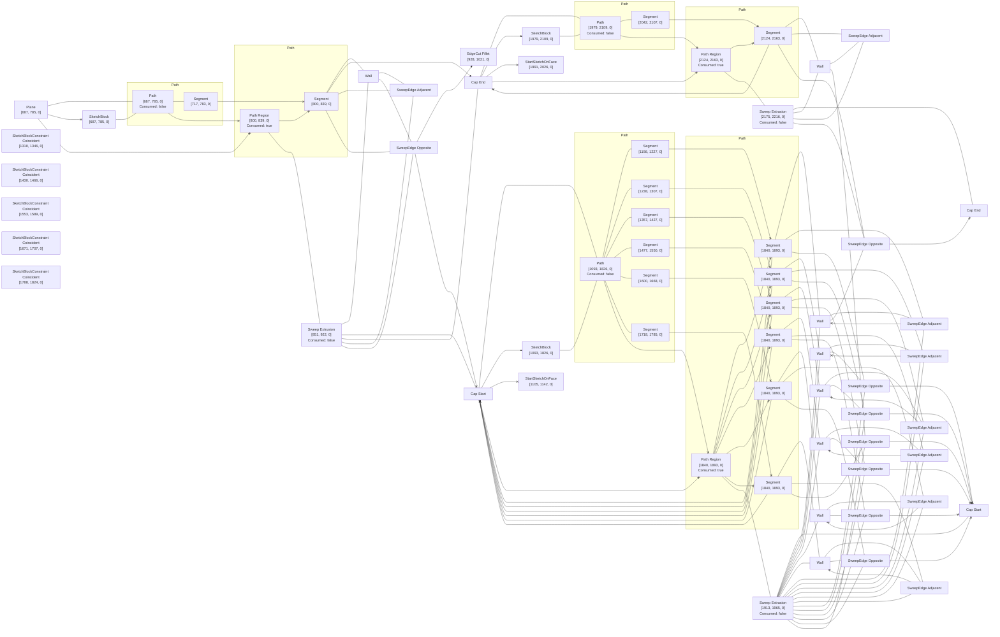

```mermaid
flowchart LR
  subgraph path11 [Path]
    11["Path<br>[687, 785, 0]<br>Consumed: false"]
      %% [ProgramBodyItem { index: 6 }, VariableDeclarationDeclaration, VariableDeclarationInit]
    14["Segment<br>[717, 783, 0]"]
      %% [ProgramBodyItem { index: 6 }, VariableDeclarationDeclaration, VariableDeclarationInit, SketchBlockBody, SketchBlockBodyItem { index: 0 }, VariableDeclarationDeclaration, VariableDeclarationInit]
  end
  subgraph path15 [Path]
    15["Path Region<br>[800, 839, 0]<br>Consumed: true"]
      %% [ProgramBodyItem { index: 7 }, VariableDeclarationDeclaration, VariableDeclarationInit]
    16["Segment<br>[800, 839, 0]"]
      %% [ProgramBodyItem { index: 7 }, VariableDeclarationDeclaration, VariableDeclarationInit]
  end
  subgraph path19 [Path]
    19["Path<br>[1093, 1826, 0]<br>Consumed: false"]
      %% [ProgramBodyItem { index: 9 }, VariableDeclarationDeclaration, VariableDeclarationInit]
    23["Segment<br>[1156, 1227, 0]"]
      %% [ProgramBodyItem { index: 9 }, VariableDeclarationDeclaration, VariableDeclarationInit, SketchBlockBody, SketchBlockBodyItem { index: 0 }, VariableDeclarationDeclaration, VariableDeclarationInit]
    24["Segment<br>[1238, 1307, 0]"]
      %% [ProgramBodyItem { index: 9 }, VariableDeclarationDeclaration, VariableDeclarationInit, SketchBlockBody, SketchBlockBodyItem { index: 1 }, VariableDeclarationDeclaration, VariableDeclarationInit]
    26["Segment<br>[1357, 1427, 0]"]
      %% [ProgramBodyItem { index: 9 }, VariableDeclarationDeclaration, VariableDeclarationInit, SketchBlockBody, SketchBlockBodyItem { index: 3 }, VariableDeclarationDeclaration, VariableDeclarationInit]
    28["Segment<br>[1477, 1550, 0]"]
      %% [ProgramBodyItem { index: 9 }, VariableDeclarationDeclaration, VariableDeclarationInit, SketchBlockBody, SketchBlockBodyItem { index: 5 }, VariableDeclarationDeclaration, VariableDeclarationInit]
    30["Segment<br>[1600, 1668, 0]"]
      %% [ProgramBodyItem { index: 9 }, VariableDeclarationDeclaration, VariableDeclarationInit, SketchBlockBody, SketchBlockBodyItem { index: 7 }, VariableDeclarationDeclaration, VariableDeclarationInit]
    32["Segment<br>[1718, 1785, 0]"]
      %% [ProgramBodyItem { index: 9 }, VariableDeclarationDeclaration, VariableDeclarationInit, SketchBlockBody, SketchBlockBodyItem { index: 9 }, VariableDeclarationDeclaration, VariableDeclarationInit]
  end
  subgraph path34 [Path]
    34["Path Region<br>[1840, 1893, 0]<br>Consumed: true"]
      %% [ProgramBodyItem { index: 10 }, VariableDeclarationDeclaration, VariableDeclarationInit]
    35["Segment<br>[1840, 1893, 0]"]
      %% [ProgramBodyItem { index: 10 }, VariableDeclarationDeclaration, VariableDeclarationInit]
    36["Segment<br>[1840, 1893, 0]"]
      %% [ProgramBodyItem { index: 10 }, VariableDeclarationDeclaration, VariableDeclarationInit]
    37["Segment<br>[1840, 1893, 0]"]
      %% [ProgramBodyItem { index: 10 }, VariableDeclarationDeclaration, VariableDeclarationInit]
    38["Segment<br>[1840, 1893, 0]"]
      %% [ProgramBodyItem { index: 10 }, VariableDeclarationDeclaration, VariableDeclarationInit]
    39["Segment<br>[1840, 1893, 0]"]
      %% [ProgramBodyItem { index: 10 }, VariableDeclarationDeclaration, VariableDeclarationInit]
    40["Segment<br>[1840, 1893, 0]"]
      %% [ProgramBodyItem { index: 10 }, VariableDeclarationDeclaration, VariableDeclarationInit]
  end
  subgraph path42 [Path]
    42["Path<br>[1979, 2109, 0]<br>Consumed: false"]
      %% [ProgramBodyItem { index: 12 }, VariableDeclarationDeclaration, VariableDeclarationInit]
    46["Segment<br>[2042, 2107, 0]"]
      %% [ProgramBodyItem { index: 12 }, VariableDeclarationDeclaration, VariableDeclarationInit, SketchBlockBody, SketchBlockBodyItem { index: 0 }, VariableDeclarationDeclaration, VariableDeclarationInit]
  end
  subgraph path47 [Path]
    47["Path Region<br>[2124, 2163, 0]<br>Consumed: true"]
      %% [ProgramBodyItem { index: 13 }, VariableDeclarationDeclaration, VariableDeclarationInit]
    48["Segment<br>[2124, 2163, 0]"]
      %% [ProgramBodyItem { index: 13 }, VariableDeclarationDeclaration, VariableDeclarationInit]
  end
  1["Cap End"]
    %% face_code_ref=Missing NodePath
  2["Cap Start"]
    %% face_code_ref=Missing NodePath
  3[Wall]
    %% face_code_ref=Missing NodePath
  4[Wall]
    %% face_code_ref=Missing NodePath
  5[Wall]
    %% face_code_ref=Missing NodePath
  6[Wall]
    %% face_code_ref=Missing NodePath
  7[Wall]
    %% face_code_ref=Missing NodePath
  8[Wall]
    %% face_code_ref=Missing NodePath
  9[Wall]
    %% face_code_ref=Missing NodePath
  10[Wall]
    %% face_code_ref=Missing NodePath
  12["Plane<br>[687, 785, 0]"]
    %% [ProgramBodyItem { index: 6 }, VariableDeclarationDeclaration, VariableDeclarationInit]
  13["SketchBlock<br>[687, 785, 0]"]
    %% [ProgramBodyItem { index: 6 }, VariableDeclarationDeclaration, VariableDeclarationInit]
  17["Sweep Extrusion<br>[851, 922, 0]<br>Consumed: false"]
    %% [ProgramBodyItem { index: 8 }, VariableDeclarationDeclaration, VariableDeclarationInit, PipeBodyItem { index: 0 }]
  18["EdgeCut Fillet<br>[928, 1021, 0]"]
    %% [ProgramBodyItem { index: 8 }, VariableDeclarationDeclaration, VariableDeclarationInit, PipeBodyItem { index: 1 }]
  20["SketchBlock<br>[1093, 1826, 0]"]
    %% [ProgramBodyItem { index: 9 }, VariableDeclarationDeclaration, VariableDeclarationInit]
  21["Cap Start"]
    %% face_code_ref=[ProgramBodyItem { index: 9 }, VariableDeclarationDeclaration, VariableDeclarationInit, SketchBlockArgs]
  22["StartSketchOnFace<br>[1105, 1142, 0]"]
    %% [ProgramBodyItem { index: 9 }, VariableDeclarationDeclaration, VariableDeclarationInit, SketchBlockArgs]
  25["SketchBlockConstraint Coincident<br>[1310, 1346, 0]"]
    %% [ProgramBodyItem { index: 9 }, VariableDeclarationDeclaration, VariableDeclarationInit, SketchBlockBody, SketchBlockBodyItem { index: 2 }, ExpressionStatementExpr]
  27["SketchBlockConstraint Coincident<br>[1430, 1466, 0]"]
    %% [ProgramBodyItem { index: 9 }, VariableDeclarationDeclaration, VariableDeclarationInit, SketchBlockBody, SketchBlockBodyItem { index: 4 }, ExpressionStatementExpr]
  29["SketchBlockConstraint Coincident<br>[1553, 1589, 0]"]
    %% [ProgramBodyItem { index: 9 }, VariableDeclarationDeclaration, VariableDeclarationInit, SketchBlockBody, SketchBlockBodyItem { index: 6 }, ExpressionStatementExpr]
  31["SketchBlockConstraint Coincident<br>[1671, 1707, 0]"]
    %% [ProgramBodyItem { index: 9 }, VariableDeclarationDeclaration, VariableDeclarationInit, SketchBlockBody, SketchBlockBodyItem { index: 8 }, ExpressionStatementExpr]
  33["SketchBlockConstraint Coincident<br>[1788, 1824, 0]"]
    %% [ProgramBodyItem { index: 9 }, VariableDeclarationDeclaration, VariableDeclarationInit, SketchBlockBody, SketchBlockBodyItem { index: 10 }, ExpressionStatementExpr]
  41["Sweep Extrusion<br>[1913, 1965, 0]<br>Consumed: false"]
    %% [ProgramBodyItem { index: 11 }, VariableDeclarationDeclaration, VariableDeclarationInit]
  43["SketchBlock<br>[1979, 2109, 0]"]
    %% [ProgramBodyItem { index: 12 }, VariableDeclarationDeclaration, VariableDeclarationInit]
  44["Cap End"]
    %% face_code_ref=[ProgramBodyItem { index: 12 }, VariableDeclarationDeclaration, VariableDeclarationInit, SketchBlockArgs]
  45["StartSketchOnFace<br>[1991, 2026, 0]"]
    %% [ProgramBodyItem { index: 12 }, VariableDeclarationDeclaration, VariableDeclarationInit, SketchBlockArgs]
  49["Sweep Extrusion<br>[2175, 2216, 0]<br>Consumed: false"]
    %% [ProgramBodyItem { index: 14 }, VariableDeclarationDeclaration, VariableDeclarationInit, PipeBodyItem { index: 0 }]
  50["SweepEdge Adjacent"]
  51["SweepEdge Adjacent"]
  52["SweepEdge Adjacent"]
  53["SweepEdge Adjacent"]
  54["SweepEdge Adjacent"]
  55["SweepEdge Adjacent"]
  56["SweepEdge Adjacent"]
  57["SweepEdge Adjacent"]
  58["SweepEdge Opposite"]
  59["SweepEdge Opposite"]
  60["SweepEdge Opposite"]
  61["SweepEdge Opposite"]
  62["SweepEdge Opposite"]
  63["SweepEdge Opposite"]
  64["SweepEdge Opposite"]
  65["SweepEdge Opposite"]
  49 --- 1
  58 <--x 1
  41 --- 2
  59 <--x 2
  60 <--x 2
  61 <--x 2
  62 <--x 2
  63 <--x 2
  64 <--x 2
  35 --- 3
  41 --- 3
  3 --- 50
  50 <--x 3
  3 --- 58
  36 --- 4
  41 --- 4
  4 --- 51
  51 <--x 4
  4 --- 59
  37 --- 5
  41 --- 5
  5 --- 52
  52 <--x 5
  5 --- 60
  38 --- 6
  41 --- 6
  6 --- 53
  53 <--x 6
  6 --- 61
  39 --- 7
  41 --- 7
  7 --- 54
  54 <--x 7
  7 --- 62
  40 --- 8
  41 --- 8
  8 --- 55
  55 <--x 8
  8 --- 63
  48 --- 9
  49 --- 9
  9 --- 56
  9 --- 64
  16 --- 10
  17 --- 10
  10 --- 57
  10 --- 65
  12 --- 11
  13 --- 11
  11 --- 14
  11 <--x 15
  12 <--x 13
  12 <--x 15
  14 <--x 16
  15 <--x 16
  15 ---- 17
  16 x--> 44
  16 --- 57
  16 --- 65
  17 --- 21
  17 --- 44
  17 --- 57
  17 --- 65
  65 x--> 18
  20 --- 19
  21 --- 19
  19 --- 23
  19 --- 24
  19 --- 26
  19 --- 28
  19 --- 30
  19 --- 32
  19 <--x 34
  21 x--> 20
  21 <--x 22
  21 <--x 34
  35 <--x 21
  36 <--x 21
  37 <--x 21
  38 <--x 21
  39 <--x 21
  40 <--x 21
  65 <--x 21
  23 <--x 35
  24 <--x 36
  26 <--x 37
  28 <--x 38
  30 <--x 39
  32 <--x 40
  34 <--x 35
  34 <--x 36
  34 <--x 37
  34 <--x 38
  34 <--x 39
  34 <--x 40
  34 ---- 41
  35 --- 50
  35 --- 59
  36 --- 51
  36 --- 60
  37 --- 52
  37 --- 61
  38 --- 53
  38 --- 62
  39 --- 54
  39 --- 63
  40 --- 55
  40 --- 64
  41 --- 50
  41 --- 51
  41 --- 52
  41 --- 53
  41 --- 54
  41 --- 55
  41 --- 59
  41 --- 60
  41 --- 61
  41 --- 62
  41 --- 63
  41 --- 64
  43 --- 42
  44 --- 42
  42 --- 46
  42 <--x 47
  44 x--> 43
  44 <--x 45
  44 <--x 47
  48 <--x 44
  46 <--x 48
  47 <--x 48
  47 ---- 49
  48 --- 56
  48 --- 58
  49 --- 56
  49 --- 58
```
