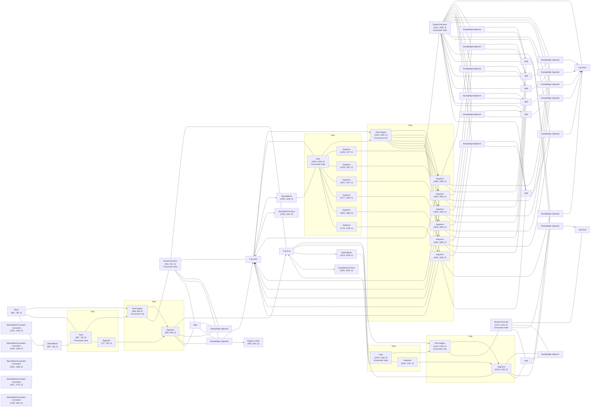

```mermaid
flowchart LR
  subgraph path11 [Path]
    11["Path<br>[687, 785, 0]<br>Consumed: false"]
      %% [ProgramBodyItem { index: 6 }, VariableDeclarationDeclaration, VariableDeclarationInit]
    27["Segment<br>[717, 783, 0]"]
      %% [ProgramBodyItem { index: 6 }, VariableDeclarationDeclaration, VariableDeclarationInit, SketchBlockBody, SketchBlockBodyItem { index: 0 }, VariableDeclarationDeclaration, VariableDeclarationInit]
  end
  subgraph path8 [Path]
    8["Path Region<br>[800, 839, 0]<br>Consumed: true"]
      %% [ProgramBodyItem { index: 7 }, VariableDeclarationDeclaration, VariableDeclarationInit]
    28["Segment<br>[800, 839, 0]"]
      %% [ProgramBodyItem { index: 7 }, VariableDeclarationDeclaration, VariableDeclarationInit]
  end
  subgraph path9 [Path]
    9["Path<br>[1093, 1826, 0]<br>Consumed: false"]
      %% [ProgramBodyItem { index: 9 }, VariableDeclarationDeclaration, VariableDeclarationInit]
    13["Segment<br>[1156, 1227, 0]"]
      %% [ProgramBodyItem { index: 9 }, VariableDeclarationDeclaration, VariableDeclarationInit, SketchBlockBody, SketchBlockBodyItem { index: 0 }, VariableDeclarationDeclaration, VariableDeclarationInit]
    14["Segment<br>[1238, 1307, 0]"]
      %% [ProgramBodyItem { index: 9 }, VariableDeclarationDeclaration, VariableDeclarationInit, SketchBlockBody, SketchBlockBodyItem { index: 1 }, VariableDeclarationDeclaration, VariableDeclarationInit]
    15["Segment<br>[1357, 1427, 0]"]
      %% [ProgramBodyItem { index: 9 }, VariableDeclarationDeclaration, VariableDeclarationInit, SketchBlockBody, SketchBlockBodyItem { index: 3 }, VariableDeclarationDeclaration, VariableDeclarationInit]
    16["Segment<br>[1477, 1550, 0]"]
      %% [ProgramBodyItem { index: 9 }, VariableDeclarationDeclaration, VariableDeclarationInit, SketchBlockBody, SketchBlockBodyItem { index: 5 }, VariableDeclarationDeclaration, VariableDeclarationInit]
    17["Segment<br>[1600, 1668, 0]"]
      %% [ProgramBodyItem { index: 9 }, VariableDeclarationDeclaration, VariableDeclarationInit, SketchBlockBody, SketchBlockBodyItem { index: 7 }, VariableDeclarationDeclaration, VariableDeclarationInit]
    18["Segment<br>[1718, 1785, 0]"]
      %% [ProgramBodyItem { index: 9 }, VariableDeclarationDeclaration, VariableDeclarationInit, SketchBlockBody, SketchBlockBodyItem { index: 9 }, VariableDeclarationDeclaration, VariableDeclarationInit]
  end
  subgraph path6 [Path]
    6["Path Region<br>[1840, 1893, 0]<br>Consumed: true"]
      %% [ProgramBodyItem { index: 10 }, VariableDeclarationDeclaration, VariableDeclarationInit]
    19["Segment<br>[1840, 1893, 0]"]
      %% [ProgramBodyItem { index: 10 }, VariableDeclarationDeclaration, VariableDeclarationInit]
    20["Segment<br>[1840, 1893, 0]"]
      %% [ProgramBodyItem { index: 10 }, VariableDeclarationDeclaration, VariableDeclarationInit]
    21["Segment<br>[1840, 1893, 0]"]
      %% [ProgramBodyItem { index: 10 }, VariableDeclarationDeclaration, VariableDeclarationInit]
    22["Segment<br>[1840, 1893, 0]"]
      %% [ProgramBodyItem { index: 10 }, VariableDeclarationDeclaration, VariableDeclarationInit]
    23["Segment<br>[1840, 1893, 0]"]
      %% [ProgramBodyItem { index: 10 }, VariableDeclarationDeclaration, VariableDeclarationInit]
    24["Segment<br>[1840, 1893, 0]"]
      %% [ProgramBodyItem { index: 10 }, VariableDeclarationDeclaration, VariableDeclarationInit]
  end
  subgraph path10 [Path]
    10["Path<br>[1979, 2109, 0]<br>Consumed: false"]
      %% [ProgramBodyItem { index: 12 }, VariableDeclarationDeclaration, VariableDeclarationInit]
    25["Segment<br>[2042, 2107, 0]"]
      %% [ProgramBodyItem { index: 12 }, VariableDeclarationDeclaration, VariableDeclarationInit, SketchBlockBody, SketchBlockBodyItem { index: 0 }, VariableDeclarationDeclaration, VariableDeclarationInit]
  end
  subgraph path7 [Path]
    7["Path Region<br>[2124, 2163, 0]<br>Consumed: true"]
      %% [ProgramBodyItem { index: 13 }, VariableDeclarationDeclaration, VariableDeclarationInit]
    26["Segment<br>[2124, 2163, 0]"]
      %% [ProgramBodyItem { index: 13 }, VariableDeclarationDeclaration, VariableDeclarationInit]
  end
  12["Plane<br>[687, 785, 0]"]
    %% [ProgramBodyItem { index: 6 }, VariableDeclarationDeclaration, VariableDeclarationInit]
  41["Sweep Extrusion<br>[851, 922, 0]<br>Consumed: false"]
    %% [ProgramBodyItem { index: 8 }, VariableDeclarationDeclaration, VariableDeclarationInit, PipeBodyItem { index: 0 }]
  65[Wall]
    %% face_code_ref=Missing NodePath
  3["Cap Start"]
    %% face_code_ref=[ProgramBodyItem { index: 9 }, VariableDeclarationDeclaration, VariableDeclarationInit, SketchBlockArgs]
  1["Cap End"]
    %% face_code_ref=[ProgramBodyItem { index: 12 }, VariableDeclarationDeclaration, VariableDeclarationInit, SketchBlockArgs]
  57["SweepEdge Opposite"]
  49["SweepEdge Adjacent"]
  5["EdgeCut Fillet<br>[928, 1021, 0]"]
    %% [ProgramBodyItem { index: 8 }, VariableDeclarationDeclaration, VariableDeclarationInit, PipeBodyItem { index: 1 }]
  39["Sweep Extrusion<br>[1913, 1965, 0]<br>Consumed: false"]
    %% [ProgramBodyItem { index: 11 }, VariableDeclarationDeclaration, VariableDeclarationInit]
  58[Wall]
    %% face_code_ref=Missing NodePath
  59[Wall]
    %% face_code_ref=Missing NodePath
  60[Wall]
    %% face_code_ref=Missing NodePath
  61[Wall]
    %% face_code_ref=Missing NodePath
  62[Wall]
    %% face_code_ref=Missing NodePath
  63[Wall]
    %% face_code_ref=Missing NodePath
  4["Cap Start"]
    %% face_code_ref=Missing NodePath
  51["SweepEdge Opposite"]
  42["SweepEdge Adjacent"]
  52["SweepEdge Opposite"]
  43["SweepEdge Adjacent"]
  53["SweepEdge Opposite"]
  44["SweepEdge Adjacent"]
  54["SweepEdge Opposite"]
  45["SweepEdge Adjacent"]
  55["SweepEdge Opposite"]
  46["SweepEdge Adjacent"]
  56["SweepEdge Opposite"]
  47["SweepEdge Adjacent"]
  40["Sweep Extrusion<br>[2175, 2216, 0]<br>Consumed: false"]
    %% [ProgramBodyItem { index: 14 }, VariableDeclarationDeclaration, VariableDeclarationInit, PipeBodyItem { index: 0 }]
  64[Wall]
    %% face_code_ref=Missing NodePath
  2["Cap End"]
    %% face_code_ref=Missing NodePath
  50["SweepEdge Opposite"]
  48["SweepEdge Adjacent"]
  31["SketchBlock<br>[687, 785, 0]"]
    %% [ProgramBodyItem { index: 6 }, VariableDeclarationDeclaration, VariableDeclarationInit]
  37["StartSketchOnFace<br>[1105, 1142, 0]"]
    %% [ProgramBodyItem { index: 9 }, VariableDeclarationDeclaration, VariableDeclarationInit, SketchBlockArgs]
  29["SketchBlock<br>[1093, 1826, 0]"]
    %% [ProgramBodyItem { index: 9 }, VariableDeclarationDeclaration, VariableDeclarationInit]
  32["SketchBlockConstraint Coincident<br>[1310, 1346, 0]"]
    %% [ProgramBodyItem { index: 9 }, VariableDeclarationDeclaration, VariableDeclarationInit, SketchBlockBody, SketchBlockBodyItem { index: 2 }, ExpressionStatementExpr]
  33["SketchBlockConstraint Coincident<br>[1430, 1466, 0]"]
    %% [ProgramBodyItem { index: 9 }, VariableDeclarationDeclaration, VariableDeclarationInit, SketchBlockBody, SketchBlockBodyItem { index: 4 }, ExpressionStatementExpr]
  34["SketchBlockConstraint Coincident<br>[1553, 1589, 0]"]
    %% [ProgramBodyItem { index: 9 }, VariableDeclarationDeclaration, VariableDeclarationInit, SketchBlockBody, SketchBlockBodyItem { index: 6 }, ExpressionStatementExpr]
  35["SketchBlockConstraint Coincident<br>[1671, 1707, 0]"]
    %% [ProgramBodyItem { index: 9 }, VariableDeclarationDeclaration, VariableDeclarationInit, SketchBlockBody, SketchBlockBodyItem { index: 8 }, ExpressionStatementExpr]
  36["SketchBlockConstraint Coincident<br>[1788, 1824, 0]"]
    %% [ProgramBodyItem { index: 9 }, VariableDeclarationDeclaration, VariableDeclarationInit, SketchBlockBody, SketchBlockBodyItem { index: 10 }, ExpressionStatementExpr]
  38["StartSketchOnFace<br>[1991, 2026, 0]"]
    %% [ProgramBodyItem { index: 12 }, VariableDeclarationDeclaration, VariableDeclarationInit, SketchBlockArgs]
  30["SketchBlock<br>[1979, 2109, 0]"]
    %% [ProgramBodyItem { index: 12 }, VariableDeclarationDeclaration, VariableDeclarationInit]
  1 <--x 7
  1 --- 10
  26 <--x 1
  28 <--x 1
  1 <--x 30
  1 <--x 38
  41 --- 1
  40 --- 2
  50 <--x 2
  3 <--x 6
  3 --- 9
  19 <--x 3
  20 <--x 3
  21 <--x 3
  22 <--x 3
  23 <--x 3
  24 <--x 3
  3 <--x 29
  3 <--x 37
  41 --- 3
  57 <--x 3
  39 --- 4
  51 <--x 4
  52 <--x 4
  53 <--x 4
  54 <--x 4
  55 <--x 4
  56 <--x 4
  57 x--> 5
  9 x--> 6
  6 <--x 19
  6 <--x 20
  6 <--x 21
  6 <--x 22
  6 <--x 23
  6 <--x 24
  6 ---- 39
  10 x--> 7
  7 <--x 26
  7 ---- 40
  11 x--> 8
  12 x--> 8
  8 <--x 28
  8 ---- 41
  9 --- 13
  9 --- 14
  9 --- 15
  9 --- 16
  9 --- 17
  9 --- 18
  29 --- 9
  10 --- 25
  30 --- 10
  12 --- 11
  11 --- 27
  31 --- 11
  12 <--x 31
  13 <--x 19
  14 <--x 20
  15 <--x 21
  16 <--x 22
  17 <--x 23
  18 <--x 24
  19 --- 42
  19 --- 51
  19 --- 58
  20 --- 43
  20 --- 52
  20 --- 59
  21 --- 44
  21 --- 53
  21 --- 60
  22 --- 45
  22 --- 54
  22 --- 61
  23 --- 46
  23 --- 55
  23 --- 62
  24 --- 47
  24 --- 56
  24 --- 63
  25 <--x 26
  26 --- 48
  26 --- 50
  26 --- 64
  27 <--x 28
  28 --- 49
  28 --- 57
  28 --- 65
  39 --- 42
  39 --- 43
  39 --- 44
  39 --- 45
  39 --- 46
  39 --- 47
  39 --- 51
  39 --- 52
  39 --- 53
  39 --- 54
  39 --- 55
  39 --- 56
  39 --- 58
  39 --- 59
  39 --- 60
  39 --- 61
  39 --- 62
  39 --- 63
  40 --- 48
  40 --- 50
  40 --- 64
  41 --- 49
  41 --- 57
  41 --- 65
  58 --- 42
  42 x--> 58
  59 --- 43
  43 x--> 59
  60 --- 44
  44 x--> 60
  61 --- 45
  45 x--> 61
  62 --- 46
  46 x--> 62
  63 --- 47
  47 x--> 63
  64 --- 48
  65 --- 49
  58 --- 50
  59 --- 51
  60 --- 52
  61 --- 53
  62 --- 54
  63 --- 55
  64 --- 56
  65 --- 57
```
