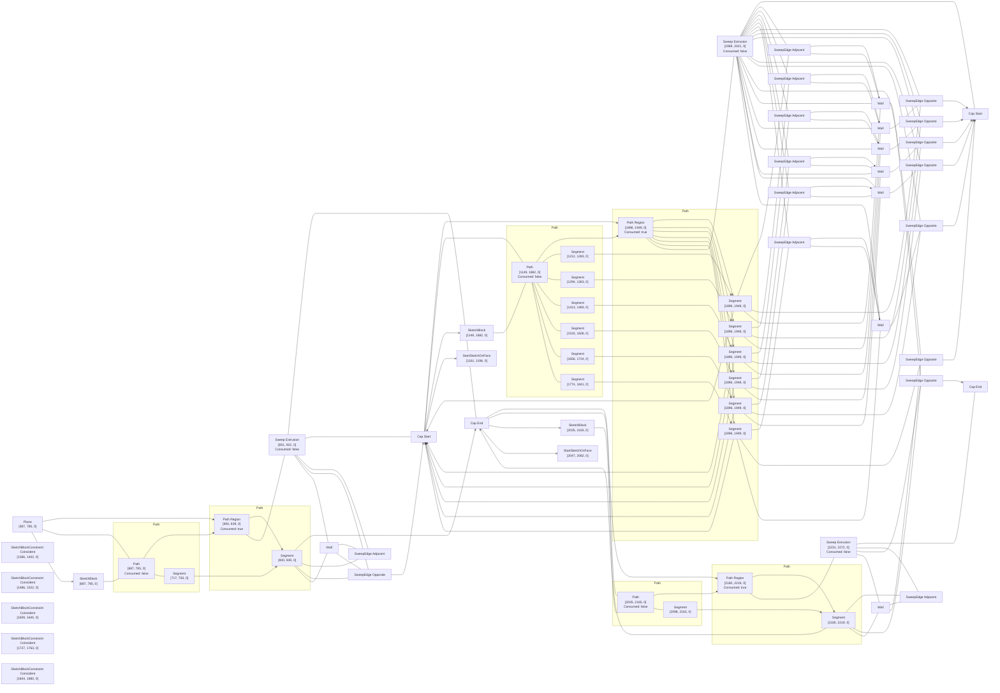

```mermaid
flowchart LR
  subgraph path5 [Path]
    5["Path Region<br>[1896, 1949, 0]<br>Consumed: true"]
      %% [ProgramBodyItem { index: 10 }, VariableDeclarationDeclaration, VariableDeclarationInit]
    18["Segment<br>[1896, 1949, 0]"]
      %% [ProgramBodyItem { index: 10 }, VariableDeclarationDeclaration, VariableDeclarationInit]
    19["Segment<br>[1896, 1949, 0]"]
      %% [ProgramBodyItem { index: 10 }, VariableDeclarationDeclaration, VariableDeclarationInit]
    20["Segment<br>[1896, 1949, 0]"]
      %% [ProgramBodyItem { index: 10 }, VariableDeclarationDeclaration, VariableDeclarationInit]
    21["Segment<br>[1896, 1949, 0]"]
      %% [ProgramBodyItem { index: 10 }, VariableDeclarationDeclaration, VariableDeclarationInit]
    22["Segment<br>[1896, 1949, 0]"]
      %% [ProgramBodyItem { index: 10 }, VariableDeclarationDeclaration, VariableDeclarationInit]
    23["Segment<br>[1896, 1949, 0]"]
      %% [ProgramBodyItem { index: 10 }, VariableDeclarationDeclaration, VariableDeclarationInit]
  end
  subgraph path6 [Path]
    6["Path Region<br>[2180, 2219, 0]<br>Consumed: true"]
      %% [ProgramBodyItem { index: 13 }, VariableDeclarationDeclaration, VariableDeclarationInit]
    25["Segment<br>[2180, 2219, 0]"]
      %% [ProgramBodyItem { index: 13 }, VariableDeclarationDeclaration, VariableDeclarationInit]
  end
  subgraph path7 [Path]
    7["Path Region<br>[800, 839, 0]<br>Consumed: true"]
      %% [ProgramBodyItem { index: 7 }, VariableDeclarationDeclaration, VariableDeclarationInit]
    27["Segment<br>[800, 839, 0]"]
      %% [ProgramBodyItem { index: 7 }, VariableDeclarationDeclaration, VariableDeclarationInit]
  end
  subgraph path8 [Path]
    8["Path<br>[1149, 1882, 0]<br>Consumed: false"]
      %% [ProgramBodyItem { index: 9 }, VariableDeclarationDeclaration, VariableDeclarationInit]
    12["Segment<br>[1212, 1283, 0]"]
      %% [ProgramBodyItem { index: 9 }, VariableDeclarationDeclaration, VariableDeclarationInit, SketchBlockBody, SketchBlockBodyItem { index: 0 }, VariableDeclarationDeclaration, VariableDeclarationInit]
    13["Segment<br>[1294, 1363, 0]"]
      %% [ProgramBodyItem { index: 9 }, VariableDeclarationDeclaration, VariableDeclarationInit, SketchBlockBody, SketchBlockBodyItem { index: 1 }, VariableDeclarationDeclaration, VariableDeclarationInit]
    14["Segment<br>[1413, 1483, 0]"]
      %% [ProgramBodyItem { index: 9 }, VariableDeclarationDeclaration, VariableDeclarationInit, SketchBlockBody, SketchBlockBodyItem { index: 3 }, VariableDeclarationDeclaration, VariableDeclarationInit]
    15["Segment<br>[1533, 1606, 0]"]
      %% [ProgramBodyItem { index: 9 }, VariableDeclarationDeclaration, VariableDeclarationInit, SketchBlockBody, SketchBlockBodyItem { index: 5 }, VariableDeclarationDeclaration, VariableDeclarationInit]
    16["Segment<br>[1656, 1724, 0]"]
      %% [ProgramBodyItem { index: 9 }, VariableDeclarationDeclaration, VariableDeclarationInit, SketchBlockBody, SketchBlockBodyItem { index: 7 }, VariableDeclarationDeclaration, VariableDeclarationInit]
    17["Segment<br>[1774, 1841, 0]"]
      %% [ProgramBodyItem { index: 9 }, VariableDeclarationDeclaration, VariableDeclarationInit, SketchBlockBody, SketchBlockBodyItem { index: 9 }, VariableDeclarationDeclaration, VariableDeclarationInit]
  end
  subgraph path9 [Path]
    9["Path<br>[2035, 2165, 0]<br>Consumed: false"]
      %% [ProgramBodyItem { index: 12 }, VariableDeclarationDeclaration, VariableDeclarationInit]
    24["Segment<br>[2098, 2163, 0]"]
      %% [ProgramBodyItem { index: 12 }, VariableDeclarationDeclaration, VariableDeclarationInit, SketchBlockBody, SketchBlockBodyItem { index: 0 }, VariableDeclarationDeclaration, VariableDeclarationInit]
  end
  subgraph path10 [Path]
    10["Path<br>[687, 785, 0]<br>Consumed: false"]
      %% [ProgramBodyItem { index: 6 }, VariableDeclarationDeclaration, VariableDeclarationInit]
    26["Segment<br>[717, 783, 0]"]
      %% [ProgramBodyItem { index: 6 }, VariableDeclarationDeclaration, VariableDeclarationInit, SketchBlockBody, SketchBlockBodyItem { index: 0 }, VariableDeclarationDeclaration, VariableDeclarationInit]
  end
  1["Cap End"]
    %% face_code_ref=[ProgramBodyItem { index: 12 }, VariableDeclarationDeclaration, VariableDeclarationInit, SketchBlockArgs]
  2["Cap End"]
    %% face_code_ref=Missing NodePath
  3["Cap Start"]
    %% face_code_ref=[ProgramBodyItem { index: 9 }, VariableDeclarationDeclaration, VariableDeclarationInit, SketchBlockArgs]
  4["Cap Start"]
    %% face_code_ref=Missing NodePath
  11["Plane<br>[687, 785, 0]"]
    %% [ProgramBodyItem { index: 6 }, VariableDeclarationDeclaration, VariableDeclarationInit]
  28["SketchBlock<br>[1149, 1882, 0]"]
    %% [ProgramBodyItem { index: 9 }, VariableDeclarationDeclaration, VariableDeclarationInit]
  29["SketchBlock<br>[2035, 2165, 0]"]
    %% [ProgramBodyItem { index: 12 }, VariableDeclarationDeclaration, VariableDeclarationInit]
  30["SketchBlock<br>[687, 785, 0]"]
    %% [ProgramBodyItem { index: 6 }, VariableDeclarationDeclaration, VariableDeclarationInit]
  31["SketchBlockConstraint Coincident<br>[1366, 1402, 0]"]
    %% [ProgramBodyItem { index: 9 }, VariableDeclarationDeclaration, VariableDeclarationInit, SketchBlockBody, SketchBlockBodyItem { index: 2 }, ExpressionStatementExpr]
  32["SketchBlockConstraint Coincident<br>[1486, 1522, 0]"]
    %% [ProgramBodyItem { index: 9 }, VariableDeclarationDeclaration, VariableDeclarationInit, SketchBlockBody, SketchBlockBodyItem { index: 4 }, ExpressionStatementExpr]
  33["SketchBlockConstraint Coincident<br>[1609, 1645, 0]"]
    %% [ProgramBodyItem { index: 9 }, VariableDeclarationDeclaration, VariableDeclarationInit, SketchBlockBody, SketchBlockBodyItem { index: 6 }, ExpressionStatementExpr]
  34["SketchBlockConstraint Coincident<br>[1727, 1763, 0]"]
    %% [ProgramBodyItem { index: 9 }, VariableDeclarationDeclaration, VariableDeclarationInit, SketchBlockBody, SketchBlockBodyItem { index: 8 }, ExpressionStatementExpr]
  35["SketchBlockConstraint Coincident<br>[1844, 1880, 0]"]
    %% [ProgramBodyItem { index: 9 }, VariableDeclarationDeclaration, VariableDeclarationInit, SketchBlockBody, SketchBlockBodyItem { index: 10 }, ExpressionStatementExpr]
  36["StartSketchOnFace<br>[1161, 1198, 0]"]
    %% [ProgramBodyItem { index: 9 }, VariableDeclarationDeclaration, VariableDeclarationInit, SketchBlockArgs]
  37["StartSketchOnFace<br>[2047, 2082, 0]"]
    %% [ProgramBodyItem { index: 12 }, VariableDeclarationDeclaration, VariableDeclarationInit, SketchBlockArgs]
  38["Sweep Extrusion<br>[1969, 2021, 0]<br>Consumed: false"]
    %% [ProgramBodyItem { index: 11 }, VariableDeclarationDeclaration, VariableDeclarationInit]
  39["Sweep Extrusion<br>[2231, 2272, 0]<br>Consumed: false"]
    %% [ProgramBodyItem { index: 14 }, VariableDeclarationDeclaration, VariableDeclarationInit, PipeBodyItem { index: 0 }]
  40["Sweep Extrusion<br>[851, 922, 0]<br>Consumed: false"]
    %% [ProgramBodyItem { index: 8 }, VariableDeclarationDeclaration, VariableDeclarationInit, PipeBodyItem { index: 0 }]
  41["SweepEdge Adjacent"]
  42["SweepEdge Adjacent"]
  43["SweepEdge Adjacent"]
  44["SweepEdge Adjacent"]
  45["SweepEdge Adjacent"]
  46["SweepEdge Adjacent"]
  47["SweepEdge Adjacent"]
  48["SweepEdge Adjacent"]
  49["SweepEdge Opposite"]
  50["SweepEdge Opposite"]
  51["SweepEdge Opposite"]
  52["SweepEdge Opposite"]
  53["SweepEdge Opposite"]
  54["SweepEdge Opposite"]
  55["SweepEdge Opposite"]
  56["SweepEdge Opposite"]
  57[Wall]
    %% face_code_ref=Missing NodePath
  58[Wall]
    %% face_code_ref=Missing NodePath
  59[Wall]
    %% face_code_ref=Missing NodePath
  60[Wall]
    %% face_code_ref=Missing NodePath
  61[Wall]
    %% face_code_ref=Missing NodePath
  62[Wall]
    %% face_code_ref=Missing NodePath
  63[Wall]
    %% face_code_ref=Missing NodePath
  64[Wall]
    %% face_code_ref=Missing NodePath
  1 <--x 6
  1 --- 9
  25 <--x 1
  27 <--x 1
  1 <--x 29
  1 <--x 37
  40 --- 1
  39 --- 2
  49 <--x 2
  3 <--x 5
  3 --- 8
  18 <--x 3
  19 <--x 3
  20 <--x 3
  21 <--x 3
  22 <--x 3
  23 <--x 3
  3 <--x 28
  3 <--x 36
  40 --- 3
  56 <--x 3
  38 --- 4
  50 <--x 4
  51 <--x 4
  52 <--x 4
  53 <--x 4
  54 <--x 4
  55 <--x 4
  8 x--> 5
  5 <--x 18
  5 <--x 19
  5 <--x 20
  5 <--x 21
  5 <--x 22
  5 <--x 23
  5 ---- 38
  9 x--> 6
  6 <--x 25
  6 ---- 39
  10 x--> 7
  11 x--> 7
  7 <--x 27
  7 ---- 40
  8 --- 12
  8 --- 13
  8 --- 14
  8 --- 15
  8 --- 16
  8 --- 17
  28 --- 8
  9 --- 24
  29 --- 9
  11 --- 10
  10 --- 26
  30 --- 10
  11 <--x 30
  12 <--x 18
  13 <--x 19
  14 <--x 20
  15 <--x 21
  16 <--x 22
  17 <--x 23
  18 --- 41
  18 --- 50
  18 --- 57
  19 --- 42
  19 --- 51
  19 --- 58
  20 --- 43
  20 --- 52
  20 --- 59
  21 --- 44
  21 --- 53
  21 --- 60
  22 --- 45
  22 --- 54
  22 --- 61
  23 --- 46
  23 --- 55
  23 --- 62
  24 <--x 25
  25 --- 47
  25 --- 49
  25 --- 63
  26 <--x 27
  27 --- 48
  27 --- 56
  27 --- 64
  38 --- 41
  38 --- 42
  38 --- 43
  38 --- 44
  38 --- 45
  38 --- 46
  38 --- 50
  38 --- 51
  38 --- 52
  38 --- 53
  38 --- 54
  38 --- 55
  38 --- 57
  38 --- 58
  38 --- 59
  38 --- 60
  38 --- 61
  38 --- 62
  39 --- 47
  39 --- 49
  39 --- 63
  40 --- 48
  40 --- 56
  40 --- 64
  57 --- 41
  41 x--> 57
  58 --- 42
  42 x--> 58
  59 --- 43
  43 x--> 59
  60 --- 44
  44 x--> 60
  61 --- 45
  45 x--> 61
  46 x--> 62
  62 --- 46
  63 --- 47
  64 --- 48
  57 --- 49
  58 --- 50
  59 --- 51
  60 --- 52
  61 --- 53
  62 --- 54
  63 --- 55
  64 --- 56
```
