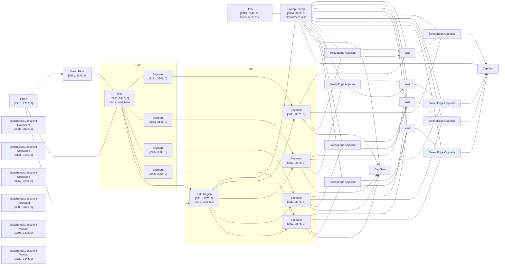

```mermaid
flowchart LR
  subgraph path5 [Path]
    5["Path<br>[2861, 3346, 0]<br>Consumed: false"]
      %% [ProgramBodyItem { index: 9 }, VariableDeclarationDeclaration, VariableDeclarationInit]
    7["Segment<br>[2906, 2964, 0]"]
      %% [ProgramBodyItem { index: 9 }, VariableDeclarationDeclaration, VariableDeclarationInit, SketchBlockBody, SketchBlockBodyItem { index: 0 }, VariableDeclarationDeclaration, VariableDeclarationInit]
    8["Segment<br>[2975, 3033, 0]"]
      %% [ProgramBodyItem { index: 9 }, VariableDeclarationDeclaration, VariableDeclarationInit, SketchBlockBody, SketchBlockBodyItem { index: 1 }, VariableDeclarationDeclaration, VariableDeclarationInit]
    9["Segment<br>[3083, 3141, 0]"]
      %% [ProgramBodyItem { index: 9 }, VariableDeclarationDeclaration, VariableDeclarationInit, SketchBlockBody, SketchBlockBodyItem { index: 3 }, VariableDeclarationDeclaration, VariableDeclarationInit]
    10["Segment<br>[3191, 3249, 0]"]
      %% [ProgramBodyItem { index: 9 }, VariableDeclarationDeclaration, VariableDeclarationInit, SketchBlockBody, SketchBlockBodyItem { index: 5 }, VariableDeclarationDeclaration, VariableDeclarationInit]
  end
  subgraph path4 [Path]
    4["Path Region<br>[3811, 3875, 0]<br>Consumed: true"]
      %% [ProgramBodyItem { index: 10 }, VariableDeclarationDeclaration, VariableDeclarationInit]
    11["Segment<br>[3811, 3875, 0]"]
      %% [ProgramBodyItem { index: 10 }, VariableDeclarationDeclaration, VariableDeclarationInit]
    12["Segment<br>[3811, 3875, 0]"]
      %% [ProgramBodyItem { index: 10 }, VariableDeclarationDeclaration, VariableDeclarationInit]
    13["Segment<br>[3811, 3875, 0]"]
      %% [ProgramBodyItem { index: 10 }, VariableDeclarationDeclaration, VariableDeclarationInit]
    14["Segment<br>[3811, 3875, 0]"]
      %% [ProgramBodyItem { index: 10 }, VariableDeclarationDeclaration, VariableDeclarationInit]
  end
  3["Helix<br>[1815, 1948, 0]: Consumed: true"]
    %% [ProgramBodyItem { index: 6 }, VariableDeclarationDeclaration, VariableDeclarationInit]
  6["Plane<br>[2715, 2732, 0]"]
    %% [ProgramBodyItem { index: 8 }, VariableDeclarationDeclaration, VariableDeclarationInit]
  22["Sweep Sweep<br>[3894, 3929, 0]<br>Consumed: false"]
    %% [ProgramBodyItem { index: 11 }, VariableDeclarationDeclaration, VariableDeclarationInit]
  31[Wall]
    %% face_code_ref=Missing NodePath
  32[Wall]
    %% face_code_ref=Missing NodePath
  33[Wall]
    %% face_code_ref=Missing NodePath
  34[Wall]
    %% face_code_ref=Missing NodePath
  2["Cap Start"]
    %% face_code_ref=Missing NodePath
  1["Cap End"]
    %% face_code_ref=Missing NodePath
  27["SweepEdge Opposite"]
  23["SweepEdge Adjacent"]
  28["SweepEdge Opposite"]
  24["SweepEdge Adjacent"]
  29["SweepEdge Opposite"]
  25["SweepEdge Adjacent"]
  30["SweepEdge Opposite"]
  26["SweepEdge Adjacent"]
  15["SketchBlock<br>[2861, 3346, 0]"]
    %% [ProgramBodyItem { index: 9 }, VariableDeclarationDeclaration, VariableDeclarationInit]
  16["SketchBlockConstraint Coincident<br>[3036, 3072, 0]"]
    %% [ProgramBodyItem { index: 9 }, VariableDeclarationDeclaration, VariableDeclarationInit, SketchBlockBody, SketchBlockBodyItem { index: 2 }, ExpressionStatementExpr]
  17["SketchBlockConstraint Coincident<br>[3144, 3180, 0]"]
    %% [ProgramBodyItem { index: 9 }, VariableDeclarationDeclaration, VariableDeclarationInit, SketchBlockBody, SketchBlockBodyItem { index: 4 }, ExpressionStatementExpr]
  18["SketchBlockConstraint Coincident<br>[3252, 3288, 0]"]
    %% [ProgramBodyItem { index: 9 }, VariableDeclarationDeclaration, VariableDeclarationInit, SketchBlockBody, SketchBlockBodyItem { index: 6 }, ExpressionStatementExpr]
  20["SketchBlockConstraint Vertical<br>[3291, 3306, 0]"]
    %% [ProgramBodyItem { index: 9 }, VariableDeclarationDeclaration, VariableDeclarationInit, SketchBlockBody, SketchBlockBodyItem { index: 7 }, ExpressionStatementExpr]
  19["SketchBlockConstraint Horizontal<br>[3309, 3326, 0]"]
    %% [ProgramBodyItem { index: 9 }, VariableDeclarationDeclaration, VariableDeclarationInit, SketchBlockBody, SketchBlockBodyItem { index: 8 }, ExpressionStatementExpr]
  21["SketchBlockConstraint Vertical<br>[3329, 3344, 0]"]
    %% [ProgramBodyItem { index: 9 }, VariableDeclarationDeclaration, VariableDeclarationInit, SketchBlockBody, SketchBlockBodyItem { index: 9 }, ExpressionStatementExpr]
  22 --- 1
  27 <--x 1
  28 <--x 1
  29 <--x 1
  30 <--x 1
  11 <--x 2
  12 <--x 2
  13 <--x 2
  14 <--x 2
  22 --- 2
  3 --- 22
  5 x--> 4
  6 x--> 4
  4 <--x 11
  4 <--x 12
  4 <--x 13
  4 <--x 14
  4 ---- 22
  6 --- 5
  5 --- 7
  5 --- 8
  5 --- 9
  5 --- 10
  15 --- 5
  6 <--x 15
  7 <--x 11
  8 <--x 12
  9 <--x 13
  10 <--x 14
  11 --- 23
  11 --- 27
  11 --- 31
  12 --- 24
  12 --- 28
  12 --- 32
  13 --- 25
  13 --- 29
  13 --- 33
  14 --- 26
  14 --- 30
  14 --- 34
  22 --- 23
  22 --- 24
  22 --- 25
  22 --- 26
  22 --- 27
  22 --- 28
  22 --- 29
  22 --- 30
  22 --- 31
  22 --- 32
  22 --- 33
  22 --- 34
  31 --- 23
  23 x--> 31
  32 --- 24
  24 x--> 32
  33 --- 25
  25 x--> 33
  34 --- 26
  26 x--> 34
  31 --- 27
  32 --- 28
  33 --- 29
  34 --- 30
```
