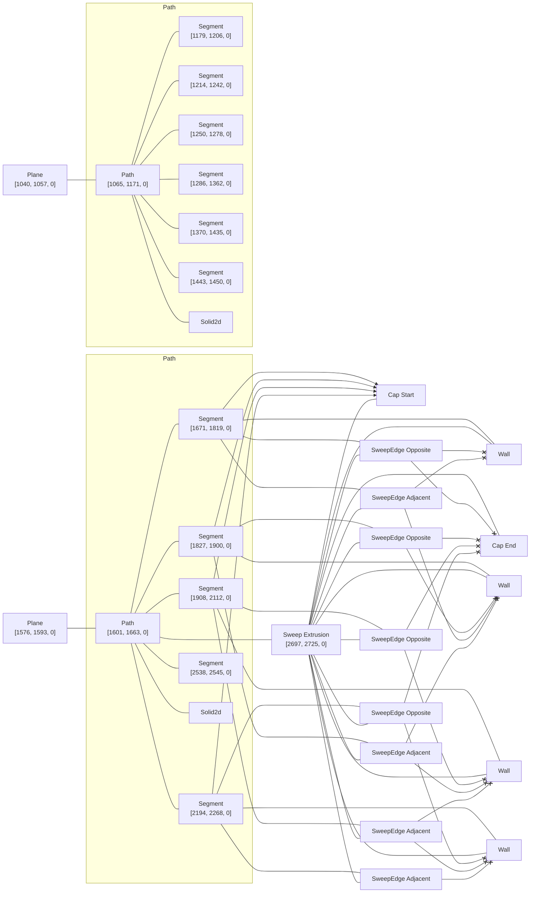

```mermaid
flowchart LR
  subgraph path3 [Path]
    3["Path<br>[1065, 1171, 0]"]
    5["Segment<br>[1179, 1206, 0]"]
    6["Segment<br>[1214, 1242, 0]"]
    7["Segment<br>[1250, 1278, 0]"]
    8["Segment<br>[1286, 1362, 0]"]
    9["Segment<br>[1370, 1435, 0]"]
    10["Segment<br>[1443, 1450, 0]"]
    16[Solid2d]
  end
  subgraph path4 [Path]
    4["Path<br>[1601, 1663, 0]"]
    11["Segment<br>[1671, 1819, 0]"]
    12["Segment<br>[1827, 1900, 0]"]
    13["Segment<br>[1908, 2112, 0]"]
    14["Segment<br>[2194, 2268, 0]"]
    15["Segment<br>[2538, 2545, 0]"]
    17[Solid2d]
  end
  1["Plane<br>[1040, 1057, 0]"]
  2["Plane<br>[1576, 1593, 0]"]
  18["Sweep Extrusion<br>[2697, 2725, 0]"]
  19[Wall]
  20[Wall]
  21[Wall]
  22[Wall]
  23["Cap Start"]
  24["Cap End"]
  25["SweepEdge Opposite"]
  26["SweepEdge Opposite"]
  27["SweepEdge Opposite"]
  28["SweepEdge Opposite"]
  29["SweepEdge Adjacent"]
  30["SweepEdge Adjacent"]
  31["SweepEdge Adjacent"]
  32["SweepEdge Adjacent"]
  1 --- 3
  2 --- 4
  3 --- 5
  3 --- 6
  3 --- 7
  3 --- 8
  3 --- 9
  3 --- 10
  3 --- 16
  4 --- 11
  4 --- 12
  4 --- 13
  4 --- 14
  4 --- 15
  4 --- 17
  4 ---- 18
  11 --- 22
  11 x--> 23
  11 --- 25
  11 --- 29
  12 --- 21
  12 x--> 23
  12 --- 26
  12 --- 30
  13 --- 20
  13 x--> 23
  13 --- 27
  13 --- 31
  14 --- 19
  14 x--> 23
  14 --- 28
  14 --- 32
  18 --- 19
  18 --- 20
  18 --- 21
  18 --- 22
  18 --- 23
  18 --- 24
  18 --- 25
  18 --- 26
  18 --- 27
  18 --- 28
  18 --- 29
  18 --- 30
  18 --- 31
  18 --- 32
  28 <--x 19
  31 <--x 19
  32 <--x 19
  27 <--x 20
  30 <--x 20
  31 <--x 20
  26 <--x 21
  29 <--x 21
  30 <--x 21
  25 <--x 22
  29 <--x 22
  25 <--x 24
  26 <--x 24
  27 <--x 24
  28 <--x 24
```
