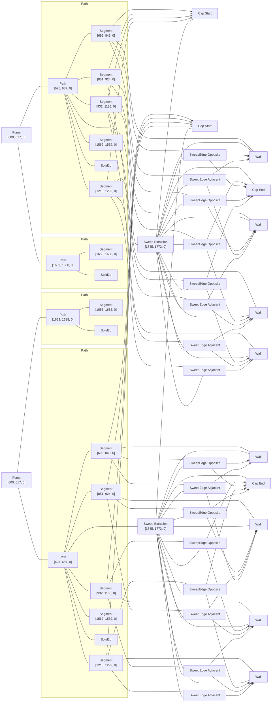

```mermaid
flowchart LR
  subgraph path3 [Path]
    3["Path<br>[625, 687, 0]"]
    7["Segment<br>[695, 843, 0]"]
    9["Segment<br>[851, 924, 0]"]
    12["Segment<br>[932, 1136, 0]"]
    14["Segment<br>[1218, 1292, 0]"]
    15["Segment<br>[1562, 1569, 0]"]
    19[Solid2d]
  end
  subgraph path4 [Path]
    4["Path<br>[625, 687, 0]"]
    8["Segment<br>[695, 843, 0]"]
    10["Segment<br>[851, 924, 0]"]
    11["Segment<br>[932, 1136, 0]"]
    13["Segment<br>[1218, 1292, 0]"]
    16["Segment<br>[1562, 1569, 0]"]
    21[Solid2d]
  end
  subgraph path5 [Path]
    5["Path<br>[1653, 1688, 0]"]
    18["Segment<br>[1653, 1688, 0]"]
    20[Solid2d]
  end
  subgraph path6 [Path]
    6["Path<br>[1653, 1688, 0]"]
    17["Segment<br>[1653, 1688, 0]"]
    22[Solid2d]
  end
  1["Plane<br>[600, 617, 0]"]
  2["Plane<br>[600, 617, 0]"]
  23["Sweep Extrusion<br>[1745, 1773, 0]"]
  24["Sweep Extrusion<br>[1745, 1773, 0]"]
  25[Wall]
  26[Wall]
  27[Wall]
  28[Wall]
  29[Wall]
  30[Wall]
  31[Wall]
  32[Wall]
  33["Cap Start"]
  34["Cap Start"]
  35["Cap End"]
  36["Cap End"]
  37["SweepEdge Opposite"]
  38["SweepEdge Opposite"]
  39["SweepEdge Opposite"]
  40["SweepEdge Opposite"]
  41["SweepEdge Opposite"]
  42["SweepEdge Opposite"]
  43["SweepEdge Opposite"]
  44["SweepEdge Opposite"]
  45["SweepEdge Adjacent"]
  46["SweepEdge Adjacent"]
  47["SweepEdge Adjacent"]
  48["SweepEdge Adjacent"]
  49["SweepEdge Adjacent"]
  50["SweepEdge Adjacent"]
  51["SweepEdge Adjacent"]
  52["SweepEdge Adjacent"]
  1 --- 3
  1 --- 5
  2 --- 4
  2 --- 6
  3 --- 7
  3 --- 9
  3 --- 12
  3 --- 14
  3 --- 15
  3 --- 19
  3 ---- 24
  4 --- 8
  4 --- 10
  4 --- 11
  4 --- 13
  4 --- 16
  4 --- 21
  4 ---- 23
  5 --- 18
  5 --- 20
  6 --- 17
  6 --- 22
  7 --- 29
  7 x--> 33
  7 --- 42
  7 --- 49
  8 --- 28
  8 x--> 34
  8 --- 38
  8 --- 46
  9 --- 30
  9 x--> 33
  9 --- 43
  9 --- 50
  10 --- 26
  10 x--> 34
  10 --- 40
  10 --- 45
  11 --- 25
  11 x--> 34
  11 --- 37
  11 --- 47
  12 --- 31
  12 x--> 33
  12 --- 41
  12 --- 51
  13 --- 27
  13 x--> 34
  13 --- 39
  13 --- 48
  14 --- 32
  14 x--> 33
  14 --- 44
  14 --- 52
  23 --- 25
  23 --- 26
  23 --- 27
  23 --- 28
  23 --- 34
  23 --- 36
  23 --- 37
  23 --- 38
  23 --- 39
  23 --- 40
  23 --- 45
  23 --- 46
  23 --- 47
  23 --- 48
  24 --- 29
  24 --- 30
  24 --- 31
  24 --- 32
  24 --- 33
  24 --- 35
  24 --- 41
  24 --- 42
  24 --- 43
  24 --- 44
  24 --- 49
  24 --- 50
  24 --- 51
  24 --- 52
  37 <--x 25
  45 <--x 25
  47 <--x 25
  40 <--x 26
  45 <--x 26
  46 <--x 26
  39 <--x 27
  47 <--x 27
  48 <--x 27
  38 <--x 28
  46 <--x 28
  42 <--x 29
  49 <--x 29
  43 <--x 30
  49 <--x 30
  50 <--x 30
  41 <--x 31
  50 <--x 31
  51 <--x 31
  44 <--x 32
  51 <--x 32
  52 <--x 32
  41 <--x 35
  42 <--x 35
  43 <--x 35
  44 <--x 35
  37 <--x 36
  38 <--x 36
  39 <--x 36
  40 <--x 36
```
