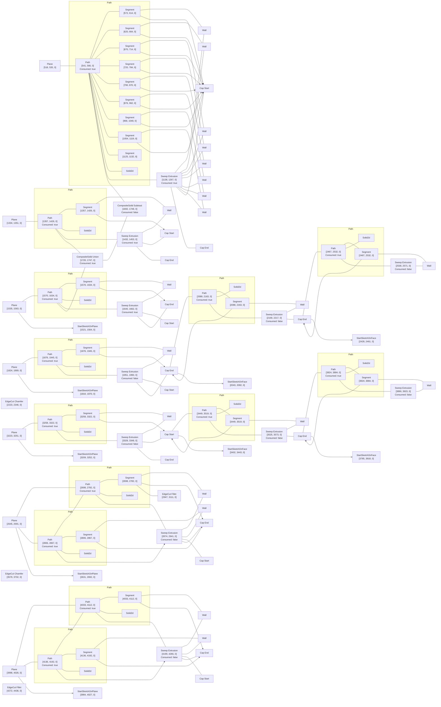

```mermaid
flowchart LR
  subgraph path2 [Path]
    2["Path<br>[541, 566, 0]<br>Consumed: true"]
      %% [ProgramBodyItem { index: 7 }, VariableDeclarationDeclaration, VariableDeclarationInit, PipeBodyItem { index: 1 }]
    3["Segment<br>[572, 614, 0]"]
      %% [ProgramBodyItem { index: 7 }, VariableDeclarationDeclaration, VariableDeclarationInit, PipeBodyItem { index: 2 }]
    4["Segment<br>[620, 664, 0]"]
      %% [ProgramBodyItem { index: 7 }, VariableDeclarationDeclaration, VariableDeclarationInit, PipeBodyItem { index: 3 }]
    5["Segment<br>[670, 714, 0]"]
      %% [ProgramBodyItem { index: 7 }, VariableDeclarationDeclaration, VariableDeclarationInit, PipeBodyItem { index: 4 }]
    6["Segment<br>[720, 784, 0]"]
      %% [ProgramBodyItem { index: 7 }, VariableDeclarationDeclaration, VariableDeclarationInit, PipeBodyItem { index: 5 }]
    7["Segment<br>[790, 870, 0]"]
      %% [ProgramBodyItem { index: 7 }, VariableDeclarationDeclaration, VariableDeclarationInit, PipeBodyItem { index: 6 }]
    8["Segment<br>[876, 962, 0]"]
      %% [ProgramBodyItem { index: 7 }, VariableDeclarationDeclaration, VariableDeclarationInit, PipeBodyItem { index: 7 }]
    9["Segment<br>[968, 1048, 0]"]
      %% [ProgramBodyItem { index: 7 }, VariableDeclarationDeclaration, VariableDeclarationInit, PipeBodyItem { index: 8 }]
    10["Segment<br>[1054, 1119, 0]"]
      %% [ProgramBodyItem { index: 7 }, VariableDeclarationDeclaration, VariableDeclarationInit, PipeBodyItem { index: 9 }]
    11["Segment<br>[1125, 1132, 0]"]
      %% [ProgramBodyItem { index: 7 }, VariableDeclarationDeclaration, VariableDeclarationInit, PipeBodyItem { index: 10 }]
    12[Solid2d]
  end
  subgraph path25 [Path]
    25["Path<br>[1357, 1426, 0]<br>Consumed: true"]
      %% [ProgramBodyItem { index: 8 }, VariableDeclarationDeclaration, VariableDeclarationInit, PipeBodyItem { index: 1 }]
    26["Segment<br>[1357, 1426, 0]"]
      %% [ProgramBodyItem { index: 8 }, VariableDeclarationDeclaration, VariableDeclarationInit, PipeBodyItem { index: 1 }]
    27[Solid2d]
  end
  subgraph path33 [Path]
    33["Path<br>[1570, 1634, 0]<br>Consumed: true"]
      %% [ProgramBodyItem { index: 9 }, VariableDeclarationDeclaration, VariableDeclarationInit, PipeBodyItem { index: 1 }]
    34["Segment<br>[1570, 1634, 0]"]
      %% [ProgramBodyItem { index: 9 }, VariableDeclarationDeclaration, VariableDeclarationInit, PipeBodyItem { index: 1 }]
    35[Solid2d]
  end
  subgraph path43 [Path]
    43["Path<br>[1876, 1945, 0]<br>Consumed: true"]
      %% [ProgramBodyItem { index: 11 }, VariableDeclarationDeclaration, VariableDeclarationInit, PipeBodyItem { index: 1 }]
    44["Segment<br>[1876, 1945, 0]"]
      %% [ProgramBodyItem { index: 11 }, VariableDeclarationDeclaration, VariableDeclarationInit, PipeBodyItem { index: 1 }]
    45[Solid2d]
  end
  subgraph path50 [Path]
    50["Path<br>[2088, 2163, 0]<br>Consumed: true"]
      %% [ProgramBodyItem { index: 12 }, VariableDeclarationDeclaration, VariableDeclarationInit, PipeBodyItem { index: 1 }]
    51["Segment<br>[2088, 2163, 0]"]
      %% [ProgramBodyItem { index: 12 }, VariableDeclarationDeclaration, VariableDeclarationInit, PipeBodyItem { index: 1 }]
    52[Solid2d]
  end
  subgraph path57 [Path]
    57["Path<br>[2467, 2532, 0]<br>Consumed: true"]
      %% [ProgramBodyItem { index: 13 }, VariableDeclarationDeclaration, VariableDeclarationInit, PipeBodyItem { index: 1 }]
    58["Segment<br>[2467, 2532, 0]"]
      %% [ProgramBodyItem { index: 13 }, VariableDeclarationDeclaration, VariableDeclarationInit, PipeBodyItem { index: 1 }]
    59[Solid2d]
  end
  subgraph path63 [Path]
    63["Path<br>[2698, 2782, 0]<br>Consumed: true"]
      %% [ProgramBodyItem { index: 14 }, VariableDeclarationDeclaration, VariableDeclarationInit, PipeBodyItem { index: 1 }]
    64["Segment<br>[2698, 2782, 0]"]
      %% [ProgramBodyItem { index: 14 }, VariableDeclarationDeclaration, VariableDeclarationInit, PipeBodyItem { index: 1 }]
    65[Solid2d]
  end
  subgraph path66 [Path]
    66["Path<br>[2806, 2867, 0]<br>Consumed: true"]
      %% [ProgramBodyItem { index: 14 }, VariableDeclarationDeclaration, VariableDeclarationInit, PipeBodyItem { index: 2 }, CallKwArg { index: 0 }]
    67["Segment<br>[2806, 2867, 0]"]
      %% [ProgramBodyItem { index: 14 }, VariableDeclarationDeclaration, VariableDeclarationInit, PipeBodyItem { index: 2 }, CallKwArg { index: 0 }]
    68[Solid2d]
  end
  subgraph path76 [Path]
    76["Path<br>[3258, 3322, 0]<br>Consumed: true"]
      %% [ProgramBodyItem { index: 15 }, VariableDeclarationDeclaration, VariableDeclarationInit, PipeBodyItem { index: 1 }]
    77["Segment<br>[3258, 3322, 0]"]
      %% [ProgramBodyItem { index: 15 }, VariableDeclarationDeclaration, VariableDeclarationInit, PipeBodyItem { index: 1 }]
    78[Solid2d]
  end
  subgraph path83 [Path]
    83["Path<br>[3449, 3519, 0]<br>Consumed: true"]
      %% [ProgramBodyItem { index: 16 }, VariableDeclarationDeclaration, VariableDeclarationInit, PipeBodyItem { index: 1 }]
    84["Segment<br>[3449, 3519, 0]"]
      %% [ProgramBodyItem { index: 16 }, VariableDeclarationDeclaration, VariableDeclarationInit, PipeBodyItem { index: 1 }]
    85[Solid2d]
  end
  subgraph path90 [Path]
    90["Path<br>[3824, 3884, 0]<br>Consumed: true"]
      %% [ProgramBodyItem { index: 17 }, VariableDeclarationDeclaration, VariableDeclarationInit, PipeBodyItem { index: 1 }]
    91["Segment<br>[3824, 3884, 0]"]
      %% [ProgramBodyItem { index: 17 }, VariableDeclarationDeclaration, VariableDeclarationInit, PipeBodyItem { index: 1 }]
    92[Solid2d]
  end
  subgraph path96 [Path]
    96["Path<br>[4033, 4112, 0]<br>Consumed: true"]
      %% [ProgramBodyItem { index: 18 }, VariableDeclarationDeclaration, VariableDeclarationInit, PipeBodyItem { index: 1 }]
    97["Segment<br>[4033, 4112, 0]"]
      %% [ProgramBodyItem { index: 18 }, VariableDeclarationDeclaration, VariableDeclarationInit, PipeBodyItem { index: 1 }]
    98[Solid2d]
  end
  subgraph path99 [Path]
    99["Path<br>[4136, 4192, 0]<br>Consumed: true"]
      %% [ProgramBodyItem { index: 18 }, VariableDeclarationDeclaration, VariableDeclarationInit, PipeBodyItem { index: 2 }, CallKwArg { index: 0 }]
    100["Segment<br>[4136, 4192, 0]"]
      %% [ProgramBodyItem { index: 18 }, VariableDeclarationDeclaration, VariableDeclarationInit, PipeBodyItem { index: 2 }, CallKwArg { index: 0 }]
    101[Solid2d]
  end
  1["Plane<br>[518, 535, 0]"]
    %% [ProgramBodyItem { index: 7 }, VariableDeclarationDeclaration, VariableDeclarationInit, PipeBodyItem { index: 0 }]
  13["Sweep Extrusion<br>[1138, 1267, 0]<br>Consumed: true"]
    %% [ProgramBodyItem { index: 7 }, VariableDeclarationDeclaration, VariableDeclarationInit, PipeBodyItem { index: 11 }]
  14[Wall]
    %% face_code_ref=Missing NodePath
  15[Wall]
    %% face_code_ref=Missing NodePath
  16[Wall]
    %% face_code_ref=Missing NodePath
  17[Wall]
    %% face_code_ref=Missing NodePath
  18[Wall]
    %% face_code_ref=Missing NodePath
  19[Wall]
    %% face_code_ref=Missing NodePath
  20[Wall]
    %% face_code_ref=Missing NodePath
  21[Wall]
    %% face_code_ref=Missing NodePath
  22["Cap Start"]
    %% face_code_ref=Missing NodePath
  23["Cap End"]
    %% face_code_ref=Missing NodePath
  24["Plane<br>[1334, 1351, 0]"]
    %% [ProgramBodyItem { index: 8 }, VariableDeclarationDeclaration, VariableDeclarationInit, PipeBodyItem { index: 0 }]
  28["Sweep Extrusion<br>[1432, 1453, 0]<br>Consumed: true"]
    %% [ProgramBodyItem { index: 8 }, VariableDeclarationDeclaration, VariableDeclarationInit, PipeBodyItem { index: 2 }]
  29[Wall]
    %% face_code_ref=Missing NodePath
  30["Cap Start"]
    %% face_code_ref=Missing NodePath
  31["Cap End"]
    %% face_code_ref=Missing NodePath
  32["Plane<br>[1535, 1563, 0]"]
    %% [ProgramBodyItem { index: 9 }, VariableDeclarationDeclaration, VariableDeclarationInit, PipeBodyItem { index: 0 }, CallKwUnlabeledArg]
  36["Sweep Extrusion<br>[1640, 1662, 0]<br>Consumed: true"]
    %% [ProgramBodyItem { index: 9 }, VariableDeclarationDeclaration, VariableDeclarationInit, PipeBodyItem { index: 2 }]
  37[Wall]
    %% face_code_ref=Missing NodePath
  38["Cap Start"]
    %% face_code_ref=Missing NodePath
  39["Cap End"]
    %% face_code_ref=Missing NodePath
  40["CompositeSolid Union<br>[1720, 1747, 0]<br>Consumed: true"]
    %% [ProgramBodyItem { index: 10 }, VariableDeclarationDeclaration, VariableDeclarationInit, CallKwArg { index: 0 }]
  41["CompositeSolid Subtract<br>[1692, 1748, 0]<br>Consumed: false"]
    %% [ProgramBodyItem { index: 10 }, VariableDeclarationDeclaration, VariableDeclarationInit]
  42["Plane<br>[1824, 1869, 0]"]
    %% [ProgramBodyItem { index: 11 }, VariableDeclarationDeclaration, VariableDeclarationInit, PipeBodyItem { index: 0 }, CallKwUnlabeledArg]
  46["Sweep Extrusion<br>[1951, 1990, 0]<br>Consumed: false"]
    %% [ProgramBodyItem { index: 11 }, VariableDeclarationDeclaration, VariableDeclarationInit, PipeBodyItem { index: 2 }]
  47[Wall]
    %% face_code_ref=Missing NodePath
  48["Cap Start"]
    %% face_code_ref=Missing NodePath
  49["Cap End"]
    %% face_code_ref=[ProgramBodyItem { index: 12 }, VariableDeclarationDeclaration, VariableDeclarationInit, PipeBodyItem { index: 0 }]
  53["Sweep Extrusion<br>[2169, 2217, 0]<br>Consumed: false"]
    %% [ProgramBodyItem { index: 12 }, VariableDeclarationDeclaration, VariableDeclarationInit, PipeBodyItem { index: 2 }]
  54[Wall]
    %% face_code_ref=Missing NodePath
  55["Cap End"]
    %% face_code_ref=[ProgramBodyItem { index: 13 }, VariableDeclarationDeclaration, VariableDeclarationInit, PipeBodyItem { index: 0 }]
  56["EdgeCut Chamfer<br>[2223, 2346, 0]"]
    %% [ProgramBodyItem { index: 12 }, VariableDeclarationDeclaration, VariableDeclarationInit, PipeBodyItem { index: 3 }]
  60["Sweep Extrusion<br>[2538, 2571, 0]<br>Consumed: false"]
    %% [ProgramBodyItem { index: 13 }, VariableDeclarationDeclaration, VariableDeclarationInit, PipeBodyItem { index: 2 }]
  61[Wall]
    %% face_code_ref=Missing NodePath
  62["Plane<br>[2645, 2691, 0]"]
    %% [ProgramBodyItem { index: 14 }, VariableDeclarationDeclaration, VariableDeclarationInit, PipeBodyItem { index: 0 }, CallKwUnlabeledArg]
  69["Sweep Extrusion<br>[2874, 2941, 0]<br>Consumed: false"]
    %% [ProgramBodyItem { index: 14 }, VariableDeclarationDeclaration, VariableDeclarationInit, PipeBodyItem { index: 3 }]
  70[Wall]
    %% face_code_ref=Missing NodePath
  71[Wall]
    %% face_code_ref=Missing NodePath
  72["Cap Start"]
    %% face_code_ref=Missing NodePath
  73["Cap End"]
    %% face_code_ref=Missing NodePath
  74["EdgeCut Fillet<br>[2947, 3111, 0]"]
    %% [ProgramBodyItem { index: 14 }, VariableDeclarationDeclaration, VariableDeclarationInit, PipeBodyItem { index: 4 }]
  75["Plane<br>[3223, 3251, 0]"]
    %% [ProgramBodyItem { index: 15 }, VariableDeclarationDeclaration, VariableDeclarationInit, PipeBodyItem { index: 0 }, CallKwUnlabeledArg]
  79["Sweep Extrusion<br>[3328, 3348, 0]<br>Consumed: false"]
    %% [ProgramBodyItem { index: 15 }, VariableDeclarationDeclaration, VariableDeclarationInit, PipeBodyItem { index: 2 }]
  80[Wall]
    %% face_code_ref=Missing NodePath
  81["Cap Start"]
    %% face_code_ref=[ProgramBodyItem { index: 16 }, VariableDeclarationDeclaration, VariableDeclarationInit, PipeBodyItem { index: 0 }]
  82["Cap End"]
    %% face_code_ref=Missing NodePath
  86["Sweep Extrusion<br>[3525, 3573, 0]<br>Consumed: false"]
    %% [ProgramBodyItem { index: 16 }, VariableDeclarationDeclaration, VariableDeclarationInit, PipeBodyItem { index: 2 }]
  87[Wall]
    %% face_code_ref=Missing NodePath
  88["Cap End"]
    %% face_code_ref=[ProgramBodyItem { index: 17 }, VariableDeclarationDeclaration, VariableDeclarationInit, PipeBodyItem { index: 0 }]
  89["EdgeCut Chamfer<br>[3579, 3702, 0]"]
    %% [ProgramBodyItem { index: 16 }, VariableDeclarationDeclaration, VariableDeclarationInit, PipeBodyItem { index: 3 }]
  93["Sweep Extrusion<br>[3890, 3923, 0]<br>Consumed: false"]
    %% [ProgramBodyItem { index: 17 }, VariableDeclarationDeclaration, VariableDeclarationInit, PipeBodyItem { index: 2 }]
  94[Wall]
    %% face_code_ref=Missing NodePath
  95["Plane<br>[3998, 4026, 0]"]
    %% [ProgramBodyItem { index: 18 }, VariableDeclarationDeclaration, VariableDeclarationInit, PipeBodyItem { index: 0 }, CallKwUnlabeledArg]
  102["Sweep Extrusion<br>[4199, 4266, 0]<br>Consumed: false"]
    %% [ProgramBodyItem { index: 18 }, VariableDeclarationDeclaration, VariableDeclarationInit, PipeBodyItem { index: 3 }]
  103[Wall]
    %% face_code_ref=Missing NodePath
  104[Wall]
    %% face_code_ref=Missing NodePath
  105["Cap Start"]
    %% face_code_ref=Missing NodePath
  106["Cap End"]
    %% face_code_ref=Missing NodePath
  107["EdgeCut Fillet<br>[4272, 4436, 0]"]
    %% [ProgramBodyItem { index: 18 }, VariableDeclarationDeclaration, VariableDeclarationInit, PipeBodyItem { index: 4 }]
  108["StartSketchOnPlane<br>[1521, 1564, 0]"]
    %% [ProgramBodyItem { index: 9 }, VariableDeclarationDeclaration, VariableDeclarationInit, PipeBodyItem { index: 0 }]
  109["StartSketchOnPlane<br>[1810, 1870, 0]"]
    %% [ProgramBodyItem { index: 11 }, VariableDeclarationDeclaration, VariableDeclarationInit, PipeBodyItem { index: 0 }]
  110["StartSketchOnFace<br>[2043, 2082, 0]"]
    %% [ProgramBodyItem { index: 12 }, VariableDeclarationDeclaration, VariableDeclarationInit, PipeBodyItem { index: 0 }]
  111["StartSketchOnFace<br>[2428, 2461, 0]"]
    %% [ProgramBodyItem { index: 13 }, VariableDeclarationDeclaration, VariableDeclarationInit, PipeBodyItem { index: 0 }]
  112["StartSketchOnPlane<br>[2631, 2692, 0]"]
    %% [ProgramBodyItem { index: 14 }, VariableDeclarationDeclaration, VariableDeclarationInit, PipeBodyItem { index: 0 }]
  113["StartSketchOnPlane<br>[3209, 3252, 0]"]
    %% [ProgramBodyItem { index: 15 }, VariableDeclarationDeclaration, VariableDeclarationInit, PipeBodyItem { index: 0 }]
  114["StartSketchOnFace<br>[3402, 3443, 0]"]
    %% [ProgramBodyItem { index: 16 }, VariableDeclarationDeclaration, VariableDeclarationInit, PipeBodyItem { index: 0 }]
  115["StartSketchOnFace<br>[3785, 3818, 0]"]
    %% [ProgramBodyItem { index: 17 }, VariableDeclarationDeclaration, VariableDeclarationInit, PipeBodyItem { index: 0 }]
  116["StartSketchOnPlane<br>[3984, 4027, 0]"]
    %% [ProgramBodyItem { index: 18 }, VariableDeclarationDeclaration, VariableDeclarationInit, PipeBodyItem { index: 0 }]
  1 --- 2
  2 --- 3
  2 --- 4
  2 --- 5
  2 --- 6
  2 --- 7
  2 --- 8
  2 --- 9
  2 --- 10
  2 --- 11
  2 --- 12
  2 ---- 13
  2 --- 41
  3 --- 14
  3 x--> 22
  4 --- 15
  4 x--> 22
  5 --- 16
  5 x--> 22
  6 --- 17
  6 x--> 22
  7 --- 18
  7 x--> 22
  8 --- 19
  8 x--> 22
  9 --- 20
  9 x--> 22
  10 --- 21
  10 x--> 22
  13 --- 14
  13 --- 15
  13 --- 16
  13 --- 17
  13 --- 18
  13 --- 19
  13 --- 20
  13 --- 21
  13 --- 22
  13 --- 23
  24 --- 25
  25 --- 26
  25 --- 27
  25 ---- 28
  25 --- 40
  26 --- 29
  26 x--> 30
  28 --- 29
  28 --- 30
  28 --- 31
  32 --- 33
  32 <--x 108
  33 --- 34
  33 --- 35
  33 ---- 36
  33 --- 40
  34 --- 37
  34 x--> 39
  36 --- 37
  36 --- 38
  36 --- 39
  40 --- 41
  42 --- 43
  42 <--x 109
  43 --- 44
  43 --- 45
  43 ---- 46
  44 --- 47
  44 x--> 49
  46 --- 47
  46 --- 48
  46 --- 49
  49 --- 50
  51 <--x 49
  49 <--x 110
  50 --- 51
  50 --- 52
  50 ---- 53
  51 --- 54
  53 --- 54
  53 --- 55
  55 --- 57
  58 <--x 55
  55 <--x 111
  57 --- 58
  57 --- 59
  57 ---- 60
  58 --- 61
  60 --- 61
  62 --- 63
  62 --- 66
  62 <--x 112
  63 --- 64
  63 --- 65
  66 --- 63
  63 ---- 69
  64 --- 70
  64 x--> 73
  64 --- 74
  66 --- 67
  66 --- 68
  66 x---> 69
  67 --- 71
  67 x--> 73
  69 --- 70
  69 --- 71
  69 --- 72
  69 --- 73
  75 --- 76
  75 <--x 113
  76 --- 77
  76 --- 78
  76 ---- 79
  77 --- 80
  77 x--> 81
  79 --- 80
  79 --- 81
  79 --- 82
  81 --- 83
  84 <--x 81
  81 <--x 114
  83 --- 84
  83 --- 85
  83 ---- 86
  84 --- 87
  86 --- 87
  86 --- 88
  88 --- 90
  91 <--x 88
  88 <--x 115
  90 --- 91
  90 --- 92
  90 ---- 93
  91 --- 94
  93 --- 94
  95 --- 96
  95 --- 99
  95 <--x 116
  96 --- 97
  96 --- 98
  99 --- 96
  96 ---- 102
  97 --- 103
  97 x--> 106
  99 --- 100
  99 --- 101
  99 x---> 102
  100 --- 104
  100 x--> 106
  102 --- 103
  102 --- 104
  102 --- 105
  102 --- 106
```
