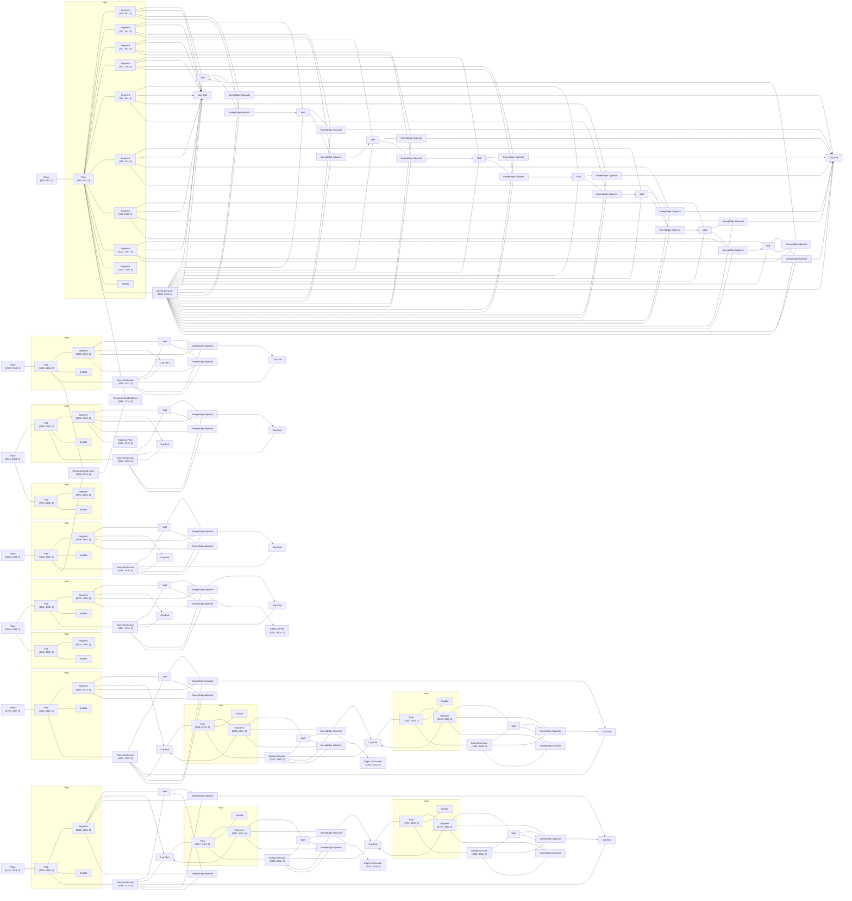

```mermaid
flowchart LR
  subgraph path2 [Path]
    2["Path<br>[518, 543, 0]"]
      %% [ProgramBodyItem { index: 7 }, VariableDeclarationDeclaration, VariableDeclarationInit, PipeBodyItem { index: 1 }]
    3["Segment<br>[549, 591, 0]"]
      %% [ProgramBodyItem { index: 7 }, VariableDeclarationDeclaration, VariableDeclarationInit, PipeBodyItem { index: 2 }]
    4["Segment<br>[597, 641, 0]"]
      %% [ProgramBodyItem { index: 7 }, VariableDeclarationDeclaration, VariableDeclarationInit, PipeBodyItem { index: 3 }]
    5["Segment<br>[647, 691, 0]"]
      %% [ProgramBodyItem { index: 7 }, VariableDeclarationDeclaration, VariableDeclarationInit, PipeBodyItem { index: 4 }]
    6["Segment<br>[697, 758, 0]"]
      %% [ProgramBodyItem { index: 7 }, VariableDeclarationDeclaration, VariableDeclarationInit, PipeBodyItem { index: 5 }]
    7["Segment<br>[764, 844, 0]"]
      %% [ProgramBodyItem { index: 7 }, VariableDeclarationDeclaration, VariableDeclarationInit, PipeBodyItem { index: 6 }]
    8["Segment<br>[850, 933, 0]"]
      %% [ProgramBodyItem { index: 7 }, VariableDeclarationDeclaration, VariableDeclarationInit, PipeBodyItem { index: 7 }]
    9["Segment<br>[939, 1016, 0]"]
      %% [ProgramBodyItem { index: 7 }, VariableDeclarationDeclaration, VariableDeclarationInit, PipeBodyItem { index: 8 }]
    10["Segment<br>[1022, 1087, 0]"]
      %% [ProgramBodyItem { index: 7 }, VariableDeclarationDeclaration, VariableDeclarationInit, PipeBodyItem { index: 9 }]
    11["Segment<br>[1093, 1100, 0]"]
      %% [ProgramBodyItem { index: 7 }, VariableDeclarationDeclaration, VariableDeclarationInit, PipeBodyItem { index: 10 }]
    12[Solid2d]
  end
  subgraph path41 [Path]
    41["Path<br>[1325, 1394, 0]"]
      %% [ProgramBodyItem { index: 8 }, VariableDeclarationDeclaration, VariableDeclarationInit, PipeBodyItem { index: 1 }]
    42["Segment<br>[1325, 1394, 0]"]
      %% [ProgramBodyItem { index: 8 }, VariableDeclarationDeclaration, VariableDeclarationInit, PipeBodyItem { index: 1 }]
    43[Solid2d]
  end
  subgraph path51 [Path]
    51["Path<br>[1538, 1602, 0]"]
      %% [ProgramBodyItem { index: 9 }, VariableDeclarationDeclaration, VariableDeclarationInit, PipeBodyItem { index: 1 }]
    52["Segment<br>[1538, 1602, 0]"]
      %% [ProgramBodyItem { index: 9 }, VariableDeclarationDeclaration, VariableDeclarationInit, PipeBodyItem { index: 1 }]
    53[Solid2d]
  end
  subgraph path63 [Path]
    63["Path<br>[1844, 1913, 0]"]
      %% [ProgramBodyItem { index: 11 }, VariableDeclarationDeclaration, VariableDeclarationInit, PipeBodyItem { index: 1 }]
    64["Segment<br>[1844, 1913, 0]"]
      %% [ProgramBodyItem { index: 11 }, VariableDeclarationDeclaration, VariableDeclarationInit, PipeBodyItem { index: 1 }]
    65[Solid2d]
  end
  subgraph path72 [Path]
    72["Path<br>[2056, 2131, 0]"]
      %% [ProgramBodyItem { index: 12 }, VariableDeclarationDeclaration, VariableDeclarationInit, PipeBodyItem { index: 1 }]
    73["Segment<br>[2056, 2131, 0]"]
      %% [ProgramBodyItem { index: 12 }, VariableDeclarationDeclaration, VariableDeclarationInit, PipeBodyItem { index: 1 }]
    74[Solid2d]
  end
  subgraph path81 [Path]
    81["Path<br>[2435, 2500, 0]"]
      %% [ProgramBodyItem { index: 13 }, VariableDeclarationDeclaration, VariableDeclarationInit, PipeBodyItem { index: 1 }]
    82["Segment<br>[2435, 2500, 0]"]
      %% [ProgramBodyItem { index: 13 }, VariableDeclarationDeclaration, VariableDeclarationInit, PipeBodyItem { index: 1 }]
    83[Solid2d]
  end
  subgraph path89 [Path]
    89["Path<br>[2666, 2750, 0]"]
      %% [ProgramBodyItem { index: 14 }, VariableDeclarationDeclaration, VariableDeclarationInit, PipeBodyItem { index: 1 }]
    90["Segment<br>[2666, 2750, 0]"]
      %% [ProgramBodyItem { index: 14 }, VariableDeclarationDeclaration, VariableDeclarationInit, PipeBodyItem { index: 1 }]
    91[Solid2d]
  end
  subgraph path92 [Path]
    92["Path<br>[2774, 2835, 0]"]
      %% [ProgramBodyItem { index: 14 }, VariableDeclarationDeclaration, VariableDeclarationInit, PipeBodyItem { index: 2 }, CallKwArg { index: 0 }]
    93["Segment<br>[2774, 2835, 0]"]
      %% [ProgramBodyItem { index: 14 }, VariableDeclarationDeclaration, VariableDeclarationInit, PipeBodyItem { index: 2 }, CallKwArg { index: 0 }]
    94[Solid2d]
  end
  subgraph path103 [Path]
    103["Path<br>[3226, 3290, 0]"]
      %% [ProgramBodyItem { index: 15 }, VariableDeclarationDeclaration, VariableDeclarationInit, PipeBodyItem { index: 1 }]
    104["Segment<br>[3226, 3290, 0]"]
      %% [ProgramBodyItem { index: 15 }, VariableDeclarationDeclaration, VariableDeclarationInit, PipeBodyItem { index: 1 }]
    105[Solid2d]
  end
  subgraph path112 [Path]
    112["Path<br>[3417, 3487, 0]"]
      %% [ProgramBodyItem { index: 16 }, VariableDeclarationDeclaration, VariableDeclarationInit, PipeBodyItem { index: 1 }]
    113["Segment<br>[3417, 3487, 0]"]
      %% [ProgramBodyItem { index: 16 }, VariableDeclarationDeclaration, VariableDeclarationInit, PipeBodyItem { index: 1 }]
    114[Solid2d]
  end
  subgraph path121 [Path]
    121["Path<br>[3792, 3852, 0]"]
      %% [ProgramBodyItem { index: 17 }, VariableDeclarationDeclaration, VariableDeclarationInit, PipeBodyItem { index: 1 }]
    122["Segment<br>[3792, 3852, 0]"]
      %% [ProgramBodyItem { index: 17 }, VariableDeclarationDeclaration, VariableDeclarationInit, PipeBodyItem { index: 1 }]
    123[Solid2d]
  end
  subgraph path129 [Path]
    129["Path<br>[4001, 4080, 0]"]
      %% [ProgramBodyItem { index: 18 }, VariableDeclarationDeclaration, VariableDeclarationInit, PipeBodyItem { index: 1 }]
    130["Segment<br>[4001, 4080, 0]"]
      %% [ProgramBodyItem { index: 18 }, VariableDeclarationDeclaration, VariableDeclarationInit, PipeBodyItem { index: 1 }]
    131[Solid2d]
  end
  subgraph path132 [Path]
    132["Path<br>[4104, 4160, 0]"]
      %% [ProgramBodyItem { index: 18 }, VariableDeclarationDeclaration, VariableDeclarationInit, PipeBodyItem { index: 2 }, CallKwArg { index: 0 }]
    133["Segment<br>[4104, 4160, 0]"]
      %% [ProgramBodyItem { index: 18 }, VariableDeclarationDeclaration, VariableDeclarationInit, PipeBodyItem { index: 2 }, CallKwArg { index: 0 }]
    134[Solid2d]
  end
  1["Plane<br>[495, 512, 0]"]
    %% [ProgramBodyItem { index: 7 }, VariableDeclarationDeclaration, VariableDeclarationInit, PipeBodyItem { index: 0 }]
  13["Sweep Extrusion<br>[1106, 1235, 0]"]
    %% [ProgramBodyItem { index: 7 }, VariableDeclarationDeclaration, VariableDeclarationInit, PipeBodyItem { index: 11 }]
  14[Wall]
    %% face_code_ref=Missing NodePath
  15[Wall]
    %% face_code_ref=Missing NodePath
  16[Wall]
    %% face_code_ref=Missing NodePath
  17[Wall]
    %% face_code_ref=Missing NodePath
  18[Wall]
    %% face_code_ref=Missing NodePath
  19[Wall]
    %% face_code_ref=Missing NodePath
  20[Wall]
    %% face_code_ref=Missing NodePath
  21[Wall]
    %% face_code_ref=Missing NodePath
  22["Cap Start"]
    %% face_code_ref=Missing NodePath
  23["Cap End"]
    %% face_code_ref=Missing NodePath
  24["SweepEdge Opposite"]
  25["SweepEdge Adjacent"]
  26["SweepEdge Opposite"]
  27["SweepEdge Adjacent"]
  28["SweepEdge Opposite"]
  29["SweepEdge Adjacent"]
  30["SweepEdge Opposite"]
  31["SweepEdge Adjacent"]
  32["SweepEdge Opposite"]
  33["SweepEdge Adjacent"]
  34["SweepEdge Opposite"]
  35["SweepEdge Adjacent"]
  36["SweepEdge Opposite"]
  37["SweepEdge Adjacent"]
  38["SweepEdge Opposite"]
  39["SweepEdge Adjacent"]
  40["Plane<br>[1302, 1319, 0]"]
    %% [ProgramBodyItem { index: 8 }, VariableDeclarationDeclaration, VariableDeclarationInit, PipeBodyItem { index: 0 }]
  44["Sweep Extrusion<br>[1400, 1421, 0]"]
    %% [ProgramBodyItem { index: 8 }, VariableDeclarationDeclaration, VariableDeclarationInit, PipeBodyItem { index: 2 }]
  45[Wall]
    %% face_code_ref=Missing NodePath
  46["Cap Start"]
    %% face_code_ref=Missing NodePath
  47["Cap End"]
    %% face_code_ref=Missing NodePath
  48["SweepEdge Opposite"]
  49["SweepEdge Adjacent"]
  50["Plane<br>[1503, 1531, 0]"]
    %% [ProgramBodyItem { index: 9 }, VariableDeclarationDeclaration, VariableDeclarationInit, PipeBodyItem { index: 0 }, CallKwUnlabeledArg]
  54["Sweep Extrusion<br>[1608, 1630, 0]"]
    %% [ProgramBodyItem { index: 9 }, VariableDeclarationDeclaration, VariableDeclarationInit, PipeBodyItem { index: 2 }]
  55[Wall]
    %% face_code_ref=Missing NodePath
  56["Cap Start"]
    %% face_code_ref=Missing NodePath
  57["Cap End"]
    %% face_code_ref=Missing NodePath
  58["SweepEdge Opposite"]
  59["SweepEdge Adjacent"]
  60["CompositeSolid Union<br>[1688, 1715, 0]"]
    %% [ProgramBodyItem { index: 10 }, VariableDeclarationDeclaration, VariableDeclarationInit, CallKwArg { index: 0 }]
  61["CompositeSolid Subtract<br>[1660, 1716, 0]"]
    %% [ProgramBodyItem { index: 10 }, VariableDeclarationDeclaration, VariableDeclarationInit]
  62["Plane<br>[1792, 1837, 0]"]
    %% [ProgramBodyItem { index: 11 }, VariableDeclarationDeclaration, VariableDeclarationInit, PipeBodyItem { index: 0 }, CallKwUnlabeledArg]
  66["Sweep Extrusion<br>[1919, 1958, 0]"]
    %% [ProgramBodyItem { index: 11 }, VariableDeclarationDeclaration, VariableDeclarationInit, PipeBodyItem { index: 2 }]
  67[Wall]
    %% face_code_ref=Missing NodePath
  68["Cap Start"]
    %% face_code_ref=Missing NodePath
  69["Cap End"]
    %% face_code_ref=Missing NodePath
  70["SweepEdge Opposite"]
  71["SweepEdge Adjacent"]
  75["Sweep Extrusion<br>[2137, 2185, 0]"]
    %% [ProgramBodyItem { index: 12 }, VariableDeclarationDeclaration, VariableDeclarationInit, PipeBodyItem { index: 2 }]
  76[Wall]
    %% face_code_ref=Missing NodePath
  77["Cap End"]
    %% face_code_ref=Missing NodePath
  78["SweepEdge Opposite"]
  79["SweepEdge Adjacent"]
  80["EdgeCut Chamfer<br>[2191, 2314, 0]"]
    %% [ProgramBodyItem { index: 12 }, VariableDeclarationDeclaration, VariableDeclarationInit, PipeBodyItem { index: 3 }]
  84["Sweep Extrusion<br>[2506, 2539, 0]"]
    %% [ProgramBodyItem { index: 13 }, VariableDeclarationDeclaration, VariableDeclarationInit, PipeBodyItem { index: 2 }]
  85[Wall]
    %% face_code_ref=Missing NodePath
  86["SweepEdge Opposite"]
  87["SweepEdge Adjacent"]
  88["Plane<br>[2613, 2659, 0]"]
    %% [ProgramBodyItem { index: 14 }, VariableDeclarationDeclaration, VariableDeclarationInit, PipeBodyItem { index: 0 }, CallKwUnlabeledArg]
  95["Sweep Extrusion<br>[2842, 2909, 0]"]
    %% [ProgramBodyItem { index: 14 }, VariableDeclarationDeclaration, VariableDeclarationInit, PipeBodyItem { index: 3 }]
  96[Wall]
    %% face_code_ref=Missing NodePath
  97["Cap Start"]
    %% face_code_ref=Missing NodePath
  98["Cap End"]
    %% face_code_ref=Missing NodePath
  99["SweepEdge Opposite"]
  100["SweepEdge Adjacent"]
  101["EdgeCut Fillet<br>[2915, 3079, 0]"]
    %% [ProgramBodyItem { index: 14 }, VariableDeclarationDeclaration, VariableDeclarationInit, PipeBodyItem { index: 4 }]
  102["Plane<br>[3191, 3219, 0]"]
    %% [ProgramBodyItem { index: 15 }, VariableDeclarationDeclaration, VariableDeclarationInit, PipeBodyItem { index: 0 }, CallKwUnlabeledArg]
  106["Sweep Extrusion<br>[3296, 3316, 0]"]
    %% [ProgramBodyItem { index: 15 }, VariableDeclarationDeclaration, VariableDeclarationInit, PipeBodyItem { index: 2 }]
  107[Wall]
    %% face_code_ref=Missing NodePath
  108["Cap Start"]
    %% face_code_ref=Missing NodePath
  109["Cap End"]
    %% face_code_ref=Missing NodePath
  110["SweepEdge Opposite"]
  111["SweepEdge Adjacent"]
  115["Sweep Extrusion<br>[3493, 3541, 0]"]
    %% [ProgramBodyItem { index: 16 }, VariableDeclarationDeclaration, VariableDeclarationInit, PipeBodyItem { index: 2 }]
  116[Wall]
    %% face_code_ref=Missing NodePath
  117["Cap End"]
    %% face_code_ref=Missing NodePath
  118["SweepEdge Opposite"]
  119["SweepEdge Adjacent"]
  120["EdgeCut Chamfer<br>[3547, 3670, 0]"]
    %% [ProgramBodyItem { index: 16 }, VariableDeclarationDeclaration, VariableDeclarationInit, PipeBodyItem { index: 3 }]
  124["Sweep Extrusion<br>[3858, 3891, 0]"]
    %% [ProgramBodyItem { index: 17 }, VariableDeclarationDeclaration, VariableDeclarationInit, PipeBodyItem { index: 2 }]
  125[Wall]
    %% face_code_ref=Missing NodePath
  126["SweepEdge Opposite"]
  127["SweepEdge Adjacent"]
  128["Plane<br>[3966, 3994, 0]"]
    %% [ProgramBodyItem { index: 18 }, VariableDeclarationDeclaration, VariableDeclarationInit, PipeBodyItem { index: 0 }, CallKwUnlabeledArg]
  135["Sweep Extrusion<br>[4167, 4234, 0]"]
    %% [ProgramBodyItem { index: 18 }, VariableDeclarationDeclaration, VariableDeclarationInit, PipeBodyItem { index: 3 }]
  136[Wall]
    %% face_code_ref=Missing NodePath
  137["Cap Start"]
    %% face_code_ref=Missing NodePath
  138["Cap End"]
    %% face_code_ref=Missing NodePath
  139["SweepEdge Opposite"]
  140["SweepEdge Adjacent"]
  141["EdgeCut Fillet<br>[4240, 4404, 0]"]
    %% [ProgramBodyItem { index: 18 }, VariableDeclarationDeclaration, VariableDeclarationInit, PipeBodyItem { index: 4 }]
  1 --- 2
  2 --- 3
  2 --- 4
  2 --- 5
  2 --- 6
  2 --- 7
  2 --- 8
  2 --- 9
  2 --- 10
  2 --- 11
  2 --- 12
  2 ---- 13
  2 --- 61
  3 --- 14
  3 x--> 22
  3 --- 24
  3 --- 25
  4 --- 15
  4 x--> 22
  4 --- 26
  4 --- 27
  5 --- 16
  5 x--> 22
  5 --- 28
  5 --- 29
  6 --- 17
  6 x--> 22
  6 --- 30
  6 --- 31
  7 --- 18
  7 x--> 22
  7 --- 32
  7 --- 33
  8 --- 19
  8 x--> 22
  8 --- 34
  8 --- 35
  9 --- 20
  9 x--> 22
  9 --- 36
  9 --- 37
  10 --- 21
  10 x--> 22
  10 --- 38
  10 --- 39
  13 --- 14
  13 --- 15
  13 --- 16
  13 --- 17
  13 --- 18
  13 --- 19
  13 --- 20
  13 --- 21
  13 --- 22
  13 --- 23
  13 --- 24
  13 --- 25
  13 --- 26
  13 --- 27
  13 --- 28
  13 --- 29
  13 --- 30
  13 --- 31
  13 --- 32
  13 --- 33
  13 --- 34
  13 --- 35
  13 --- 36
  13 --- 37
  13 --- 38
  13 --- 39
  14 --- 24
  14 --- 25
  39 <--x 14
  25 <--x 15
  15 --- 26
  15 --- 27
  27 <--x 16
  16 --- 28
  16 --- 29
  29 <--x 17
  17 --- 30
  17 --- 31
  31 <--x 18
  18 --- 32
  18 --- 33
  33 <--x 19
  19 --- 34
  19 --- 35
  35 <--x 20
  20 --- 36
  20 --- 37
  37 <--x 21
  21 --- 38
  21 --- 39
  24 <--x 23
  26 <--x 23
  28 <--x 23
  30 <--x 23
  32 <--x 23
  34 <--x 23
  36 <--x 23
  38 <--x 23
  40 --- 41
  41 --- 42
  41 --- 43
  41 ---- 44
  41 --- 60
  42 --- 45
  42 x--> 46
  42 --- 48
  42 --- 49
  44 --- 45
  44 --- 46
  44 --- 47
  44 --- 48
  44 --- 49
  45 --- 48
  45 --- 49
  48 <--x 47
  50 --- 51
  51 --- 52
  51 --- 53
  51 ---- 54
  51 --- 60
  52 --- 55
  52 x--> 57
  52 --- 58
  52 --- 59
  54 --- 55
  54 --- 56
  54 --- 57
  54 --- 58
  54 --- 59
  55 --- 58
  55 --- 59
  58 <--x 56
  60 --- 61
  62 --- 63
  63 --- 64
  63 --- 65
  63 ---- 66
  64 --- 67
  64 x--> 69
  64 --- 70
  64 --- 71
  66 --- 67
  66 --- 68
  66 --- 69
  66 --- 70
  66 --- 71
  67 --- 70
  67 --- 71
  70 <--x 68
  86 <--x 68
  69 --- 72
  73 <--x 69
  72 --- 73
  72 --- 74
  72 ---- 75
  73 --- 76
  73 --- 78
  73 --- 79
  75 --- 76
  75 --- 77
  75 --- 78
  75 --- 79
  76 --- 78
  76 --- 79
  78 <--x 77
  77 --- 81
  82 <--x 77
  78 <--x 80
  81 --- 82
  81 --- 83
  81 ---- 84
  82 --- 85
  82 --- 86
  82 --- 87
  84 --- 85
  84 --- 86
  84 --- 87
  85 --- 86
  85 --- 87
  88 --- 89
  88 --- 92
  89 --- 90
  89 --- 91
  89 ---- 95
  90 --- 96
  90 x--> 98
  90 --- 99
  90 --- 100
  90 --- 101
  92 --- 93
  92 --- 94
  95 --- 96
  95 --- 97
  95 --- 98
  95 --- 99
  95 --- 100
  96 --- 99
  96 --- 100
  99 <--x 97
  102 --- 103
  103 --- 104
  103 --- 105
  103 ---- 106
  104 --- 107
  104 x--> 108
  104 --- 110
  104 --- 111
  106 --- 107
  106 --- 108
  106 --- 109
  106 --- 110
  106 --- 111
  107 --- 110
  107 --- 111
  108 --- 112
  113 <--x 108
  110 <--x 109
  126 <--x 109
  112 --- 113
  112 --- 114
  112 ---- 115
  113 --- 116
  113 --- 118
  113 --- 119
  115 --- 116
  115 --- 117
  115 --- 118
  115 --- 119
  116 --- 118
  116 --- 119
  118 <--x 117
  117 --- 121
  122 <--x 117
  118 <--x 120
  121 --- 122
  121 --- 123
  121 ---- 124
  122 --- 125
  122 --- 126
  122 --- 127
  124 --- 125
  124 --- 126
  124 --- 127
  125 --- 126
  125 --- 127
  128 --- 129
  128 --- 132
  129 --- 130
  129 --- 131
  129 ---- 135
  130 --- 136
  130 x--> 138
  130 --- 139
  130 --- 140
  132 --- 133
  132 --- 134
  135 --- 136
  135 --- 137
  135 --- 138
  135 --- 139
  135 --- 140
  136 --- 139
  136 --- 140
  139 <--x 137
  139 <--x 141
```
