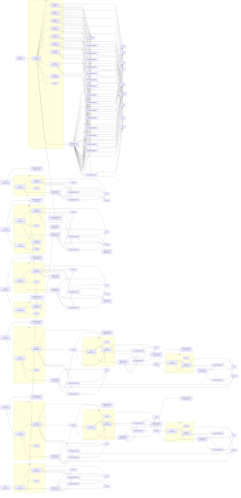

```mermaid
flowchart LR
  subgraph path17 [Path]
    17["Path<br>[518, 543, 0]"]
      %% [ProgramBodyItem { index: 7 }, VariableDeclarationDeclaration, VariableDeclarationInit, PipeBodyItem { index: 1 }]
    30["Segment<br>[549, 591, 0]"]
      %% [ProgramBodyItem { index: 7 }, VariableDeclarationDeclaration, VariableDeclarationInit, PipeBodyItem { index: 2 }]
    31["Segment<br>[597, 641, 0]"]
      %% [ProgramBodyItem { index: 7 }, VariableDeclarationDeclaration, VariableDeclarationInit, PipeBodyItem { index: 3 }]
    32["Segment<br>[647, 691, 0]"]
      %% [ProgramBodyItem { index: 7 }, VariableDeclarationDeclaration, VariableDeclarationInit, PipeBodyItem { index: 4 }]
    33["Segment<br>[697, 758, 0]"]
      %% [ProgramBodyItem { index: 7 }, VariableDeclarationDeclaration, VariableDeclarationInit, PipeBodyItem { index: 5 }]
    34["Segment<br>[764, 844, 0]"]
      %% [ProgramBodyItem { index: 7 }, VariableDeclarationDeclaration, VariableDeclarationInit, PipeBodyItem { index: 6 }]
    35["Segment<br>[850, 933, 0]"]
      %% [ProgramBodyItem { index: 7 }, VariableDeclarationDeclaration, VariableDeclarationInit, PipeBodyItem { index: 7 }]
    36["Segment<br>[939, 1016, 0]"]
      %% [ProgramBodyItem { index: 7 }, VariableDeclarationDeclaration, VariableDeclarationInit, PipeBodyItem { index: 8 }]
    37["Segment<br>[1022, 1087, 0]"]
      %% [ProgramBodyItem { index: 7 }, VariableDeclarationDeclaration, VariableDeclarationInit, PipeBodyItem { index: 9 }]
    38["Segment<br>[1093, 1100, 0]"]
      %% [ProgramBodyItem { index: 7 }, VariableDeclarationDeclaration, VariableDeclarationInit, PipeBodyItem { index: 10 }]
    56[Solid2d]
  end
  subgraph path18 [Path]
    18["Path<br>[1325, 1394, 0]"]
      %% [ProgramBodyItem { index: 8 }, VariableDeclarationDeclaration, VariableDeclarationInit, PipeBodyItem { index: 1 }]
    39["Segment<br>[1325, 1394, 0]"]
      %% [ProgramBodyItem { index: 8 }, VariableDeclarationDeclaration, VariableDeclarationInit, PipeBodyItem { index: 1 }]
    55[Solid2d]
  end
  subgraph path19 [Path]
    19["Path<br>[1538, 1602, 0]"]
      %% [ProgramBodyItem { index: 9 }, VariableDeclarationDeclaration, VariableDeclarationInit, PipeBodyItem { index: 1 }]
    40["Segment<br>[1538, 1602, 0]"]
      %% [ProgramBodyItem { index: 9 }, VariableDeclarationDeclaration, VariableDeclarationInit, PipeBodyItem { index: 1 }]
    51[Solid2d]
  end
  subgraph path20 [Path]
    20["Path<br>[1844, 1913, 0]"]
      %% [ProgramBodyItem { index: 11 }, VariableDeclarationDeclaration, VariableDeclarationInit, PipeBodyItem { index: 1 }]
    41["Segment<br>[1844, 1913, 0]"]
      %% [ProgramBodyItem { index: 11 }, VariableDeclarationDeclaration, VariableDeclarationInit, PipeBodyItem { index: 1 }]
    61[Solid2d]
  end
  subgraph path21 [Path]
    21["Path<br>[2056, 2131, 0]"]
      %% [ProgramBodyItem { index: 12 }, VariableDeclarationDeclaration, VariableDeclarationInit, PipeBodyItem { index: 1 }]
    42["Segment<br>[2056, 2131, 0]"]
      %% [ProgramBodyItem { index: 12 }, VariableDeclarationDeclaration, VariableDeclarationInit, PipeBodyItem { index: 1 }]
    57[Solid2d]
  end
  subgraph path22 [Path]
    22["Path<br>[2435, 2500, 0]"]
      %% [ProgramBodyItem { index: 13 }, VariableDeclarationDeclaration, VariableDeclarationInit, PipeBodyItem { index: 1 }]
    43["Segment<br>[2435, 2500, 0]"]
      %% [ProgramBodyItem { index: 13 }, VariableDeclarationDeclaration, VariableDeclarationInit, PipeBodyItem { index: 1 }]
    60[Solid2d]
  end
  subgraph path23 [Path]
    23["Path<br>[2666, 2750, 0]"]
      %% [ProgramBodyItem { index: 14 }, VariableDeclarationDeclaration, VariableDeclarationInit, PipeBodyItem { index: 1 }]
    44["Segment<br>[2666, 2750, 0]"]
      %% [ProgramBodyItem { index: 14 }, VariableDeclarationDeclaration, VariableDeclarationInit, PipeBodyItem { index: 1 }]
    62[Solid2d]
  end
  subgraph path24 [Path]
    24["Path<br>[2774, 2835, 0]"]
      %% [ProgramBodyItem { index: 14 }, VariableDeclarationDeclaration, VariableDeclarationInit, PipeBodyItem { index: 2 }, CallKwArg { index: 0 }]
    45["Segment<br>[2774, 2835, 0]"]
      %% [ProgramBodyItem { index: 14 }, VariableDeclarationDeclaration, VariableDeclarationInit, PipeBodyItem { index: 2 }, CallKwArg { index: 0 }]
    59[Solid2d]
  end
  subgraph path25 [Path]
    25["Path<br>[3226, 3290, 0]"]
      %% [ProgramBodyItem { index: 15 }, VariableDeclarationDeclaration, VariableDeclarationInit, PipeBodyItem { index: 1 }]
    46["Segment<br>[3226, 3290, 0]"]
      %% [ProgramBodyItem { index: 15 }, VariableDeclarationDeclaration, VariableDeclarationInit, PipeBodyItem { index: 1 }]
    63[Solid2d]
  end
  subgraph path26 [Path]
    26["Path<br>[3417, 3487, 0]"]
      %% [ProgramBodyItem { index: 16 }, VariableDeclarationDeclaration, VariableDeclarationInit, PipeBodyItem { index: 1 }]
    47["Segment<br>[3417, 3487, 0]"]
      %% [ProgramBodyItem { index: 16 }, VariableDeclarationDeclaration, VariableDeclarationInit, PipeBodyItem { index: 1 }]
    52[Solid2d]
  end
  subgraph path27 [Path]
    27["Path<br>[3792, 3852, 0]"]
      %% [ProgramBodyItem { index: 17 }, VariableDeclarationDeclaration, VariableDeclarationInit, PipeBodyItem { index: 1 }]
    48["Segment<br>[3792, 3852, 0]"]
      %% [ProgramBodyItem { index: 17 }, VariableDeclarationDeclaration, VariableDeclarationInit, PipeBodyItem { index: 1 }]
    54[Solid2d]
  end
  subgraph path28 [Path]
    28["Path<br>[4001, 4080, 0]"]
      %% [ProgramBodyItem { index: 18 }, VariableDeclarationDeclaration, VariableDeclarationInit, PipeBodyItem { index: 1 }]
    49["Segment<br>[4001, 4080, 0]"]
      %% [ProgramBodyItem { index: 18 }, VariableDeclarationDeclaration, VariableDeclarationInit, PipeBodyItem { index: 1 }]
    58[Solid2d]
  end
  subgraph path29 [Path]
    29["Path<br>[4104, 4160, 0]"]
      %% [ProgramBodyItem { index: 18 }, VariableDeclarationDeclaration, VariableDeclarationInit, PipeBodyItem { index: 2 }, CallKwArg { index: 0 }]
    50["Segment<br>[4104, 4160, 0]"]
      %% [ProgramBodyItem { index: 18 }, VariableDeclarationDeclaration, VariableDeclarationInit, PipeBodyItem { index: 2 }, CallKwArg { index: 0 }]
    53[Solid2d]
  end
  1["Plane<br>[495, 512, 0]"]
    %% [ProgramBodyItem { index: 7 }, VariableDeclarationDeclaration, VariableDeclarationInit, PipeBodyItem { index: 0 }]
  2["Plane<br>[1302, 1319, 0]"]
    %% [ProgramBodyItem { index: 8 }, VariableDeclarationDeclaration, VariableDeclarationInit, PipeBodyItem { index: 0 }]
  3["Plane<br>[1503, 1531, 0]"]
    %% [ProgramBodyItem { index: 9 }, VariableDeclarationDeclaration, VariableDeclarationInit, PipeBodyItem { index: 0 }, CallKwUnlabeledArg]
  4["Plane<br>[1792, 1837, 0]"]
    %% [ProgramBodyItem { index: 11 }, VariableDeclarationDeclaration, VariableDeclarationInit, PipeBodyItem { index: 0 }, CallKwUnlabeledArg]
  5["Plane<br>[2613, 2659, 0]"]
    %% [ProgramBodyItem { index: 14 }, VariableDeclarationDeclaration, VariableDeclarationInit, PipeBodyItem { index: 0 }, CallKwUnlabeledArg]
  6["Plane<br>[3191, 3219, 0]"]
    %% [ProgramBodyItem { index: 15 }, VariableDeclarationDeclaration, VariableDeclarationInit, PipeBodyItem { index: 0 }, CallKwUnlabeledArg]
  7["Plane<br>[3966, 3994, 0]"]
    %% [ProgramBodyItem { index: 18 }, VariableDeclarationDeclaration, VariableDeclarationInit, PipeBodyItem { index: 0 }, CallKwUnlabeledArg]
  8["StartSketchOnPlane<br>[2599, 2660, 0]"]
    %% Missing NodePath
  9["StartSketchOnPlane<br>[3952, 3995, 0]"]
    %% Missing NodePath
  10["StartSketchOnPlane<br>[1778, 1838, 0]"]
    %% Missing NodePath
  11["StartSketchOnPlane<br>[3177, 3220, 0]"]
    %% Missing NodePath
  12["StartSketchOnPlane<br>[1489, 1532, 0]"]
    %% Missing NodePath
  13["StartSketchOnFace<br>[3753, 3786, 0]"]
    %% Missing NodePath
  14["StartSketchOnFace<br>[3370, 3411, 0]"]
    %% Missing NodePath
  15["StartSketchOnFace<br>[2396, 2429, 0]"]
    %% Missing NodePath
  16["StartSketchOnFace<br>[2011, 2050, 0]"]
    %% Missing NodePath
  64["Sweep Extrusion<br>[1106, 1235, 0]"]
    %% [ProgramBodyItem { index: 7 }, VariableDeclarationDeclaration, VariableDeclarationInit, PipeBodyItem { index: 11 }]
  65["Sweep Extrusion<br>[1400, 1421, 0]"]
    %% [ProgramBodyItem { index: 8 }, VariableDeclarationDeclaration, VariableDeclarationInit, PipeBodyItem { index: 2 }]
  66["Sweep Extrusion<br>[1608, 1630, 0]"]
    %% [ProgramBodyItem { index: 9 }, VariableDeclarationDeclaration, VariableDeclarationInit, PipeBodyItem { index: 2 }]
  67["Sweep Extrusion<br>[1919, 1958, 0]"]
    %% [ProgramBodyItem { index: 11 }, VariableDeclarationDeclaration, VariableDeclarationInit, PipeBodyItem { index: 2 }]
  68["Sweep Extrusion<br>[2137, 2185, 0]"]
    %% [ProgramBodyItem { index: 12 }, VariableDeclarationDeclaration, VariableDeclarationInit, PipeBodyItem { index: 2 }]
  69["Sweep Extrusion<br>[2506, 2539, 0]"]
    %% [ProgramBodyItem { index: 13 }, VariableDeclarationDeclaration, VariableDeclarationInit, PipeBodyItem { index: 2 }]
  70["Sweep Extrusion<br>[2842, 2909, 0]"]
    %% [ProgramBodyItem { index: 14 }, VariableDeclarationDeclaration, VariableDeclarationInit, PipeBodyItem { index: 3 }]
  71["Sweep Extrusion<br>[3296, 3316, 0]"]
    %% [ProgramBodyItem { index: 15 }, VariableDeclarationDeclaration, VariableDeclarationInit, PipeBodyItem { index: 2 }]
  72["Sweep Extrusion<br>[3493, 3541, 0]"]
    %% [ProgramBodyItem { index: 16 }, VariableDeclarationDeclaration, VariableDeclarationInit, PipeBodyItem { index: 2 }]
  73["Sweep Extrusion<br>[3858, 3891, 0]"]
    %% [ProgramBodyItem { index: 17 }, VariableDeclarationDeclaration, VariableDeclarationInit, PipeBodyItem { index: 2 }]
  74["Sweep Extrusion<br>[4167, 4234, 0]"]
    %% [ProgramBodyItem { index: 18 }, VariableDeclarationDeclaration, VariableDeclarationInit, PipeBodyItem { index: 3 }]
  75["CompositeSolid Subtract<br>[1660, 1716, 0]"]
    %% [ProgramBodyItem { index: 10 }, VariableDeclarationDeclaration, VariableDeclarationInit]
  76["CompositeSolid Union<br>[1688, 1715, 0]"]
    %% [ProgramBodyItem { index: 10 }, VariableDeclarationDeclaration, VariableDeclarationInit, CallKwArg { index: 0 }]
  77[Wall]
  78[Wall]
  79[Wall]
  80[Wall]
  81[Wall]
  82[Wall]
  83[Wall]
  84[Wall]
  85[Wall]
  86[Wall]
  87[Wall]
  88[Wall]
  89[Wall]
  90[Wall]
  91[Wall]
  92[Wall]
  93[Wall]
  94[Wall]
  95["Cap Start"]
  96["Cap Start"]
  97["Cap Start"]
  98["Cap Start"]
  99["Cap Start"]
  100["Cap Start"]
  101["Cap Start"]
  102["Cap End"]
  103["Cap End"]
  104["Cap End"]
  105["Cap End"]
  106["Cap End"]
  107["Cap End"]
  108["Cap End"]
  109["Cap End"]
  110["Cap End"]
  111["SweepEdge Opposite"]
  112["SweepEdge Opposite"]
  113["SweepEdge Opposite"]
  114["SweepEdge Opposite"]
  115["SweepEdge Opposite"]
  116["SweepEdge Opposite"]
  117["SweepEdge Opposite"]
  118["SweepEdge Opposite"]
  119["SweepEdge Opposite"]
  120["SweepEdge Opposite"]
  121["SweepEdge Opposite"]
  122["SweepEdge Opposite"]
  123["SweepEdge Opposite"]
  124["SweepEdge Opposite"]
  125["SweepEdge Opposite"]
  126["SweepEdge Opposite"]
  127["SweepEdge Opposite"]
  128["SweepEdge Opposite"]
  129["SweepEdge Adjacent"]
  130["SweepEdge Adjacent"]
  131["SweepEdge Adjacent"]
  132["SweepEdge Adjacent"]
  133["SweepEdge Adjacent"]
  134["SweepEdge Adjacent"]
  135["SweepEdge Adjacent"]
  136["SweepEdge Adjacent"]
  137["SweepEdge Adjacent"]
  138["SweepEdge Adjacent"]
  139["SweepEdge Adjacent"]
  140["SweepEdge Adjacent"]
  141["SweepEdge Adjacent"]
  142["SweepEdge Adjacent"]
  143["SweepEdge Adjacent"]
  144["SweepEdge Adjacent"]
  145["SweepEdge Adjacent"]
  146["SweepEdge Adjacent"]
  147["EdgeCut Chamfer<br>[2191, 2314, 0]"]
    %% [ProgramBodyItem { index: 12 }, VariableDeclarationDeclaration, VariableDeclarationInit, PipeBodyItem { index: 3 }]
  148["EdgeCut Fillet<br>[2915, 3079, 0]"]
    %% [ProgramBodyItem { index: 14 }, VariableDeclarationDeclaration, VariableDeclarationInit, PipeBodyItem { index: 4 }]
  149["EdgeCut Fillet<br>[2915, 3079, 0]"]
    %% [ProgramBodyItem { index: 14 }, VariableDeclarationDeclaration, VariableDeclarationInit, PipeBodyItem { index: 4 }]
  150["EdgeCut Chamfer<br>[3547, 3670, 0]"]
    %% [ProgramBodyItem { index: 16 }, VariableDeclarationDeclaration, VariableDeclarationInit, PipeBodyItem { index: 3 }]
  151["EdgeCut Fillet<br>[4240, 4404, 0]"]
    %% [ProgramBodyItem { index: 18 }, VariableDeclarationDeclaration, VariableDeclarationInit, PipeBodyItem { index: 4 }]
  152["EdgeCut Fillet<br>[4240, 4404, 0]"]
    %% [ProgramBodyItem { index: 18 }, VariableDeclarationDeclaration, VariableDeclarationInit, PipeBodyItem { index: 4 }]
  1 --- 17
  2 --- 18
  3 <--x 12
  3 --- 19
  4 <--x 10
  4 --- 20
  5 <--x 8
  5 --- 23
  5 --- 24
  6 <--x 11
  6 --- 25
  7 <--x 9
  7 --- 28
  7 --- 29
  109 x--> 13
  100 x--> 14
  103 x--> 15
  110 x--> 16
  17 --- 30
  17 --- 31
  17 --- 32
  17 --- 33
  17 --- 34
  17 --- 35
  17 --- 36
  17 --- 37
  17 --- 38
  17 --- 56
  17 ---- 64
  17 --- 75
  18 --- 39
  18 --- 55
  18 ---- 65
  18 --- 76
  19 --- 40
  19 --- 51
  19 ---- 66
  19 --- 76
  20 --- 41
  20 --- 61
  20 ---- 67
  21 --- 42
  21 --- 57
  21 ---- 68
  110 --- 21
  22 --- 43
  22 --- 60
  22 ---- 69
  103 --- 22
  23 --- 44
  23 --- 62
  23 ---- 70
  24 --- 45
  24 --- 59
  25 --- 46
  25 --- 63
  25 ---- 71
  26 --- 47
  26 --- 52
  26 ---- 72
  100 --- 26
  27 --- 48
  27 --- 54
  27 ---- 73
  109 --- 27
  28 --- 49
  28 --- 58
  28 ---- 74
  29 --- 50
  29 --- 53
  30 --- 83
  30 x--> 98
  30 --- 111
  30 --- 134
  31 --- 80
  31 x--> 98
  31 --- 114
  31 --- 132
  32 --- 79
  32 x--> 98
  32 --- 112
  32 --- 130
  33 --- 81
  33 x--> 98
  33 --- 116
  33 --- 131
  34 --- 78
  34 x--> 98
  34 --- 117
  34 --- 133
  35 --- 77
  35 x--> 98
  35 --- 118
  35 --- 136
  36 --- 82
  36 x--> 98
  36 --- 113
  36 --- 135
  37 --- 84
  37 x--> 98
  37 --- 115
  37 --- 129
  39 --- 93
  39 x--> 96
  39 --- 127
  39 --- 145
  40 --- 86
  40 x--> 107
  40 --- 120
  40 --- 138
  41 --- 88
  41 x--> 110
  41 --- 122
  41 --- 140
  42 --- 94
  42 x--> 110
  42 --- 128
  42 --- 146
  43 --- 90
  43 x--> 103
  43 --- 124
  43 --- 142
  44 --- 91
  44 x--> 102
  44 --- 125
  44 --- 143
  44 --- 148
  46 --- 85
  46 x--> 100
  46 --- 119
  46 --- 137
  47 --- 89
  47 x--> 100
  47 --- 123
  47 --- 141
  48 --- 92
  48 x--> 109
  48 --- 126
  48 --- 144
  49 --- 87
  49 x--> 105
  49 --- 121
  49 --- 139
  49 --- 152
  64 --- 77
  64 --- 78
  64 --- 79
  64 --- 80
  64 --- 81
  64 --- 82
  64 --- 83
  64 --- 84
  64 --- 98
  64 --- 106
  64 --- 111
  64 --- 112
  64 --- 113
  64 --- 114
  64 --- 115
  64 --- 116
  64 --- 117
  64 --- 118
  64 --- 129
  64 --- 130
  64 --- 131
  64 --- 132
  64 --- 133
  64 --- 134
  64 --- 135
  64 --- 136
  65 --- 93
  65 --- 96
  65 --- 104
  65 --- 127
  65 --- 145
  66 --- 86
  66 --- 99
  66 --- 107
  66 --- 120
  66 --- 138
  67 --- 88
  67 --- 101
  67 --- 110
  67 --- 122
  67 --- 140
  68 --- 94
  68 --- 103
  68 --- 128
  68 --- 146
  69 --- 90
  69 --- 124
  69 --- 142
  70 --- 91
  70 --- 95
  70 --- 102
  70 --- 125
  70 --- 143
  71 --- 85
  71 --- 100
  71 --- 108
  71 --- 119
  71 --- 137
  72 --- 89
  72 --- 109
  72 --- 123
  72 --- 141
  73 --- 92
  73 --- 126
  73 --- 144
  74 --- 87
  74 --- 97
  74 --- 105
  74 --- 121
  74 --- 139
  76 --- 75
  118 <--x 77
  133 <--x 77
  136 <--x 77
  117 <--x 78
  131 <--x 78
  133 <--x 78
  112 <--x 79
  130 <--x 79
  132 <--x 79
  114 <--x 80
  132 <--x 80
  134 <--x 80
  116 <--x 81
  130 <--x 81
  131 <--x 81
  113 <--x 82
  135 <--x 82
  136 <--x 82
  111 <--x 83
  129 <--x 83
  134 <--x 83
  115 <--x 84
  129 <--x 84
  135 <--x 84
  119 <--x 85
  137 <--x 85
  120 <--x 86
  138 <--x 86
  121 <--x 87
  139 <--x 87
  122 <--x 88
  140 <--x 88
  123 <--x 89
  141 <--x 89
  124 <--x 90
  142 <--x 90
  125 <--x 91
  143 <--x 91
  126 <--x 92
  144 <--x 92
  127 <--x 93
  145 <--x 93
  128 <--x 94
  146 <--x 94
  125 <--x 95
  121 <--x 97
  120 <--x 99
  122 <--x 101
  124 <--x 101
  128 <--x 103
  127 <--x 104
  111 <--x 106
  112 <--x 106
  113 <--x 106
  114 <--x 106
  115 <--x 106
  116 <--x 106
  117 <--x 106
  118 <--x 106
  119 <--x 108
  126 <--x 108
  123 <--x 109
  121 <--x 151
  123 <--x 150
  125 <--x 149
  128 <--x 147
```
