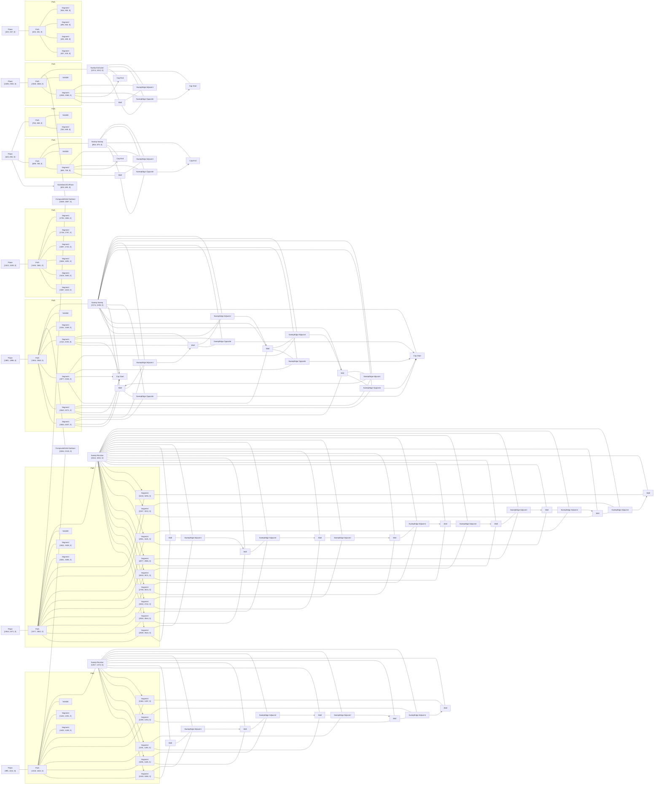

```mermaid
flowchart LR
  subgraph path9 [Path]
    9["Path<br>[343, 401, 0]"]
      %% [ProgramBodyItem { index: 5 }, VariableDeclarationDeclaration, VariableDeclarationInit, PipeBodyItem { index: 1 }]
    17["Segment<br>[407, 429, 0]"]
      %% [ProgramBodyItem { index: 5 }, VariableDeclarationDeclaration, VariableDeclarationInit, PipeBodyItem { index: 2 }]
    18["Segment<br>[435, 489, 0]"]
      %% [ProgramBodyItem { index: 5 }, VariableDeclarationDeclaration, VariableDeclarationInit, PipeBodyItem { index: 3 }]
    19["Segment<br>[495, 550, 0]"]
      %% [ProgramBodyItem { index: 5 }, VariableDeclarationDeclaration, VariableDeclarationInit, PipeBodyItem { index: 4 }]
    20["Segment<br>[556, 595, 0]"]
      %% [ProgramBodyItem { index: 5 }, VariableDeclarationDeclaration, VariableDeclarationInit, PipeBodyItem { index: 5 }]
  end
  subgraph path10 [Path]
    10["Path<br>[699, 759, 0]"]
      %% [ProgramBodyItem { index: 6 }, VariableDeclarationDeclaration, VariableDeclarationInit, PipeBodyItem { index: 1 }]
    21["Segment<br>[699, 759, 0]"]
      %% [ProgramBodyItem { index: 6 }, VariableDeclarationDeclaration, VariableDeclarationInit, PipeBodyItem { index: 1 }]
    54[Solid2d]
  end
  subgraph path11 [Path]
    11["Path<br>[783, 849, 0]"]
      %% [ProgramBodyItem { index: 6 }, VariableDeclarationDeclaration, VariableDeclarationInit, PipeBodyItem { index: 2 }, CallKwArg { index: 0 }]
    22["Segment<br>[783, 849, 0]"]
      %% [ProgramBodyItem { index: 6 }, VariableDeclarationDeclaration, VariableDeclarationInit, PipeBodyItem { index: 2 }, CallKwArg { index: 0 }]
    58[Solid2d]
  end
  subgraph path12 [Path]
    12["Path<br>[1018, 1043, 0]"]
      %% [ProgramBodyItem { index: 7 }, VariableDeclarationDeclaration, VariableDeclarationInit, PipeBodyItem { index: 1 }]
    23["Segment<br>[1049, 1085, 0]"]
      %% [ProgramBodyItem { index: 7 }, VariableDeclarationDeclaration, VariableDeclarationInit, PipeBodyItem { index: 2 }]
    24["Segment<br>[1091, 1185, 0]"]
      %% [ProgramBodyItem { index: 7 }, VariableDeclarationDeclaration, VariableDeclarationInit, PipeBodyItem { index: 3 }]
    25["Segment<br>[1191, 1283, 0]"]
      %% [ProgramBodyItem { index: 7 }, VariableDeclarationDeclaration, VariableDeclarationInit, PipeBodyItem { index: 4 }]
    26["Segment<br>[1289, 1354, 0]"]
      %% [ProgramBodyItem { index: 7 }, VariableDeclarationDeclaration, VariableDeclarationInit, PipeBodyItem { index: 5 }]
    27["Segment<br>[1360, 1397, 0]"]
      %% [ProgramBodyItem { index: 7 }, VariableDeclarationDeclaration, VariableDeclarationInit, PipeBodyItem { index: 6 }]
    28["Segment<br>[1403, 1438, 0]"]
      %% [ProgramBodyItem { index: 7 }, VariableDeclarationDeclaration, VariableDeclarationInit, PipeBodyItem { index: 7 }]
    29["Segment<br>[1444, 1451, 0]"]
      %% [ProgramBodyItem { index: 7 }, VariableDeclarationDeclaration, VariableDeclarationInit, PipeBodyItem { index: 8 }]
    53[Solid2d]
  end
  subgraph path13 [Path]
    13["Path<br>[1545, 1581, 0]"]
      %% [ProgramBodyItem { index: 8 }, VariableDeclarationDeclaration, VariableDeclarationInit, PipeBodyItem { index: 1 }]
    30["Segment<br>[1587, 1610, 0]"]
      %% [ProgramBodyItem { index: 8 }, VariableDeclarationDeclaration, VariableDeclarationInit, PipeBodyItem { index: 2 }]
    31["Segment<br>[1616, 1650, 0]"]
      %% [ProgramBodyItem { index: 8 }, VariableDeclarationDeclaration, VariableDeclarationInit, PipeBodyItem { index: 3 }]
    32["Segment<br>[1656, 1691, 0]"]
      %% [ProgramBodyItem { index: 8 }, VariableDeclarationDeclaration, VariableDeclarationInit, PipeBodyItem { index: 4 }]
    33["Segment<br>[1697, 1732, 0]"]
      %% [ProgramBodyItem { index: 8 }, VariableDeclarationDeclaration, VariableDeclarationInit, PipeBodyItem { index: 5 }]
    34["Segment<br>[1738, 1787, 0]"]
      %% [ProgramBodyItem { index: 8 }, VariableDeclarationDeclaration, VariableDeclarationInit, PipeBodyItem { index: 6 }]
    35["Segment<br>[1793, 1850, 0]"]
      %% [ProgramBodyItem { index: 8 }, VariableDeclarationDeclaration, VariableDeclarationInit, PipeBodyItem { index: 7 }]
  end
  subgraph path14 [Path]
    14["Path<br>[1904, 1948, 0]"]
      %% [ProgramBodyItem { index: 9 }, VariableDeclarationDeclaration, VariableDeclarationInit, PipeBodyItem { index: 1 }]
    36["Segment<br>[1954, 2037, 0]"]
      %% [ProgramBodyItem { index: 9 }, VariableDeclarationDeclaration, VariableDeclarationInit, PipeBodyItem { index: 2 }]
    37["Segment<br>[2043, 2071, 0]"]
      %% [ProgramBodyItem { index: 9 }, VariableDeclarationDeclaration, VariableDeclarationInit, PipeBodyItem { index: 3 }]
    38["Segment<br>[2077, 2106, 0]"]
      %% [ProgramBodyItem { index: 9 }, VariableDeclarationDeclaration, VariableDeclarationInit, PipeBodyItem { index: 4 }]
    39["Segment<br>[2112, 2155, 0]"]
      %% [ProgramBodyItem { index: 9 }, VariableDeclarationDeclaration, VariableDeclarationInit, PipeBodyItem { index: 5 }]
    40["Segment<br>[2161, 2168, 0]"]
      %% [ProgramBodyItem { index: 9 }, VariableDeclarationDeclaration, VariableDeclarationInit, PipeBodyItem { index: 6 }]
    56[Solid2d]
  end
  subgraph path15 [Path]
    15["Path<br>[2308, 2368, 0]"]
      %% [ProgramBodyItem { index: 10 }, VariableDeclarationDeclaration, VariableDeclarationInit, PipeBodyItem { index: 1 }]
    41["Segment<br>[2308, 2368, 0]"]
      %% [ProgramBodyItem { index: 10 }, VariableDeclarationDeclaration, VariableDeclarationInit, PipeBodyItem { index: 1 }]
    57[Solid2d]
  end
  subgraph path16 [Path]
    16["Path<br>[2477, 2502, 0]"]
      %% [ProgramBodyItem { index: 11 }, VariableDeclarationDeclaration, VariableDeclarationInit, PipeBodyItem { index: 1 }]
    42["Segment<br>[2508, 2544, 0]"]
      %% [ProgramBodyItem { index: 11 }, VariableDeclarationDeclaration, VariableDeclarationInit, PipeBodyItem { index: 2 }]
    43["Segment<br>[2550, 2644, 0]"]
      %% [ProgramBodyItem { index: 11 }, VariableDeclarationDeclaration, VariableDeclarationInit, PipeBodyItem { index: 3 }]
    44["Segment<br>[2650, 2742, 0]"]
      %% [ProgramBodyItem { index: 11 }, VariableDeclarationDeclaration, VariableDeclarationInit, PipeBodyItem { index: 4 }]
    45["Segment<br>[2748, 2813, 0]"]
      %% [ProgramBodyItem { index: 11 }, VariableDeclarationDeclaration, VariableDeclarationInit, PipeBodyItem { index: 5 }]
    46["Segment<br>[2819, 2871, 0]"]
      %% [ProgramBodyItem { index: 11 }, VariableDeclarationDeclaration, VariableDeclarationInit, PipeBodyItem { index: 6 }]
    47["Segment<br>[2877, 2985, 0]"]
      %% [ProgramBodyItem { index: 11 }, VariableDeclarationDeclaration, VariableDeclarationInit, PipeBodyItem { index: 7 }]
    48["Segment<br>[2991, 3101, 0]"]
      %% [ProgramBodyItem { index: 11 }, VariableDeclarationDeclaration, VariableDeclarationInit, PipeBodyItem { index: 8 }]
    49["Segment<br>[3107, 3212, 0]"]
      %% [ProgramBodyItem { index: 11 }, VariableDeclarationDeclaration, VariableDeclarationInit, PipeBodyItem { index: 9 }]
    50["Segment<br>[3218, 3255, 0]"]
      %% [ProgramBodyItem { index: 11 }, VariableDeclarationDeclaration, VariableDeclarationInit, PipeBodyItem { index: 10 }]
    51["Segment<br>[3261, 3296, 0]"]
      %% [ProgramBodyItem { index: 11 }, VariableDeclarationDeclaration, VariableDeclarationInit, PipeBodyItem { index: 11 }]
    52["Segment<br>[3302, 3309, 0]"]
      %% [ProgramBodyItem { index: 11 }, VariableDeclarationDeclaration, VariableDeclarationInit, PipeBodyItem { index: 12 }]
    55[Solid2d]
  end
  1["Plane<br>[320, 337, 0]"]
    %% [ProgramBodyItem { index: 5 }, VariableDeclarationDeclaration, VariableDeclarationInit, PipeBodyItem { index: 0 }]
  2["Plane<br>[643, 692, 0]"]
    %% [ProgramBodyItem { index: 6 }, VariableDeclarationDeclaration, VariableDeclarationInit, PipeBodyItem { index: 0 }, CallKwUnlabeledArg]
  3["Plane<br>[995, 1012, 0]"]
    %% [ProgramBodyItem { index: 7 }, VariableDeclarationDeclaration, VariableDeclarationInit, PipeBodyItem { index: 0 }]
  4["Plane<br>[1522, 1539, 0]"]
    %% [ProgramBodyItem { index: 8 }, VariableDeclarationDeclaration, VariableDeclarationInit, PipeBodyItem { index: 0 }]
  5["Plane<br>[1881, 1898, 0]"]
    %% [ProgramBodyItem { index: 9 }, VariableDeclarationDeclaration, VariableDeclarationInit, PipeBodyItem { index: 0 }]
  6["Plane<br>[2285, 2302, 0]"]
    %% [ProgramBodyItem { index: 10 }, VariableDeclarationDeclaration, VariableDeclarationInit, PipeBodyItem { index: 0 }]
  7["Plane<br>[2454, 2471, 0]"]
    %% [ProgramBodyItem { index: 11 }, VariableDeclarationDeclaration, VariableDeclarationInit, PipeBodyItem { index: 0 }]
  8["StartSketchOnPlane<br>[629, 693, 0]"]
    %% [ProgramBodyItem { index: 6 }, VariableDeclarationDeclaration, VariableDeclarationInit, PipeBodyItem { index: 0 }]
  59["Sweep Sweep<br>[856, 879, 0]"]
    %% [ProgramBodyItem { index: 6 }, VariableDeclarationDeclaration, VariableDeclarationInit, PipeBodyItem { index: 3 }]
  60["Sweep Revolve<br>[1457, 1474, 0]"]
    %% [ProgramBodyItem { index: 7 }, VariableDeclarationDeclaration, VariableDeclarationInit, PipeBodyItem { index: 9 }]
  61["Sweep Sweep<br>[2174, 2198, 0]"]
    %% [ProgramBodyItem { index: 9 }, VariableDeclarationDeclaration, VariableDeclarationInit, PipeBodyItem { index: 7 }]
  62["Sweep Extrusion<br>[2374, 2413, 0]"]
    %% [ProgramBodyItem { index: 10 }, VariableDeclarationDeclaration, VariableDeclarationInit, PipeBodyItem { index: 2 }]
  63["Sweep Revolve<br>[3315, 3332, 0]"]
    %% [ProgramBodyItem { index: 11 }, VariableDeclarationDeclaration, VariableDeclarationInit, PipeBodyItem { index: 13 }]
  64["CompositeSolid Subtract<br>[3338, 3367, 0]"]
    %% [ProgramBodyItem { index: 11 }, VariableDeclarationDeclaration, VariableDeclarationInit, PipeBodyItem { index: 14 }]
  65["CompositeSolid Subtract<br>[2204, 2219, 0]"]
    %% [ProgramBodyItem { index: 9 }, VariableDeclarationDeclaration, VariableDeclarationInit, PipeBodyItem { index: 8 }]
  66[Wall]
    %% face_code_ref=Missing NodePath
  67[Wall]
    %% face_code_ref=Missing NodePath
  68[Wall]
    %% face_code_ref=Missing NodePath
  69[Wall]
    %% face_code_ref=Missing NodePath
  70[Wall]
    %% face_code_ref=Missing NodePath
  71[Wall]
    %% face_code_ref=Missing NodePath
  72[Wall]
    %% face_code_ref=Missing NodePath
  73[Wall]
    %% face_code_ref=Missing NodePath
  74[Wall]
    %% face_code_ref=Missing NodePath
  75[Wall]
    %% face_code_ref=Missing NodePath
  76[Wall]
    %% face_code_ref=Missing NodePath
  77[Wall]
    %% face_code_ref=Missing NodePath
  78[Wall]
    %% face_code_ref=Missing NodePath
  79[Wall]
    %% face_code_ref=Missing NodePath
  80[Wall]
    %% face_code_ref=Missing NodePath
  81[Wall]
    %% face_code_ref=Missing NodePath
  82[Wall]
    %% face_code_ref=Missing NodePath
  83[Wall]
    %% face_code_ref=Missing NodePath
  84[Wall]
    %% face_code_ref=Missing NodePath
  85[Wall]
    %% face_code_ref=Missing NodePath
  86["Cap Start"]
    %% face_code_ref=Missing NodePath
  87["Cap Start"]
    %% face_code_ref=Missing NodePath
  88["Cap Start"]
    %% face_code_ref=Missing NodePath
  89["Cap End"]
    %% face_code_ref=Missing NodePath
  90["Cap End"]
    %% face_code_ref=Missing NodePath
  91["Cap End"]
    %% face_code_ref=Missing NodePath
  92["SweepEdge Opposite"]
  93["SweepEdge Opposite"]
  94["SweepEdge Opposite"]
  95["SweepEdge Opposite"]
  96["SweepEdge Opposite"]
  97["SweepEdge Opposite"]
  98["SweepEdge Adjacent"]
  99["SweepEdge Adjacent"]
  100["SweepEdge Adjacent"]
  101["SweepEdge Adjacent"]
  102["SweepEdge Adjacent"]
  103["SweepEdge Adjacent"]
  104["SweepEdge Adjacent"]
  105["SweepEdge Adjacent"]
  106["SweepEdge Adjacent"]
  107["SweepEdge Adjacent"]
  108["SweepEdge Adjacent"]
  109["SweepEdge Adjacent"]
  110["SweepEdge Adjacent"]
  111["SweepEdge Adjacent"]
  112["SweepEdge Adjacent"]
  113["SweepEdge Adjacent"]
  114["SweepEdge Adjacent"]
  115["SweepEdge Adjacent"]
  1 --- 9
  2 <--x 8
  2 --- 10
  2 --- 11
  3 --- 12
  4 --- 13
  5 --- 14
  6 --- 15
  7 --- 16
  9 --- 17
  9 --- 18
  9 --- 19
  9 --- 20
  10 --- 21
  10 --- 54
  10 ---- 59
  11 --- 22
  11 --- 58
  12 --- 23
  12 --- 24
  12 --- 25
  12 --- 26
  12 --- 27
  12 --- 28
  12 --- 29
  12 --- 53
  12 ---- 60
  12 --- 65
  13 --- 30
  13 --- 31
  13 --- 32
  13 --- 33
  13 --- 34
  13 --- 35
  14 --- 36
  14 --- 37
  14 --- 38
  14 --- 39
  14 --- 40
  14 --- 56
  14 ---- 61
  14 --- 65
  15 --- 41
  15 --- 57
  15 ---- 62
  15 --- 64
  16 --- 42
  16 --- 43
  16 --- 44
  16 --- 45
  16 --- 46
  16 --- 47
  16 --- 48
  16 --- 49
  16 --- 50
  16 --- 51
  16 --- 52
  16 --- 55
  16 ---- 63
  16 --- 64
  21 --- 80
  21 x--> 90
  21 --- 97
  21 --- 111
  60 <--x 23
  23 --- 82
  23 --- 112
  60 <--x 24
  24 --- 83
  24 --- 113
  60 <--x 25
  25 --- 81
  25 --- 114
  60 <--x 26
  26 --- 84
  26 --- 115
  60 <--x 27
  27 --- 85
  36 --- 68
  36 x--> 88
  36 --- 92
  36 --- 98
  37 --- 67
  37 x--> 88
  37 --- 93
  37 --- 99
  38 --- 69
  38 x--> 88
  38 --- 94
  38 --- 100
  39 --- 66
  39 x--> 88
  39 --- 95
  39 --- 101
  41 --- 70
  41 x--> 89
  41 --- 96
  41 --- 102
  63 <--x 42
  42 --- 79
  42 --- 103
  63 <--x 43
  43 --- 74
  43 --- 104
  63 <--x 44
  44 --- 77
  44 --- 105
  63 <--x 45
  45 --- 76
  45 --- 106
  63 <--x 46
  46 --- 72
  46 --- 107
  63 <--x 47
  47 --- 73
  47 --- 108
  63 <--x 48
  48 --- 71
  48 --- 109
  63 <--x 49
  49 --- 78
  49 --- 110
  63 <--x 50
  50 --- 75
  59 --- 80
  59 --- 90
  59 --- 91
  59 --- 97
  59 --- 111
  60 --- 81
  60 --- 82
  60 --- 83
  60 --- 84
  60 --- 85
  60 --- 112
  60 --- 113
  60 --- 114
  60 --- 115
  61 --- 66
  61 --- 67
  61 --- 68
  61 --- 69
  61 --- 87
  61 --- 88
  61 --- 92
  61 --- 93
  61 --- 94
  61 --- 95
  61 --- 98
  61 --- 99
  61 --- 100
  61 --- 101
  62 --- 70
  62 --- 86
  62 --- 89
  62 --- 96
  62 --- 102
  63 --- 71
  63 --- 72
  63 --- 73
  63 --- 74
  63 --- 75
  63 --- 76
  63 --- 77
  63 --- 78
  63 --- 79
  63 --- 103
  63 --- 104
  63 --- 105
  63 --- 106
  63 --- 107
  63 --- 108
  63 --- 109
  63 --- 110
  66 --- 95
  98 <--x 66
  66 --- 101
  67 --- 93
  67 --- 99
  100 <--x 67
  68 --- 92
  68 --- 98
  99 <--x 68
  69 --- 94
  69 --- 100
  101 <--x 69
  70 --- 96
  70 --- 102
  108 <--x 71
  71 --- 109
  106 <--x 72
  72 --- 107
  107 <--x 73
  73 --- 108
  103 <--x 74
  74 --- 104
  110 <--x 75
  105 <--x 76
  76 --- 106
  104 <--x 77
  77 --- 105
  109 <--x 78
  78 --- 110
  79 --- 103
  80 --- 97
  80 --- 111
  113 <--x 81
  81 --- 114
  82 --- 112
  112 <--x 83
  83 --- 113
  114 <--x 84
  84 --- 115
  115 <--x 85
  96 <--x 86
  92 <--x 87
  93 <--x 87
  94 <--x 87
  95 <--x 87
  97 <--x 91
```
