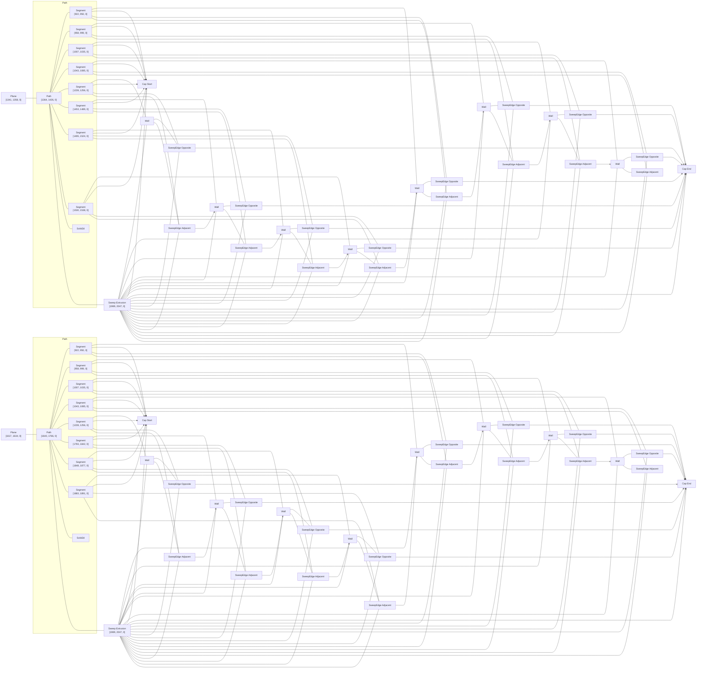

```mermaid
flowchart LR
  subgraph path3 [Path]
    3["Path<br>[1364, 1426, 0]"]
      %% [ProgramBodyItem { index: 12 }, VariableDeclarationDeclaration, VariableDeclarationInit, PipeBodyItem { index: 1 }]
    6["Segment<br>[922, 950, 0]"]
      %% [ProgramBodyItem { index: 11 }, VariableDeclarationDeclaration, VariableDeclarationInit, FunctionExpressionBody, FunctionExpressionBodyItem { index: 0 }, VariableDeclarationDeclaration, VariableDeclarationInit, PipeBodyItem { index: 0 }]
    7["Segment<br>[958, 999, 0]"]
      %% [ProgramBodyItem { index: 11 }, VariableDeclarationDeclaration, VariableDeclarationInit, FunctionExpressionBody, FunctionExpressionBodyItem { index: 0 }, VariableDeclarationDeclaration, VariableDeclarationInit, PipeBodyItem { index: 1 }]
    10["Segment<br>[1007, 1035, 0]"]
      %% [ProgramBodyItem { index: 11 }, VariableDeclarationDeclaration, VariableDeclarationInit, FunctionExpressionBody, FunctionExpressionBodyItem { index: 0 }, VariableDeclarationDeclaration, VariableDeclarationInit, PipeBodyItem { index: 2 }]
    11["Segment<br>[1043, 1085, 0]"]
      %% [ProgramBodyItem { index: 11 }, VariableDeclarationDeclaration, VariableDeclarationInit, FunctionExpressionBody, FunctionExpressionBodyItem { index: 0 }, VariableDeclarationDeclaration, VariableDeclarationInit, PipeBodyItem { index: 3 }]
    13["Segment<br>[1228, 1256, 0]"]
      %% [ProgramBodyItem { index: 11 }, VariableDeclarationDeclaration, VariableDeclarationInit, FunctionExpressionBody, FunctionExpressionBodyItem { index: 0 }, VariableDeclarationDeclaration, VariableDeclarationInit, PipeBodyItem { index: 5 }]
    15["Segment<br>[1453, 1489, 0]"]
      %% [ProgramBodyItem { index: 12 }, VariableDeclarationDeclaration, VariableDeclarationInit, PipeBodyItem { index: 3 }]
    16["Segment<br>[1495, 1524, 0]"]
      %% [ProgramBodyItem { index: 12 }, VariableDeclarationDeclaration, VariableDeclarationInit, PipeBodyItem { index: 4 }]
    17["Segment<br>[1530, 1538, 0]"]
      %% [ProgramBodyItem { index: 12 }, VariableDeclarationDeclaration, VariableDeclarationInit, PipeBodyItem { index: 5 }]
    21[Solid2d]
  end
  subgraph path4 [Path]
    4["Path<br>[1640, 1766, 0]"]
      %% [ProgramBodyItem { index: 13 }, VariableDeclarationDeclaration, VariableDeclarationInit, PipeBodyItem { index: 1 }]
    5["Segment<br>[922, 950, 0]"]
      %% [ProgramBodyItem { index: 11 }, VariableDeclarationDeclaration, VariableDeclarationInit, FunctionExpressionBody, FunctionExpressionBodyItem { index: 0 }, VariableDeclarationDeclaration, VariableDeclarationInit, PipeBodyItem { index: 0 }]
    8["Segment<br>[958, 999, 0]"]
      %% [ProgramBodyItem { index: 11 }, VariableDeclarationDeclaration, VariableDeclarationInit, FunctionExpressionBody, FunctionExpressionBodyItem { index: 0 }, VariableDeclarationDeclaration, VariableDeclarationInit, PipeBodyItem { index: 1 }]
    9["Segment<br>[1007, 1035, 0]"]
      %% [ProgramBodyItem { index: 11 }, VariableDeclarationDeclaration, VariableDeclarationInit, FunctionExpressionBody, FunctionExpressionBodyItem { index: 0 }, VariableDeclarationDeclaration, VariableDeclarationInit, PipeBodyItem { index: 2 }]
    12["Segment<br>[1043, 1085, 0]"]
      %% [ProgramBodyItem { index: 11 }, VariableDeclarationDeclaration, VariableDeclarationInit, FunctionExpressionBody, FunctionExpressionBodyItem { index: 0 }, VariableDeclarationDeclaration, VariableDeclarationInit, PipeBodyItem { index: 3 }]
    14["Segment<br>[1228, 1256, 0]"]
      %% [ProgramBodyItem { index: 11 }, VariableDeclarationDeclaration, VariableDeclarationInit, FunctionExpressionBody, FunctionExpressionBodyItem { index: 0 }, VariableDeclarationDeclaration, VariableDeclarationInit, PipeBodyItem { index: 5 }]
    18["Segment<br>[1793, 1842, 0]"]
      %% [ProgramBodyItem { index: 13 }, VariableDeclarationDeclaration, VariableDeclarationInit, PipeBodyItem { index: 3 }]
    19["Segment<br>[1848, 1877, 0]"]
      %% [ProgramBodyItem { index: 13 }, VariableDeclarationDeclaration, VariableDeclarationInit, PipeBodyItem { index: 4 }]
    20["Segment<br>[1883, 1891, 0]"]
      %% [ProgramBodyItem { index: 13 }, VariableDeclarationDeclaration, VariableDeclarationInit, PipeBodyItem { index: 5 }]
    22[Solid2d]
  end
  1["Plane<br>[1341, 1358, 0]"]
    %% [ProgramBodyItem { index: 12 }, VariableDeclarationDeclaration, VariableDeclarationInit, PipeBodyItem { index: 0 }]
  2["Plane<br>[1617, 1634, 0]"]
    %% [ProgramBodyItem { index: 13 }, VariableDeclarationDeclaration, VariableDeclarationInit, PipeBodyItem { index: 0 }]
  23["Sweep Extrusion<br>[1989, 2047, 0]"]
    %% [ProgramBodyItem { index: 14 }, VariableDeclarationDeclaration, VariableDeclarationInit]
  24["Sweep Extrusion<br>[1989, 2047, 0]"]
    %% [ProgramBodyItem { index: 14 }, VariableDeclarationDeclaration, VariableDeclarationInit]
  25[Wall]
    %% face_code_ref=Missing NodePath
  26[Wall]
    %% face_code_ref=Missing NodePath
  27[Wall]
    %% face_code_ref=Missing NodePath
  28[Wall]
    %% face_code_ref=Missing NodePath
  29[Wall]
    %% face_code_ref=Missing NodePath
  30[Wall]
    %% face_code_ref=Missing NodePath
  31[Wall]
    %% face_code_ref=Missing NodePath
  32[Wall]
    %% face_code_ref=Missing NodePath
  33[Wall]
    %% face_code_ref=Missing NodePath
  34[Wall]
    %% face_code_ref=Missing NodePath
  35[Wall]
    %% face_code_ref=Missing NodePath
  36[Wall]
    %% face_code_ref=Missing NodePath
  37[Wall]
    %% face_code_ref=Missing NodePath
  38[Wall]
    %% face_code_ref=Missing NodePath
  39[Wall]
    %% face_code_ref=Missing NodePath
  40[Wall]
    %% face_code_ref=Missing NodePath
  41["Cap Start"]
    %% face_code_ref=Missing NodePath
  42["Cap Start"]
    %% face_code_ref=Missing NodePath
  43["Cap End"]
    %% face_code_ref=Missing NodePath
  44["Cap End"]
    %% face_code_ref=Missing NodePath
  45["SweepEdge Opposite"]
  46["SweepEdge Opposite"]
  47["SweepEdge Opposite"]
  48["SweepEdge Opposite"]
  49["SweepEdge Opposite"]
  50["SweepEdge Opposite"]
  51["SweepEdge Opposite"]
  52["SweepEdge Opposite"]
  53["SweepEdge Opposite"]
  54["SweepEdge Opposite"]
  55["SweepEdge Opposite"]
  56["SweepEdge Opposite"]
  57["SweepEdge Opposite"]
  58["SweepEdge Opposite"]
  59["SweepEdge Opposite"]
  60["SweepEdge Opposite"]
  61["SweepEdge Adjacent"]
  62["SweepEdge Adjacent"]
  63["SweepEdge Adjacent"]
  64["SweepEdge Adjacent"]
  65["SweepEdge Adjacent"]
  66["SweepEdge Adjacent"]
  67["SweepEdge Adjacent"]
  68["SweepEdge Adjacent"]
  69["SweepEdge Adjacent"]
  70["SweepEdge Adjacent"]
  71["SweepEdge Adjacent"]
  72["SweepEdge Adjacent"]
  73["SweepEdge Adjacent"]
  74["SweepEdge Adjacent"]
  75["SweepEdge Adjacent"]
  76["SweepEdge Adjacent"]
  1 --- 3
  2 --- 4
  3 --- 6
  3 --- 7
  3 --- 10
  3 --- 11
  3 --- 13
  3 --- 15
  3 --- 16
  3 --- 17
  3 --- 21
  3 ---- 23
  4 --- 5
  4 --- 8
  4 --- 9
  4 --- 12
  4 --- 14
  4 --- 18
  4 --- 19
  4 --- 20
  4 --- 22
  4 ---- 24
  5 --- 33
  5 x--> 41
  5 --- 53
  5 --- 69
  6 --- 30
  6 x--> 42
  6 --- 52
  6 --- 68
  7 --- 27
  7 x--> 42
  7 --- 51
  7 --- 67
  8 --- 39
  8 x--> 41
  8 --- 54
  8 --- 70
  9 --- 34
  9 x--> 41
  9 --- 55
  9 --- 71
  10 --- 26
  10 x--> 42
  10 --- 50
  10 --- 66
  11 --- 28
  11 x--> 42
  11 --- 49
  11 --- 65
  12 --- 40
  12 x--> 41
  12 --- 56
  12 --- 72
  13 --- 25
  13 x--> 42
  13 --- 48
  13 --- 64
  14 --- 37
  14 x--> 41
  14 --- 57
  14 --- 73
  15 --- 29
  15 x--> 42
  15 --- 47
  15 --- 63
  16 --- 32
  16 x--> 42
  16 --- 46
  16 --- 62
  17 --- 31
  17 x--> 42
  17 --- 45
  17 --- 61
  18 --- 38
  18 x--> 41
  18 --- 58
  18 --- 74
  19 --- 35
  19 x--> 41
  19 --- 59
  19 --- 75
  20 --- 36
  20 x--> 41
  20 --- 60
  20 --- 76
  23 --- 25
  23 --- 26
  23 --- 27
  23 --- 28
  23 --- 29
  23 --- 30
  23 --- 31
  23 --- 32
  23 --- 42
  23 --- 44
  23 --- 45
  23 --- 46
  23 --- 47
  23 --- 48
  23 --- 49
  23 --- 50
  23 --- 51
  23 --- 52
  23 --- 61
  23 --- 62
  23 --- 63
  23 --- 64
  23 --- 65
  23 --- 66
  23 --- 67
  23 --- 68
  24 --- 33
  24 --- 34
  24 --- 35
  24 --- 36
  24 --- 37
  24 --- 38
  24 --- 39
  24 --- 40
  24 --- 41
  24 --- 43
  24 --- 53
  24 --- 54
  24 --- 55
  24 --- 56
  24 --- 57
  24 --- 58
  24 --- 59
  24 --- 60
  24 --- 69
  24 --- 70
  24 --- 71
  24 --- 72
  24 --- 73
  24 --- 74
  24 --- 75
  24 --- 76
  25 --- 48
  25 --- 64
  26 --- 50
  26 --- 66
  67 <--x 26
  27 --- 51
  27 --- 67
  68 <--x 27
  28 --- 49
  28 --- 65
  66 <--x 28
  29 --- 47
  29 --- 63
  64 <--x 29
  30 --- 52
  61 <--x 30
  30 --- 68
  31 --- 45
  31 --- 61
  62 <--x 31
  32 --- 46
  32 --- 62
  63 <--x 32
  33 --- 53
  33 --- 69
  76 <--x 33
  34 --- 55
  70 <--x 34
  34 --- 71
  35 --- 59
  74 <--x 35
  35 --- 75
  36 --- 60
  75 <--x 36
  36 --- 76
  37 --- 57
  37 --- 73
  38 --- 58
  73 <--x 38
  38 --- 74
  39 --- 54
  69 <--x 39
  39 --- 70
  40 --- 56
  71 <--x 40
  40 --- 72
  53 <--x 43
  54 <--x 43
  55 <--x 43
  56 <--x 43
  57 <--x 43
  58 <--x 43
  59 <--x 43
  60 <--x 43
  45 <--x 44
  46 <--x 44
  47 <--x 44
  48 <--x 44
  49 <--x 44
  50 <--x 44
  51 <--x 44
  52 <--x 44
```
