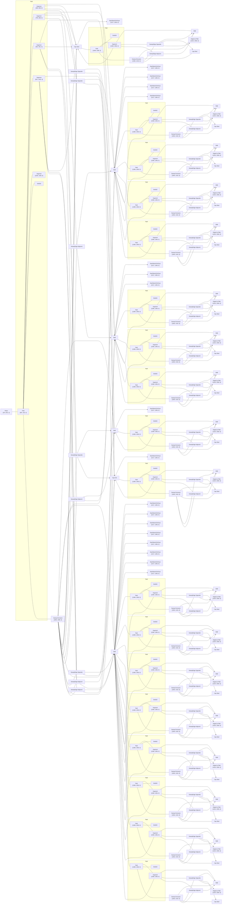

```mermaid
flowchart LR
  subgraph path20 [Path]
    20["Path<br>[597, 622, 0]"]
    39["Segment<br>[628, 699, 0]"]
    40["Segment<br>[705, 808, 0]"]
    41["Segment<br>[814, 931, 0]"]
    42["Segment<br>[937, 1022, 0]"]
    43["Segment<br>[1028, 1035, 0]"]
    71[Solid2d]
  end
  subgraph path21 [Path]
    21["Path<br>[1268, 1356, 0]"]
    45["Segment<br>[1268, 1356, 0]"]
    62[Solid2d]
  end
  subgraph path22 [Path]
    22["Path<br>[1268, 1356, 0]"]
    59["Segment<br>[1268, 1356, 0]"]
    63[Solid2d]
  end
  subgraph path23 [Path]
    23["Path<br>[1268, 1356, 0]"]
    61["Segment<br>[1268, 1356, 0]"]
    64[Solid2d]
  end
  subgraph path24 [Path]
    24["Path<br>[1268, 1356, 0]"]
    55["Segment<br>[1268, 1356, 0]"]
    65[Solid2d]
  end
  subgraph path25 [Path]
    25["Path<br>[1268, 1356, 0]"]
    54["Segment<br>[1268, 1356, 0]"]
    66[Solid2d]
  end
  subgraph path26 [Path]
    26["Path<br>[1268, 1356, 0]"]
    46["Segment<br>[1268, 1356, 0]"]
    67[Solid2d]
  end
  subgraph path27 [Path]
    27["Path<br>[1268, 1356, 0]"]
    56["Segment<br>[1268, 1356, 0]"]
    68[Solid2d]
  end
  subgraph path28 [Path]
    28["Path<br>[1268, 1356, 0]"]
    60["Segment<br>[1268, 1356, 0]"]
    69[Solid2d]
  end
  subgraph path29 [Path]
    29["Path<br>[1268, 1356, 0]"]
    49["Segment<br>[1268, 1356, 0]"]
    70[Solid2d]
  end
  subgraph path30 [Path]
    30["Path<br>[1268, 1356, 0]"]
    48["Segment<br>[1268, 1356, 0]"]
    72[Solid2d]
  end
  subgraph path31 [Path]
    31["Path<br>[1268, 1356, 0]"]
    58["Segment<br>[1268, 1356, 0]"]
    73[Solid2d]
  end
  subgraph path32 [Path]
    32["Path<br>[1268, 1356, 0]"]
    57["Segment<br>[1268, 1356, 0]"]
    74[Solid2d]
  end
  subgraph path33 [Path]
    33["Path<br>[1268, 1356, 0]"]
    51["Segment<br>[1268, 1356, 0]"]
    75[Solid2d]
  end
  subgraph path34 [Path]
    34["Path<br>[1268, 1356, 0]"]
    44["Segment<br>[1268, 1356, 0]"]
    76[Solid2d]
  end
  subgraph path35 [Path]
    35["Path<br>[1268, 1356, 0]"]
    52["Segment<br>[1268, 1356, 0]"]
    77[Solid2d]
  end
  subgraph path36 [Path]
    36["Path<br>[1268, 1356, 0]"]
    53["Segment<br>[1268, 1356, 0]"]
    78[Solid2d]
  end
  subgraph path37 [Path]
    37["Path<br>[1268, 1356, 0]"]
    50["Segment<br>[1268, 1356, 0]"]
    79[Solid2d]
  end
  subgraph path38 [Path]
    38["Path<br>[1268, 1356, 0]"]
    47["Segment<br>[1268, 1356, 0]"]
    80[Solid2d]
  end
  1["Plane<br>[574, 591, 0]"]
  2["StartSketchOnFace<br>[1217, 1260, 0]"]
  3["StartSketchOnFace<br>[1217, 1260, 0]"]
  4["StartSketchOnFace<br>[1217, 1260, 0]"]
  5["StartSketchOnFace<br>[1217, 1260, 0]"]
  6["StartSketchOnFace<br>[1217, 1260, 0]"]
  7["StartSketchOnFace<br>[1217, 1260, 0]"]
  8["StartSketchOnFace<br>[1217, 1260, 0]"]
  9["StartSketchOnFace<br>[1217, 1260, 0]"]
  10["StartSketchOnFace<br>[1217, 1260, 0]"]
  11["StartSketchOnFace<br>[1217, 1260, 0]"]
  12["StartSketchOnFace<br>[1217, 1260, 0]"]
  13["StartSketchOnFace<br>[1217, 1260, 0]"]
  14["StartSketchOnFace<br>[1217, 1260, 0]"]
  15["StartSketchOnFace<br>[1217, 1260, 0]"]
  16["StartSketchOnFace<br>[1217, 1260, 0]"]
  17["StartSketchOnFace<br>[1217, 1260, 0]"]
  18["StartSketchOnFace<br>[1217, 1260, 0]"]
  19["StartSketchOnFace<br>[1217, 1260, 0]"]
  81["Sweep Extrusion<br>[1050, 1090, 0]"]
  82["Sweep Extrusion<br>[1364, 1416, 0]"]
  83["Sweep Extrusion<br>[1364, 1416, 0]"]
  84["Sweep Extrusion<br>[1364, 1416, 0]"]
  85["Sweep Extrusion<br>[1364, 1416, 0]"]
  86["Sweep Extrusion<br>[1364, 1416, 0]"]
  87["Sweep Extrusion<br>[1364, 1416, 0]"]
  88["Sweep Extrusion<br>[1364, 1416, 0]"]
  89["Sweep Extrusion<br>[1364, 1416, 0]"]
  90["Sweep Extrusion<br>[1364, 1416, 0]"]
  91["Sweep Extrusion<br>[1364, 1416, 0]"]
  92["Sweep Extrusion<br>[1364, 1416, 0]"]
  93["Sweep Extrusion<br>[1364, 1416, 0]"]
  94["Sweep Extrusion<br>[1364, 1416, 0]"]
  95["Sweep Extrusion<br>[1364, 1416, 0]"]
  96["Sweep Extrusion<br>[1364, 1416, 0]"]
  97["Sweep Extrusion<br>[1364, 1416, 0]"]
  98["Sweep Extrusion<br>[1364, 1416, 0]"]
  99["Sweep Extrusion<br>[1364, 1416, 0]"]
  100[Wall]
  101[Wall]
  102[Wall]
  103[Wall]
  104[Wall]
  105[Wall]
  106[Wall]
  107[Wall]
  108[Wall]
  109[Wall]
  110[Wall]
  111[Wall]
  112[Wall]
  113[Wall]
  114[Wall]
  115[Wall]
  116[Wall]
  117[Wall]
  118[Wall]
  119[Wall]
  120[Wall]
  121[Wall]
  122["Cap Start"]
  123["Cap Start"]
  124["Cap Start"]
  125["Cap Start"]
  126["Cap Start"]
  127["Cap Start"]
  128["Cap Start"]
  129["Cap Start"]
  130["Cap Start"]
  131["Cap Start"]
  132["Cap Start"]
  133["Cap Start"]
  134["Cap Start"]
  135["Cap Start"]
  136["Cap Start"]
  137["Cap Start"]
  138["Cap Start"]
  139["Cap Start"]
  140["Cap Start"]
  141["Cap End"]
  142["SweepEdge Opposite"]
  143["SweepEdge Opposite"]
  144["SweepEdge Opposite"]
  145["SweepEdge Opposite"]
  146["SweepEdge Opposite"]
  147["SweepEdge Opposite"]
  148["SweepEdge Opposite"]
  149["SweepEdge Opposite"]
  150["SweepEdge Opposite"]
  151["SweepEdge Opposite"]
  152["SweepEdge Opposite"]
  153["SweepEdge Opposite"]
  154["SweepEdge Opposite"]
  155["SweepEdge Opposite"]
  156["SweepEdge Opposite"]
  157["SweepEdge Opposite"]
  158["SweepEdge Opposite"]
  159["SweepEdge Opposite"]
  160["SweepEdge Opposite"]
  161["SweepEdge Opposite"]
  162["SweepEdge Opposite"]
  163["SweepEdge Opposite"]
  164["SweepEdge Adjacent"]
  165["SweepEdge Adjacent"]
  166["SweepEdge Adjacent"]
  167["SweepEdge Adjacent"]
  168["SweepEdge Adjacent"]
  169["SweepEdge Adjacent"]
  170["SweepEdge Adjacent"]
  171["SweepEdge Adjacent"]
  172["SweepEdge Adjacent"]
  173["SweepEdge Adjacent"]
  174["SweepEdge Adjacent"]
  175["SweepEdge Adjacent"]
  176["SweepEdge Adjacent"]
  177["SweepEdge Adjacent"]
  178["SweepEdge Adjacent"]
  179["SweepEdge Adjacent"]
  180["SweepEdge Adjacent"]
  181["SweepEdge Adjacent"]
  182["SweepEdge Adjacent"]
  183["SweepEdge Adjacent"]
  184["SweepEdge Adjacent"]
  185["SweepEdge Adjacent"]
  186["EdgeCut Fillet<br>[1424, 1559, 0]"]
  187["EdgeCut Fillet<br>[1424, 1559, 0]"]
  188["EdgeCut Fillet<br>[1424, 1559, 0]"]
  189["EdgeCut Fillet<br>[1424, 1559, 0]"]
  190["EdgeCut Fillet<br>[1424, 1559, 0]"]
  191["EdgeCut Fillet<br>[1424, 1559, 0]"]
  192["EdgeCut Fillet<br>[1424, 1559, 0]"]
  193["EdgeCut Fillet<br>[1424, 1559, 0]"]
  194["EdgeCut Fillet<br>[1424, 1559, 0]"]
  195["EdgeCut Fillet<br>[1424, 1559, 0]"]
  196["EdgeCut Fillet<br>[1424, 1559, 0]"]
  197["EdgeCut Fillet<br>[1424, 1559, 0]"]
  198["EdgeCut Fillet<br>[1424, 1559, 0]"]
  199["EdgeCut Fillet<br>[1424, 1559, 0]"]
  200["EdgeCut Fillet<br>[1424, 1559, 0]"]
  201["EdgeCut Fillet<br>[1424, 1559, 0]"]
  202["EdgeCut Fillet<br>[1424, 1559, 0]"]
  203["EdgeCut Fillet<br>[1424, 1559, 0]"]
  1 --- 20
  106 x--> 2
  107 x--> 3
  108 x--> 4
  107 x--> 5
  106 x--> 6
  108 x--> 7
  106 x--> 8
  108 x--> 9
  141 x--> 10
  124 x--> 11
  107 x--> 12
  107 x--> 13
  107 x--> 14
  107 x--> 15
  106 x--> 16
  107 x--> 17
  105 x--> 18
  107 x--> 19
  20 --- 39
  20 --- 40
  20 --- 41
  20 --- 42
  20 --- 43
  20 --- 71
  20 ---- 81
  21 --- 45
  21 --- 62
  21 ---- 91
  107 --- 21
  22 --- 59
  22 --- 63
  22 ---- 95
  105 --- 22
  23 --- 61
  23 --- 64
  23 ---- 89
  108 --- 23
  24 --- 55
  24 --- 65
  24 ---- 82
  106 --- 24
  25 --- 54
  25 --- 66
  25 ---- 87
  106 --- 25
  26 --- 46
  26 --- 67
  26 ---- 94
  124 --- 26
  27 --- 56
  27 --- 68
  27 ---- 99
  108 --- 27
  28 --- 60
  28 --- 69
  28 ---- 96
  107 --- 28
  29 --- 49
  29 --- 70
  29 ---- 85
  107 --- 29
  30 --- 48
  30 --- 72
  30 ---- 93
  107 --- 30
  31 --- 58
  31 --- 73
  31 ---- 88
  107 --- 31
  32 --- 57
  32 --- 74
  32 ---- 90
  141 --- 32
  33 --- 51
  33 --- 75
  33 ---- 98
  107 --- 33
  34 --- 44
  34 --- 76
  34 ---- 83
  107 --- 34
  35 --- 52
  35 --- 77
  35 ---- 86
  106 --- 35
  36 --- 53
  36 --- 78
  36 ---- 92
  106 --- 36
  37 --- 50
  37 --- 79
  37 ---- 84
  108 --- 37
  38 --- 47
  38 --- 80
  38 ---- 97
  107 --- 38
  39 --- 108
  39 x--> 124
  39 --- 147
  39 --- 172
  40 --- 106
  40 x--> 124
  40 --- 150
  40 --- 170
  41 --- 105
  41 x--> 124
  41 --- 149
  41 --- 171
  42 --- 107
  42 x--> 124
  42 --- 148
  42 --- 169
  44 --- 101
  44 x--> 107
  44 --- 143
  44 --- 165
  45 x--> 107
  45 --- 113
  45 --- 155
  45 --- 177
  46 --- 116
  46 x--> 124
  46 --- 158
  46 --- 180
  47 x--> 107
  47 --- 119
  47 --- 161
  47 --- 183
  48 x--> 107
  48 --- 115
  48 --- 157
  48 --- 179
  49 --- 103
  49 x--> 107
  49 --- 145
  49 --- 167
  50 --- 102
  50 x--> 108
  50 --- 144
  50 --- 166
  51 x--> 107
  51 --- 120
  51 --- 162
  51 --- 184
  52 --- 104
  52 x--> 106
  52 --- 146
  52 --- 168
  53 x--> 106
  53 --- 114
  53 --- 156
  53 --- 178
  54 x--> 106
  54 --- 109
  54 --- 151
  54 --- 173
  55 --- 100
  55 x--> 106
  55 --- 142
  55 --- 164
  56 x--> 108
  56 --- 121
  56 --- 163
  56 --- 185
  57 --- 112
  57 x--> 141
  57 --- 154
  57 --- 176
  58 x--> 107
  58 --- 110
  58 --- 152
  58 --- 174
  59 x--> 105
  59 --- 117
  59 --- 159
  59 --- 181
  60 x--> 107
  60 --- 118
  60 --- 160
  60 --- 182
  61 x--> 108
  61 --- 111
  61 --- 153
  61 --- 175
  81 --- 105
  81 --- 106
  81 --- 107
  81 --- 108
  81 --- 124
  81 --- 141
  81 --- 147
  81 --- 148
  81 --- 149
  81 --- 150
  81 --- 169
  81 --- 170
  81 --- 171
  81 --- 172
  82 --- 100
  82 --- 138
  82 --- 142
  82 --- 164
  83 --- 101
  83 --- 129
  83 --- 143
  83 --- 165
  84 --- 102
  84 --- 126
  84 --- 144
  84 --- 166
  85 --- 103
  85 --- 130
  85 --- 145
  85 --- 167
  86 --- 104
  86 --- 137
  86 --- 146
  86 --- 168
  87 --- 109
  87 --- 134
  87 --- 151
  87 --- 173
  88 --- 110
  88 --- 132
  88 --- 152
  88 --- 174
  89 --- 111
  89 --- 136
  89 --- 153
  89 --- 175
  90 --- 112
  90 --- 139
  90 --- 154
  90 --- 176
  91 --- 113
  91 --- 131
  91 --- 155
  91 --- 177
  92 --- 114
  92 --- 128
  92 --- 156
  92 --- 178
  93 --- 115
  93 --- 122
  93 --- 157
  93 --- 179
  94 --- 116
  94 --- 135
  94 --- 158
  94 --- 180
  95 --- 117
  95 --- 133
  95 --- 159
  95 --- 181
  96 --- 118
  96 --- 140
  96 --- 160
  96 --- 182
  97 --- 119
  97 --- 123
  97 --- 161
  97 --- 183
  98 --- 120
  98 --- 127
  98 --- 162
  98 --- 184
  99 --- 121
  99 --- 125
  99 --- 163
  99 --- 185
  142 <--x 100
  164 <--x 100
  143 <--x 101
  165 <--x 101
  144 <--x 102
  166 <--x 102
  145 <--x 103
  167 <--x 103
  146 <--x 104
  168 <--x 104
  149 <--x 105
  170 <--x 105
  171 <--x 105
  150 <--x 106
  170 <--x 106
  172 <--x 106
  148 <--x 107
  169 <--x 107
  171 <--x 107
  147 <--x 108
  169 <--x 108
  172 <--x 108
  151 <--x 109
  173 <--x 109
  152 <--x 110
  174 <--x 110
  153 <--x 111
  175 <--x 111
  154 <--x 112
  176 <--x 112
  155 <--x 113
  177 <--x 113
  156 <--x 114
  178 <--x 114
  157 <--x 115
  179 <--x 115
  158 <--x 116
  180 <--x 116
  159 <--x 117
  181 <--x 117
  160 <--x 118
  182 <--x 118
  161 <--x 119
  183 <--x 119
  162 <--x 120
  184 <--x 120
  163 <--x 121
  185 <--x 121
  157 <--x 122
  161 <--x 123
  163 <--x 125
  144 <--x 126
  162 <--x 127
  156 <--x 128
  143 <--x 129
  145 <--x 130
  155 <--x 131
  152 <--x 132
  159 <--x 133
  151 <--x 134
  158 <--x 135
  153 <--x 136
  146 <--x 137
  142 <--x 138
  154 <--x 139
  160 <--x 140
  147 <--x 141
  148 <--x 141
  149 <--x 141
  150 <--x 141
  142 <--x 192
  143 <--x 190
  144 <--x 189
  145 <--x 195
  146 <--x 199
  151 <--x 186
  152 <--x 201
  153 <--x 194
  154 <--x 188
  155 <--x 187
  156 <--x 196
  157 <--x 197
  158 <--x 202
  159 <--x 191
  160 <--x 203
  161 <--x 200
  162 <--x 198
  163 <--x 193
```
