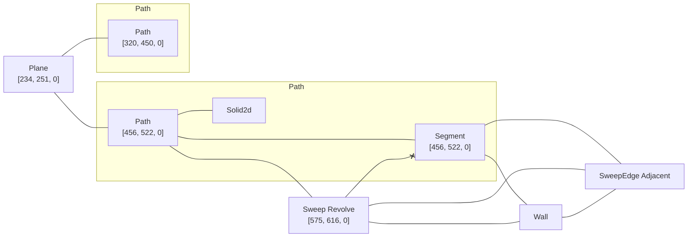

```mermaid
flowchart LR
  subgraph path2 [Path]
    2["Path<br>[320, 450, 0]"]
      %% [ProgramBodyItem { index: 3 }, VariableDeclarationDeclaration, VariableDeclarationInit, PipeBodyItem { index: 0 }]
  end
  subgraph path3 [Path]
    3["Path<br>[456, 522, 0]"]
      %% [ProgramBodyItem { index: 3 }, VariableDeclarationDeclaration, VariableDeclarationInit, PipeBodyItem { index: 1 }]
    4["Segment<br>[456, 522, 0]"]
      %% [ProgramBodyItem { index: 3 }, VariableDeclarationDeclaration, VariableDeclarationInit, PipeBodyItem { index: 1 }]
    5[Solid2d]
  end
  1["Plane<br>[234, 251, 0]"]
    %% [ProgramBodyItem { index: 2 }, VariableDeclarationDeclaration, VariableDeclarationInit]
  6["Sweep Revolve<br>[575, 616, 0]"]
    %% [ProgramBodyItem { index: 4 }, VariableDeclarationDeclaration, VariableDeclarationInit]
  7[Wall]
    %% face_code_ref=Missing NodePath
  8["SweepEdge Adjacent"]
  1 --- 2
  1 --- 3
  3 --- 4
  3 --- 5
  3 ---- 6
  6 <--x 4
  4 --- 7
  4 --- 8
  6 --- 7
  6 --- 8
  7 --- 8
```
