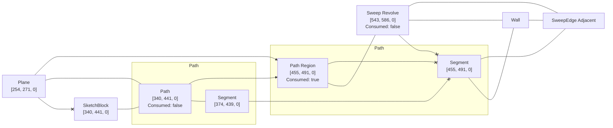

```mermaid
flowchart LR
  subgraph path2 [Path]
    2["Path<br>[340, 441, 0]<br>Consumed: false"]
      %% [ProgramBodyItem { index: 3 }, VariableDeclarationDeclaration, VariableDeclarationInit]
    4["Segment<br>[374, 439, 0]"]
      %% [ProgramBodyItem { index: 3 }, VariableDeclarationDeclaration, VariableDeclarationInit, SketchBlockBody, SketchBlockBodyItem { index: 0 }, VariableDeclarationDeclaration, VariableDeclarationInit]
  end
  subgraph path1 [Path]
    1["Path Region<br>[455, 491, 0]<br>Consumed: true"]
      %% [ProgramBodyItem { index: 4 }, VariableDeclarationDeclaration, VariableDeclarationInit]
    5["Segment<br>[455, 491, 0]"]
      %% [ProgramBodyItem { index: 4 }, VariableDeclarationDeclaration, VariableDeclarationInit]
  end
  3["Plane<br>[254, 271, 0]"]
    %% [ProgramBodyItem { index: 2 }, VariableDeclarationDeclaration, VariableDeclarationInit]
  7["Sweep Revolve<br>[543, 586, 0]<br>Consumed: false"]
    %% [ProgramBodyItem { index: 5 }, VariableDeclarationDeclaration, VariableDeclarationInit]
  9[Wall]
    %% face_code_ref=Missing NodePath
  8["SweepEdge Adjacent"]
  6["SketchBlock<br>[340, 441, 0]"]
    %% [ProgramBodyItem { index: 3 }, VariableDeclarationDeclaration, VariableDeclarationInit]
  2 x--> 1
  3 x--> 1
  1 <--x 5
  1 ---- 7
  3 --- 2
  2 --- 4
  6 --- 2
  3 <--x 6
  4 <--x 5
  7 <--x 5
  5 --- 8
  5 --- 9
  7 --- 8
  7 --- 9
  9 --- 8
```
