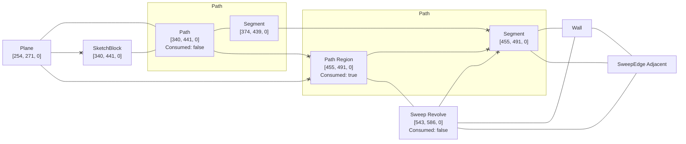

```mermaid
flowchart LR
  subgraph path3 [Path]
    3["Path<br>[340, 441, 0]<br>Consumed: false"]
      %% [ProgramBodyItem { index: 3 }, VariableDeclarationDeclaration, VariableDeclarationInit]
    5["Segment<br>[374, 439, 0]"]
      %% [ProgramBodyItem { index: 3 }, VariableDeclarationDeclaration, VariableDeclarationInit, SketchBlockBody, SketchBlockBodyItem { index: 0 }, VariableDeclarationDeclaration, VariableDeclarationInit]
  end
  subgraph path6 [Path]
    6["Path Region<br>[455, 491, 0]<br>Consumed: true"]
      %% [ProgramBodyItem { index: 4 }, VariableDeclarationDeclaration, VariableDeclarationInit]
    7["Segment<br>[455, 491, 0]"]
      %% [ProgramBodyItem { index: 4 }, VariableDeclarationDeclaration, VariableDeclarationInit]
  end
  1[Wall]
    %% face_code_ref=Missing NodePath
  2["Plane<br>[254, 271, 0]"]
    %% [ProgramBodyItem { index: 2 }, VariableDeclarationDeclaration, VariableDeclarationInit]
  4["SketchBlock<br>[340, 441, 0]"]
    %% [ProgramBodyItem { index: 3 }, VariableDeclarationDeclaration, VariableDeclarationInit]
  8["Sweep Revolve<br>[543, 586, 0]<br>Consumed: false"]
    %% [ProgramBodyItem { index: 5 }, VariableDeclarationDeclaration, VariableDeclarationInit]
  9["SweepEdge Adjacent"]
  7 --- 1
  8 --- 1
  1 --- 9
  2 --- 3
  2 <--x 4
  2 <--x 6
  4 --- 3
  3 --- 5
  3 <--x 6
  5 <--x 7
  6 <--x 7
  6 ---- 8
  8 <--x 7
  7 --- 9
  8 --- 9
```
