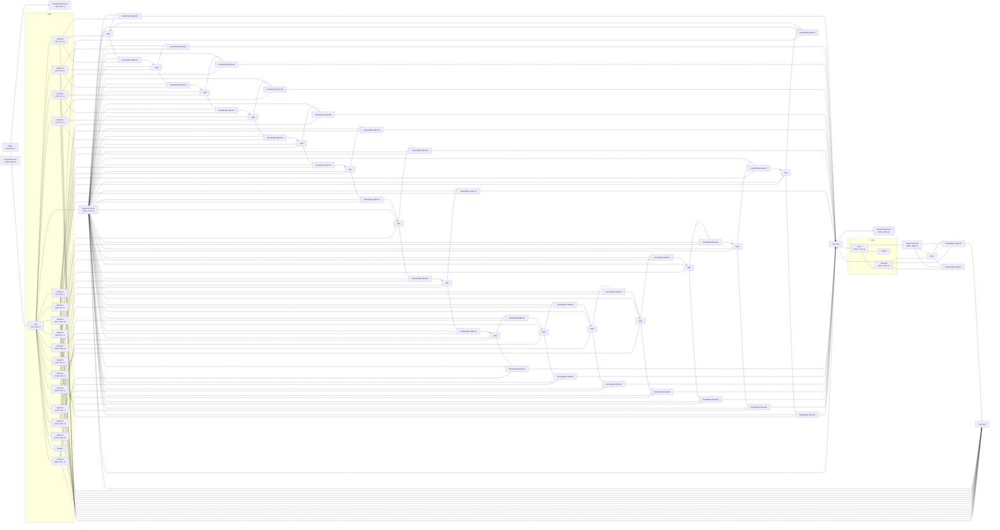

```mermaid
flowchart LR
  subgraph path2 [Path]
    2["Path<br>[544, 605, 0]"]
      %% [ProgramBodyItem { index: 9 }, VariableDeclarationDeclaration, VariableDeclarationInit, PipeBodyItem { index: 0 }]
    3["Segment<br>[621, 672, 0]"]
      %% [ProgramBodyItem { index: 9 }, VariableDeclarationDeclaration, VariableDeclarationInit, PipeBodyItem { index: 1 }]
    4["Segment<br>[678, 703, 0]"]
      %% [ProgramBodyItem { index: 9 }, VariableDeclarationDeclaration, VariableDeclarationInit, PipeBodyItem { index: 2 }]
    5["Segment<br>[709, 735, 0]"]
      %% [ProgramBodyItem { index: 9 }, VariableDeclarationDeclaration, VariableDeclarationInit, PipeBodyItem { index: 3 }]
    6["Segment<br>[741, 767, 0]"]
      %% [ProgramBodyItem { index: 9 }, VariableDeclarationDeclaration, VariableDeclarationInit, PipeBodyItem { index: 4 }]
    7["Segment<br>[773, 824, 0]"]
      %% [ProgramBodyItem { index: 9 }, VariableDeclarationDeclaration, VariableDeclarationInit, PipeBodyItem { index: 5 }]
    8["Segment<br>[842, 902, 0]"]
      %% [ProgramBodyItem { index: 9 }, VariableDeclarationDeclaration, VariableDeclarationInit, PipeBodyItem { index: 6 }]
    9["Segment<br>[908, 941, 0]"]
      %% [ProgramBodyItem { index: 9 }, VariableDeclarationDeclaration, VariableDeclarationInit, PipeBodyItem { index: 7 }]
    10["Segment<br>[947, 979, 0]"]
      %% [ProgramBodyItem { index: 9 }, VariableDeclarationDeclaration, VariableDeclarationInit, PipeBodyItem { index: 8 }]
    11["Segment<br>[985, 1031, 0]"]
      %% [ProgramBodyItem { index: 9 }, VariableDeclarationDeclaration, VariableDeclarationInit, PipeBodyItem { index: 9 }]
    12["Segment<br>[1047, 1097, 0]"]
      %% [ProgramBodyItem { index: 9 }, VariableDeclarationDeclaration, VariableDeclarationInit, PipeBodyItem { index: 10 }]
    13["Segment<br>[1103, 1129, 0]"]
      %% [ProgramBodyItem { index: 9 }, VariableDeclarationDeclaration, VariableDeclarationInit, PipeBodyItem { index: 11 }]
    14["Segment<br>[1135, 1162, 0]"]
      %% [ProgramBodyItem { index: 9 }, VariableDeclarationDeclaration, VariableDeclarationInit, PipeBodyItem { index: 12 }]
    15["Segment<br>[1168, 1193, 0]"]
      %% [ProgramBodyItem { index: 9 }, VariableDeclarationDeclaration, VariableDeclarationInit, PipeBodyItem { index: 13 }]
    16["Segment<br>[1199, 1249, 0]"]
      %% [ProgramBodyItem { index: 9 }, VariableDeclarationDeclaration, VariableDeclarationInit, PipeBodyItem { index: 14 }]
    17["Segment<br>[1267, 1323, 0]"]
      %% [ProgramBodyItem { index: 9 }, VariableDeclarationDeclaration, VariableDeclarationInit, PipeBodyItem { index: 15 }]
    18["Segment<br>[1329, 1336, 0]"]
      %% [ProgramBodyItem { index: 9 }, VariableDeclarationDeclaration, VariableDeclarationInit, PipeBodyItem { index: 16 }]
    19[Solid2d]
  end
  subgraph path68 [Path]
    68["Path<br>[1615, 1713, 0]"]
      %% [ProgramBodyItem { index: 15 }, VariableDeclarationDeclaration, VariableDeclarationInit, PipeBodyItem { index: 0 }]
    69["Segment<br>[1615, 1713, 0]"]
      %% [ProgramBodyItem { index: 15 }, VariableDeclarationDeclaration, VariableDeclarationInit, PipeBodyItem { index: 0 }]
    70[Solid2d]
  end
  1["Plane<br>[446, 489, 0]"]
    %% [ProgramBodyItem { index: 8 }, VariableDeclarationDeclaration, VariableDeclarationInit, CallKwUnlabeledArg]
  20["Sweep Extrusion<br>[1392, 1437, 0]"]
    %% [ProgramBodyItem { index: 10 }, VariableDeclarationDeclaration, VariableDeclarationInit]
  21[Wall]
    %% face_code_ref=Missing NodePath
  22[Wall]
    %% face_code_ref=Missing NodePath
  23[Wall]
    %% face_code_ref=Missing NodePath
  24[Wall]
    %% face_code_ref=Missing NodePath
  25[Wall]
    %% face_code_ref=Missing NodePath
  26[Wall]
    %% face_code_ref=Missing NodePath
  27[Wall]
    %% face_code_ref=Missing NodePath
  28[Wall]
    %% face_code_ref=Missing NodePath
  29[Wall]
    %% face_code_ref=Missing NodePath
  30[Wall]
    %% face_code_ref=Missing NodePath
  31[Wall]
    %% face_code_ref=Missing NodePath
  32[Wall]
    %% face_code_ref=Missing NodePath
  33[Wall]
    %% face_code_ref=Missing NodePath
  34[Wall]
    %% face_code_ref=Missing NodePath
  35[Wall]
    %% face_code_ref=Missing NodePath
  36["Cap Start"]
    %% face_code_ref=Missing NodePath
  37["Cap End"]
    %% face_code_ref=[ProgramBodyItem { index: 14 }, VariableDeclarationDeclaration, VariableDeclarationInit]
  38["SweepEdge Opposite"]
  39["SweepEdge Adjacent"]
  40["SweepEdge Opposite"]
  41["SweepEdge Adjacent"]
  42["SweepEdge Opposite"]
  43["SweepEdge Adjacent"]
  44["SweepEdge Opposite"]
  45["SweepEdge Adjacent"]
  46["SweepEdge Opposite"]
  47["SweepEdge Adjacent"]
  48["SweepEdge Opposite"]
  49["SweepEdge Adjacent"]
  50["SweepEdge Opposite"]
  51["SweepEdge Adjacent"]
  52["SweepEdge Opposite"]
  53["SweepEdge Adjacent"]
  54["SweepEdge Opposite"]
  55["SweepEdge Adjacent"]
  56["SweepEdge Opposite"]
  57["SweepEdge Adjacent"]
  58["SweepEdge Opposite"]
  59["SweepEdge Adjacent"]
  60["SweepEdge Opposite"]
  61["SweepEdge Adjacent"]
  62["SweepEdge Opposite"]
  63["SweepEdge Adjacent"]
  64["SweepEdge Opposite"]
  65["SweepEdge Adjacent"]
  66["SweepEdge Opposite"]
  67["SweepEdge Adjacent"]
  71["Sweep Extrusion<br>[1845, 1892, 0]"]
    %% [ProgramBodyItem { index: 16 }, VariableDeclarationDeclaration, VariableDeclarationInit]
  72[Wall]
    %% face_code_ref=Missing NodePath
  73["SweepEdge Opposite"]
  74["SweepEdge Adjacent"]
  75["Sweep Extrusion<br>[1845, 1892, 0]"]
    %% [ProgramBodyItem { index: 16 }, VariableDeclarationDeclaration, VariableDeclarationInit]
  76["StartSketchOnPlane<br>[432, 490, 0]"]
    %% [ProgramBodyItem { index: 8 }, VariableDeclarationDeclaration, VariableDeclarationInit]
  77["StartSketchOnFace<br>[1563, 1596, 0]"]
    %% [ProgramBodyItem { index: 14 }, VariableDeclarationDeclaration, VariableDeclarationInit]
  1 --- 2
  1 <--x 76
  2 --- 3
  2 --- 4
  2 --- 5
  2 --- 6
  2 --- 7
  2 --- 8
  2 --- 9
  2 --- 10
  2 --- 11
  2 --- 12
  2 --- 13
  2 --- 14
  2 --- 15
  2 --- 16
  2 --- 17
  2 --- 18
  2 --- 19
  2 ---- 20
  3 --- 35
  3 x--> 36
  3 --- 66
  3 --- 67
  4 --- 34
  4 x--> 36
  4 --- 64
  4 --- 65
  5 --- 33
  5 x--> 36
  5 --- 62
  5 --- 63
  6 --- 32
  6 x--> 36
  6 --- 60
  6 --- 61
  7 --- 31
  7 x--> 36
  7 --- 58
  7 --- 59
  8 --- 30
  8 x--> 36
  8 --- 56
  8 --- 57
  9 --- 29
  9 x--> 36
  9 --- 54
  9 --- 55
  10 --- 28
  10 x--> 36
  10 --- 52
  10 --- 53
  11 --- 27
  11 x--> 36
  11 --- 50
  11 --- 51
  12 --- 26
  12 x--> 36
  12 --- 48
  12 --- 49
  13 --- 25
  13 x--> 36
  13 --- 46
  13 --- 47
  14 --- 24
  14 x--> 36
  14 --- 44
  14 --- 45
  15 --- 23
  15 x--> 36
  15 --- 42
  15 --- 43
  16 --- 22
  16 x--> 36
  16 --- 40
  16 --- 41
  17 --- 21
  17 x--> 36
  17 --- 38
  17 --- 39
  20 --- 21
  20 --- 22
  20 --- 23
  20 --- 24
  20 --- 25
  20 --- 26
  20 --- 27
  20 --- 28
  20 --- 29
  20 --- 30
  20 --- 31
  20 --- 32
  20 --- 33
  20 --- 34
  20 --- 35
  20 --- 36
  20 --- 37
  20 --- 38
  20 --- 39
  20 --- 40
  20 --- 41
  20 --- 42
  20 --- 43
  20 --- 44
  20 --- 45
  20 --- 46
  20 --- 47
  20 --- 48
  20 --- 49
  20 --- 50
  20 --- 51
  20 --- 52
  20 --- 53
  20 --- 54
  20 --- 55
  20 --- 56
  20 --- 57
  20 --- 58
  20 --- 59
  20 --- 60
  20 --- 61
  20 --- 62
  20 --- 63
  20 --- 64
  20 --- 65
  20 --- 66
  20 --- 67
  21 --- 38
  21 --- 39
  41 <--x 21
  22 --- 40
  22 --- 41
  43 <--x 22
  23 --- 42
  23 --- 43
  45 <--x 23
  24 --- 44
  24 --- 45
  47 <--x 24
  25 --- 46
  25 --- 47
  49 <--x 25
  26 --- 48
  26 --- 49
  51 <--x 26
  27 --- 50
  27 --- 51
  53 <--x 27
  28 --- 52
  28 --- 53
  55 <--x 28
  29 --- 54
  29 --- 55
  57 <--x 29
  30 --- 56
  30 --- 57
  59 <--x 30
  31 --- 58
  31 --- 59
  61 <--x 31
  32 --- 60
  32 --- 61
  63 <--x 32
  33 --- 62
  33 --- 63
  65 <--x 33
  34 --- 64
  34 --- 65
  67 <--x 34
  39 <--x 35
  35 --- 66
  35 --- 67
  73 <--x 36
  38 <--x 37
  40 <--x 37
  42 <--x 37
  44 <--x 37
  46 <--x 37
  48 <--x 37
  50 <--x 37
  52 <--x 37
  54 <--x 37
  56 <--x 37
  58 <--x 37
  60 <--x 37
  62 <--x 37
  64 <--x 37
  66 <--x 37
  37 --- 68
  69 <--x 37
  37 <--x 77
  68 --- 69
  68 --- 70
  68 ---- 71
  69 --- 72
  69 --- 73
  69 --- 74
  71 --- 72
  71 --- 73
  71 --- 74
  72 --- 73
  72 --- 74
```
