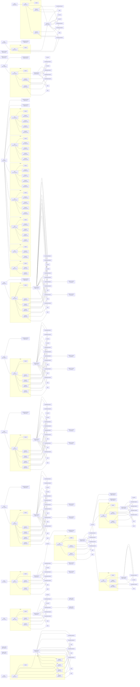

```mermaid
flowchart LR
  subgraph path2 [Path]
    2["Path<br>[298, 341, 3]"]
    3["Segment<br>[347, 385, 3]"]
    4["Segment<br>[482, 504, 3]"]
    5[Solid2d]
  end
  subgraph path19 [Path]
    19["Path<br>[888, 1013, 3]"]
    20["Segment<br>[1019, 1077, 3]"]
    21["Segment<br>[1718, 1725, 3]"]
    22[Solid2d]
  end
  subgraph path31 [Path]
    31["Path<br>[1865, 1919, 3]"]
    32["Segment<br>[1925, 1966, 3]"]
    33["Segment<br>[2105, 2112, 3]"]
    34[Solid2d]
  end
  subgraph path40 [Path]
    40["Path<br>[2246, 2283, 3]"]
    41["Segment<br>[2289, 2320, 3]"]
    42["Segment<br>[2403, 2410, 3]"]
    43[Solid2d]
  end
  subgraph path54 [Path]
    54["Path<br>[1373, 1532, 5]"]
    55["Segment<br>[1538, 1633, 5]"]
    56["Segment<br>[2449, 2456, 5]"]
    57[Solid2d]
  end
  subgraph path58 [Path]
    58["Path<br>[463, 517, 5]"]
    59["Segment<br>[525, 552, 5]"]
    60["Segment<br>[697, 704, 5]"]
    61[Solid2d]
  end
  subgraph path62 [Path]
    62["Path<br>[952, 979, 5]"]
    63["Segment<br>[987, 1028, 5]"]
    64["Segment<br>[1136, 1143, 5]"]
    65[Solid2d]
  end
  subgraph path66 [Path]
    66["Path<br>[123, 210, 10]"]
    67["Segment<br>[218, 247, 10]"]
    68["Segment<br>[733, 821, 10]"]
    69["Segment<br>[829, 857, 10]"]
    70["Segment<br>[1062, 1069, 10]"]
    71[Solid2d]
  end
  subgraph path72 [Path]
    72["Path<br>[1203, 1301, 10]"]
    73["Segment<br>[1309, 1428, 10]"]
    74["Segment<br>[1436, 1490, 10]"]
    75["Segment<br>[1498, 1619, 10]"]
    76["Segment<br>[1627, 1634, 10]"]
    77[Solid2d]
  end
  subgraph path78 [Path]
    78["Path<br>[1731, 1828, 10]"]
    79["Segment<br>[1836, 1955, 10]"]
    80["Segment<br>[1963, 2018, 10]"]
    81["Segment<br>[2026, 2147, 10]"]
    82["Segment<br>[2155, 2162, 10]"]
    83[Solid2d]
  end
  subgraph path84 [Path]
    84["Path<br>[1203, 1301, 10]"]
    85["Segment<br>[1309, 1428, 10]"]
    86["Segment<br>[1436, 1490, 10]"]
    87["Segment<br>[1498, 1619, 10]"]
    88["Segment<br>[1627, 1634, 10]"]
    89[Solid2d]
  end
  subgraph path90 [Path]
    90["Path<br>[1731, 1828, 10]"]
    91["Segment<br>[1836, 1955, 10]"]
    92["Segment<br>[1963, 2018, 10]"]
    93["Segment<br>[2026, 2147, 10]"]
    94["Segment<br>[2155, 2162, 10]"]
    95[Solid2d]
  end
  subgraph path106 [Path]
    106["Path<br>[592, 633, 4]"]
    107["Segment<br>[639, 672, 4]"]
    108["Segment<br>[759, 766, 4]"]
    109[Solid2d]
  end
  subgraph path111 [Path]
    111["Path<br>[899, 1051, 4]"]
    114[Solid2d]
  end
  subgraph path123 [Path]
    123["Path<br>[314, 355, 8]"]
    124["Segment<br>[363, 458, 8]"]
    125["Segment<br>[466, 562, 8]"]
    126["Segment<br>[570, 656, 8]"]
    127["Segment<br>[664, 671, 8]"]
    128[Solid2d]
  end
  subgraph path145 [Path]
    145["Path<br>[314, 355, 8]"]
    146["Segment<br>[363, 458, 8]"]
    147["Segment<br>[466, 562, 8]"]
    148["Segment<br>[570, 656, 8]"]
    149["Segment<br>[664, 671, 8]"]
    150[Solid2d]
  end
  subgraph path167 [Path]
    167["Path<br>[314, 355, 8]"]
    168["Segment<br>[363, 458, 8]"]
    169["Segment<br>[466, 562, 8]"]
    170["Segment<br>[570, 656, 8]"]
    171["Segment<br>[664, 671, 8]"]
    172[Solid2d]
  end
  subgraph path189 [Path]
    189["Path<br>[314, 355, 8]"]
    190["Segment<br>[363, 458, 8]"]
    191["Segment<br>[466, 562, 8]"]
    192["Segment<br>[570, 656, 8]"]
    193["Segment<br>[664, 671, 8]"]
    194[Solid2d]
  end
  subgraph path211 [Path]
    211["Path<br>[503, 596, 6]"]
    212["Segment<br>[602, 651, 6]"]
    221["Segment<br>[769, 787, 6]"]
    222[Solid2d]
  end
  subgraph path237 [Path]
    237["Path<br>[524, 554, 7]"]
    238["Segment<br>[560, 592, 7]"]
    239["Segment<br>[637, 718, 7]"]
    240["Segment<br>[724, 751, 7]"]
    241["Segment<br>[757, 764, 7]"]
    242[Solid2d]
  end
  1["Plane<br>[273, 292, 3]"]
  6["Sweep Extrusion<br>[519, 558, 3]"]
  7[Wall]
  8[Wall]
  9["Cap Start"]
  10["Cap End"]
  11["SweepEdge Opposite"]
  12["SweepEdge Adjacent"]
  13["SweepEdge Opposite"]
  14["SweepEdge Adjacent"]
  15["EdgeCut Chamfer<br>[564, 794, 3]"]
  16["EdgeCut Chamfer<br>[564, 794, 3]"]
  17["EdgeCut Chamfer<br>[564, 794, 3]"]
  18["EdgeCut Chamfer<br>[564, 794, 3]"]
  23["Sweep Extrusion<br>[1739, 1775, 3]"]
  24[Wall]
  25[Wall]
  26["Cap Start"]
  27["SweepEdge Opposite"]
  28["SweepEdge Adjacent"]
  29["SweepEdge Opposite"]
  30["SweepEdge Adjacent"]
  35["Sweep Extrusion<br>[2126, 2166, 3]"]
  36[Wall]
  37["Cap Start"]
  38["SweepEdge Opposite"]
  39["SweepEdge Adjacent"]
  44["Sweep Extrusion<br>[2411, 2443, 3]"]
  45[Wall]
  46[Wall]
  47["Cap Start"]
  48["SweepEdge Opposite"]
  49["SweepEdge Adjacent"]
  50["SweepEdge Opposite"]
  51["SweepEdge Adjacent"]
  52["Plane<br>[355, 384, 5]"]
  53["Plane<br>[1337, 1366, 5]"]
  96["Sweep Extrusion<br>[2784, 2820, 5]"]
  97[Wall]
  98[Wall]
  99["Cap Start"]
  100["Cap End"]
  101["SweepEdge Opposite"]
  102["SweepEdge Adjacent"]
  103["SweepEdge Opposite"]
  104["SweepEdge Adjacent"]
  105["Plane<br>[559, 586, 4]"]
  110["Plane<br>[813, 855, 4]"]
  112["SweepEdge Opposite"]
  113["SweepEdge Opposite"]
  115["Sweep Loft<br>[1215, 1243, 4]"]
  116[Wall]
  117[Wall]
  118["Cap End"]
  119["Cap End"]
  120["SweepEdge Adjacent"]
  121["SweepEdge Adjacent"]
  122["Plane<br>[838, 875, 0]"]
  129["Sweep Extrusion<br>[690, 737, 8]"]
  130[Wall]
  131[Wall]
  132[Wall]
  133[Wall]
  134["Cap Start"]
  135["Cap End"]
  136["SweepEdge Opposite"]
  137["SweepEdge Adjacent"]
  138["SweepEdge Opposite"]
  139["SweepEdge Adjacent"]
  140["SweepEdge Opposite"]
  141["SweepEdge Adjacent"]
  142["SweepEdge Opposite"]
  143["SweepEdge Adjacent"]
  144["Plane<br>[965, 1002, 0]"]
  151["Sweep Extrusion<br>[690, 737, 8]"]
  152[Wall]
  153[Wall]
  154[Wall]
  155[Wall]
  156["Cap Start"]
  157["Cap End"]
  158["SweepEdge Opposite"]
  159["SweepEdge Adjacent"]
  160["SweepEdge Opposite"]
  161["SweepEdge Adjacent"]
  162["SweepEdge Opposite"]
  163["SweepEdge Adjacent"]
  164["SweepEdge Opposite"]
  165["SweepEdge Adjacent"]
  166["Plane<br>[1085, 1122, 0]"]
  173["Sweep Extrusion<br>[690, 737, 8]"]
  174[Wall]
  175[Wall]
  176[Wall]
  177[Wall]
  178["Cap Start"]
  179["Cap End"]
  180["SweepEdge Opposite"]
  181["SweepEdge Adjacent"]
  182["SweepEdge Opposite"]
  183["SweepEdge Adjacent"]
  184["SweepEdge Opposite"]
  185["SweepEdge Adjacent"]
  186["SweepEdge Opposite"]
  187["SweepEdge Adjacent"]
  188["Plane<br>[1211, 1248, 0]"]
  195["Sweep Extrusion<br>[690, 737, 8]"]
  196[Wall]
  197[Wall]
  198[Wall]
  199[Wall]
  200["Cap Start"]
  201["Cap End"]
  202["SweepEdge Opposite"]
  203["SweepEdge Adjacent"]
  204["SweepEdge Opposite"]
  205["SweepEdge Adjacent"]
  206["SweepEdge Opposite"]
  207["SweepEdge Adjacent"]
  208["SweepEdge Opposite"]
  209["SweepEdge Adjacent"]
  210["Plane<br>[467, 497, 6]"]
  213["EdgeCut Chamfer<br>[745, 890, 8]"]
  214["EdgeCut Chamfer<br>[745, 890, 8]"]
  215["EdgeCut Chamfer<br>[745, 890, 8]"]
  216["EdgeCut Chamfer<br>[745, 890, 8]"]
  217["EdgeCut Chamfer<br>[745, 890, 8]"]
  218["EdgeCut Chamfer<br>[745, 890, 8]"]
  219["EdgeCut Chamfer<br>[745, 890, 8]"]
  220["EdgeCut Chamfer<br>[745, 890, 8]"]
  223["Sweep Extrusion<br>[833, 885, 6]"]
  224[Wall]
  225[Wall]
  226["Cap Start"]
  227["Cap End"]
  228["SweepEdge Opposite"]
  229["SweepEdge Adjacent"]
  230["SweepEdge Opposite"]
  231["SweepEdge Adjacent"]
  232["EdgeCut Fillet<br>[891, 1096, 6]"]
  233["EdgeCut Fillet<br>[891, 1096, 6]"]
  234["EdgeCut Fillet<br>[891, 1096, 6]"]
  235["EdgeCut Fillet<br>[891, 1096, 6]"]
  236["Plane<br>[494, 518, 7]"]
  243["Sweep Revolve<br>[770, 796, 7]"]
  244[Wall]
  245[Wall]
  246[Wall]
  247[Wall]
  248["SweepEdge Adjacent"]
  249["SweepEdge Adjacent"]
  250["SweepEdge Adjacent"]
  251["SweepEdge Adjacent"]
  252["StartSketchOnFace<br>[849, 882, 3]"]
  253["StartSketchOnFace<br>[1825, 1859, 3]"]
  254["StartSketchOnFace<br>[2206, 2240, 3]"]
  255["StartSketchOnPlane<br>[1323, 1367, 5]"]
  256["StartSketchOnPlane<br>[429, 455, 5]"]
  257["StartSketchOnPlane<br>[924, 944, 5]"]
  258["StartSketchOnPlane<br>[869, 893, 4]"]
  259["StartSketchOnPlane<br>[286, 306, 8]"]
  260["StartSketchOnPlane<br>[286, 306, 8]"]
  261["StartSketchOnPlane<br>[286, 306, 8]"]
  262["StartSketchOnPlane<br>[286, 306, 8]"]
  1 --- 2
  2 --- 3
  2 --- 4
  2 ---- 6
  2 --- 5
  3 --- 8
  3 --- 13
  3 --- 14
  4 --- 7
  4 --- 11
  4 --- 12
  6 --- 7
  6 --- 8
  6 --- 9
  6 --- 10
  6 --- 11
  6 --- 12
  6 --- 13
  6 --- 14
  10 --- 19
  14 <--x 15
  12 <--x 18
  19 --- 20
  19 --- 21
  19 ---- 23
  19 --- 22
  20 --- 25
  20 --- 29
  20 --- 30
  21 --- 24
  21 --- 27
  21 --- 28
  23 --- 24
  23 --- 25
  23 --- 26
  23 --- 27
  23 --- 28
  23 --- 29
  23 --- 30
  26 --- 31
  26 --- 40
  31 --- 32
  31 --- 33
  31 ---- 35
  31 --- 34
  32 --- 36
  32 --- 38
  32 --- 39
  35 --- 36
  35 --- 37
  35 --- 38
  35 --- 39
  40 --- 41
  40 --- 42
  40 ---- 44
  40 --- 43
  41 --- 46
  41 --- 50
  41 --- 51
  42 --- 45
  42 --- 48
  42 --- 49
  44 --- 45
  44 --- 46
  44 --- 47
  44 --- 48
  44 --- 49
  44 --- 50
  44 --- 51
  52 --- 58
  52 --- 62
  52 --- 66
  52 --- 72
  52 --- 78
  52 --- 84
  52 --- 90
  53 --- 54
  54 --- 55
  54 --- 56
  54 ---- 96
  54 --- 57
  55 --- 98
  55 --- 103
  55 --- 104
  56 --- 97
  56 --- 101
  56 --- 102
  58 --- 59
  58 --- 60
  58 --- 61
  62 --- 63
  62 --- 64
  62 --- 65
  66 --- 67
  66 --- 68
  66 --- 69
  66 --- 70
  66 --- 71
  72 --- 73
  72 --- 74
  72 --- 75
  72 --- 76
  72 --- 77
  78 --- 79
  78 --- 80
  78 --- 81
  78 --- 82
  78 --- 83
  84 --- 85
  84 --- 86
  84 --- 87
  84 --- 88
  84 --- 89
  90 --- 91
  90 --- 92
  90 --- 93
  90 --- 94
  90 --- 95
  96 --- 97
  96 --- 98
  96 --- 99
  96 --- 100
  96 --- 101
  96 --- 102
  96 --- 103
  96 --- 104
  105 --- 106
  106 --- 107
  106 --- 108
  106 ---- 115
  106 --- 109
  107 --- 116
  107 --- 112
  107 --- 120
  108 --- 117
  108 --- 113
  108 --- 121
  110 --- 111
  111 x--> 112
  111 x--> 113
  111 x---> 115
  111 --- 114
  115 --- 112
  115 --- 113
  115 --- 116
  115 --- 117
  115 --- 118
  115 --- 119
  115 --- 120
  115 --- 121
  122 --- 123
  123 --- 124
  123 --- 125
  123 --- 126
  123 --- 127
  123 ---- 129
  123 --- 128
  124 --- 130
  124 --- 136
  124 --- 137
  125 --- 131
  125 --- 138
  125 --- 139
  126 --- 132
  126 --- 140
  126 --- 141
  127 --- 133
  127 --- 142
  127 --- 143
  129 --- 130
  129 --- 131
  129 --- 132
  129 --- 133
  129 --- 134
  129 --- 135
  129 --- 136
  129 --- 137
  129 --- 138
  129 --- 139
  129 --- 140
  129 --- 141
  129 --- 142
  129 --- 143
  144 --- 145
  145 --- 146
  145 --- 147
  145 --- 148
  145 --- 149
  145 ---- 151
  145 --- 150
  146 --- 152
  146 --- 158
  146 --- 159
  147 --- 153
  147 --- 160
  147 --- 161
  148 --- 154
  148 --- 162
  148 --- 163
  149 --- 155
  149 --- 164
  149 --- 165
  151 --- 152
  151 --- 153
  151 --- 154
  151 --- 155
  151 --- 156
  151 --- 157
  151 --- 158
  151 --- 159
  151 --- 160
  151 --- 161
  151 --- 162
  151 --- 163
  151 --- 164
  151 --- 165
  166 --- 167
  167 --- 168
  167 --- 169
  167 --- 170
  167 --- 171
  167 ---- 173
  167 --- 172
  168 --- 174
  168 --- 180
  168 --- 181
  169 --- 175
  169 --- 182
  169 --- 183
  170 --- 176
  170 --- 184
  170 --- 185
  171 --- 177
  171 --- 186
  171 --- 187
  173 --- 174
  173 --- 175
  173 --- 176
  173 --- 177
  173 --- 178
  173 --- 179
  173 --- 180
  173 --- 181
  173 --- 182
  173 --- 183
  173 --- 184
  173 --- 185
  173 --- 186
  173 --- 187
  188 --- 189
  189 --- 190
  189 --- 191
  189 --- 192
  189 --- 193
  189 ---- 195
  189 --- 194
  190 --- 196
  190 --- 202
  190 --- 203
  191 --- 197
  191 --- 204
  191 --- 205
  192 --- 198
  192 --- 206
  192 --- 207
  193 --- 199
  193 --- 208
  193 --- 209
  195 --- 196
  195 --- 197
  195 --- 198
  195 --- 199
  195 --- 200
  195 --- 201
  195 --- 202
  195 --- 203
  195 --- 204
  195 --- 205
  195 --- 206
  195 --- 207
  195 --- 208
  195 --- 209
  210 --- 211
  211 --- 212
  211 --- 221
  211 ---- 223
  211 --- 222
  212 --- 225
  212 --- 230
  212 --- 231
  137 <--x 213
  139 <--x 214
  159 <--x 215
  161 <--x 216
  181 <--x 217
  183 <--x 218
  203 <--x 219
  205 <--x 220
  221 --- 224
  221 --- 228
  221 --- 229
  223 --- 224
  223 --- 225
  223 --- 226
  223 --- 227
  223 --- 228
  223 --- 229
  223 --- 230
  223 --- 231
  231 <--x 232
  229 <--x 235
  236 --- 237
  237 --- 238
  237 --- 239
  237 --- 240
  237 --- 241
  237 ---- 243
  237 --- 242
  238 --- 244
  238 --- 248
  239 --- 245
  239 --- 249
  240 --- 246
  240 --- 250
  241 --- 247
  241 --- 251
  243 --- 244
  243 --- 245
  243 --- 246
  243 --- 247
  243 <--x 238
  243 --- 248
  243 <--x 239
  243 --- 249
  243 <--x 240
  243 --- 250
  243 <--x 241
  243 --- 251
  10 <--x 252
  26 <--x 253
  26 <--x 254
  53 <--x 255
  52 <--x 256
  52 <--x 257
  110 <--x 258
  122 <--x 259
  144 <--x 260
  166 <--x 261
  188 <--x 262
```
