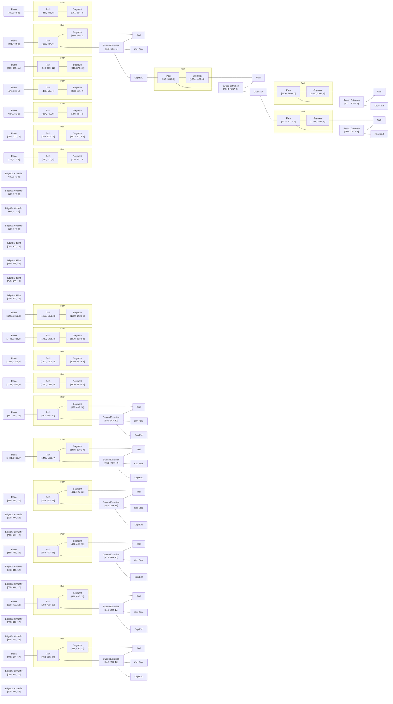

```mermaid
flowchart LR
  subgraph path2 [Path]
    2["Path<br>[330, 355, 9]"]
    3["Segment<br>[361, 394, 9]"]
  end
  subgraph path5 [Path]
    5["Path<br>[391, 434, 6]"]
    6["Segment<br>[440, 478, 6]"]
  end
  subgraph path8 [Path]
    8["Path<br>[309, 339, 11]"]
    9["Segment<br>[345, 377, 11]"]
  end
  subgraph path11 [Path]
    11["Path<br>[478, 532, 7]"]
    12["Segment<br>[538, 565, 7]"]
  end
  subgraph path14 [Path]
    14["Path<br>[261, 354, 10]"]
    15["Segment<br>[360, 409, 10]"]
  end
  subgraph path25 [Path]
    25["Path<br>[624, 750, 9]"]
    26["Segment<br>[756, 787, 9]"]
  end
  subgraph path28 [Path]
    28["Path<br>[980, 1027, 7]"]
    29["Segment<br>[1033, 1074, 7]"]
  end
  subgraph path34 [Path]
    34["Path<br>[963, 1088, 6]"]
    35["Segment<br>[1094, 1152, 6]"]
  end
  subgraph path41 [Path]
    41["Path<br>[1441, 1600, 7]"]
    42["Segment<br>[1606, 1701, 7]"]
  end
  subgraph path46 [Path]
    46["Path<br>[1950, 2004, 6]"]
    47["Segment<br>[2010, 2051, 6]"]
  end
  subgraph path51 [Path]
    51["Path<br>[2335, 2372, 6]"]
    52["Segment<br>[2378, 2409, 6]"]
  end
  subgraph path57 [Path]
    57["Path<br>[123, 210, 8]"]
    58["Segment<br>[218, 247, 8]"]
  end
  subgraph path60 [Path]
    60["Path<br>[1203, 1301, 8]"]
    61["Segment<br>[1309, 1428, 8]"]
  end
  subgraph path63 [Path]
    63["Path<br>[1731, 1828, 8]"]
    64["Segment<br>[1836, 1955, 8]"]
  end
  subgraph path66 [Path]
    66["Path<br>[1203, 1301, 8]"]
    67["Segment<br>[1309, 1428, 8]"]
  end
  subgraph path69 [Path]
    69["Path<br>[1731, 1828, 8]"]
    70["Segment<br>[1836, 1955, 8]"]
  end
  subgraph path76 [Path]
    76["Path<br>[398, 423, 12]"]
    77["Segment<br>[431, 490, 12]"]
  end
  subgraph path85 [Path]
    85["Path<br>[398, 423, 12]"]
    86["Segment<br>[431, 490, 12]"]
  end
  subgraph path94 [Path]
    94["Path<br>[398, 423, 12]"]
    95["Segment<br>[431, 490, 12]"]
  end
  subgraph path103 [Path]
    103["Path<br>[398, 423, 12]"]
    104["Segment<br>[431, 490, 12]"]
  end
  1["Plane<br>[330, 355, 9]"]
  4["Plane<br>[391, 434, 6]"]
  7["Plane<br>[309, 339, 11]"]
  10["Plane<br>[478, 532, 7]"]
  13["Plane<br>[261, 354, 10]"]
  16["Sweep Extrusion<br>[603, 633, 6]"]
  17[Wall]
  18["Cap Start"]
  19["Cap End"]
  20["Sweep Extrusion<br>[591, 643, 10]"]
  21[Wall]
  22["Cap Start"]
  23["Cap End"]
  24["Plane<br>[624, 750, 9]"]
  27["Plane<br>[980, 1027, 7]"]
  30["EdgeCut Chamfer<br>[639, 870, 6]"]
  31["EdgeCut Chamfer<br>[639, 870, 6]"]
  32["EdgeCut Chamfer<br>[639, 870, 6]"]
  33["EdgeCut Chamfer<br>[639, 870, 6]"]
  36["EdgeCut Fillet<br>[649, 855, 10]"]
  37["EdgeCut Fillet<br>[649, 855, 10]"]
  38["EdgeCut Fillet<br>[649, 855, 10]"]
  39["EdgeCut Fillet<br>[649, 855, 10]"]
  40["Plane<br>[1441, 1600, 7]"]
  43["Sweep Extrusion<br>[1814, 1857, 6]"]
  44[Wall]
  45["Cap Start"]
  48["Sweep Extrusion<br>[2211, 2254, 6]"]
  49[Wall]
  50["Cap Start"]
  53["Sweep Extrusion<br>[2501, 2534, 6]"]
  54[Wall]
  55["Cap Start"]
  56["Plane<br>[123, 210, 8]"]
  59["Plane<br>[1203, 1301, 8]"]
  62["Plane<br>[1731, 1828, 8]"]
  65["Plane<br>[1203, 1301, 8]"]
  68["Plane<br>[1731, 1828, 8]"]
  71["Sweep Extrusion<br>[2920, 2951, 7]"]
  72[Wall]
  73["Cap Start"]
  74["Cap End"]
  75["Plane<br>[398, 423, 12]"]
  78["Sweep Extrusion<br>[643, 690, 12]"]
  79[Wall]
  80["Cap Start"]
  81["Cap End"]
  82["EdgeCut Chamfer<br>[698, 844, 12]"]
  83["EdgeCut Chamfer<br>[698, 844, 12]"]
  84["Plane<br>[398, 423, 12]"]
  87["Sweep Extrusion<br>[643, 690, 12]"]
  88[Wall]
  89["Cap Start"]
  90["Cap End"]
  91["EdgeCut Chamfer<br>[698, 844, 12]"]
  92["EdgeCut Chamfer<br>[698, 844, 12]"]
  93["Plane<br>[398, 423, 12]"]
  96["Sweep Extrusion<br>[643, 690, 12]"]
  97[Wall]
  98["Cap Start"]
  99["Cap End"]
  100["EdgeCut Chamfer<br>[698, 844, 12]"]
  101["EdgeCut Chamfer<br>[698, 844, 12]"]
  102["Plane<br>[398, 423, 12]"]
  105["Sweep Extrusion<br>[643, 690, 12]"]
  106[Wall]
  107["Cap Start"]
  108["Cap End"]
  109["EdgeCut Chamfer<br>[698, 844, 12]"]
  110["EdgeCut Chamfer<br>[698, 844, 12]"]
  1 --- 2
  2 --- 3
  4 --- 5
  5 --- 6
  5 ---- 16
  6 --- 17
  7 --- 8
  8 --- 9
  10 --- 11
  11 --- 12
  13 --- 14
  14 --- 15
  14 ---- 20
  15 --- 21
  16 --- 17
  16 --- 18
  16 --- 19
  19 --- 34
  20 --- 21
  20 --- 22
  20 --- 23
  24 --- 25
  25 --- 26
  27 --- 28
  28 --- 29
  34 --- 35
  34 ---- 43
  35 --- 44
  40 --- 41
  41 --- 42
  41 ---- 71
  42 --- 72
  43 --- 44
  43 --- 45
  45 --- 46
  45 --- 51
  46 --- 47
  46 ---- 48
  47 --- 49
  48 --- 49
  48 --- 50
  51 --- 52
  51 ---- 53
  52 --- 54
  53 --- 54
  53 --- 55
  56 --- 57
  57 --- 58
  59 --- 60
  60 --- 61
  62 --- 63
  63 --- 64
  65 --- 66
  66 --- 67
  68 --- 69
  69 --- 70
  71 --- 72
  71 --- 73
  71 --- 74
  75 --- 76
  76 --- 77
  76 ---- 78
  77 --- 79
  78 --- 79
  78 --- 80
  78 --- 81
  84 --- 85
  85 --- 86
  85 ---- 87
  86 --- 88
  87 --- 88
  87 --- 89
  87 --- 90
  93 --- 94
  94 --- 95
  94 ---- 96
  95 --- 97
  96 --- 97
  96 --- 98
  96 --- 99
  102 --- 103
  103 --- 104
  103 ---- 105
  104 --- 106
  105 --- 106
  105 --- 107
  105 --- 108
```
