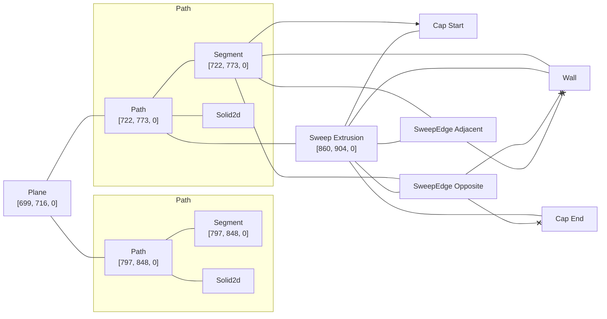

```mermaid
flowchart LR
  subgraph path2 [Path]
    2["Path<br>[722, 773, 0]"]
    4["Segment<br>[722, 773, 0]"]
    6[Solid2d]
  end
  subgraph path3 [Path]
    3["Path<br>[797, 848, 0]"]
    5["Segment<br>[797, 848, 0]"]
    7[Solid2d]
  end
  1["Plane<br>[699, 716, 0]"]
  8["Sweep Extrusion<br>[860, 904, 0]"]
  9[Wall]
  10["Cap Start"]
  11["Cap End"]
  12["SweepEdge Opposite"]
  13["SweepEdge Adjacent"]
  1 --- 2
  1 --- 3
  2 --- 4
  2 --- 6
  2 ---- 8
  3 --- 5
  3 --- 7
  4 --- 9
  4 x--> 10
  4 --- 12
  4 --- 13
  8 --- 9
  8 --- 10
  8 --- 11
  8 --- 12
  8 --- 13
  12 <--x 9
  13 <--x 9
  12 <--x 11
```
