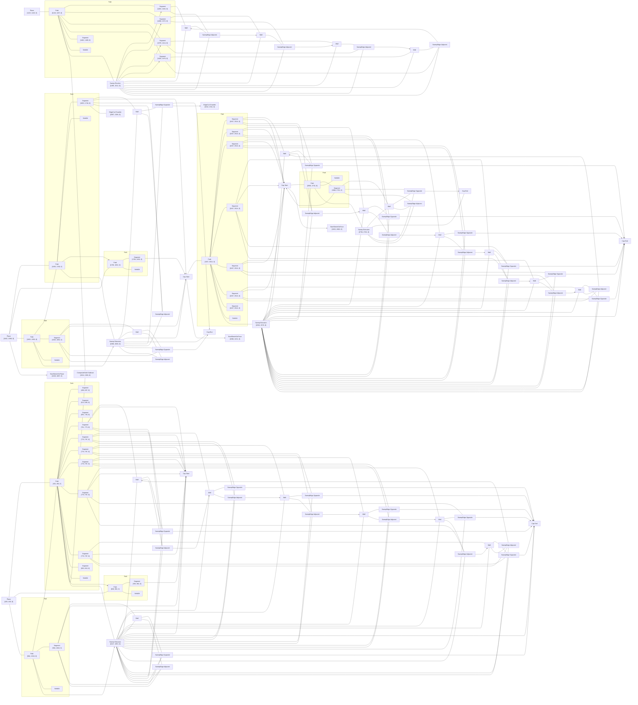

```mermaid
flowchart LR
  subgraph path2 [Path]
    2["Path<br>[452, 492, 0]"]
      %% [ProgramBodyItem { index: 8 }, VariableDeclarationDeclaration, VariableDeclarationInit, PipeBodyItem { index: 1 }]
    3["Segment<br>[498, 607, 0]"]
      %% [ProgramBodyItem { index: 8 }, VariableDeclarationDeclaration, VariableDeclarationInit, PipeBodyItem { index: 2 }]
    4["Segment<br>[613, 685, 0]"]
      %% [ProgramBodyItem { index: 8 }, VariableDeclarationDeclaration, VariableDeclarationInit, PipeBodyItem { index: 3 }]
    5["Segment<br>[691, 745, 0]"]
      %% [ProgramBodyItem { index: 8 }, VariableDeclarationDeclaration, VariableDeclarationInit, PipeBodyItem { index: 4 }]
    6["Segment<br>[751, 773, 0]"]
      %% [ProgramBodyItem { index: 8 }, VariableDeclarationDeclaration, VariableDeclarationInit, PipeBodyItem { index: 5 }]
    7["Segment<br>[779, 797, 0]"]
      %% [ProgramBodyItem { index: 8 }, VariableDeclarationDeclaration, VariableDeclarationInit, PipeBodyItem { index: 6 }]
    8["Segment<br>[779, 797, 0]"]
      %% [ProgramBodyItem { index: 8 }, VariableDeclarationDeclaration, VariableDeclarationInit, PipeBodyItem { index: 6 }]
    9["Segment<br>[779, 797, 0]"]
      %% [ProgramBodyItem { index: 8 }, VariableDeclarationDeclaration, VariableDeclarationInit, PipeBodyItem { index: 6 }]
    10["Segment<br>[779, 797, 0]"]
      %% [ProgramBodyItem { index: 8 }, VariableDeclarationDeclaration, VariableDeclarationInit, PipeBodyItem { index: 6 }]
    11["Segment<br>[779, 797, 0]"]
      %% [ProgramBodyItem { index: 8 }, VariableDeclarationDeclaration, VariableDeclarationInit, PipeBodyItem { index: 6 }]
    12["Segment<br>[803, 810, 0]"]
      %% [ProgramBodyItem { index: 8 }, VariableDeclarationDeclaration, VariableDeclarationInit, PipeBodyItem { index: 7 }]
    13[Solid2d]
  end
  subgraph path14 [Path]
    14["Path<br>[836, 902, 0]"]
      %% [ProgramBodyItem { index: 8 }, VariableDeclarationDeclaration, VariableDeclarationInit, PipeBodyItem { index: 8 }, CallKwArg { index: 0 }, PipeBodyItem { index: 0 }]
    15["Segment<br>[836, 902, 0]"]
      %% [ProgramBodyItem { index: 8 }, VariableDeclarationDeclaration, VariableDeclarationInit, PipeBodyItem { index: 8 }, CallKwArg { index: 0 }, PipeBodyItem { index: 0 }]
    16[Solid2d]
  end
  subgraph path17 [Path]
    17["Path<br>[984, 1010, 0]"]
      %% [ProgramBodyItem { index: 8 }, VariableDeclarationDeclaration, VariableDeclarationInit, PipeBodyItem { index: 9 }, CallKwArg { index: 0 }]
    18["Segment<br>[984, 1010, 0]"]
      %% [ProgramBodyItem { index: 8 }, VariableDeclarationDeclaration, VariableDeclarationInit, PipeBodyItem { index: 9 }, CallKwArg { index: 0 }]
    19[Solid2d]
  end
  subgraph path45 [Path]
    45["Path<br>[1146, 1197, 0]"]
      %% [ProgramBodyItem { index: 9 }, VariableDeclarationDeclaration, VariableDeclarationInit, PipeBodyItem { index: 1 }]
    46["Segment<br>[1203, 1282, 0]"]
      %% [ProgramBodyItem { index: 9 }, VariableDeclarationDeclaration, VariableDeclarationInit, PipeBodyItem { index: 2 }]
    47["Segment<br>[1288, 1372, 0]"]
      %% [ProgramBodyItem { index: 9 }, VariableDeclarationDeclaration, VariableDeclarationInit, PipeBodyItem { index: 3 }]
    48["Segment<br>[1378, 1414, 0]"]
      %% [ProgramBodyItem { index: 9 }, VariableDeclarationDeclaration, VariableDeclarationInit, PipeBodyItem { index: 4 }]
    49["Segment<br>[1420, 1476, 0]"]
      %% [ProgramBodyItem { index: 9 }, VariableDeclarationDeclaration, VariableDeclarationInit, PipeBodyItem { index: 5 }]
    50["Segment<br>[1482, 1489, 0]"]
      %% [ProgramBodyItem { index: 9 }, VariableDeclarationDeclaration, VariableDeclarationInit, PipeBodyItem { index: 6 }]
    51[Solid2d]
  end
  subgraph path63 [Path]
    63["Path<br>[1693, 1740, 0]"]
      %% [ProgramBodyItem { index: 11 }, VariableDeclarationDeclaration, VariableDeclarationInit, PipeBodyItem { index: 1 }]
    64["Segment<br>[1693, 1740, 0]"]
      %% [ProgramBodyItem { index: 11 }, VariableDeclarationDeclaration, VariableDeclarationInit, PipeBodyItem { index: 1 }]
    65[Solid2d]
  end
  subgraph path66 [Path]
    66["Path<br>[1766, 1832, 0]"]
      %% [ProgramBodyItem { index: 11 }, VariableDeclarationDeclaration, VariableDeclarationInit, PipeBodyItem { index: 2 }, CallKwArg { index: 0 }, PipeBodyItem { index: 0 }]
    67["Segment<br>[1766, 1832, 0]"]
      %% [ProgramBodyItem { index: 11 }, VariableDeclarationDeclaration, VariableDeclarationInit, PipeBodyItem { index: 2 }, CallKwArg { index: 0 }, PipeBodyItem { index: 0 }]
    68[Solid2d]
  end
  subgraph path69 [Path]
    69["Path<br>[1925, 1953, 0]"]
      %% [ProgramBodyItem { index: 11 }, VariableDeclarationDeclaration, VariableDeclarationInit, PipeBodyItem { index: 3 }, CallKwArg { index: 0 }]
    70["Segment<br>[1925, 1953, 0]"]
      %% [ProgramBodyItem { index: 11 }, VariableDeclarationDeclaration, VariableDeclarationInit, PipeBodyItem { index: 3 }, CallKwArg { index: 0 }]
    71[Solid2d]
  end
  subgraph path83 [Path]
    83["Path<br>[2437, 2524, 0]"]
      %% [ProgramBodyItem { index: 14 }, VariableDeclarationDeclaration, VariableDeclarationInit, PipeBodyItem { index: 1 }]
    84["Segment<br>[2437, 2524, 0]"]
      %% [ProgramBodyItem { index: 14 }, VariableDeclarationDeclaration, VariableDeclarationInit, PipeBodyItem { index: 1 }]
    85["Segment<br>[2437, 2524, 0]"]
      %% [ProgramBodyItem { index: 14 }, VariableDeclarationDeclaration, VariableDeclarationInit, PipeBodyItem { index: 1 }]
    86["Segment<br>[2437, 2524, 0]"]
      %% [ProgramBodyItem { index: 14 }, VariableDeclarationDeclaration, VariableDeclarationInit, PipeBodyItem { index: 1 }]
    87["Segment<br>[2437, 2524, 0]"]
      %% [ProgramBodyItem { index: 14 }, VariableDeclarationDeclaration, VariableDeclarationInit, PipeBodyItem { index: 1 }]
    88["Segment<br>[2437, 2524, 0]"]
      %% [ProgramBodyItem { index: 14 }, VariableDeclarationDeclaration, VariableDeclarationInit, PipeBodyItem { index: 1 }]
    89["Segment<br>[2437, 2524, 0]"]
      %% [ProgramBodyItem { index: 14 }, VariableDeclarationDeclaration, VariableDeclarationInit, PipeBodyItem { index: 1 }]
    90["Segment<br>[2437, 2524, 0]"]
      %% [ProgramBodyItem { index: 14 }, VariableDeclarationDeclaration, VariableDeclarationInit, PipeBodyItem { index: 1 }]
    91[Solid2d]
  end
  subgraph path113 [Path]
    113["Path<br>[2666, 2732, 0]"]
      %% [ProgramBodyItem { index: 15 }, VariableDeclarationDeclaration, VariableDeclarationInit, PipeBodyItem { index: 1 }]
    114["Segment<br>[2666, 2732, 0]"]
      %% [ProgramBodyItem { index: 15 }, VariableDeclarationDeclaration, VariableDeclarationInit, PipeBodyItem { index: 1 }]
    115[Solid2d]
  end
  1["Plane<br>[429, 446, 0]"]
    %% [ProgramBodyItem { index: 8 }, VariableDeclarationDeclaration, VariableDeclarationInit, PipeBodyItem { index: 0 }]
  20["Sweep Extrusion<br>[1017, 1053, 0]"]
    %% [ProgramBodyItem { index: 8 }, VariableDeclarationDeclaration, VariableDeclarationInit, PipeBodyItem { index: 10 }]
  21[Wall]
    %% face_code_ref=Missing NodePath
  22[Wall]
    %% face_code_ref=Missing NodePath
  23[Wall]
    %% face_code_ref=Missing NodePath
  24[Wall]
    %% face_code_ref=Missing NodePath
  25[Wall]
    %% face_code_ref=Missing NodePath
  26[Wall]
    %% face_code_ref=Missing NodePath
  27[Wall]
    %% face_code_ref=Missing NodePath
  28["Cap Start"]
    %% face_code_ref=Missing NodePath
  29["Cap End"]
    %% face_code_ref=Missing NodePath
  30["SweepEdge Opposite"]
  31["SweepEdge Adjacent"]
  32["SweepEdge Opposite"]
  33["SweepEdge Adjacent"]
  34["SweepEdge Opposite"]
  35["SweepEdge Adjacent"]
  36["SweepEdge Opposite"]
  37["SweepEdge Adjacent"]
  38["SweepEdge Opposite"]
  39["SweepEdge Adjacent"]
  40["SweepEdge Opposite"]
  41["SweepEdge Adjacent"]
  42["SweepEdge Opposite"]
  43["SweepEdge Adjacent"]
  44["Plane<br>[1123, 1140, 0]"]
    %% [ProgramBodyItem { index: 9 }, VariableDeclarationDeclaration, VariableDeclarationInit, PipeBodyItem { index: 0 }]
  52["Sweep Revolve<br>[1495, 1512, 0]"]
    %% [ProgramBodyItem { index: 9 }, VariableDeclarationDeclaration, VariableDeclarationInit, PipeBodyItem { index: 7 }]
  53[Wall]
    %% face_code_ref=Missing NodePath
  54[Wall]
    %% face_code_ref=Missing NodePath
  55[Wall]
    %% face_code_ref=Missing NodePath
  56[Wall]
    %% face_code_ref=Missing NodePath
  57["SweepEdge Adjacent"]
  58["SweepEdge Adjacent"]
  59["SweepEdge Adjacent"]
  60["SweepEdge Adjacent"]
  61["CompositeSolid Subtract<br>[1524, 1565, 0]"]
    %% [ProgramBodyItem { index: 10 }, VariableDeclarationDeclaration, VariableDeclarationInit]
  62["Plane<br>[1642, 1686, 0]"]
    %% [ProgramBodyItem { index: 11 }, VariableDeclarationDeclaration, VariableDeclarationInit, PipeBodyItem { index: 0 }, CallKwUnlabeledArg]
  72["Sweep Extrusion<br>[1960, 2038, 0]"]
    %% [ProgramBodyItem { index: 11 }, VariableDeclarationDeclaration, VariableDeclarationInit, PipeBodyItem { index: 4 }]
  73[Wall]
    %% face_code_ref=Missing NodePath
  74[Wall]
    %% face_code_ref=Missing NodePath
  75["Cap Start"]
    %% face_code_ref=[ProgramBodyItem { index: 14 }, VariableDeclarationDeclaration, VariableDeclarationInit, PipeBodyItem { index: 0 }]
  76["Cap End"]
    %% face_code_ref=Missing NodePath
  77["SweepEdge Opposite"]
  78["SweepEdge Adjacent"]
  79["SweepEdge Opposite"]
  80["SweepEdge Adjacent"]
  81["EdgeCut Chamfer<br>[2097, 2198, 0]"]
    %% [ProgramBodyItem { index: 12 }, VariableDeclarationDeclaration, VariableDeclarationInit]
  82["EdgeCut Chamfer<br>[2212, 2311, 0]"]
    %% [ProgramBodyItem { index: 13 }, VariableDeclarationDeclaration, VariableDeclarationInit]
  92["Sweep Extrusion<br>[2530, 2576, 0]"]
    %% [ProgramBodyItem { index: 14 }, VariableDeclarationDeclaration, VariableDeclarationInit, PipeBodyItem { index: 2 }]
  93[Wall]
    %% face_code_ref=Missing NodePath
  94[Wall]
    %% face_code_ref=Missing NodePath
  95[Wall]
    %% face_code_ref=Missing NodePath
  96[Wall]
    %% face_code_ref=Missing NodePath
  97[Wall]
    %% face_code_ref=Missing NodePath
  98[Wall]
    %% face_code_ref=Missing NodePath
  99["Cap Start"]
    %% face_code_ref=[ProgramBodyItem { index: 15 }, VariableDeclarationDeclaration, VariableDeclarationInit, PipeBodyItem { index: 0 }]
  100["Cap End"]
    %% face_code_ref=Missing NodePath
  101["SweepEdge Opposite"]
  102["SweepEdge Adjacent"]
  103["SweepEdge Opposite"]
  104["SweepEdge Adjacent"]
  105["SweepEdge Opposite"]
  106["SweepEdge Adjacent"]
  107["SweepEdge Opposite"]
  108["SweepEdge Adjacent"]
  109["SweepEdge Opposite"]
  110["SweepEdge Adjacent"]
  111["SweepEdge Opposite"]
  112["SweepEdge Adjacent"]
  116["Sweep Extrusion<br>[2738, 2782, 0]"]
    %% [ProgramBodyItem { index: 15 }, VariableDeclarationDeclaration, VariableDeclarationInit, PipeBodyItem { index: 2 }]
  117[Wall]
    %% face_code_ref=Missing NodePath
  118["Cap End"]
    %% face_code_ref=Missing NodePath
  119["SweepEdge Opposite"]
  120["SweepEdge Adjacent"]
  121["StartSketchOnPlane<br>[1628, 1687, 0]"]
    %% [ProgramBodyItem { index: 11 }, VariableDeclarationDeclaration, VariableDeclarationInit, PipeBodyItem { index: 0 }]
  122["StartSketchOnFace<br>[2388, 2431, 0]"]
    %% [ProgramBodyItem { index: 14 }, VariableDeclarationDeclaration, VariableDeclarationInit, PipeBodyItem { index: 0 }]
  123["StartSketchOnFace<br>[2623, 2660, 0]"]
    %% [ProgramBodyItem { index: 15 }, VariableDeclarationDeclaration, VariableDeclarationInit, PipeBodyItem { index: 0 }]
  1 --- 2
  1 --- 14
  1 --- 17
  2 --- 3
  2 --- 4
  2 --- 5
  2 --- 6
  2 --- 7
  2 --- 8
  2 --- 9
  2 --- 10
  2 --- 11
  2 --- 12
  2 --- 13
  2 <--x 14
  17 --- 2
  2 ---- 20
  2 --- 61
  6 --- 26
  6 x--> 28
  6 --- 40
  6 --- 41
  7 --- 21
  7 x--> 28
  7 --- 30
  7 --- 31
  8 --- 22
  8 x--> 28
  8 --- 32
  8 --- 33
  9 --- 23
  9 x--> 28
  9 --- 34
  9 --- 35
  10 --- 24
  10 x--> 28
  10 --- 36
  10 --- 37
  11 --- 25
  11 x--> 28
  11 --- 38
  11 --- 39
  14 --- 15
  14 --- 16
  15 x--> 28
  17 --- 18
  17 --- 19
  17 x---> 20
  18 --- 27
  18 x--> 28
  18 --- 42
  18 --- 43
  20 --- 21
  20 --- 22
  20 --- 23
  20 --- 24
  20 --- 25
  20 --- 26
  20 --- 27
  20 --- 28
  20 --- 29
  20 --- 30
  20 --- 31
  20 --- 32
  20 --- 33
  20 --- 34
  20 --- 35
  20 --- 36
  20 --- 37
  20 --- 38
  20 --- 39
  20 --- 40
  20 --- 41
  20 --- 42
  20 --- 43
  21 --- 30
  21 --- 31
  41 <--x 21
  31 <--x 22
  22 --- 32
  22 --- 33
  33 <--x 23
  23 --- 34
  23 --- 35
  35 <--x 24
  24 --- 36
  24 --- 37
  37 <--x 25
  25 --- 38
  25 --- 39
  39 <--x 26
  26 --- 40
  26 --- 41
  27 --- 42
  27 --- 43
  30 <--x 29
  32 <--x 29
  34 <--x 29
  36 <--x 29
  38 <--x 29
  40 <--x 29
  42 <--x 29
  44 --- 45
  45 --- 46
  45 --- 47
  45 --- 48
  45 --- 49
  45 --- 50
  45 --- 51
  45 ---- 52
  45 --- 61
  52 <--x 46
  46 --- 53
  46 --- 57
  52 <--x 47
  47 --- 54
  47 --- 58
  52 <--x 48
  48 --- 55
  48 --- 59
  52 <--x 49
  49 --- 56
  49 --- 60
  52 --- 53
  52 --- 54
  52 --- 55
  52 --- 56
  52 --- 57
  52 --- 58
  52 --- 59
  52 --- 60
  53 --- 57
  60 <--x 53
  57 <--x 54
  54 --- 58
  58 <--x 55
  55 --- 59
  59 <--x 56
  56 --- 60
  62 --- 63
  62 --- 66
  62 --- 69
  62 <--x 121
  63 --- 64
  63 --- 65
  63 <--x 66
  69 --- 63
  63 ---- 72
  64 --- 73
  64 x--> 75
  64 --- 77
  64 --- 78
  64 --- 81
  66 --- 67
  66 --- 68
  67 x--> 75
  69 --- 70
  69 --- 71
  69 x---> 72
  70 --- 74
  70 x--> 75
  70 --- 79
  70 --- 80
  72 --- 73
  72 --- 74
  72 --- 75
  72 --- 76
  72 --- 77
  72 --- 78
  72 --- 79
  72 --- 80
  73 --- 77
  73 --- 78
  74 --- 79
  74 --- 80
  75 --- 83
  75 <--x 122
  77 <--x 76
  79 <--x 76
  77 <--x 82
  83 --- 84
  83 --- 85
  83 --- 86
  83 --- 87
  83 --- 88
  83 --- 89
  83 --- 90
  83 --- 91
  83 ---- 92
  84 --- 93
  84 x--> 99
  84 --- 101
  84 --- 102
  85 --- 94
  85 x--> 99
  85 --- 103
  85 --- 104
  86 --- 95
  86 x--> 99
  86 --- 105
  86 --- 106
  87 --- 96
  87 x--> 99
  87 --- 107
  87 --- 108
  88 --- 97
  88 x--> 99
  88 --- 109
  88 --- 110
  89 --- 98
  89 x--> 99
  89 --- 111
  89 --- 112
  92 --- 93
  92 --- 94
  92 --- 95
  92 --- 96
  92 --- 97
  92 --- 98
  92 --- 99
  92 --- 100
  92 --- 101
  92 --- 102
  92 --- 103
  92 --- 104
  92 --- 105
  92 --- 106
  92 --- 107
  92 --- 108
  92 --- 109
  92 --- 110
  92 --- 111
  92 --- 112
  93 --- 101
  93 --- 102
  112 <--x 93
  102 <--x 94
  94 --- 103
  94 --- 104
  104 <--x 95
  95 --- 105
  95 --- 106
  106 <--x 96
  96 --- 107
  96 --- 108
  108 <--x 97
  97 --- 109
  97 --- 110
  110 <--x 98
  98 --- 111
  98 --- 112
  99 --- 113
  114 <--x 99
  99 <--x 123
  101 <--x 100
  103 <--x 100
  105 <--x 100
  107 <--x 100
  109 <--x 100
  111 <--x 100
  113 --- 114
  113 --- 115
  113 ---- 116
  114 --- 117
  114 --- 119
  114 --- 120
  116 --- 117
  116 --- 118
  116 --- 119
  116 --- 120
  117 --- 119
  117 --- 120
  119 <--x 118
```
