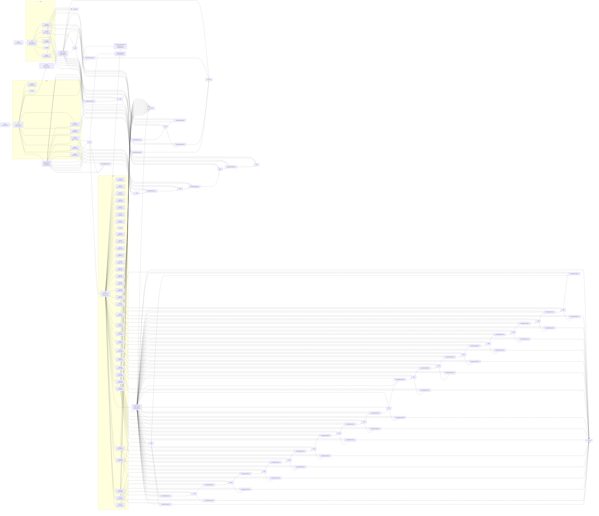

```mermaid
flowchart LR
  subgraph path2 [Path]
    2["Path<br>[1279, 1317, 0]<br>Consumed: true"]
      %% [ProgramBodyItem { index: 17 }, VariableDeclarationDeclaration, VariableDeclarationInit, PipeBodyItem { index: 0 }]
    3["Segment<br>[1323, 1370, 0]"]
      %% [ProgramBodyItem { index: 17 }, VariableDeclarationDeclaration, VariableDeclarationInit, PipeBodyItem { index: 1 }]
    4["Segment<br>[1376, 1474, 0]"]
      %% [ProgramBodyItem { index: 17 }, VariableDeclarationDeclaration, VariableDeclarationInit, PipeBodyItem { index: 2 }]
    5["Segment<br>[1480, 1525, 0]"]
      %% [ProgramBodyItem { index: 17 }, VariableDeclarationDeclaration, VariableDeclarationInit, PipeBodyItem { index: 3 }]
    6["Segment<br>[1531, 1566, 0]"]
      %% [ProgramBodyItem { index: 17 }, VariableDeclarationDeclaration, VariableDeclarationInit, PipeBodyItem { index: 4 }]
    7["Segment<br>[1572, 1609, 0]"]
      %% [ProgramBodyItem { index: 17 }, VariableDeclarationDeclaration, VariableDeclarationInit, PipeBodyItem { index: 5 }]
    8["Segment<br>[1615, 1622, 0]"]
      %% [ProgramBodyItem { index: 17 }, VariableDeclarationDeclaration, VariableDeclarationInit, PipeBodyItem { index: 6 }]
    9[Solid2d]
  end
  subgraph path22 [Path]
    22["Path<br>[1807, 1918, 0]<br>Consumed: true"]
      %% [ProgramBodyItem { index: 20 }, VariableDeclarationDeclaration, VariableDeclarationInit]
    23["Segment<br>[1807, 1918, 0]"]
      %% [ProgramBodyItem { index: 20 }, VariableDeclarationDeclaration, VariableDeclarationInit]
    24["Segment<br>[1807, 1918, 0]"]
      %% [ProgramBodyItem { index: 20 }, VariableDeclarationDeclaration, VariableDeclarationInit]
    25["Segment<br>[1807, 1918, 0]"]
      %% [ProgramBodyItem { index: 20 }, VariableDeclarationDeclaration, VariableDeclarationInit]
    26["Segment<br>[1807, 1918, 0]"]
      %% [ProgramBodyItem { index: 20 }, VariableDeclarationDeclaration, VariableDeclarationInit]
    27[Solid2d]
  end
  subgraph path40 [Path]
    40["Path<br>[2080, 2141, 0]<br>Consumed: true"]
      %% [ProgramBodyItem { index: 23 }, VariableDeclarationDeclaration, VariableDeclarationInit, PipeBodyItem { index: 0 }]
    41["Segment<br>[2147, 2185, 0]"]
      %% [ProgramBodyItem { index: 23 }, VariableDeclarationDeclaration, VariableDeclarationInit, PipeBodyItem { index: 1 }]
    42["Segment<br>[2191, 2247, 0]"]
      %% [ProgramBodyItem { index: 23 }, VariableDeclarationDeclaration, VariableDeclarationInit, PipeBodyItem { index: 2 }]
    43["Segment<br>[2253, 2362, 0]"]
      %% [ProgramBodyItem { index: 23 }, VariableDeclarationDeclaration, VariableDeclarationInit, PipeBodyItem { index: 3 }]
    44["Segment<br>[2368, 2423, 0]"]
      %% [ProgramBodyItem { index: 23 }, VariableDeclarationDeclaration, VariableDeclarationInit, PipeBodyItem { index: 4 }]
    45["Segment<br>[2429, 2468, 0]"]
      %% [ProgramBodyItem { index: 23 }, VariableDeclarationDeclaration, VariableDeclarationInit, PipeBodyItem { index: 5 }]
    46["Segment<br>[2474, 2505, 0]"]
      %% [ProgramBodyItem { index: 23 }, VariableDeclarationDeclaration, VariableDeclarationInit, PipeBodyItem { index: 6 }]
    47["Segment<br>[2511, 2518, 0]"]
      %% [ProgramBodyItem { index: 23 }, VariableDeclarationDeclaration, VariableDeclarationInit, PipeBodyItem { index: 7 }]
    48[Solid2d]
    49["Segment<br>[2688, 2730, 0]"]
      %% [ProgramBodyItem { index: 24 }, VariableDeclarationDeclaration, VariableDeclarationInit]
    50["Segment<br>[2688, 2730, 0]"]
      %% [ProgramBodyItem { index: 24 }, VariableDeclarationDeclaration, VariableDeclarationInit]
    51["Segment<br>[2688, 2730, 0]"]
      %% [ProgramBodyItem { index: 24 }, VariableDeclarationDeclaration, VariableDeclarationInit]
    52["Segment<br>[2688, 2730, 0]"]
      %% [ProgramBodyItem { index: 24 }, VariableDeclarationDeclaration, VariableDeclarationInit]
    53["Segment<br>[2688, 2730, 0]"]
      %% [ProgramBodyItem { index: 24 }, VariableDeclarationDeclaration, VariableDeclarationInit]
    54["Segment<br>[2688, 2730, 0]"]
      %% [ProgramBodyItem { index: 24 }, VariableDeclarationDeclaration, VariableDeclarationInit]
    55["Segment<br>[2688, 2730, 0]"]
      %% [ProgramBodyItem { index: 24 }, VariableDeclarationDeclaration, VariableDeclarationInit]
    56["Segment<br>[2688, 2730, 0]"]
      %% [ProgramBodyItem { index: 24 }, VariableDeclarationDeclaration, VariableDeclarationInit]
    57["Segment<br>[2688, 2730, 0]"]
      %% [ProgramBodyItem { index: 24 }, VariableDeclarationDeclaration, VariableDeclarationInit]
    58["Segment<br>[2688, 2730, 0]"]
      %% [ProgramBodyItem { index: 24 }, VariableDeclarationDeclaration, VariableDeclarationInit]
    59["Segment<br>[2751, 2788, 0]"]
      %% [ProgramBodyItem { index: 25 }, VariableDeclarationDeclaration, VariableDeclarationInit, PipeBodyItem { index: 0 }]
    60["Segment<br>[2751, 2788, 0]"]
      %% [ProgramBodyItem { index: 25 }, VariableDeclarationDeclaration, VariableDeclarationInit, PipeBodyItem { index: 0 }]
    61["Segment<br>[2751, 2788, 0]"]
      %% [ProgramBodyItem { index: 25 }, VariableDeclarationDeclaration, VariableDeclarationInit, PipeBodyItem { index: 0 }]
    62["Segment<br>[2751, 2788, 0]"]
      %% [ProgramBodyItem { index: 25 }, VariableDeclarationDeclaration, VariableDeclarationInit, PipeBodyItem { index: 0 }]
    63["Segment<br>[2751, 2788, 0]"]
      %% [ProgramBodyItem { index: 25 }, VariableDeclarationDeclaration, VariableDeclarationInit, PipeBodyItem { index: 0 }]
    64["Segment<br>[2751, 2788, 0]"]
      %% [ProgramBodyItem { index: 25 }, VariableDeclarationDeclaration, VariableDeclarationInit, PipeBodyItem { index: 0 }]
    65["Segment<br>[2751, 2788, 0]"]
      %% [ProgramBodyItem { index: 25 }, VariableDeclarationDeclaration, VariableDeclarationInit, PipeBodyItem { index: 0 }]
    66["Segment<br>[2751, 2788, 0]"]
      %% [ProgramBodyItem { index: 25 }, VariableDeclarationDeclaration, VariableDeclarationInit, PipeBodyItem { index: 0 }]
    67["Segment<br>[2751, 2788, 0]"]
      %% [ProgramBodyItem { index: 25 }, VariableDeclarationDeclaration, VariableDeclarationInit, PipeBodyItem { index: 0 }]
    68["Segment<br>[2751, 2788, 0]"]
      %% [ProgramBodyItem { index: 25 }, VariableDeclarationDeclaration, VariableDeclarationInit, PipeBodyItem { index: 0 }]
    69["Segment<br>[2751, 2788, 0]"]
      %% [ProgramBodyItem { index: 25 }, VariableDeclarationDeclaration, VariableDeclarationInit, PipeBodyItem { index: 0 }]
    70["Segment<br>[2751, 2788, 0]"]
      %% [ProgramBodyItem { index: 25 }, VariableDeclarationDeclaration, VariableDeclarationInit, PipeBodyItem { index: 0 }]
    71["Segment<br>[2751, 2788, 0]"]
      %% [ProgramBodyItem { index: 25 }, VariableDeclarationDeclaration, VariableDeclarationInit, PipeBodyItem { index: 0 }]
    72["Segment<br>[2751, 2788, 0]"]
      %% [ProgramBodyItem { index: 25 }, VariableDeclarationDeclaration, VariableDeclarationInit, PipeBodyItem { index: 0 }]
    73["Segment<br>[2751, 2788, 0]"]
      %% [ProgramBodyItem { index: 25 }, VariableDeclarationDeclaration, VariableDeclarationInit, PipeBodyItem { index: 0 }]
    74["Segment<br>[2751, 2788, 0]"]
      %% [ProgramBodyItem { index: 25 }, VariableDeclarationDeclaration, VariableDeclarationInit, PipeBodyItem { index: 0 }]
  end
  1["Plane<br>[1246, 1263, 0]"]
    %% [ProgramBodyItem { index: 16 }, VariableDeclarationDeclaration, VariableDeclarationInit]
  10["Sweep Revolve<br>[1628, 1645, 0]<br>Consumed: true"]
    %% [ProgramBodyItem { index: 17 }, VariableDeclarationDeclaration, VariableDeclarationInit, PipeBodyItem { index: 7 }]
  11[Wall]
    %% face_code_ref=[ProgramBodyItem { index: 22 }, VariableDeclarationDeclaration, VariableDeclarationInit]
  12[Wall]
    %% face_code_ref=Missing NodePath
  13[Wall]
    %% face_code_ref=Missing NodePath
  14[Wall]
    %% face_code_ref=Missing NodePath
  15[Wall]
    %% face_code_ref=Missing NodePath
  16["SweepEdge Adjacent"]
  17["SweepEdge Adjacent"]
  18["SweepEdge Adjacent"]
  19["SweepEdge Adjacent"]
  20["Helix<br>[1698, 1757, 0]: Consumed: true"]
    %% [ProgramBodyItem { index: 18 }, VariableDeclarationDeclaration, VariableDeclarationInit]
  21["Plane<br>[1773, 1790, 0]"]
    %% [ProgramBodyItem { index: 19 }, VariableDeclarationDeclaration, VariableDeclarationInit]
  28["Sweep Sweep<br>[1919, 1958, 0]<br>Consumed: false"]
    %% [ProgramBodyItem { index: 21 }, ExpressionStatementExpr]
  29[Wall]
    %% face_code_ref=Missing NodePath
  30[Wall]
    %% face_code_ref=Missing NodePath
  31[Wall]
    %% face_code_ref=Missing NodePath
  32["Cap Start"]
    %% face_code_ref=Missing NodePath
  33["Cap Start"]
    %% face_code_ref=Missing NodePath
  34["SweepEdge Opposite"]
  35["SweepEdge Adjacent"]
  36["SweepEdge Opposite"]
  37["SweepEdge Adjacent"]
  38["SweepEdge Opposite"]
  39["SweepEdge Adjacent"]
  75["Sweep Extrusion<br>[2794, 2836, 0]<br>Consumed: true"]
    %% [ProgramBodyItem { index: 25 }, VariableDeclarationDeclaration, VariableDeclarationInit, PipeBodyItem { index: 1 }]
  76[Wall]
    %% face_code_ref=Missing NodePath
  77[Wall]
    %% face_code_ref=Missing NodePath
  78[Wall]
    %% face_code_ref=Missing NodePath
  79[Wall]
    %% face_code_ref=Missing NodePath
  80[Wall]
    %% face_code_ref=Missing NodePath
  81[Wall]
    %% face_code_ref=Missing NodePath
  82[Wall]
    %% face_code_ref=Missing NodePath
  83[Wall]
    %% face_code_ref=Missing NodePath
  84[Wall]
    %% face_code_ref=Missing NodePath
  85[Wall]
    %% face_code_ref=Missing NodePath
  86[Wall]
    %% face_code_ref=Missing NodePath
  87[Wall]
    %% face_code_ref=Missing NodePath
  88[Wall]
    %% face_code_ref=Missing NodePath
  89[Wall]
    %% face_code_ref=Missing NodePath
  90[Wall]
    %% face_code_ref=Missing NodePath
  91[Wall]
    %% face_code_ref=Missing NodePath
  92["Cap Start"]
    %% face_code_ref=Missing NodePath
  93["Cap End"]
    %% face_code_ref=Missing NodePath
  94["SweepEdge Opposite"]
  95["SweepEdge Adjacent"]
  96["SweepEdge Opposite"]
  97["SweepEdge Adjacent"]
  98["SweepEdge Opposite"]
  99["SweepEdge Adjacent"]
  100["SweepEdge Opposite"]
  101["SweepEdge Adjacent"]
  102["SweepEdge Opposite"]
  103["SweepEdge Adjacent"]
  104["SweepEdge Opposite"]
  105["SweepEdge Adjacent"]
  106["SweepEdge Opposite"]
  107["SweepEdge Adjacent"]
  108["SweepEdge Opposite"]
  109["SweepEdge Adjacent"]
  110["SweepEdge Opposite"]
  111["SweepEdge Adjacent"]
  112["SweepEdge Opposite"]
  113["SweepEdge Adjacent"]
  114["SweepEdge Opposite"]
  115["SweepEdge Adjacent"]
  116["SweepEdge Opposite"]
  117["SweepEdge Adjacent"]
  118["SweepEdge Opposite"]
  119["SweepEdge Adjacent"]
  120["SweepEdge Opposite"]
  121["SweepEdge Adjacent"]
  122["SweepEdge Opposite"]
  123["SweepEdge Adjacent"]
  124["SweepEdge Opposite"]
  125["SweepEdge Adjacent"]
  126["CompositeSolid Subtract<br>[2898, 2951, 0]<br>Consumed: false"]
    %% [ProgramBodyItem { index: 26 }, ExpressionStatementExpr]
  127["StartSketchOnFace<br>[2010, 2054, 0]"]
    %% [ProgramBodyItem { index: 22 }, VariableDeclarationDeclaration, VariableDeclarationInit]
  1 --- 2
  2 --- 3
  2 --- 4
  2 --- 5
  2 --- 6
  2 --- 7
  2 --- 8
  2 --- 9
  2 ---- 10
  2 <--x 20
  2 --- 126
  10 <--x 3
  3 --- 11
  3 --- 16
  10 <--x 4
  4 --- 12
  4 --- 17
  10 <--x 5
  5 --- 13
  5 --- 18
  10 <--x 6
  6 --- 14
  6 --- 19
  10 <--x 7
  7 --- 15
  10 --- 11
  10 --- 12
  10 --- 13
  10 --- 14
  10 --- 15
  10 --- 16
  10 --- 17
  10 --- 18
  10 --- 19
  11 --- 16
  11 --- 40
  11 <--x 127
  16 <--x 12
  12 --- 17
  17 <--x 13
  13 --- 18
  18 <--x 14
  14 --- 19
  19 <--x 15
  20 --- 28
  21 --- 22
  22 --- 23
  22 --- 24
  22 --- 25
  22 --- 26
  22 --- 27
  22 ---- 28
  23 --- 29
  23 x--> 32
  23 --- 34
  23 --- 35
  24 --- 30
  24 x--> 32
  24 --- 36
  24 --- 37
  25 --- 31
  25 x--> 32
  25 --- 38
  25 --- 39
  28 --- 29
  28 --- 30
  28 --- 31
  28 --- 32
  28 --- 33
  28 --- 34
  28 --- 35
  28 --- 36
  28 --- 37
  28 --- 38
  28 --- 39
  29 --- 34
  29 --- 35
  37 <--x 29
  30 --- 36
  30 --- 37
  39 <--x 30
  35 <--x 31
  31 --- 38
  31 --- 39
  34 <--x 33
  36 <--x 33
  38 <--x 33
  40 --- 41
  40 --- 42
  40 --- 43
  40 --- 44
  40 --- 45
  40 --- 46
  40 --- 47
  40 --- 48
  40 --- 49
  40 --- 50
  40 --- 51
  40 --- 52
  40 --- 53
  40 --- 54
  40 --- 55
  40 --- 56
  40 --- 57
  40 --- 58
  40 --- 59
  40 --- 60
  40 --- 61
  40 --- 62
  40 --- 63
  40 --- 64
  40 --- 65
  40 --- 66
  40 --- 67
  40 --- 68
  40 --- 69
  40 --- 70
  40 --- 71
  40 --- 72
  40 --- 73
  40 --- 74
  40 ---- 75
  40 --- 126
  59 --- 91
  59 x--> 92
  59 --- 124
  59 --- 125
  60 --- 90
  60 x--> 92
  60 --- 122
  60 --- 123
  61 --- 89
  61 x--> 92
  61 --- 120
  61 --- 121
  62 --- 88
  62 x--> 92
  62 --- 118
  62 --- 119
  63 --- 87
  63 x--> 92
  63 --- 116
  63 --- 117
  64 --- 86
  64 x--> 92
  64 --- 114
  64 --- 115
  65 --- 85
  65 x--> 92
  65 --- 112
  65 --- 113
  66 --- 84
  66 x--> 92
  66 --- 110
  66 --- 111
  67 --- 83
  67 x--> 92
  67 --- 108
  67 --- 109
  68 --- 82
  68 x--> 92
  68 --- 106
  68 --- 107
  69 --- 81
  69 x--> 92
  69 --- 104
  69 --- 105
  70 --- 80
  70 x--> 92
  70 --- 102
  70 --- 103
  71 --- 79
  71 x--> 92
  71 --- 100
  71 --- 101
  72 --- 78
  72 x--> 92
  72 --- 98
  72 --- 99
  73 --- 77
  73 x--> 92
  73 --- 96
  73 --- 97
  74 --- 76
  74 x--> 92
  74 --- 94
  74 --- 95
  75 --- 76
  75 --- 77
  75 --- 78
  75 --- 79
  75 --- 80
  75 --- 81
  75 --- 82
  75 --- 83
  75 --- 84
  75 --- 85
  75 --- 86
  75 --- 87
  75 --- 88
  75 --- 89
  75 --- 90
  75 --- 91
  75 --- 92
  75 --- 93
  75 --- 94
  75 --- 95
  75 --- 96
  75 --- 97
  75 --- 98
  75 --- 99
  75 --- 100
  75 --- 101
  75 --- 102
  75 --- 103
  75 --- 104
  75 --- 105
  75 --- 106
  75 --- 107
  75 --- 108
  75 --- 109
  75 --- 110
  75 --- 111
  75 --- 112
  75 --- 113
  75 --- 114
  75 --- 115
  75 --- 116
  75 --- 117
  75 --- 118
  75 --- 119
  75 --- 120
  75 --- 121
  75 --- 122
  75 --- 123
  75 --- 124
  75 --- 125
  76 --- 94
  76 --- 95
  97 <--x 76
  77 --- 96
  77 --- 97
  99 <--x 77
  78 --- 98
  78 --- 99
  101 <--x 78
  79 --- 100
  79 --- 101
  103 <--x 79
  80 --- 102
  80 --- 103
  105 <--x 80
  81 --- 104
  81 --- 105
  107 <--x 81
  82 --- 106
  82 --- 107
  109 <--x 82
  83 --- 108
  83 --- 109
  111 <--x 83
  84 --- 110
  84 --- 111
  113 <--x 84
  85 --- 112
  85 --- 113
  115 <--x 85
  86 --- 114
  86 --- 115
  117 <--x 86
  87 --- 116
  87 --- 117
  119 <--x 87
  88 --- 118
  88 --- 119
  121 <--x 88
  89 --- 120
  89 --- 121
  123 <--x 89
  90 --- 122
  90 --- 123
  125 <--x 90
  95 <--x 91
  91 --- 124
  91 --- 125
  94 <--x 93
  96 <--x 93
  98 <--x 93
  100 <--x 93
  102 <--x 93
  104 <--x 93
  106 <--x 93
  108 <--x 93
  110 <--x 93
  112 <--x 93
  114 <--x 93
  116 <--x 93
  118 <--x 93
  120 <--x 93
  122 <--x 93
  124 <--x 93
```
