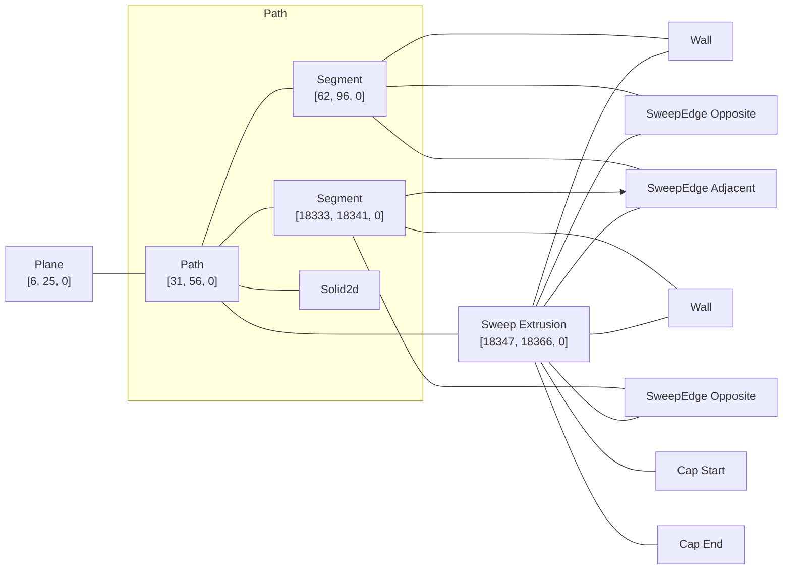

```mermaid
flowchart LR
  subgraph path2 [Path]
    2["Path<br>[31, 56, 0]"]
    3["Segment<br>[62, 96, 0]"]
    4["Segment<br>[18333, 18341, 0]"]
    5[Solid2d]
  end
  1["Plane<br>[6, 25, 0]"]
  6["Sweep Extrusion<br>[18347, 18366, 0]"]
  7[Wall]
  8[Wall]
  9["Cap Start"]
  10["Cap End"]
  11["SweepEdge Opposite"]
  12["SweepEdge Adjacent"]
  13["SweepEdge Opposite"]
  1 --- 2
  2 --- 3
  2 --- 4
  2 ---- 6
  2 --- 5
  3 --- 8
  3 --- 13
  3 --- 12
  4 --- 7
  4 --- 11
  4 x--> 12
  6 --- 7
  6 --- 8
  6 --- 9
  6 --- 10
  6 --- 11
  6 --- 12
  6 --- 13
```
