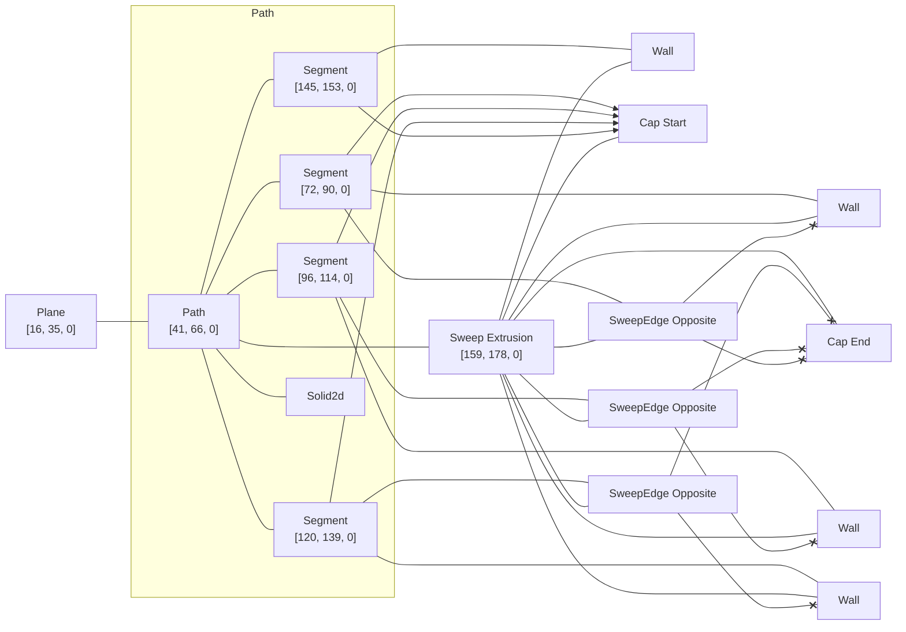

```mermaid
flowchart LR
  subgraph path2 [Path]
    2["Path<br>[41, 66, 0]"]
    3["Segment<br>[72, 90, 0]"]
    4["Segment<br>[96, 114, 0]"]
    5["Segment<br>[120, 139, 0]"]
    6["Segment<br>[145, 153, 0]"]
    7[Solid2d]
  end
  1["Plane<br>[16, 35, 0]"]
  8["Sweep Extrusion<br>[159, 178, 0]"]
  9[Wall]
  10[Wall]
  11[Wall]
  12[Wall]
  13["Cap Start"]
  14["Cap End"]
  15["SweepEdge Opposite"]
  16["SweepEdge Opposite"]
  17["SweepEdge Opposite"]
  1 --- 2
  2 --- 3
  2 --- 4
  2 --- 5
  2 --- 6
  2 ---- 8
  2 --- 7
  3 --- 12
  3 --- 17
  3 x--> 13
  4 --- 11
  4 --- 16
  4 x--> 13
  5 --- 10
  5 --- 15
  5 x--> 13
  6 --- 9
  6 x--> 13
  8 --- 9
  8 --- 10
  8 --- 11
  8 --- 12
  8 --- 13
  8 --- 14
  8 --- 15
  8 --- 16
  8 --- 17
  15 <--x 10
  15 <--x 14
  16 <--x 11
  16 <--x 14
  17 <--x 12
  17 <--x 14
```
