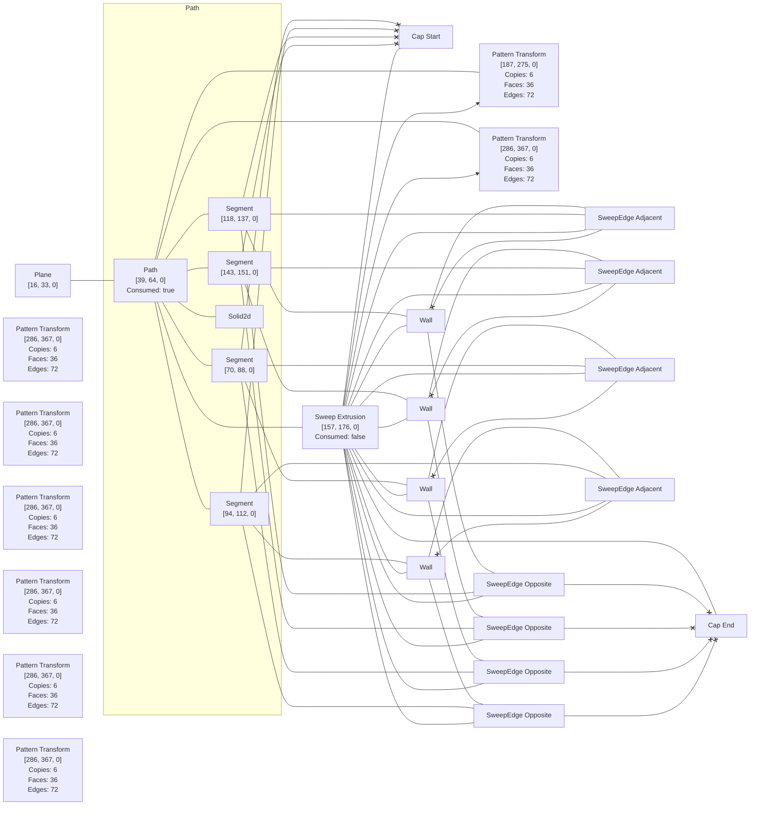

```mermaid
flowchart LR
  subgraph path8 [Path]
    8["Path<br>[39, 64, 0]<br>Consumed: true"]
      %% [ProgramBodyItem { index: 0 }, VariableDeclarationDeclaration, VariableDeclarationInit, PipeBodyItem { index: 1 }]
    9["Segment<br>[70, 88, 0]"]
      %% [ProgramBodyItem { index: 0 }, VariableDeclarationDeclaration, VariableDeclarationInit, PipeBodyItem { index: 2 }]
    10["Segment<br>[94, 112, 0]"]
      %% [ProgramBodyItem { index: 0 }, VariableDeclarationDeclaration, VariableDeclarationInit, PipeBodyItem { index: 3 }]
    11["Segment<br>[118, 137, 0]"]
      %% [ProgramBodyItem { index: 0 }, VariableDeclarationDeclaration, VariableDeclarationInit, PipeBodyItem { index: 4 }]
    12["Segment<br>[143, 151, 0]"]
      %% [ProgramBodyItem { index: 0 }, VariableDeclarationDeclaration, VariableDeclarationInit, PipeBodyItem { index: 5 }]
    22[Solid2d]
  end
  1["Cap End"]
    %% face_code_ref=Missing NodePath
  2["Cap Start"]
    %% face_code_ref=Missing NodePath
  3[Wall]
    %% face_code_ref=Missing NodePath
  4[Wall]
    %% face_code_ref=Missing NodePath
  5[Wall]
    %% face_code_ref=Missing NodePath
  6[Wall]
    %% face_code_ref=Missing NodePath
  7["Plane<br>[16, 33, 0]"]
    %% [ProgramBodyItem { index: 0 }, VariableDeclarationDeclaration, VariableDeclarationInit, PipeBodyItem { index: 0 }]
  13["Sweep Extrusion<br>[157, 176, 0]<br>Consumed: false"]
    %% [ProgramBodyItem { index: 0 }, VariableDeclarationDeclaration, VariableDeclarationInit, PipeBodyItem { index: 6 }]
  14["Pattern Transform<br>[187, 275, 0]<br>Copies: 6<br>Faces: 36<br>Edges: 72"]
    %% [ProgramBodyItem { index: 1 }, VariableDeclarationDeclaration, VariableDeclarationInit]
  15["Pattern Transform<br>[286, 367, 0]<br>Copies: 6<br>Faces: 36<br>Edges: 72"]
    %% [ProgramBodyItem { index: 2 }, VariableDeclarationDeclaration, VariableDeclarationInit]
  16["Pattern Transform<br>[286, 367, 0]<br>Copies: 6<br>Faces: 36<br>Edges: 72"]
    %% [ProgramBodyItem { index: 2 }, VariableDeclarationDeclaration, VariableDeclarationInit]
  17["Pattern Transform<br>[286, 367, 0]<br>Copies: 6<br>Faces: 36<br>Edges: 72"]
    %% [ProgramBodyItem { index: 2 }, VariableDeclarationDeclaration, VariableDeclarationInit]
  18["Pattern Transform<br>[286, 367, 0]<br>Copies: 6<br>Faces: 36<br>Edges: 72"]
    %% [ProgramBodyItem { index: 2 }, VariableDeclarationDeclaration, VariableDeclarationInit]
  19["Pattern Transform<br>[286, 367, 0]<br>Copies: 6<br>Faces: 36<br>Edges: 72"]
    %% [ProgramBodyItem { index: 2 }, VariableDeclarationDeclaration, VariableDeclarationInit]
  20["Pattern Transform<br>[286, 367, 0]<br>Copies: 6<br>Faces: 36<br>Edges: 72"]
    %% [ProgramBodyItem { index: 2 }, VariableDeclarationDeclaration, VariableDeclarationInit]
  21["Pattern Transform<br>[286, 367, 0]<br>Copies: 6<br>Faces: 36<br>Edges: 72"]
    %% [ProgramBodyItem { index: 2 }, VariableDeclarationDeclaration, VariableDeclarationInit]
  23["SweepEdge Adjacent"]
  24["SweepEdge Adjacent"]
  25["SweepEdge Adjacent"]
  26["SweepEdge Adjacent"]
  27["SweepEdge Opposite"]
  28["SweepEdge Opposite"]
  29["SweepEdge Opposite"]
  30["SweepEdge Opposite"]
  13 --- 1
  27 <--x 1
  28 <--x 1
  29 <--x 1
  30 <--x 1
  9 <--x 2
  10 <--x 2
  11 <--x 2
  12 <--x 2
  13 --- 2
  11 --- 3
  13 --- 3
  3 --- 23
  23 <--x 3
  3 --- 27
  12 --- 4
  13 --- 4
  4 --- 24
  24 <--x 4
  4 --- 28
  9 --- 5
  13 --- 5
  5 --- 25
  25 <--x 5
  5 --- 29
  10 --- 6
  13 --- 6
  6 --- 26
  26 <--x 6
  6 --- 30
  7 --- 8
  8 --- 9
  8 --- 10
  8 --- 11
  8 --- 12
  8 ---- 13
  8 --- 14
  8 --- 21
  8 --- 22
  9 --- 25
  9 --- 29
  10 --- 26
  10 --- 30
  11 --- 23
  11 --- 27
  12 --- 24
  12 --- 28
  13 x--> 14
  13 x--> 21
  13 --- 23
  13 --- 24
  13 --- 25
  13 --- 26
  13 --- 27
  13 --- 28
  13 --- 29
  13 --- 30
```
