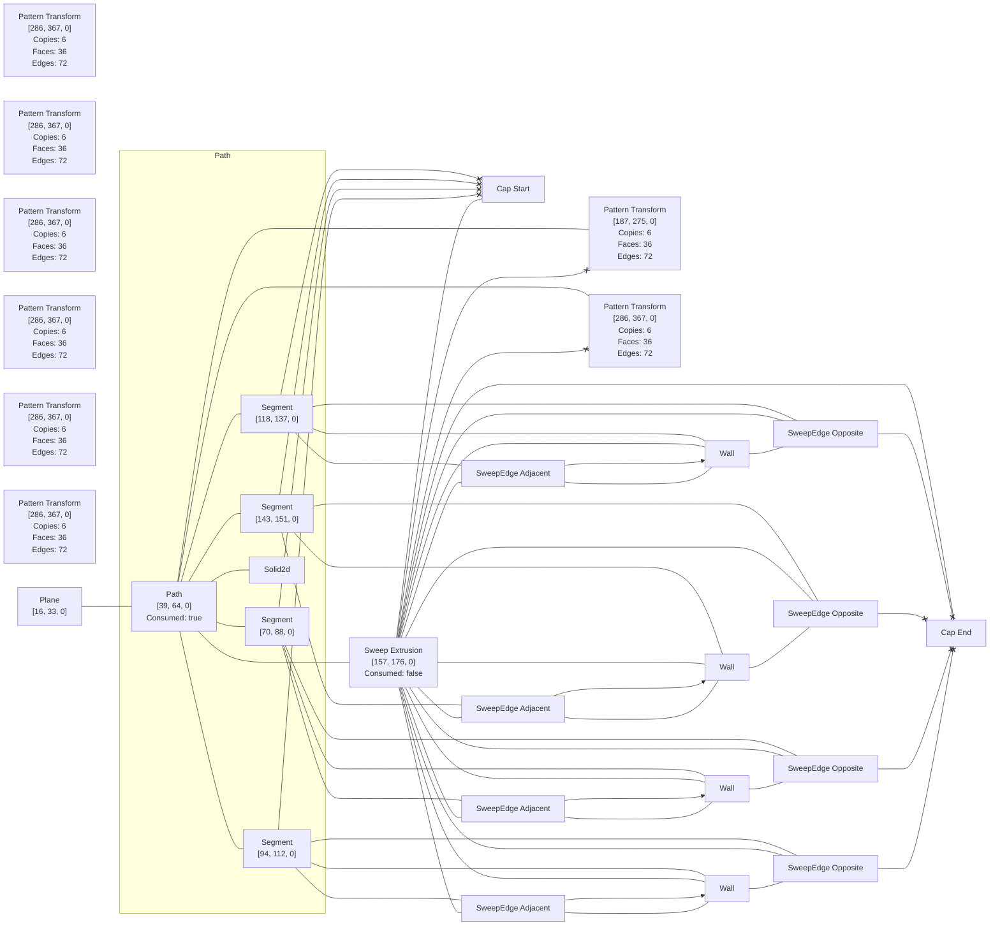

```mermaid
flowchart LR
  subgraph path3 [Path]
    3["Path<br>[39, 64, 0]<br>Consumed: true"]
      %% [ProgramBodyItem { index: 0 }, VariableDeclarationDeclaration, VariableDeclarationInit, PipeBodyItem { index: 1 }]
    15["Segment<br>[70, 88, 0]"]
      %% [ProgramBodyItem { index: 0 }, VariableDeclarationDeclaration, VariableDeclarationInit, PipeBodyItem { index: 2 }]
    16["Segment<br>[94, 112, 0]"]
      %% [ProgramBodyItem { index: 0 }, VariableDeclarationDeclaration, VariableDeclarationInit, PipeBodyItem { index: 3 }]
    13["Segment<br>[118, 137, 0]"]
      %% [ProgramBodyItem { index: 0 }, VariableDeclarationDeclaration, VariableDeclarationInit, PipeBodyItem { index: 4 }]
    14["Segment<br>[143, 151, 0]"]
      %% [ProgramBodyItem { index: 0 }, VariableDeclarationDeclaration, VariableDeclarationInit, PipeBodyItem { index: 5 }]
    17[Solid2d]
  end
  12["Plane<br>[16, 33, 0]"]
    %% [ProgramBodyItem { index: 0 }, VariableDeclarationDeclaration, VariableDeclarationInit, PipeBodyItem { index: 0 }]
  18["Sweep Extrusion<br>[157, 176, 0]<br>Consumed: false"]
    %% [ProgramBodyItem { index: 0 }, VariableDeclarationDeclaration, VariableDeclarationInit, PipeBodyItem { index: 6 }]
  28[Wall]
    %% face_code_ref=Missing NodePath
  27[Wall]
    %% face_code_ref=Missing NodePath
  30[Wall]
    %% face_code_ref=Missing NodePath
  29[Wall]
    %% face_code_ref=Missing NodePath
  2["Cap Start"]
    %% face_code_ref=Missing NodePath
  1["Cap End"]
    %% face_code_ref=Missing NodePath
  24["SweepEdge Opposite"]
  20["SweepEdge Adjacent"]
  23["SweepEdge Opposite"]
  19["SweepEdge Adjacent"]
  26["SweepEdge Opposite"]
  22["SweepEdge Adjacent"]
  25["SweepEdge Opposite"]
  21["SweepEdge Adjacent"]
  4["Pattern Transform<br>[187, 275, 0]<br>Copies: 6<br>Faces: 36<br>Edges: 72"]
    %% [ProgramBodyItem { index: 1 }, VariableDeclarationDeclaration, VariableDeclarationInit]
  11["Pattern Transform<br>[286, 367, 0]<br>Copies: 6<br>Faces: 36<br>Edges: 72"]
    %% [ProgramBodyItem { index: 2 }, VariableDeclarationDeclaration, VariableDeclarationInit]
  5["Pattern Transform<br>[286, 367, 0]<br>Copies: 6<br>Faces: 36<br>Edges: 72"]
    %% [ProgramBodyItem { index: 2 }, VariableDeclarationDeclaration, VariableDeclarationInit]
  6["Pattern Transform<br>[286, 367, 0]<br>Copies: 6<br>Faces: 36<br>Edges: 72"]
    %% [ProgramBodyItem { index: 2 }, VariableDeclarationDeclaration, VariableDeclarationInit]
  7["Pattern Transform<br>[286, 367, 0]<br>Copies: 6<br>Faces: 36<br>Edges: 72"]
    %% [ProgramBodyItem { index: 2 }, VariableDeclarationDeclaration, VariableDeclarationInit]
  8["Pattern Transform<br>[286, 367, 0]<br>Copies: 6<br>Faces: 36<br>Edges: 72"]
    %% [ProgramBodyItem { index: 2 }, VariableDeclarationDeclaration, VariableDeclarationInit]
  9["Pattern Transform<br>[286, 367, 0]<br>Copies: 6<br>Faces: 36<br>Edges: 72"]
    %% [ProgramBodyItem { index: 2 }, VariableDeclarationDeclaration, VariableDeclarationInit]
  10["Pattern Transform<br>[286, 367, 0]<br>Copies: 6<br>Faces: 36<br>Edges: 72"]
    %% [ProgramBodyItem { index: 2 }, VariableDeclarationDeclaration, VariableDeclarationInit]
  18 --- 1
  23 <--x 1
  24 <--x 1
  25 <--x 1
  26 <--x 1
  13 <--x 2
  14 <--x 2
  15 <--x 2
  16 <--x 2
  18 --- 2
  3 --- 4
  3 --- 11
  12 --- 3
  3 --- 13
  3 --- 14
  3 --- 15
  3 --- 16
  3 --- 17
  3 ---- 18
  18 <--x 4
  18 <--x 11
  13 --- 19
  13 --- 23
  13 --- 27
  14 --- 20
  14 --- 24
  14 --- 28
  15 --- 21
  15 --- 25
  15 --- 29
  16 --- 22
  16 --- 26
  16 --- 30
  18 --- 19
  18 --- 20
  18 --- 21
  18 --- 22
  18 --- 23
  18 --- 24
  18 --- 25
  18 --- 26
  18 --- 27
  18 --- 28
  18 --- 29
  18 --- 30
  27 --- 19
  19 x--> 27
  28 --- 20
  20 x--> 28
  29 --- 21
  21 x--> 29
  30 --- 22
  22 x--> 30
  27 --- 23
  28 --- 24
  29 --- 25
  30 --- 26
```
