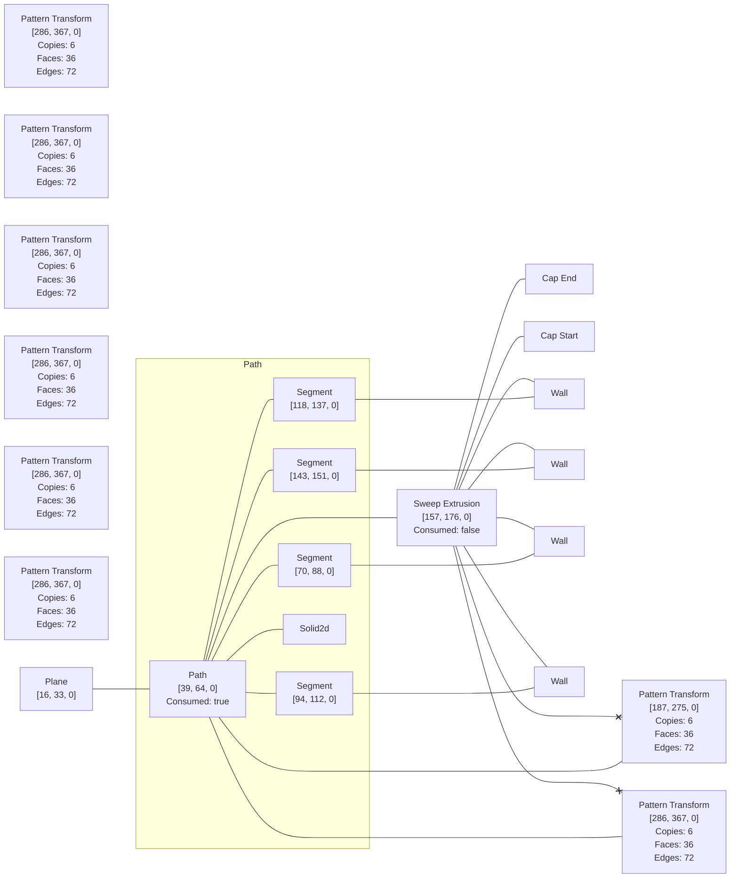

```mermaid
flowchart LR
  subgraph path3 [Path]
    3["Path<br>[39, 64, 0]<br>Consumed: true"]
      %% [ProgramBodyItem { index: 0 }, VariableDeclarationDeclaration, VariableDeclarationInit, PipeBodyItem { index: 1 }]
    13["Segment<br>[118, 137, 0]"]
      %% [ProgramBodyItem { index: 0 }, VariableDeclarationDeclaration, VariableDeclarationInit, PipeBodyItem { index: 4 }]
    14["Segment<br>[143, 151, 0]"]
      %% [ProgramBodyItem { index: 0 }, VariableDeclarationDeclaration, VariableDeclarationInit, PipeBodyItem { index: 5 }]
    15["Segment<br>[70, 88, 0]"]
      %% [ProgramBodyItem { index: 0 }, VariableDeclarationDeclaration, VariableDeclarationInit, PipeBodyItem { index: 2 }]
    16["Segment<br>[94, 112, 0]"]
      %% [ProgramBodyItem { index: 0 }, VariableDeclarationDeclaration, VariableDeclarationInit, PipeBodyItem { index: 3 }]
    17[Solid2d]
  end
  1["Cap End"]
    %% face_code_ref=Missing NodePath
  2["Cap Start"]
    %% face_code_ref=Missing NodePath
  4["Pattern Transform<br>[187, 275, 0]<br>Copies: 6<br>Faces: 36<br>Edges: 72"]
    %% [ProgramBodyItem { index: 1 }, VariableDeclarationDeclaration, VariableDeclarationInit]
  5["Pattern Transform<br>[286, 367, 0]<br>Copies: 6<br>Faces: 36<br>Edges: 72"]
    %% [ProgramBodyItem { index: 2 }, VariableDeclarationDeclaration, VariableDeclarationInit]
  6["Pattern Transform<br>[286, 367, 0]<br>Copies: 6<br>Faces: 36<br>Edges: 72"]
    %% [ProgramBodyItem { index: 2 }, VariableDeclarationDeclaration, VariableDeclarationInit]
  7["Pattern Transform<br>[286, 367, 0]<br>Copies: 6<br>Faces: 36<br>Edges: 72"]
    %% [ProgramBodyItem { index: 2 }, VariableDeclarationDeclaration, VariableDeclarationInit]
  8["Pattern Transform<br>[286, 367, 0]<br>Copies: 6<br>Faces: 36<br>Edges: 72"]
    %% [ProgramBodyItem { index: 2 }, VariableDeclarationDeclaration, VariableDeclarationInit]
  9["Pattern Transform<br>[286, 367, 0]<br>Copies: 6<br>Faces: 36<br>Edges: 72"]
    %% [ProgramBodyItem { index: 2 }, VariableDeclarationDeclaration, VariableDeclarationInit]
  10["Pattern Transform<br>[286, 367, 0]<br>Copies: 6<br>Faces: 36<br>Edges: 72"]
    %% [ProgramBodyItem { index: 2 }, VariableDeclarationDeclaration, VariableDeclarationInit]
  11["Pattern Transform<br>[286, 367, 0]<br>Copies: 6<br>Faces: 36<br>Edges: 72"]
    %% [ProgramBodyItem { index: 2 }, VariableDeclarationDeclaration, VariableDeclarationInit]
  12["Plane<br>[16, 33, 0]"]
    %% [ProgramBodyItem { index: 0 }, VariableDeclarationDeclaration, VariableDeclarationInit, PipeBodyItem { index: 0 }]
  18["Sweep Extrusion<br>[157, 176, 0]<br>Consumed: false"]
    %% [ProgramBodyItem { index: 0 }, VariableDeclarationDeclaration, VariableDeclarationInit, PipeBodyItem { index: 6 }]
  19[Wall]
    %% face_code_ref=Missing NodePath
  20[Wall]
    %% face_code_ref=Missing NodePath
  21[Wall]
    %% face_code_ref=Missing NodePath
  22[Wall]
    %% face_code_ref=Missing NodePath
  18 --- 1
  18 --- 2
  3 --- 4
  3 --- 11
  12 --- 3
  3 --- 13
  3 --- 14
  3 --- 15
  3 --- 16
  3 --- 17
  3 ---- 18
  18 <--x 4
  18 <--x 11
  13 --- 19
  14 --- 20
  15 --- 21
  16 --- 22
  18 --- 19
  18 --- 20
  18 --- 21
  18 --- 22
```
