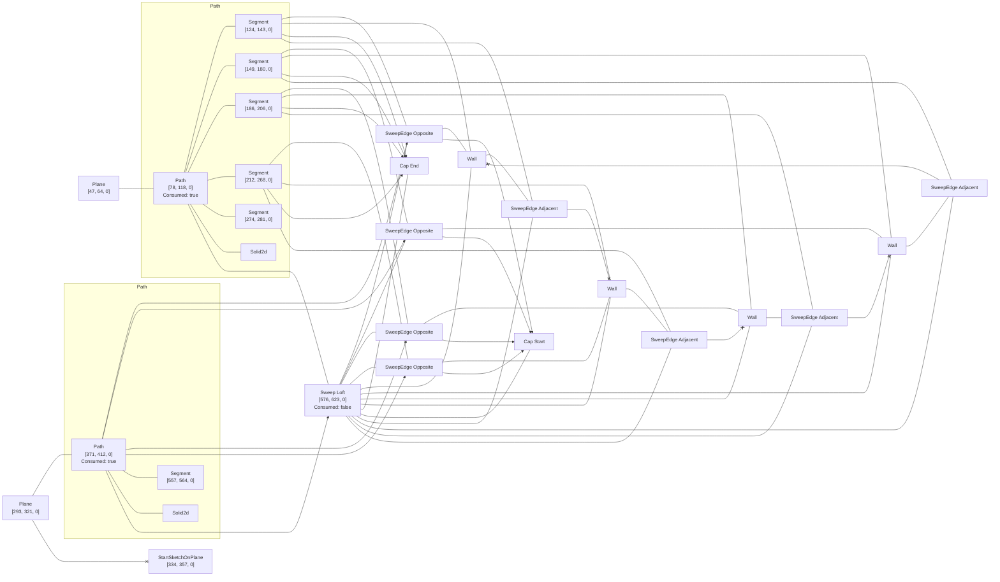

```mermaid
flowchart LR
  subgraph path2 [Path]
    2["Path<br>[78, 118, 0]<br>Consumed: true"]
      %% [ProgramBodyItem { index: 1 }, VariableDeclarationDeclaration, VariableDeclarationInit, PipeBodyItem { index: 0 }]
    3["Segment<br>[124, 143, 0]"]
      %% [ProgramBodyItem { index: 1 }, VariableDeclarationDeclaration, VariableDeclarationInit, PipeBodyItem { index: 1 }]
    4["Segment<br>[149, 180, 0]"]
      %% [ProgramBodyItem { index: 1 }, VariableDeclarationDeclaration, VariableDeclarationInit, PipeBodyItem { index: 2 }]
    5["Segment<br>[186, 206, 0]"]
      %% [ProgramBodyItem { index: 1 }, VariableDeclarationDeclaration, VariableDeclarationInit, PipeBodyItem { index: 3 }]
    6["Segment<br>[212, 268, 0]"]
      %% [ProgramBodyItem { index: 1 }, VariableDeclarationDeclaration, VariableDeclarationInit, PipeBodyItem { index: 4 }]
    7["Segment<br>[274, 281, 0]"]
      %% [ProgramBodyItem { index: 1 }, VariableDeclarationDeclaration, VariableDeclarationInit, PipeBodyItem { index: 5 }]
    8[Solid2d]
  end
  subgraph path10 [Path]
    10["Path<br>[371, 412, 0]<br>Consumed: true"]
      %% [ProgramBodyItem { index: 4 }, VariableDeclarationDeclaration, VariableDeclarationInit, PipeBodyItem { index: 0 }]
    15["Segment<br>[557, 564, 0]"]
      %% [ProgramBodyItem { index: 4 }, VariableDeclarationDeclaration, VariableDeclarationInit, PipeBodyItem { index: 5 }]
    16[Solid2d]
  end
  1["Plane<br>[47, 64, 0]"]
    %% [ProgramBodyItem { index: 0 }, VariableDeclarationDeclaration, VariableDeclarationInit]
  9["Plane<br>[293, 321, 0]"]
    %% [ProgramBodyItem { index: 2 }, VariableDeclarationDeclaration, VariableDeclarationInit]
  11["SweepEdge Opposite"]
  12["SweepEdge Opposite"]
  13["SweepEdge Opposite"]
  14["SweepEdge Opposite"]
  17["Sweep Loft<br>[576, 623, 0]<br>Consumed: false"]
    %% [ProgramBodyItem { index: 5 }, VariableDeclarationDeclaration, VariableDeclarationInit]
  18[Wall]
    %% face_code_ref=Missing NodePath
  19[Wall]
    %% face_code_ref=Missing NodePath
  20[Wall]
    %% face_code_ref=Missing NodePath
  21[Wall]
    %% face_code_ref=Missing NodePath
  22["Cap End"]
    %% face_code_ref=Missing NodePath
  23["Cap Start"]
    %% face_code_ref=Missing NodePath
  24["SweepEdge Adjacent"]
  25["SweepEdge Adjacent"]
  26["SweepEdge Adjacent"]
  27["SweepEdge Adjacent"]
  28["StartSketchOnPlane<br>[334, 357, 0]"]
    %% [ProgramBodyItem { index: 3 }, VariableDeclarationDeclaration, VariableDeclarationInit]
  1 --- 2
  2 --- 3
  2 --- 4
  2 --- 5
  2 --- 6
  2 --- 7
  2 --- 8
  2 ---- 17
  3 --- 11
  3 --- 18
  3 x--> 22
  3 --- 24
  4 --- 12
  4 --- 19
  4 x--> 22
  4 --- 25
  5 --- 13
  5 --- 20
  5 x--> 22
  5 --- 26
  6 --- 14
  6 --- 21
  6 x--> 22
  6 --- 27
  9 --- 10
  9 <--x 28
  10 x--> 11
  10 x--> 12
  10 x--> 13
  10 x--> 14
  10 --- 15
  10 --- 16
  10 x---> 17
  17 --- 11
  11 --- 18
  11 x--> 23
  17 --- 12
  12 --- 19
  12 x--> 23
  17 --- 13
  13 --- 20
  13 x--> 23
  17 --- 14
  14 --- 21
  14 x--> 23
  17 --- 18
  17 --- 19
  17 --- 20
  17 --- 21
  17 --- 22
  17 --- 23
  17 --- 24
  17 --- 25
  17 --- 26
  17 --- 27
  18 --- 24
  25 <--x 18
  19 --- 25
  26 <--x 19
  20 --- 26
  27 <--x 20
  24 <--x 21
  21 --- 27
```
