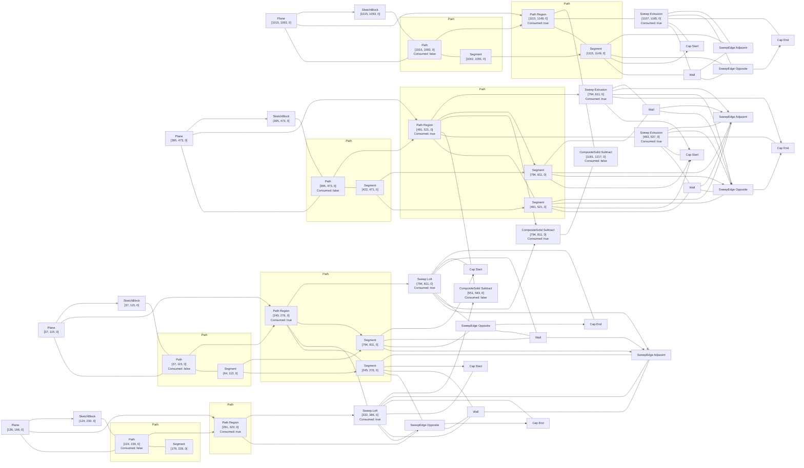

```mermaid
flowchart LR
  subgraph path2 [Path]
    2["Path<br>[37, 115, 0]<br>Consumed: false"]
      %% [ProgramBodyItem { index: 0 }, VariableDeclarationDeclaration, VariableDeclarationInit]
    3["Segment<br>[64, 113, 0]"]
      %% [ProgramBodyItem { index: 0 }, VariableDeclarationDeclaration, VariableDeclarationInit, SketchBlockBody, SketchBlockBodyItem { index: 0 }, VariableDeclarationDeclaration, VariableDeclarationInit]
  end
  subgraph path5 [Path]
    5["Path<br>[124, 230, 0]<br>Consumed: false"]
      %% [ProgramBodyItem { index: 1 }, VariableDeclarationDeclaration, VariableDeclarationInit]
    6["Segment<br>[179, 228, 0]"]
      %% [ProgramBodyItem { index: 1 }, VariableDeclarationDeclaration, VariableDeclarationInit, SketchBlockBody, SketchBlockBodyItem { index: 0 }, VariableDeclarationDeclaration, VariableDeclarationInit]
  end
  subgraph path7 [Path]
    7["Path Region<br>[245, 276, 0]<br>Consumed: true"]
      %% [ProgramBodyItem { index: 2 }, VariableDeclarationDeclaration, VariableDeclarationInit]
    8["Segment<br>[245, 276, 0]"]
      %% [ProgramBodyItem { index: 2 }, VariableDeclarationDeclaration, VariableDeclarationInit]
    29["Segment<br>[794, 811, 0]"]
      %% [ProgramBodyItem { index: 10 }, VariableDeclarationDeclaration, VariableDeclarationInit, PipeBodyItem { index: 0 }, MemberExpressionObject]
  end
  subgraph path9 [Path]
    9["Path Region<br>[291, 322, 0]<br>Consumed: true"]
      %% [ProgramBodyItem { index: 3 }, VariableDeclarationDeclaration, VariableDeclarationInit]
  end
  subgraph path17 [Path]
    17["Path<br>[395, 473, 0]<br>Consumed: false"]
      %% [ProgramBodyItem { index: 5 }, VariableDeclarationDeclaration, VariableDeclarationInit]
    18["Segment<br>[422, 471, 0]"]
      %% [ProgramBodyItem { index: 5 }, VariableDeclarationDeclaration, VariableDeclarationInit, SketchBlockBody, SketchBlockBodyItem { index: 0 }, VariableDeclarationDeclaration, VariableDeclarationInit]
  end
  subgraph path19 [Path]
    19["Path Region<br>[491, 521, 0]<br>Consumed: true"]
      %% [ProgramBodyItem { index: 6 }, VariableDeclarationDeclaration, VariableDeclarationInit, CallKwUnlabeledArg]
    20["Segment<br>[491, 521, 0]"]
      %% [ProgramBodyItem { index: 6 }, VariableDeclarationDeclaration, VariableDeclarationInit, CallKwUnlabeledArg]
    35["Segment<br>[794, 811, 0]"]
      %% [ProgramBodyItem { index: 10 }, VariableDeclarationDeclaration, VariableDeclarationInit, PipeBodyItem { index: 0 }, MemberExpressionObject]
  end
  subgraph path39 [Path]
    39["Path<br>[1015, 1093, 0]<br>Consumed: false"]
      %% [ProgramBodyItem { index: 12 }, VariableDeclarationDeclaration, VariableDeclarationInit]
    40["Segment<br>[1042, 1091, 0]"]
      %% [ProgramBodyItem { index: 12 }, VariableDeclarationDeclaration, VariableDeclarationInit, SketchBlockBody, SketchBlockBodyItem { index: 0 }, VariableDeclarationDeclaration, VariableDeclarationInit]
  end
  subgraph path41 [Path]
    41["Path Region<br>[1115, 1149, 0]<br>Consumed: true"]
      %% [ProgramBodyItem { index: 13 }, VariableDeclarationDeclaration, VariableDeclarationInit, CallKwUnlabeledArg]
    42["Segment<br>[1115, 1149, 0]"]
      %% [ProgramBodyItem { index: 13 }, VariableDeclarationDeclaration, VariableDeclarationInit, CallKwUnlabeledArg]
  end
  1["Plane<br>[37, 115, 0]"]
    %% [ProgramBodyItem { index: 0 }, VariableDeclarationDeclaration, VariableDeclarationInit]
  4["Plane<br>[136, 166, 0]"]
    %% [ProgramBodyItem { index: 1 }, VariableDeclarationDeclaration, VariableDeclarationInit, SketchBlockArgs]
  10["SweepEdge Opposite"]
  11["Sweep Loft<br>[332, 386, 0]<br>Consumed: true"]
    %% [ProgramBodyItem { index: 4 }, VariableDeclarationDeclaration, VariableDeclarationInit]
  12[Wall]
    %% face_code_ref=Missing NodePath
  13["Cap Start"]
    %% face_code_ref=Missing NodePath
  14["Cap End"]
    %% face_code_ref=Missing NodePath
  15["SweepEdge Adjacent"]
  16["Plane<br>[395, 473, 0]"]
    %% [ProgramBodyItem { index: 5 }, VariableDeclarationDeclaration, VariableDeclarationInit]
  21["Sweep Extrusion<br>[483, 537, 0]<br>Consumed: true"]
    %% [ProgramBodyItem { index: 6 }, VariableDeclarationDeclaration, VariableDeclarationInit]
  22[Wall]
    %% face_code_ref=Missing NodePath
  23["Cap Start"]
    %% face_code_ref=Missing NodePath
  24["Cap End"]
    %% face_code_ref=Missing NodePath
  25["SweepEdge Opposite"]
  26["SweepEdge Adjacent"]
  27["CompositeSolid Subtract<br>[551, 583, 0]<br>Consumed: false"]
    %% [ProgramBodyItem { index: 7 }, VariableDeclarationDeclaration, VariableDeclarationInit, MemberExpressionObject]
  28["CompositeSolid Subtract<br>[794, 811, 0]<br>Consumed: true"]
    %% [ProgramBodyItem { index: 10 }, VariableDeclarationDeclaration, VariableDeclarationInit, PipeBodyItem { index: 0 }, MemberExpressionObject]
  30["SweepEdge Opposite"]
  31["Sweep Loft<br>[794, 811, 0]<br>Consumed: true"]
    %% [ProgramBodyItem { index: 10 }, VariableDeclarationDeclaration, VariableDeclarationInit, PipeBodyItem { index: 0 }, MemberExpressionObject]
  32[Wall]
    %% face_code_ref=Missing NodePath
  33["Cap Start"]
    %% face_code_ref=Missing NodePath
  34["Cap End"]
    %% face_code_ref=Missing NodePath
  36["Sweep Extrusion<br>[794, 811, 0]<br>Consumed: true"]
    %% [ProgramBodyItem { index: 10 }, VariableDeclarationDeclaration, VariableDeclarationInit, PipeBodyItem { index: 0 }, MemberExpressionObject]
  37[Wall]
    %% face_code_ref=Missing NodePath
  38["Plane<br>[1015, 1093, 0]"]
    %% [ProgramBodyItem { index: 12 }, VariableDeclarationDeclaration, VariableDeclarationInit]
  43["Sweep Extrusion<br>[1107, 1165, 0]<br>Consumed: true"]
    %% [ProgramBodyItem { index: 13 }, VariableDeclarationDeclaration, VariableDeclarationInit]
  44[Wall]
    %% face_code_ref=Missing NodePath
  45["Cap Start"]
    %% face_code_ref=Missing NodePath
  46["Cap End"]
    %% face_code_ref=Missing NodePath
  47["SweepEdge Opposite"]
  48["SweepEdge Adjacent"]
  49["CompositeSolid Subtract<br>[1181, 1217, 0]<br>Consumed: false"]
    %% [ProgramBodyItem { index: 14 }, VariableDeclarationDeclaration, VariableDeclarationInit, MemberExpressionObject]
  50["SketchBlock<br>[37, 115, 0]"]
    %% [ProgramBodyItem { index: 0 }, VariableDeclarationDeclaration, VariableDeclarationInit]
  51["SketchBlock<br>[124, 230, 0]"]
    %% [ProgramBodyItem { index: 1 }, VariableDeclarationDeclaration, VariableDeclarationInit]
  52["SketchBlock<br>[395, 473, 0]"]
    %% [ProgramBodyItem { index: 5 }, VariableDeclarationDeclaration, VariableDeclarationInit]
  53["SketchBlock<br>[1015, 1093, 0]"]
    %% [ProgramBodyItem { index: 12 }, VariableDeclarationDeclaration, VariableDeclarationInit]
  1 --- 2
  1 <--x 7
  1 <--x 50
  2 --- 3
  2 <--x 7
  50 --- 2
  3 <--x 8
  3 <--x 29
  4 --- 5
  4 <--x 9
  4 <--x 51
  5 --- 6
  5 <--x 9
  51 --- 5
  7 --- 8
  7 ---- 11
  7 <--x 29
  7 <---x 31
  8 --- 10
  8 --- 12
  8 x--> 13
  8 --- 15
  9 x--> 10
  9 x---> 11
  11 --- 10
  10 --- 12
  10 x--> 14
  11 --- 12
  11 --- 13
  11 --- 14
  11 --- 15
  11 <--x 27
  12 --- 15
  29 <--x 15
  31 <--x 15
  32 <--x 15
  16 --- 17
  16 <--x 19
  16 <--x 52
  17 --- 18
  17 <--x 19
  52 --- 17
  18 <--x 20
  18 <--x 35
  19 --- 20
  19 ---- 21
  19 --- 27
  19 <--x 28
  19 <--x 35
  19 <---x 36
  20 --- 22
  20 x--> 23
  20 --- 25
  20 --- 26
  21 --- 22
  21 --- 23
  21 --- 24
  21 --- 25
  21 --- 26
  22 --- 25
  22 --- 26
  35 <--x 23
  36 <--x 23
  25 <--x 24
  36 <--x 24
  35 <--x 25
  36 <--x 25
  37 <--x 25
  35 <--x 26
  36 <--x 26
  37 <--x 26
  31 x--> 28
  28 --- 49
  29 --- 30
  29 --- 32
  29 x--> 33
  31 --- 30
  30 --- 32
  30 x--> 34
  31 --- 32
  31 --- 33
  31 --- 34
  35 --- 37
  36 --- 37
  38 --- 39
  38 <--x 41
  38 <--x 53
  39 --- 40
  39 <--x 41
  53 --- 39
  40 <--x 42
  41 --- 42
  41 ---- 43
  41 --- 49
  42 --- 44
  42 x--> 45
  42 --- 47
  42 --- 48
  43 --- 44
  43 --- 45
  43 --- 46
  43 --- 47
  43 --- 48
  44 --- 47
  44 --- 48
  47 <--x 46
```
