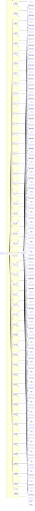

```mermaid
flowchart LR
  subgraph path2 [Path]
    2["Path<br>[754, 790, 0]"]
    3["Segment<br>[930, 994, 0]"]
    4["Segment<br>[930, 994, 0]"]
    5["Segment<br>[930, 994, 0]"]
    6["Segment<br>[930, 994, 0]"]
    7["Segment<br>[930, 994, 0]"]
    8["Segment<br>[930, 994, 0]"]
    9["Segment<br>[930, 994, 0]"]
    10["Segment<br>[930, 994, 0]"]
    11["Segment<br>[930, 994, 0]"]
    12["Segment<br>[930, 994, 0]"]
    13["Segment<br>[930, 994, 0]"]
    14["Segment<br>[930, 994, 0]"]
    15["Segment<br>[930, 994, 0]"]
    16["Segment<br>[930, 994, 0]"]
    17["Segment<br>[930, 994, 0]"]
    18["Segment<br>[930, 994, 0]"]
    19["Segment<br>[930, 994, 0]"]
    20["Segment<br>[930, 994, 0]"]
    21["Segment<br>[930, 994, 0]"]
    22["Segment<br>[930, 994, 0]"]
    23["Segment<br>[930, 994, 0]"]
    24["Segment<br>[930, 994, 0]"]
    25["Segment<br>[930, 994, 0]"]
    26["Segment<br>[930, 994, 0]"]
    27["Segment<br>[930, 994, 0]"]
    28["Segment<br>[930, 994, 0]"]
    29["Segment<br>[930, 994, 0]"]
    30["Segment<br>[930, 994, 0]"]
    31["Segment<br>[930, 994, 0]"]
    32["Segment<br>[930, 994, 0]"]
    33["Segment<br>[930, 994, 0]"]
    34["Segment<br>[930, 994, 0]"]
    35["Segment<br>[930, 994, 0]"]
    36["Segment<br>[930, 994, 0]"]
    37["Segment<br>[930, 994, 0]"]
    38["Segment<br>[930, 994, 0]"]
    39["Segment<br>[930, 994, 0]"]
    40["Segment<br>[930, 994, 0]"]
    41["Segment<br>[930, 994, 0]"]
    42["Segment<br>[930, 994, 0]"]
    43["Segment<br>[930, 994, 0]"]
    44["Segment<br>[930, 994, 0]"]
    45["Segment<br>[930, 994, 0]"]
    46["Segment<br>[930, 994, 0]"]
    47["Segment<br>[930, 994, 0]"]
    48["Segment<br>[930, 994, 0]"]
    49["Segment<br>[930, 994, 0]"]
    50["Segment<br>[930, 994, 0]"]
    51["Segment<br>[930, 994, 0]"]
    52["Segment<br>[1058, 1076, 0]"]
    53[Solid2d]
  end
  1["Plane<br>[731, 748, 0]"]
  54["Sweep Extrusion<br>[1130, 1168, 0]"]
  55[Wall]
  56[Wall]
  57[Wall]
  58[Wall]
  59[Wall]
  60[Wall]
  61[Wall]
  62[Wall]
  63[Wall]
  64[Wall]
  65[Wall]
  66[Wall]
  67[Wall]
  68[Wall]
  69[Wall]
  70[Wall]
  71[Wall]
  72[Wall]
  73[Wall]
  74[Wall]
  75[Wall]
  76[Wall]
  77[Wall]
  78[Wall]
  79[Wall]
  80[Wall]
  81[Wall]
  82[Wall]
  83[Wall]
  84[Wall]
  85[Wall]
  86[Wall]
  87[Wall]
  88[Wall]
  89[Wall]
  90[Wall]
  91[Wall]
  92[Wall]
  93[Wall]
  94[Wall]
  95[Wall]
  96[Wall]
  97[Wall]
  98[Wall]
  99[Wall]
  100[Wall]
  101[Wall]
  102[Wall]
  103[Wall]
  104[Wall]
  105["Cap Start"]
  106["Cap End"]
  107["SweepEdge Opposite"]
  108["SweepEdge Adjacent"]
  109["SweepEdge Opposite"]
  110["SweepEdge Adjacent"]
  111["SweepEdge Opposite"]
  112["SweepEdge Adjacent"]
  113["SweepEdge Opposite"]
  114["SweepEdge Adjacent"]
  115["SweepEdge Opposite"]
  116["SweepEdge Adjacent"]
  117["SweepEdge Opposite"]
  118["SweepEdge Adjacent"]
  119["SweepEdge Opposite"]
  120["SweepEdge Adjacent"]
  121["SweepEdge Opposite"]
  122["SweepEdge Adjacent"]
  123["SweepEdge Opposite"]
  124["SweepEdge Adjacent"]
  125["SweepEdge Opposite"]
  126["SweepEdge Adjacent"]
  127["SweepEdge Opposite"]
  128["SweepEdge Adjacent"]
  129["SweepEdge Opposite"]
  130["SweepEdge Adjacent"]
  131["SweepEdge Opposite"]
  132["SweepEdge Adjacent"]
  133["SweepEdge Opposite"]
  134["SweepEdge Adjacent"]
  135["SweepEdge Opposite"]
  136["SweepEdge Adjacent"]
  137["SweepEdge Opposite"]
  138["SweepEdge Adjacent"]
  139["SweepEdge Opposite"]
  140["SweepEdge Adjacent"]
  141["SweepEdge Opposite"]
  142["SweepEdge Adjacent"]
  143["SweepEdge Opposite"]
  144["SweepEdge Adjacent"]
  145["SweepEdge Opposite"]
  146["SweepEdge Adjacent"]
  147["SweepEdge Opposite"]
  148["SweepEdge Adjacent"]
  149["SweepEdge Opposite"]
  150["SweepEdge Adjacent"]
  151["SweepEdge Opposite"]
  152["SweepEdge Adjacent"]
  153["SweepEdge Opposite"]
  154["SweepEdge Adjacent"]
  155["SweepEdge Opposite"]
  156["SweepEdge Adjacent"]
  157["SweepEdge Opposite"]
  158["SweepEdge Adjacent"]
  159["SweepEdge Opposite"]
  160["SweepEdge Adjacent"]
  161["SweepEdge Opposite"]
  162["SweepEdge Adjacent"]
  163["SweepEdge Opposite"]
  164["SweepEdge Adjacent"]
  165["SweepEdge Opposite"]
  166["SweepEdge Adjacent"]
  167["SweepEdge Opposite"]
  168["SweepEdge Adjacent"]
  169["SweepEdge Opposite"]
  170["SweepEdge Adjacent"]
  171["SweepEdge Opposite"]
  172["SweepEdge Adjacent"]
  173["SweepEdge Opposite"]
  174["SweepEdge Adjacent"]
  175["SweepEdge Opposite"]
  176["SweepEdge Adjacent"]
  177["SweepEdge Opposite"]
  178["SweepEdge Adjacent"]
  179["SweepEdge Opposite"]
  180["SweepEdge Adjacent"]
  181["SweepEdge Opposite"]
  182["SweepEdge Adjacent"]
  183["SweepEdge Opposite"]
  184["SweepEdge Adjacent"]
  185["SweepEdge Opposite"]
  186["SweepEdge Adjacent"]
  187["SweepEdge Opposite"]
  188["SweepEdge Adjacent"]
  189["SweepEdge Opposite"]
  190["SweepEdge Adjacent"]
  191["SweepEdge Opposite"]
  192["SweepEdge Adjacent"]
  193["SweepEdge Opposite"]
  194["SweepEdge Adjacent"]
  195["SweepEdge Opposite"]
  196["SweepEdge Adjacent"]
  197["SweepEdge Opposite"]
  198["SweepEdge Adjacent"]
  199["SweepEdge Opposite"]
  200["SweepEdge Adjacent"]
  201["SweepEdge Opposite"]
  202["SweepEdge Adjacent"]
  203["SweepEdge Opposite"]
  204["SweepEdge Adjacent"]
  205["SweepEdge Opposite"]
  206["SweepEdge Adjacent"]
  1 --- 2
  2 --- 3
  2 --- 4
  2 --- 5
  2 --- 6
  2 --- 7
  2 --- 8
  2 --- 9
  2 --- 10
  2 --- 11
  2 --- 12
  2 --- 13
  2 --- 14
  2 --- 15
  2 --- 16
  2 --- 17
  2 --- 18
  2 --- 19
  2 --- 20
  2 --- 21
  2 --- 22
  2 --- 23
  2 --- 24
  2 --- 25
  2 --- 26
  2 --- 27
  2 --- 28
  2 --- 29
  2 --- 30
  2 --- 31
  2 --- 32
  2 --- 33
  2 --- 34
  2 --- 35
  2 --- 36
  2 --- 37
  2 --- 38
  2 --- 39
  2 --- 40
  2 --- 41
  2 --- 42
  2 --- 43
  2 --- 44
  2 --- 45
  2 --- 46
  2 --- 47
  2 --- 48
  2 --- 49
  2 --- 50
  2 --- 51
  2 --- 52
  2 ---- 54
  2 --- 53
  3 --- 55
  3 --- 107
  3 --- 108
  4 --- 56
  4 --- 109
  4 --- 110
  5 --- 57
  5 --- 111
  5 --- 112
  6 --- 58
  6 --- 113
  6 --- 114
  7 --- 59
  7 --- 115
  7 --- 116
  8 --- 60
  8 --- 117
  8 --- 118
  9 --- 61
  9 --- 119
  9 --- 120
  10 --- 62
  10 --- 121
  10 --- 122
  11 --- 63
  11 --- 123
  11 --- 124
  12 --- 64
  12 --- 125
  12 --- 126
  13 --- 65
  13 --- 127
  13 --- 128
  14 --- 66
  14 --- 129
  14 --- 130
  15 --- 67
  15 --- 131
  15 --- 132
  16 --- 68
  16 --- 133
  16 --- 134
  17 --- 69
  17 --- 135
  17 --- 136
  18 --- 70
  18 --- 137
  18 --- 138
  19 --- 71
  19 --- 139
  19 --- 140
  20 --- 72
  20 --- 141
  20 --- 142
  21 --- 73
  21 --- 143
  21 --- 144
  22 --- 74
  22 --- 145
  22 --- 146
  23 --- 75
  23 --- 147
  23 --- 148
  24 --- 76
  24 --- 149
  24 --- 150
  25 --- 77
  25 --- 151
  25 --- 152
  26 --- 78
  26 --- 153
  26 --- 154
  27 --- 79
  27 --- 155
  27 --- 156
  28 --- 80
  28 --- 157
  28 --- 158
  29 --- 81
  29 --- 159
  29 --- 160
  30 --- 82
  30 --- 161
  30 --- 162
  31 --- 83
  31 --- 163
  31 --- 164
  32 --- 84
  32 --- 165
  32 --- 166
  33 --- 85
  33 --- 167
  33 --- 168
  34 --- 86
  34 --- 169
  34 --- 170
  35 --- 87
  35 --- 171
  35 --- 172
  36 --- 88
  36 --- 173
  36 --- 174
  37 --- 89
  37 --- 175
  37 --- 176
  38 --- 90
  38 --- 177
  38 --- 178
  39 --- 91
  39 --- 179
  39 --- 180
  40 --- 92
  40 --- 181
  40 --- 182
  41 --- 93
  41 --- 183
  41 --- 184
  42 --- 94
  42 --- 185
  42 --- 186
  43 --- 95
  43 --- 187
  43 --- 188
  44 --- 96
  44 --- 189
  44 --- 190
  45 --- 97
  45 --- 191
  45 --- 192
  46 --- 98
  46 --- 193
  46 --- 194
  47 --- 99
  47 --- 195
  47 --- 196
  48 --- 100
  48 --- 197
  48 --- 198
  49 --- 101
  49 --- 199
  49 --- 200
  50 --- 102
  50 --- 201
  50 --- 202
  51 --- 103
  51 --- 203
  51 --- 204
  52 --- 104
  52 --- 205
  52 --- 206
  54 --- 55
  54 --- 56
  54 --- 57
  54 --- 58
  54 --- 59
  54 --- 60
  54 --- 61
  54 --- 62
  54 --- 63
  54 --- 64
  54 --- 65
  54 --- 66
  54 --- 67
  54 --- 68
  54 --- 69
  54 --- 70
  54 --- 71
  54 --- 72
  54 --- 73
  54 --- 74
  54 --- 75
  54 --- 76
  54 --- 77
  54 --- 78
  54 --- 79
  54 --- 80
  54 --- 81
  54 --- 82
  54 --- 83
  54 --- 84
  54 --- 85
  54 --- 86
  54 --- 87
  54 --- 88
  54 --- 89
  54 --- 90
  54 --- 91
  54 --- 92
  54 --- 93
  54 --- 94
  54 --- 95
  54 --- 96
  54 --- 97
  54 --- 98
  54 --- 99
  54 --- 100
  54 --- 101
  54 --- 102
  54 --- 103
  54 --- 104
  54 --- 105
  54 --- 106
  54 --- 107
  54 --- 108
  54 --- 109
  54 --- 110
  54 --- 111
  54 --- 112
  54 --- 113
  54 --- 114
  54 --- 115
  54 --- 116
  54 --- 117
  54 --- 118
  54 --- 119
  54 --- 120
  54 --- 121
  54 --- 122
  54 --- 123
  54 --- 124
  54 --- 125
  54 --- 126
  54 --- 127
  54 --- 128
  54 --- 129
  54 --- 130
  54 --- 131
  54 --- 132
  54 --- 133
  54 --- 134
  54 --- 135
  54 --- 136
  54 --- 137
  54 --- 138
  54 --- 139
  54 --- 140
  54 --- 141
  54 --- 142
  54 --- 143
  54 --- 144
  54 --- 145
  54 --- 146
  54 --- 147
  54 --- 148
  54 --- 149
  54 --- 150
  54 --- 151
  54 --- 152
  54 --- 153
  54 --- 154
  54 --- 155
  54 --- 156
  54 --- 157
  54 --- 158
  54 --- 159
  54 --- 160
  54 --- 161
  54 --- 162
  54 --- 163
  54 --- 164
  54 --- 165
  54 --- 166
  54 --- 167
  54 --- 168
  54 --- 169
  54 --- 170
  54 --- 171
  54 --- 172
  54 --- 173
  54 --- 174
  54 --- 175
  54 --- 176
  54 --- 177
  54 --- 178
  54 --- 179
  54 --- 180
  54 --- 181
  54 --- 182
  54 --- 183
  54 --- 184
  54 --- 185
  54 --- 186
  54 --- 187
  54 --- 188
  54 --- 189
  54 --- 190
  54 --- 191
  54 --- 192
  54 --- 193
  54 --- 194
  54 --- 195
  54 --- 196
  54 --- 197
  54 --- 198
  54 --- 199
  54 --- 200
  54 --- 201
  54 --- 202
  54 --- 203
  54 --- 204
  54 --- 205
  54 --- 206
```
