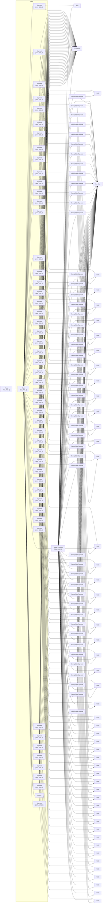

```mermaid
flowchart LR
  subgraph path2 [Path]
    2["Path<br>[754, 790, 0]"]
    3["Segment<br>[944, 1008, 0]"]
    4["Segment<br>[944, 1008, 0]"]
    5["Segment<br>[944, 1008, 0]"]
    6["Segment<br>[944, 1008, 0]"]
    7["Segment<br>[944, 1008, 0]"]
    8["Segment<br>[944, 1008, 0]"]
    9["Segment<br>[944, 1008, 0]"]
    10["Segment<br>[944, 1008, 0]"]
    11["Segment<br>[944, 1008, 0]"]
    12["Segment<br>[944, 1008, 0]"]
    13["Segment<br>[944, 1008, 0]"]
    14["Segment<br>[944, 1008, 0]"]
    15["Segment<br>[944, 1008, 0]"]
    16["Segment<br>[944, 1008, 0]"]
    17["Segment<br>[944, 1008, 0]"]
    18["Segment<br>[944, 1008, 0]"]
    19["Segment<br>[944, 1008, 0]"]
    20["Segment<br>[944, 1008, 0]"]
    21["Segment<br>[944, 1008, 0]"]
    22["Segment<br>[944, 1008, 0]"]
    23["Segment<br>[944, 1008, 0]"]
    24["Segment<br>[944, 1008, 0]"]
    25["Segment<br>[944, 1008, 0]"]
    26["Segment<br>[944, 1008, 0]"]
    27["Segment<br>[944, 1008, 0]"]
    28["Segment<br>[944, 1008, 0]"]
    29["Segment<br>[944, 1008, 0]"]
    30["Segment<br>[944, 1008, 0]"]
    31["Segment<br>[944, 1008, 0]"]
    32["Segment<br>[944, 1008, 0]"]
    33["Segment<br>[944, 1008, 0]"]
    34["Segment<br>[944, 1008, 0]"]
    35["Segment<br>[944, 1008, 0]"]
    36["Segment<br>[944, 1008, 0]"]
    37["Segment<br>[944, 1008, 0]"]
    38["Segment<br>[944, 1008, 0]"]
    39["Segment<br>[944, 1008, 0]"]
    40["Segment<br>[944, 1008, 0]"]
    41["Segment<br>[944, 1008, 0]"]
    42["Segment<br>[944, 1008, 0]"]
    43["Segment<br>[944, 1008, 0]"]
    44["Segment<br>[944, 1008, 0]"]
    45["Segment<br>[944, 1008, 0]"]
    46["Segment<br>[944, 1008, 0]"]
    47["Segment<br>[944, 1008, 0]"]
    48["Segment<br>[944, 1008, 0]"]
    49["Segment<br>[944, 1008, 0]"]
    50["Segment<br>[944, 1008, 0]"]
    51["Segment<br>[944, 1008, 0]"]
    52["Segment<br>[1072, 1090, 0]"]
    53[Solid2d]
  end
  1["Plane<br>[731, 748, 0]"]
  54["Sweep Extrusion<br>[1144, 1182, 0]"]
  55[Wall]
  56[Wall]
  57[Wall]
  58[Wall]
  59[Wall]
  60[Wall]
  61[Wall]
  62[Wall]
  63[Wall]
  64[Wall]
  65[Wall]
  66[Wall]
  67[Wall]
  68[Wall]
  69[Wall]
  70[Wall]
  71[Wall]
  72[Wall]
  73[Wall]
  74[Wall]
  75[Wall]
  76[Wall]
  77[Wall]
  78[Wall]
  79[Wall]
  80[Wall]
  81[Wall]
  82[Wall]
  83[Wall]
  84[Wall]
  85[Wall]
  86[Wall]
  87[Wall]
  88[Wall]
  89[Wall]
  90[Wall]
  91[Wall]
  92[Wall]
  93[Wall]
  94[Wall]
  95[Wall]
  96[Wall]
  97[Wall]
  98[Wall]
  99[Wall]
  100[Wall]
  101[Wall]
  102[Wall]
  103[Wall]
  104[Wall]
  105["Cap Start"]
  106["Cap End"]
  107["SweepEdge Opposite"]
  108["SweepEdge Opposite"]
  109["SweepEdge Opposite"]
  110["SweepEdge Opposite"]
  111["SweepEdge Opposite"]
  112["SweepEdge Opposite"]
  113["SweepEdge Opposite"]
  114["SweepEdge Opposite"]
  115["SweepEdge Opposite"]
  116["SweepEdge Opposite"]
  117["SweepEdge Opposite"]
  118["SweepEdge Opposite"]
  119["SweepEdge Opposite"]
  120["SweepEdge Opposite"]
  121["SweepEdge Opposite"]
  122["SweepEdge Opposite"]
  123["SweepEdge Opposite"]
  124["SweepEdge Opposite"]
  125["SweepEdge Opposite"]
  126["SweepEdge Opposite"]
  127["SweepEdge Opposite"]
  128["SweepEdge Opposite"]
  129["SweepEdge Opposite"]
  130["SweepEdge Opposite"]
  131["SweepEdge Opposite"]
  132["SweepEdge Opposite"]
  133["SweepEdge Opposite"]
  134["SweepEdge Opposite"]
  135["SweepEdge Opposite"]
  136["SweepEdge Opposite"]
  137["SweepEdge Opposite"]
  138["SweepEdge Opposite"]
  139["SweepEdge Opposite"]
  140["SweepEdge Opposite"]
  141["SweepEdge Opposite"]
  142["SweepEdge Opposite"]
  143["SweepEdge Opposite"]
  144["SweepEdge Opposite"]
  145["SweepEdge Opposite"]
  146["SweepEdge Opposite"]
  147["SweepEdge Opposite"]
  148["SweepEdge Opposite"]
  149["SweepEdge Opposite"]
  150["SweepEdge Opposite"]
  151["SweepEdge Opposite"]
  152["SweepEdge Opposite"]
  153["SweepEdge Opposite"]
  154["SweepEdge Opposite"]
  155["SweepEdge Opposite"]
  1 --- 2
  2 --- 3
  2 --- 4
  2 --- 5
  2 --- 6
  2 --- 7
  2 --- 8
  2 --- 9
  2 --- 10
  2 --- 11
  2 --- 12
  2 --- 13
  2 --- 14
  2 --- 15
  2 --- 16
  2 --- 17
  2 --- 18
  2 --- 19
  2 --- 20
  2 --- 21
  2 --- 22
  2 --- 23
  2 --- 24
  2 --- 25
  2 --- 26
  2 --- 27
  2 --- 28
  2 --- 29
  2 --- 30
  2 --- 31
  2 --- 32
  2 --- 33
  2 --- 34
  2 --- 35
  2 --- 36
  2 --- 37
  2 --- 38
  2 --- 39
  2 --- 40
  2 --- 41
  2 --- 42
  2 --- 43
  2 --- 44
  2 --- 45
  2 --- 46
  2 --- 47
  2 --- 48
  2 --- 49
  2 --- 50
  2 --- 51
  2 --- 52
  2 ---- 54
  2 --- 53
  3 --- 55
  3 x--> 105
  4 --- 56
  4 --- 107
  4 x--> 105
  5 --- 57
  5 --- 108
  5 x--> 105
  6 --- 58
  6 --- 109
  6 x--> 105
  7 --- 59
  7 --- 110
  7 x--> 105
  8 --- 60
  8 --- 111
  8 x--> 105
  9 --- 61
  9 --- 112
  9 x--> 105
  10 --- 62
  10 --- 113
  10 x--> 105
  11 --- 63
  11 --- 114
  11 x--> 105
  12 --- 64
  12 --- 115
  12 x--> 105
  13 --- 65
  13 --- 116
  13 x--> 105
  14 --- 66
  14 --- 117
  14 x--> 105
  15 --- 67
  15 --- 118
  15 x--> 105
  16 --- 68
  16 --- 119
  16 x--> 105
  17 --- 69
  17 --- 120
  17 x--> 105
  18 --- 70
  18 --- 121
  18 x--> 105
  19 --- 71
  19 --- 122
  19 x--> 105
  20 --- 72
  20 --- 123
  20 x--> 105
  21 --- 73
  21 --- 124
  21 x--> 105
  22 --- 74
  22 --- 125
  22 x--> 105
  23 --- 75
  23 --- 126
  23 x--> 105
  24 --- 76
  24 --- 127
  24 x--> 105
  25 --- 77
  25 --- 128
  25 x--> 105
  26 --- 78
  26 --- 129
  26 x--> 105
  27 --- 79
  27 --- 130
  27 x--> 105
  28 --- 80
  28 --- 131
  28 x--> 105
  29 --- 81
  29 --- 132
  29 x--> 105
  30 --- 82
  30 --- 133
  30 x--> 105
  31 --- 83
  31 --- 134
  31 x--> 105
  32 --- 84
  32 --- 135
  32 x--> 105
  33 --- 85
  33 --- 136
  33 x--> 105
  34 --- 86
  34 --- 137
  34 x--> 105
  35 --- 87
  35 --- 138
  35 x--> 105
  36 --- 88
  36 --- 139
  36 x--> 105
  37 --- 89
  37 --- 140
  37 x--> 105
  38 --- 90
  38 --- 141
  38 x--> 105
  39 --- 91
  39 --- 142
  39 x--> 105
  40 --- 92
  40 --- 143
  40 x--> 105
  41 --- 93
  41 --- 144
  41 x--> 105
  42 --- 94
  42 --- 145
  42 x--> 105
  43 --- 95
  43 --- 146
  43 x--> 105
  44 --- 96
  44 --- 147
  44 x--> 105
  45 --- 97
  45 --- 148
  45 x--> 105
  46 --- 98
  46 --- 149
  46 x--> 105
  47 --- 99
  47 --- 150
  47 x--> 105
  48 --- 100
  48 --- 151
  48 x--> 105
  49 --- 101
  49 --- 152
  49 x--> 105
  50 --- 102
  50 --- 153
  50 x--> 105
  51 --- 103
  51 --- 154
  51 x--> 105
  52 --- 104
  52 --- 155
  52 x--> 105
  54 --- 55
  54 --- 56
  54 --- 57
  54 --- 58
  54 --- 59
  54 --- 60
  54 --- 61
  54 --- 62
  54 --- 63
  54 --- 64
  54 --- 65
  54 --- 66
  54 --- 67
  54 --- 68
  54 --- 69
  54 --- 70
  54 --- 71
  54 --- 72
  54 --- 73
  54 --- 74
  54 --- 75
  54 --- 76
  54 --- 77
  54 --- 78
  54 --- 79
  54 --- 80
  54 --- 81
  54 --- 82
  54 --- 83
  54 --- 84
  54 --- 85
  54 --- 86
  54 --- 87
  54 --- 88
  54 --- 89
  54 --- 90
  54 --- 91
  54 --- 92
  54 --- 93
  54 --- 94
  54 --- 95
  54 --- 96
  54 --- 97
  54 --- 98
  54 --- 99
  54 --- 100
  54 --- 101
  54 --- 102
  54 --- 103
  54 --- 104
  54 --- 105
  54 --- 106
  54 --- 107
  54 --- 108
  54 --- 109
  54 --- 110
  54 --- 111
  54 --- 112
  54 --- 113
  54 --- 114
  54 --- 115
  54 --- 116
  54 --- 117
  54 --- 118
  54 --- 119
  54 --- 120
  54 --- 121
  54 --- 122
  54 --- 123
  54 --- 124
  54 --- 125
  54 --- 126
  54 --- 127
  54 --- 128
  54 --- 129
  54 --- 130
  54 --- 131
  54 --- 132
  54 --- 133
  54 --- 134
  54 --- 135
  54 --- 136
  54 --- 137
  54 --- 138
  54 --- 139
  54 --- 140
  54 --- 141
  54 --- 142
  54 --- 143
  54 --- 144
  54 --- 145
  54 --- 146
  54 --- 147
  54 --- 148
  54 --- 149
  54 --- 150
  54 --- 151
  54 --- 152
  54 --- 153
  54 --- 154
  54 --- 155
  107 <--x 56
  107 <--x 106
  108 <--x 57
  108 <--x 106
  109 <--x 58
  109 <--x 106
  110 <--x 59
  110 <--x 106
  111 <--x 60
  111 <--x 106
  112 <--x 61
  112 <--x 106
  113 <--x 62
  113 <--x 106
  114 <--x 63
  114 <--x 106
  115 <--x 64
  115 <--x 106
  116 <--x 65
  116 <--x 106
  117 <--x 66
  117 <--x 106
  118 <--x 67
  118 <--x 106
  119 <--x 68
  119 <--x 106
  120 <--x 69
  120 <--x 106
  121 <--x 70
  121 <--x 106
  122 <--x 71
  122 <--x 106
  123 <--x 72
  123 <--x 106
  124 <--x 73
  124 <--x 106
  125 <--x 74
  125 <--x 106
  126 <--x 75
  126 <--x 106
  127 <--x 76
  127 <--x 106
  128 <--x 77
  128 <--x 106
  129 <--x 78
  129 <--x 106
  130 <--x 79
  130 <--x 106
  131 <--x 80
  131 <--x 106
  132 <--x 81
  132 <--x 106
  133 <--x 82
  133 <--x 106
  134 <--x 83
  134 <--x 106
  135 <--x 84
  135 <--x 106
  136 <--x 85
  136 <--x 106
  137 <--x 86
  137 <--x 106
  138 <--x 87
  138 <--x 106
  139 <--x 88
  139 <--x 106
  140 <--x 89
  140 <--x 106
  141 <--x 90
  141 <--x 106
  142 <--x 91
  142 <--x 106
  143 <--x 92
  143 <--x 106
  144 <--x 93
  144 <--x 106
  145 <--x 94
  145 <--x 106
  146 <--x 95
  146 <--x 106
  147 <--x 96
  147 <--x 106
  148 <--x 97
  148 <--x 106
  149 <--x 98
  149 <--x 106
  150 <--x 99
  150 <--x 106
  151 <--x 100
  151 <--x 106
  152 <--x 101
  152 <--x 106
  153 <--x 102
  153 <--x 106
  154 <--x 103
  154 <--x 106
  155 <--x 104
  155 <--x 106
```
