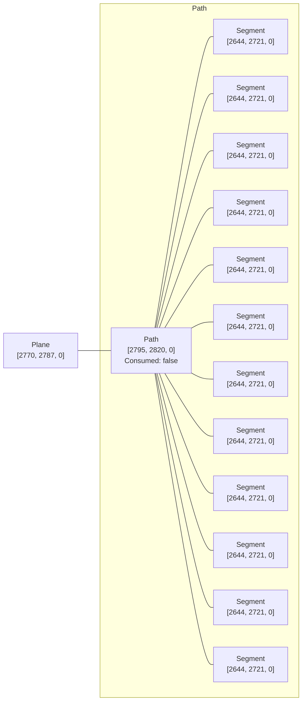

```mermaid
flowchart LR
  subgraph path2 [Path]
    2["Path<br>[2795, 2820, 0]<br>Consumed: false"]
      %% [ProgramBodyItem { index: 18 }, VariableDeclarationDeclaration, VariableDeclarationInit, FunctionExpressionBody, FunctionExpressionBodyItem { index: 0 }, VariableDeclarationDeclaration, VariableDeclarationInit, PipeBodyItem { index: 1 }]
    3["Segment<br>[2644, 2721, 0]"]
      %% [ProgramBodyItem { index: 17 }, VariableDeclarationDeclaration, VariableDeclarationInit, FunctionExpressionBody, FunctionExpressionBodyItem { index: 0 }, ReturnStatementArg, IfExpressionElse, ProgramBodyItem { index: 0 }, ExpressionStatementExpr, PipeBodyItem { index: 1 }, CallKwArg { index: 0 }]
    4["Segment<br>[2644, 2721, 0]"]
      %% [ProgramBodyItem { index: 17 }, VariableDeclarationDeclaration, VariableDeclarationInit, FunctionExpressionBody, FunctionExpressionBodyItem { index: 0 }, ReturnStatementArg, IfExpressionElse, ProgramBodyItem { index: 0 }, ExpressionStatementExpr, PipeBodyItem { index: 1 }, CallKwArg { index: 0 }]
    5["Segment<br>[2644, 2721, 0]"]
      %% [ProgramBodyItem { index: 17 }, VariableDeclarationDeclaration, VariableDeclarationInit, FunctionExpressionBody, FunctionExpressionBodyItem { index: 0 }, ReturnStatementArg, IfExpressionElse, ProgramBodyItem { index: 0 }, ExpressionStatementExpr, PipeBodyItem { index: 1 }, CallKwArg { index: 0 }]
    6["Segment<br>[2644, 2721, 0]"]
      %% [ProgramBodyItem { index: 17 }, VariableDeclarationDeclaration, VariableDeclarationInit, FunctionExpressionBody, FunctionExpressionBodyItem { index: 0 }, ReturnStatementArg, IfExpressionElse, ProgramBodyItem { index: 0 }, ExpressionStatementExpr, PipeBodyItem { index: 1 }, CallKwArg { index: 0 }]
    7["Segment<br>[2644, 2721, 0]"]
      %% [ProgramBodyItem { index: 17 }, VariableDeclarationDeclaration, VariableDeclarationInit, FunctionExpressionBody, FunctionExpressionBodyItem { index: 0 }, ReturnStatementArg, IfExpressionElse, ProgramBodyItem { index: 0 }, ExpressionStatementExpr, PipeBodyItem { index: 1 }, CallKwArg { index: 0 }]
    8["Segment<br>[2644, 2721, 0]"]
      %% [ProgramBodyItem { index: 17 }, VariableDeclarationDeclaration, VariableDeclarationInit, FunctionExpressionBody, FunctionExpressionBodyItem { index: 0 }, ReturnStatementArg, IfExpressionElse, ProgramBodyItem { index: 0 }, ExpressionStatementExpr, PipeBodyItem { index: 1 }, CallKwArg { index: 0 }]
    9["Segment<br>[2644, 2721, 0]"]
      %% [ProgramBodyItem { index: 17 }, VariableDeclarationDeclaration, VariableDeclarationInit, FunctionExpressionBody, FunctionExpressionBodyItem { index: 0 }, ReturnStatementArg, IfExpressionElse, ProgramBodyItem { index: 0 }, ExpressionStatementExpr, PipeBodyItem { index: 1 }, CallKwArg { index: 0 }]
    10["Segment<br>[2644, 2721, 0]"]
      %% [ProgramBodyItem { index: 17 }, VariableDeclarationDeclaration, VariableDeclarationInit, FunctionExpressionBody, FunctionExpressionBodyItem { index: 0 }, ReturnStatementArg, IfExpressionElse, ProgramBodyItem { index: 0 }, ExpressionStatementExpr, PipeBodyItem { index: 1 }, CallKwArg { index: 0 }]
    11["Segment<br>[2644, 2721, 0]"]
      %% [ProgramBodyItem { index: 17 }, VariableDeclarationDeclaration, VariableDeclarationInit, FunctionExpressionBody, FunctionExpressionBodyItem { index: 0 }, ReturnStatementArg, IfExpressionElse, ProgramBodyItem { index: 0 }, ExpressionStatementExpr, PipeBodyItem { index: 1 }, CallKwArg { index: 0 }]
    12["Segment<br>[2644, 2721, 0]"]
      %% [ProgramBodyItem { index: 17 }, VariableDeclarationDeclaration, VariableDeclarationInit, FunctionExpressionBody, FunctionExpressionBodyItem { index: 0 }, ReturnStatementArg, IfExpressionElse, ProgramBodyItem { index: 0 }, ExpressionStatementExpr, PipeBodyItem { index: 1 }, CallKwArg { index: 0 }]
    13["Segment<br>[2644, 2721, 0]"]
      %% [ProgramBodyItem { index: 17 }, VariableDeclarationDeclaration, VariableDeclarationInit, FunctionExpressionBody, FunctionExpressionBodyItem { index: 0 }, ReturnStatementArg, IfExpressionElse, ProgramBodyItem { index: 0 }, ExpressionStatementExpr, PipeBodyItem { index: 1 }, CallKwArg { index: 0 }]
    14["Segment<br>[2644, 2721, 0]"]
      %% [ProgramBodyItem { index: 17 }, VariableDeclarationDeclaration, VariableDeclarationInit, FunctionExpressionBody, FunctionExpressionBodyItem { index: 0 }, ReturnStatementArg, IfExpressionElse, ProgramBodyItem { index: 0 }, ExpressionStatementExpr, PipeBodyItem { index: 1 }, CallKwArg { index: 0 }]
  end
  1["Plane<br>[2770, 2787, 0]"]
    %% [ProgramBodyItem { index: 18 }, VariableDeclarationDeclaration, VariableDeclarationInit, FunctionExpressionBody, FunctionExpressionBodyItem { index: 0 }, VariableDeclarationDeclaration, VariableDeclarationInit, PipeBodyItem { index: 0 }]
  1 --- 2
  2 --- 3
  2 --- 4
  2 --- 5
  2 --- 6
  2 --- 7
  2 --- 8
  2 --- 9
  2 --- 10
  2 --- 11
  2 --- 12
  2 --- 13
  2 --- 14
```
