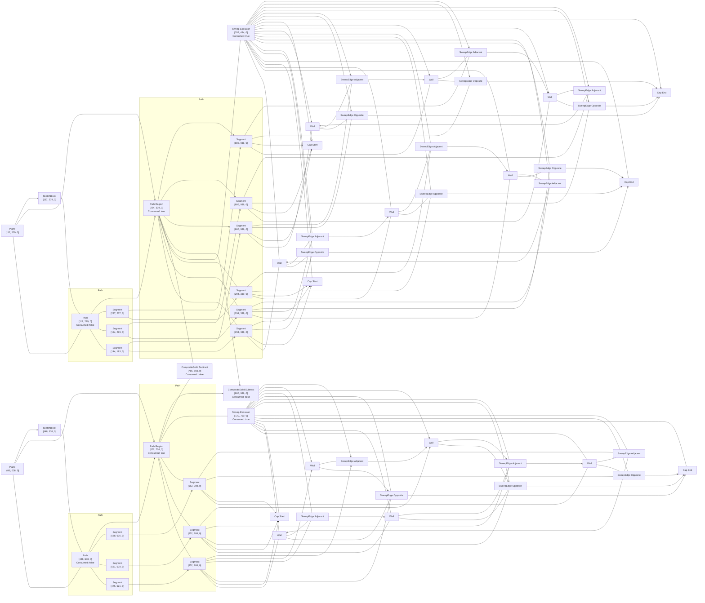

```mermaid
flowchart LR
  subgraph path2 [Path]
    2["Path<br>[117, 279, 0]<br>Consumed: false"]
      %% [ProgramBodyItem { index: 1 }, VariableDeclarationDeclaration, VariableDeclarationInit]
    3["Segment<br>[144, 183, 0]"]
      %% [ProgramBodyItem { index: 1 }, VariableDeclarationDeclaration, VariableDeclarationInit, SketchBlockBody, SketchBlockBodyItem { index: 0 }, VariableDeclarationDeclaration, VariableDeclarationInit]
    4["Segment<br>[194, 229, 0]"]
      %% [ProgramBodyItem { index: 1 }, VariableDeclarationDeclaration, VariableDeclarationInit, SketchBlockBody, SketchBlockBodyItem { index: 1 }, VariableDeclarationDeclaration, VariableDeclarationInit]
    5["Segment<br>[237, 277, 0]"]
      %% [ProgramBodyItem { index: 1 }, VariableDeclarationDeclaration, VariableDeclarationInit, SketchBlockBody, SketchBlockBodyItem { index: 2 }, VariableDeclarationDeclaration, VariableDeclarationInit]
  end
  subgraph path6 [Path]
    6["Path Region<br>[294, 339, 0]<br>Consumed: true"]
      %% [ProgramBodyItem { index: 2 }, VariableDeclarationDeclaration, VariableDeclarationInit]
    7["Segment<br>[294, 339, 0]"]
      %% [ProgramBodyItem { index: 2 }, VariableDeclarationDeclaration, VariableDeclarationInit]
    8["Segment<br>[294, 339, 0]"]
      %% [ProgramBodyItem { index: 2 }, VariableDeclarationDeclaration, VariableDeclarationInit]
    9["Segment<br>[294, 339, 0]"]
      %% [ProgramBodyItem { index: 2 }, VariableDeclarationDeclaration, VariableDeclarationInit]
    45["Segment<br>[805, 936, 0]"]
      %% [ProgramBodyItem { index: 8 }, ExpressionStatementExpr]
    46["Segment<br>[805, 936, 0]"]
      %% [ProgramBodyItem { index: 8 }, ExpressionStatementExpr]
    47["Segment<br>[805, 936, 0]"]
      %% [ProgramBodyItem { index: 8 }, ExpressionStatementExpr]
  end
  subgraph path23 [Path]
    23["Path<br>[448, 638, 0]<br>Consumed: false"]
      %% [ProgramBodyItem { index: 4 }, VariableDeclarationDeclaration, VariableDeclarationInit]
    24["Segment<br>[475, 521, 0]"]
      %% [ProgramBodyItem { index: 4 }, VariableDeclarationDeclaration, VariableDeclarationInit, SketchBlockBody, SketchBlockBodyItem { index: 0 }, VariableDeclarationDeclaration, VariableDeclarationInit]
    25["Segment<br>[531, 578, 0]"]
      %% [ProgramBodyItem { index: 4 }, VariableDeclarationDeclaration, VariableDeclarationInit, SketchBlockBody, SketchBlockBodyItem { index: 1 }, VariableDeclarationDeclaration, VariableDeclarationInit]
    26["Segment<br>[588, 636, 0]"]
      %% [ProgramBodyItem { index: 4 }, VariableDeclarationDeclaration, VariableDeclarationInit, SketchBlockBody, SketchBlockBodyItem { index: 2 }, VariableDeclarationDeclaration, VariableDeclarationInit]
  end
  subgraph path27 [Path]
    27["Path Region<br>[652, 708, 0]<br>Consumed: true"]
      %% [ProgramBodyItem { index: 5 }, VariableDeclarationDeclaration, VariableDeclarationInit]
    28["Segment<br>[652, 708, 0]"]
      %% [ProgramBodyItem { index: 5 }, VariableDeclarationDeclaration, VariableDeclarationInit]
    29["Segment<br>[652, 708, 0]"]
      %% [ProgramBodyItem { index: 5 }, VariableDeclarationDeclaration, VariableDeclarationInit]
    30["Segment<br>[652, 708, 0]"]
      %% [ProgramBodyItem { index: 5 }, VariableDeclarationDeclaration, VariableDeclarationInit]
  end
  1["Plane<br>[117, 279, 0]"]
    %% [ProgramBodyItem { index: 1 }, VariableDeclarationDeclaration, VariableDeclarationInit]
  10["Sweep Extrusion<br>[352, 434, 0]<br>Consumed: true"]
    %% [ProgramBodyItem { index: 3 }, VariableDeclarationDeclaration, VariableDeclarationInit]
  11[Wall]
    %% face_code_ref=Missing NodePath
  12[Wall]
    %% face_code_ref=Missing NodePath
  13[Wall]
    %% face_code_ref=Missing NodePath
  14["Cap Start"]
    %% face_code_ref=Missing NodePath
  15["Cap End"]
    %% face_code_ref=Missing NodePath
  16["SweepEdge Opposite"]
  17["SweepEdge Adjacent"]
  18["SweepEdge Opposite"]
  19["SweepEdge Adjacent"]
  20["SweepEdge Opposite"]
  21["SweepEdge Adjacent"]
  22["Plane<br>[448, 638, 0]"]
    %% [ProgramBodyItem { index: 4 }, VariableDeclarationDeclaration, VariableDeclarationInit]
  31["Sweep Extrusion<br>[720, 750, 0]<br>Consumed: true"]
    %% [ProgramBodyItem { index: 6 }, VariableDeclarationDeclaration, VariableDeclarationInit]
  32[Wall]
    %% face_code_ref=Missing NodePath
  33[Wall]
    %% face_code_ref=Missing NodePath
  34[Wall]
    %% face_code_ref=Missing NodePath
  35["Cap Start"]
    %% face_code_ref=Missing NodePath
  36["Cap End"]
    %% face_code_ref=Missing NodePath
  37["SweepEdge Opposite"]
  38["SweepEdge Adjacent"]
  39["SweepEdge Opposite"]
  40["SweepEdge Adjacent"]
  41["SweepEdge Opposite"]
  42["SweepEdge Adjacent"]
  43["CompositeSolid Subtract<br>[766, 803, 0]<br>Consumed: false"]
    %% [ProgramBodyItem { index: 7 }, VariableDeclarationDeclaration, VariableDeclarationInit]
  44["CompositeSolid Subtract<br>[805, 936, 0]<br>Consumed: false"]
    %% [ProgramBodyItem { index: 8 }, ExpressionStatementExpr]
  48[Wall]
    %% face_code_ref=Missing NodePath
  49[Wall]
    %% face_code_ref=Missing NodePath
  50[Wall]
    %% face_code_ref=Missing NodePath
  51["Cap Start"]
    %% face_code_ref=Missing NodePath
  52["Cap End"]
    %% face_code_ref=Missing NodePath
  53["SweepEdge Opposite"]
  54["SweepEdge Adjacent"]
  55["SweepEdge Opposite"]
  56["SweepEdge Adjacent"]
  57["SweepEdge Opposite"]
  58["SweepEdge Adjacent"]
  59[Wall]
    %% face_code_ref=Missing NodePath
  60[Wall]
    %% face_code_ref=Missing NodePath
  61["SweepEdge Adjacent"]
  62["SketchBlock<br>[117, 279, 0]"]
    %% [ProgramBodyItem { index: 1 }, VariableDeclarationDeclaration, VariableDeclarationInit]
  63["SketchBlock<br>[448, 638, 0]"]
    %% [ProgramBodyItem { index: 4 }, VariableDeclarationDeclaration, VariableDeclarationInit]
  1 --- 2
  1 <--x 6
  1 <--x 62
  2 --- 3
  2 --- 4
  2 --- 5
  2 <--x 6
  62 --- 2
  3 <--x 7
  3 <--x 45
  4 <--x 8
  4 <--x 46
  5 <--x 9
  5 <--x 47
  6 --- 7
  6 --- 8
  6 --- 9
  6 ---- 10
  6 --- 43
  6 <--x 44
  6 <--x 45
  6 <--x 46
  6 <--x 47
  7 --- 11
  7 x--> 14
  7 --- 16
  7 --- 17
  8 --- 12
  8 x--> 14
  8 --- 18
  8 --- 19
  9 --- 13
  9 x--> 14
  9 --- 20
  9 --- 21
  10 --- 11
  10 --- 12
  10 --- 13
  10 --- 14
  10 --- 15
  10 --- 16
  10 --- 17
  10 --- 18
  10 --- 19
  10 --- 20
  10 --- 21
  10 <--x 48
  10 <--x 49
  10 <--x 50
  10 <--x 51
  10 <--x 52
  10 <--x 53
  10 <--x 54
  10 <--x 55
  10 <--x 56
  10 <--x 57
  10 <--x 58
  11 --- 16
  11 --- 17
  19 <--x 11
  12 --- 18
  12 --- 19
  21 <--x 12
  17 <--x 13
  13 --- 20
  13 --- 21
  16 <--x 15
  18 <--x 15
  20 <--x 15
  22 --- 23
  22 <--x 27
  22 <--x 63
  23 --- 24
  23 --- 25
  23 --- 26
  23 <--x 27
  63 --- 23
  24 <--x 28
  25 <--x 29
  26 <--x 30
  27 --- 28
  27 --- 29
  27 --- 30
  27 ---- 31
  27 --- 43
  27 <--x 44
  28 --- 34
  28 x--> 35
  28 --- 41
  28 --- 42
  28 <--x 60
  28 <--x 61
  29 --- 33
  29 x--> 35
  29 --- 39
  29 --- 40
  29 <--x 59
  30 --- 32
  30 x--> 35
  30 --- 37
  30 --- 38
  31 --- 32
  31 --- 33
  31 --- 34
  31 --- 35
  31 --- 36
  31 --- 37
  31 --- 38
  31 --- 39
  31 --- 40
  31 --- 41
  31 --- 42
  31 <--x 59
  31 <--x 60
  31 <--x 61
  32 --- 37
  32 --- 38
  40 <--x 32
  33 --- 39
  33 --- 40
  42 <--x 33
  38 <--x 34
  34 --- 41
  34 --- 42
  37 <--x 36
  39 <--x 36
  41 <--x 36
  59 <--x 39
  59 <--x 40
  60 <--x 41
  45 --- 48
  45 x--> 51
  45 --- 53
  45 --- 54
  46 --- 49
  46 x--> 51
  46 --- 55
  46 --- 56
  47 --- 50
  47 x--> 51
  47 --- 57
  47 --- 58
  48 --- 53
  48 --- 54
  56 <--x 48
  49 --- 55
  49 --- 56
  58 <--x 49
  54 <--x 50
  50 --- 57
  50 --- 58
  53 <--x 52
  55 <--x 52
  57 <--x 52
  61 <--x 59
  60 --- 61
```
