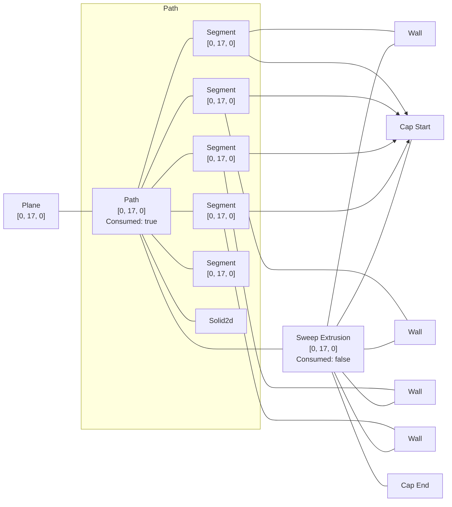

```mermaid
flowchart LR
  subgraph path2 [Path]
    2["Path<br>[0, 17, 0]<br>Consumed: true"]
      %% [ProgramBodyItem { index: 0 }]
    3["Segment<br>[0, 17, 0]"]
      %% [ProgramBodyItem { index: 0 }]
    4["Segment<br>[0, 17, 0]"]
      %% [ProgramBodyItem { index: 0 }]
    5["Segment<br>[0, 17, 0]"]
      %% [ProgramBodyItem { index: 0 }]
    6["Segment<br>[0, 17, 0]"]
      %% [ProgramBodyItem { index: 0 }]
    7["Segment<br>[0, 17, 0]"]
      %% [ProgramBodyItem { index: 0 }]
    8[Solid2d]
  end
  1["Plane<br>[0, 17, 0]"]
    %% [ProgramBodyItem { index: 0 }]
  9["Sweep Extrusion<br>[0, 17, 0]<br>Consumed: false"]
    %% [ProgramBodyItem { index: 0 }]
  10[Wall]
    %% face_code_ref=Missing NodePath
  11[Wall]
    %% face_code_ref=Missing NodePath
  12[Wall]
    %% face_code_ref=Missing NodePath
  13[Wall]
    %% face_code_ref=Missing NodePath
  14["Cap Start"]
    %% face_code_ref=Missing NodePath
  15["Cap End"]
    %% face_code_ref=Missing NodePath
  1 --- 2
  2 --- 3
  2 --- 4
  2 --- 5
  2 --- 6
  2 --- 7
  2 --- 8
  2 ---- 9
  3 --- 10
  3 x--> 14
  4 --- 11
  4 x--> 14
  5 --- 12
  5 x--> 14
  6 --- 13
  6 x--> 14
  9 --- 10
  9 --- 11
  9 --- 12
  9 --- 13
  9 --- 14
  9 --- 15
```
