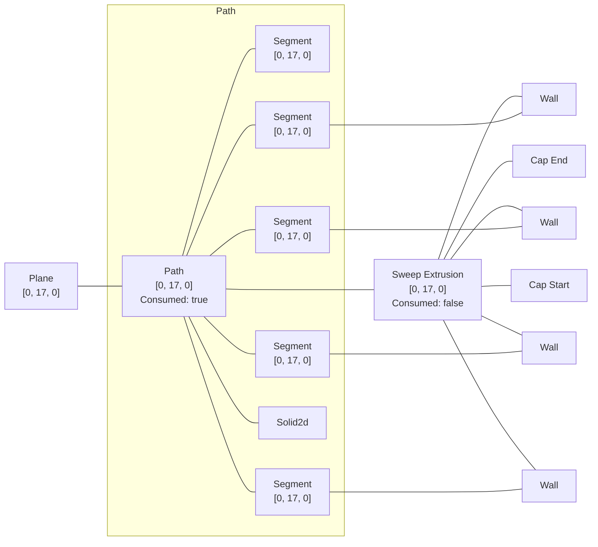

```mermaid
flowchart LR
  subgraph path3 [Path]
    3["Path<br>[0, 17, 0]<br>Consumed: true"]
      %% [ProgramBodyItem { index: 0 }]
    5["Segment<br>[0, 17, 0]"]
      %% [ProgramBodyItem { index: 0 }]
    6["Segment<br>[0, 17, 0]"]
      %% [ProgramBodyItem { index: 0 }]
    7["Segment<br>[0, 17, 0]"]
      %% [ProgramBodyItem { index: 0 }]
    8["Segment<br>[0, 17, 0]"]
      %% [ProgramBodyItem { index: 0 }]
    9["Segment<br>[0, 17, 0]"]
      %% [ProgramBodyItem { index: 0 }]
    10[Solid2d]
  end
  1["Cap End"]
    %% face_code_ref=Missing NodePath
  2["Cap Start"]
    %% face_code_ref=Missing NodePath
  4["Plane<br>[0, 17, 0]"]
    %% [ProgramBodyItem { index: 0 }]
  11["Sweep Extrusion<br>[0, 17, 0]<br>Consumed: false"]
    %% [ProgramBodyItem { index: 0 }]
  12[Wall]
    %% face_code_ref=Missing NodePath
  13[Wall]
    %% face_code_ref=Missing NodePath
  14[Wall]
    %% face_code_ref=Missing NodePath
  15[Wall]
    %% face_code_ref=Missing NodePath
  11 --- 1
  11 --- 2
  4 --- 3
  3 --- 5
  3 --- 6
  3 --- 7
  3 --- 8
  3 --- 9
  3 --- 10
  3 ---- 11
  6 --- 12
  7 --- 13
  8 --- 14
  9 --- 15
  11 --- 12
  11 --- 13
  11 --- 14
  11 --- 15
```
