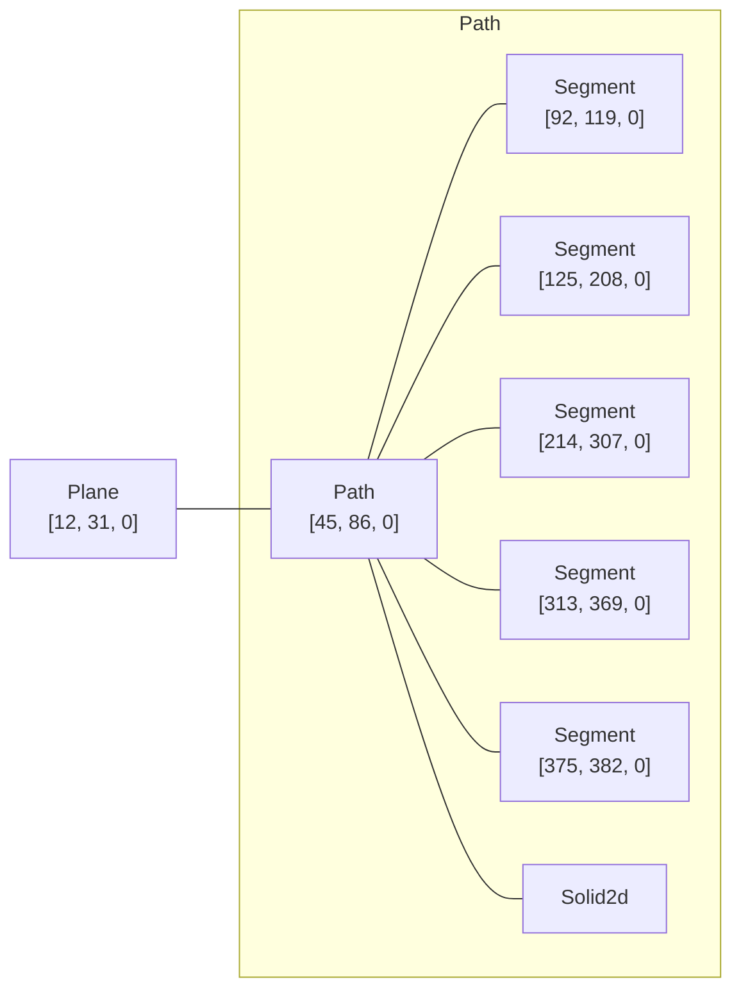

```mermaid
flowchart LR
  subgraph path2 [Path]
    2["Path<br>[45, 86, 0]"]
    3["Segment<br>[92, 119, 0]"]
    4["Segment<br>[125, 208, 0]"]
    5["Segment<br>[214, 307, 0]"]
    6["Segment<br>[313, 369, 0]"]
    7["Segment<br>[375, 382, 0]"]
    8[Solid2d]
  end
  1["Plane<br>[12, 31, 0]"]
  1 --- 2
  2 --- 3
  2 --- 4
  2 --- 5
  2 --- 6
  2 --- 7
  2 --- 8
```
