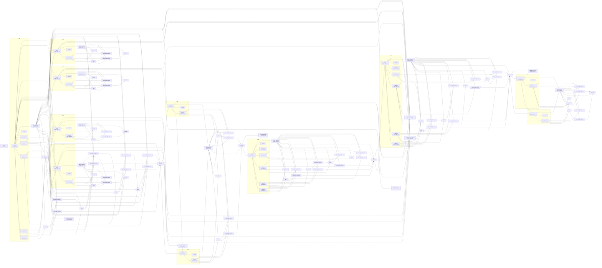

```mermaid
flowchart LR
  subgraph path2 [Path]
    2["Path<br>[275, 330, 0]"]
      %% [ProgramBodyItem { index: 11 }, VariableDeclarationDeclaration, VariableDeclarationInit, PipeBodyItem { index: 0 }]
    3["Segment<br>[336, 405, 0]"]
      %% [ProgramBodyItem { index: 11 }, VariableDeclarationDeclaration, VariableDeclarationInit, PipeBodyItem { index: 1 }]
    4["Segment<br>[411, 484, 0]"]
      %% [ProgramBodyItem { index: 11 }, VariableDeclarationDeclaration, VariableDeclarationInit, PipeBodyItem { index: 2 }]
    5["Segment<br>[490, 578, 0]"]
      %% [ProgramBodyItem { index: 11 }, VariableDeclarationDeclaration, VariableDeclarationInit, PipeBodyItem { index: 3 }]
    6["Segment<br>[584, 640, 0]"]
      %% [ProgramBodyItem { index: 11 }, VariableDeclarationDeclaration, VariableDeclarationInit, PipeBodyItem { index: 4 }]
    7["Segment<br>[646, 653, 0]"]
      %% [ProgramBodyItem { index: 11 }, VariableDeclarationDeclaration, VariableDeclarationInit, PipeBodyItem { index: 5 }]
    8[Solid2d]
  end
  subgraph path24 [Path]
    24["Path<br>[810, 871, 0]"]
      %% [ProgramBodyItem { index: 15 }, VariableDeclarationDeclaration, VariableDeclarationInit]
    25["Segment<br>[810, 871, 0]"]
      %% [ProgramBodyItem { index: 15 }, VariableDeclarationDeclaration, VariableDeclarationInit]
    26[Solid2d]
  end
  subgraph path27 [Path]
    27["Path<br>[885, 952, 0]"]
      %% [ProgramBodyItem { index: 16 }, VariableDeclarationDeclaration, VariableDeclarationInit, PipeBodyItem { index: 0 }]
    28["Segment<br>[885, 952, 0]"]
      %% [ProgramBodyItem { index: 16 }, VariableDeclarationDeclaration, VariableDeclarationInit, PipeBodyItem { index: 0 }]
    29[Solid2d]
  end
  subgraph path39 [Path]
    39["Path<br>[1157, 1212, 0]"]
      %% [ProgramBodyItem { index: 20 }, VariableDeclarationDeclaration, VariableDeclarationInit, PipeBodyItem { index: 0 }]
    40["Segment<br>[1218, 1287, 0]"]
      %% [ProgramBodyItem { index: 20 }, VariableDeclarationDeclaration, VariableDeclarationInit, PipeBodyItem { index: 1 }]
    41["Segment<br>[1293, 1366, 0]"]
      %% [ProgramBodyItem { index: 20 }, VariableDeclarationDeclaration, VariableDeclarationInit, PipeBodyItem { index: 2 }]
    42["Segment<br>[1372, 1460, 0]"]
      %% [ProgramBodyItem { index: 20 }, VariableDeclarationDeclaration, VariableDeclarationInit, PipeBodyItem { index: 3 }]
    43["Segment<br>[1466, 1522, 0]"]
      %% [ProgramBodyItem { index: 20 }, VariableDeclarationDeclaration, VariableDeclarationInit, PipeBodyItem { index: 4 }]
    44["Segment<br>[1528, 1535, 0]"]
      %% [ProgramBodyItem { index: 20 }, VariableDeclarationDeclaration, VariableDeclarationInit, PipeBodyItem { index: 5 }]
    45[Solid2d]
  end
  subgraph path61 [Path]
    61["Path<br>[1648, 1703, 0]"]
      %% [ProgramBodyItem { index: 23 }, VariableDeclarationDeclaration, VariableDeclarationInit, PipeBodyItem { index: 0 }]
    62["Segment<br>[1709, 1778, 0]"]
      %% [ProgramBodyItem { index: 23 }, VariableDeclarationDeclaration, VariableDeclarationInit, PipeBodyItem { index: 1 }]
    63["Segment<br>[1784, 1857, 0]"]
      %% [ProgramBodyItem { index: 23 }, VariableDeclarationDeclaration, VariableDeclarationInit, PipeBodyItem { index: 2 }]
    64["Segment<br>[1863, 1951, 0]"]
      %% [ProgramBodyItem { index: 23 }, VariableDeclarationDeclaration, VariableDeclarationInit, PipeBodyItem { index: 3 }]
    65["Segment<br>[1957, 2013, 0]"]
      %% [ProgramBodyItem { index: 23 }, VariableDeclarationDeclaration, VariableDeclarationInit, PipeBodyItem { index: 4 }]
    66["Segment<br>[2019, 2026, 0]"]
      %% [ProgramBodyItem { index: 23 }, VariableDeclarationDeclaration, VariableDeclarationInit, PipeBodyItem { index: 5 }]
    67[Solid2d]
  end
  subgraph path83 [Path]
    83["Path<br>[2154, 2208, 0]"]
      %% [ProgramBodyItem { index: 26 }, VariableDeclarationDeclaration, VariableDeclarationInit]
    84["Segment<br>[2154, 2208, 0]"]
      %% [ProgramBodyItem { index: 26 }, VariableDeclarationDeclaration, VariableDeclarationInit]
    85[Solid2d]
  end
  subgraph path86 [Path]
    86["Path<br>[2222, 2284, 0]"]
      %% [ProgramBodyItem { index: 27 }, VariableDeclarationDeclaration, VariableDeclarationInit, PipeBodyItem { index: 0 }]
    87["Segment<br>[2222, 2284, 0]"]
      %% [ProgramBodyItem { index: 27 }, VariableDeclarationDeclaration, VariableDeclarationInit, PipeBodyItem { index: 0 }]
    88[Solid2d]
  end
  subgraph path98 [Path]
    98["Path<br>[2447, 2543, 0]"]
      %% [ProgramBodyItem { index: 30 }, VariableDeclarationDeclaration, VariableDeclarationInit]
    99["Segment<br>[2447, 2543, 0]"]
      %% [ProgramBodyItem { index: 30 }, VariableDeclarationDeclaration, VariableDeclarationInit]
    100[Solid2d]
  end
  subgraph path101 [Path]
    101["Path<br>[2557, 2654, 0]"]
      %% [ProgramBodyItem { index: 31 }, VariableDeclarationDeclaration, VariableDeclarationInit]
    102["Segment<br>[2557, 2654, 0]"]
      %% [ProgramBodyItem { index: 31 }, VariableDeclarationDeclaration, VariableDeclarationInit]
    103[Solid2d]
  end
  subgraph path104 [Path]
    104["Path<br>[2668, 2766, 0]"]
      %% [ProgramBodyItem { index: 32 }, VariableDeclarationDeclaration, VariableDeclarationInit]
    105["Segment<br>[2668, 2766, 0]"]
      %% [ProgramBodyItem { index: 32 }, VariableDeclarationDeclaration, VariableDeclarationInit]
    106[Solid2d]
  end
  subgraph path107 [Path]
    107["Path<br>[2780, 2877, 0]"]
      %% [ProgramBodyItem { index: 33 }, VariableDeclarationDeclaration, VariableDeclarationInit]
    108["Segment<br>[2780, 2877, 0]"]
      %% [ProgramBodyItem { index: 33 }, VariableDeclarationDeclaration, VariableDeclarationInit]
    109[Solid2d]
  end
  1["Plane<br>[244, 261, 0]"]
    %% [ProgramBodyItem { index: 10 }, VariableDeclarationDeclaration, VariableDeclarationInit]
  9["Sweep Extrusion<br>[667, 701, 0]"]
    %% [ProgramBodyItem { index: 12 }, VariableDeclarationDeclaration, VariableDeclarationInit]
  10[Wall]
    %% face_code_ref=Missing NodePath
  11[Wall]
    %% face_code_ref=Missing NodePath
  12[Wall]
    %% face_code_ref=Missing NodePath
  13[Wall]
    %% face_code_ref=Missing NodePath
  14["Cap Start"]
    %% face_code_ref=[ProgramBodyItem { index: 14 }, VariableDeclarationDeclaration, VariableDeclarationInit]
  15["Cap End"]
    %% face_code_ref=[ProgramBodyItem { index: 29 }, VariableDeclarationDeclaration, VariableDeclarationInit]
  16["SweepEdge Opposite"]
  17["SweepEdge Adjacent"]
  18["SweepEdge Opposite"]
  19["SweepEdge Adjacent"]
  20["SweepEdge Opposite"]
  21["SweepEdge Adjacent"]
  22["SweepEdge Opposite"]
  23["SweepEdge Adjacent"]
  30["Sweep Extrusion<br>[1001, 1050, 0]"]
    %% [ProgramBodyItem { index: 17 }, VariableDeclarationDeclaration, VariableDeclarationInit]
  31[Wall]
    %% face_code_ref=Missing NodePath
  32[Wall]
    %% face_code_ref=Missing NodePath
  33["Cap Start"]
    %% face_code_ref=Missing NodePath
  34["Cap End"]
    %% face_code_ref=[ProgramBodyItem { index: 19 }, VariableDeclarationDeclaration, VariableDeclarationInit]
  35["SweepEdge Opposite"]
  36["SweepEdge Adjacent"]
  37["SweepEdge Opposite"]
  38["SweepEdge Adjacent"]
  46["Sweep Extrusion<br>[1549, 1583, 0]"]
    %% [ProgramBodyItem { index: 21 }, VariableDeclarationDeclaration, VariableDeclarationInit]
  47[Wall]
    %% face_code_ref=Missing NodePath
  48[Wall]
    %% face_code_ref=Missing NodePath
  49[Wall]
    %% face_code_ref=Missing NodePath
  50[Wall]
    %% face_code_ref=Missing NodePath
  51["Cap Start"]
    %% face_code_ref=Missing NodePath
  52["Cap End"]
    %% face_code_ref=[ProgramBodyItem { index: 22 }, VariableDeclarationDeclaration, VariableDeclarationInit]
  53["SweepEdge Opposite"]
  54["SweepEdge Adjacent"]
  55["SweepEdge Opposite"]
  56["SweepEdge Adjacent"]
  57["SweepEdge Opposite"]
  58["SweepEdge Adjacent"]
  59["SweepEdge Opposite"]
  60["SweepEdge Adjacent"]
  68["Sweep Extrusion<br>[2040, 2089, 0]"]
    %% [ProgramBodyItem { index: 24 }, VariableDeclarationDeclaration, VariableDeclarationInit]
  69[Wall]
    %% face_code_ref=Missing NodePath
  70[Wall]
    %% face_code_ref=Missing NodePath
  71[Wall]
    %% face_code_ref=Missing NodePath
  72[Wall]
    %% face_code_ref=Missing NodePath
  73["Cap Start"]
    %% face_code_ref=Missing NodePath
  74["Cap End"]
    %% face_code_ref=[ProgramBodyItem { index: 25 }, VariableDeclarationDeclaration, VariableDeclarationInit]
  75["SweepEdge Opposite"]
  76["SweepEdge Adjacent"]
  77["SweepEdge Opposite"]
  78["SweepEdge Adjacent"]
  79["SweepEdge Opposite"]
  80["SweepEdge Adjacent"]
  81["SweepEdge Opposite"]
  82["SweepEdge Adjacent"]
  89["Sweep Extrusion<br>[2333, 2382, 0]"]
    %% [ProgramBodyItem { index: 28 }, VariableDeclarationDeclaration, VariableDeclarationInit]
  90[Wall]
    %% face_code_ref=Missing NodePath
  91[Wall]
    %% face_code_ref=Missing NodePath
  92["Cap Start"]
    %% face_code_ref=Missing NodePath
  93["Cap End"]
    %% face_code_ref=Missing NodePath
  94["SweepEdge Opposite"]
  95["SweepEdge Adjacent"]
  96["SweepEdge Opposite"]
  97["SweepEdge Adjacent"]
  110["Sweep Extrusion<br>[2891, 2976, 0]"]
    %% [ProgramBodyItem { index: 34 }, VariableDeclarationDeclaration, VariableDeclarationInit]
  111[Wall]
    %% face_code_ref=Missing NodePath
  112["Cap Start"]
    %% face_code_ref=Missing NodePath
  113["Cap End"]
    %% face_code_ref=Missing NodePath
  114["SweepEdge Opposite"]
  115["SweepEdge Adjacent"]
  116["Sweep Extrusion<br>[2891, 2976, 0]"]
    %% [ProgramBodyItem { index: 34 }, VariableDeclarationDeclaration, VariableDeclarationInit]
  117[Wall]
    %% face_code_ref=Missing NodePath
  118["Cap Start"]
    %% face_code_ref=Missing NodePath
  119["Cap End"]
    %% face_code_ref=Missing NodePath
  120["SweepEdge Opposite"]
  121["SweepEdge Adjacent"]
  122["Sweep Extrusion<br>[2891, 2976, 0]"]
    %% [ProgramBodyItem { index: 34 }, VariableDeclarationDeclaration, VariableDeclarationInit]
  123[Wall]
    %% face_code_ref=Missing NodePath
  124["Cap Start"]
    %% face_code_ref=Missing NodePath
  125["Cap End"]
    %% face_code_ref=Missing NodePath
  126["SweepEdge Opposite"]
  127["SweepEdge Adjacent"]
  128["Sweep Extrusion<br>[2891, 2976, 0]"]
    %% [ProgramBodyItem { index: 34 }, VariableDeclarationDeclaration, VariableDeclarationInit]
  129[Wall]
    %% face_code_ref=Missing NodePath
  130["Cap Start"]
    %% face_code_ref=Missing NodePath
  131["Cap End"]
    %% face_code_ref=Missing NodePath
  132["SweepEdge Opposite"]
  133["SweepEdge Adjacent"]
  134["CompositeSolid Subtract<br>[2977, 3043, 0]"]
    %% [ProgramBodyItem { index: 35 }, ExpressionStatementExpr]
  135["CompositeSolid Subtract<br>[2977, 3043, 0]"]
    %% [ProgramBodyItem { index: 35 }, ExpressionStatementExpr]
  136["StartSketchOnFace<br>[757, 796, 0]"]
    %% [ProgramBodyItem { index: 14 }, VariableDeclarationDeclaration, VariableDeclarationInit]
  137["StartSketchOnFace<br>[1106, 1143, 0]"]
    %% [ProgramBodyItem { index: 19 }, VariableDeclarationDeclaration, VariableDeclarationInit]
  138["StartSketchOnFace<br>[1597, 1634, 0]"]
    %% [ProgramBodyItem { index: 22 }, VariableDeclarationDeclaration, VariableDeclarationInit]
  139["StartSketchOnFace<br>[2103, 2140, 0]"]
    %% [ProgramBodyItem { index: 25 }, VariableDeclarationDeclaration, VariableDeclarationInit]
  140["StartSketchOnFace<br>[2396, 2433, 0]"]
    %% [ProgramBodyItem { index: 29 }, VariableDeclarationDeclaration, VariableDeclarationInit]
  1 --- 2
  2 --- 3
  2 --- 4
  2 --- 5
  2 --- 6
  2 --- 7
  2 --- 8
  2 ---- 9
  27 <--x 2
  61 <--x 2
  98 <--x 2
  101 <--x 2
  104 <--x 2
  107 <--x 2
  2 <--x 134
  2 <--x 135
  3 --- 10
  3 x--> 15
  3 --- 16
  3 --- 17
  4 --- 11
  4 x--> 15
  4 --- 18
  4 --- 19
  5 --- 12
  5 x--> 15
  5 --- 20
  5 --- 21
  6 --- 13
  6 x--> 15
  6 --- 22
  6 --- 23
  9 --- 10
  9 --- 11
  9 --- 12
  9 --- 13
  9 --- 14
  9 --- 15
  9 --- 16
  9 --- 17
  9 --- 18
  9 --- 19
  9 --- 20
  9 --- 21
  9 --- 22
  9 --- 23
  10 --- 16
  10 --- 17
  23 <--x 10
  17 <--x 11
  11 --- 18
  11 --- 19
  19 <--x 12
  12 --- 20
  12 --- 21
  21 <--x 13
  13 --- 22
  13 --- 23
  16 <--x 14
  18 <--x 14
  20 <--x 14
  22 <--x 14
  14 --- 24
  14 --- 27
  14 <--x 136
  15 --- 98
  15 --- 101
  15 --- 104
  15 --- 107
  15 <--x 140
  24 --- 25
  24 --- 26
  27 --- 24
  24 x---> 30
  25 --- 32
  25 x--> 33
  25 --- 37
  25 --- 38
  27 --- 28
  27 --- 29
  27 ---- 30
  27 <--x 134
  27 <--x 135
  28 --- 31
  28 x--> 33
  28 --- 35
  28 --- 36
  30 --- 31
  30 --- 32
  30 --- 33
  30 --- 34
  30 --- 35
  30 --- 36
  30 --- 37
  30 --- 38
  31 --- 35
  31 --- 36
  32 --- 37
  32 --- 38
  35 <--x 34
  37 <--x 34
  34 --- 39
  34 <--x 137
  39 --- 40
  39 --- 41
  39 --- 42
  39 --- 43
  39 --- 44
  39 --- 45
  39 ---- 46
  40 --- 47
  40 x--> 51
  40 --- 53
  40 --- 54
  41 --- 48
  41 x--> 51
  41 --- 55
  41 --- 56
  42 --- 49
  42 x--> 51
  42 --- 57
  42 --- 58
  43 --- 50
  43 x--> 51
  43 --- 59
  43 --- 60
  46 --- 47
  46 --- 48
  46 --- 49
  46 --- 50
  46 --- 51
  46 --- 52
  46 --- 53
  46 --- 54
  46 --- 55
  46 --- 56
  46 --- 57
  46 --- 58
  46 --- 59
  46 --- 60
  47 --- 53
  47 --- 54
  60 <--x 47
  54 <--x 48
  48 --- 55
  48 --- 56
  56 <--x 49
  49 --- 57
  49 --- 58
  58 <--x 50
  50 --- 59
  50 --- 60
  53 <--x 52
  55 <--x 52
  57 <--x 52
  59 <--x 52
  52 --- 61
  52 <--x 138
  61 --- 62
  61 --- 63
  61 --- 64
  61 --- 65
  61 --- 66
  61 --- 67
  61 ---- 68
  61 <--x 134
  61 <--x 135
  62 --- 69
  62 x--> 73
  62 --- 75
  62 --- 76
  63 --- 70
  63 x--> 73
  63 --- 77
  63 --- 78
  64 --- 71
  64 x--> 73
  64 --- 79
  64 --- 80
  65 --- 72
  65 x--> 73
  65 --- 81
  65 --- 82
  68 --- 69
  68 --- 70
  68 --- 71
  68 --- 72
  68 --- 73
  68 --- 74
  68 --- 75
  68 --- 76
  68 --- 77
  68 --- 78
  68 --- 79
  68 --- 80
  68 --- 81
  68 --- 82
  69 --- 75
  69 --- 76
  82 <--x 69
  76 <--x 70
  70 --- 77
  70 --- 78
  78 <--x 71
  71 --- 79
  71 --- 80
  80 <--x 72
  72 --- 81
  72 --- 82
  75 <--x 74
  77 <--x 74
  79 <--x 74
  81 <--x 74
  74 --- 83
  74 --- 86
  74 <--x 139
  83 --- 84
  83 --- 85
  86 --- 83
  83 x---> 89
  84 --- 91
  84 x--> 92
  84 --- 96
  84 --- 97
  86 --- 87
  86 --- 88
  86 ---- 89
  87 --- 90
  87 x--> 92
  87 --- 94
  87 --- 95
  89 --- 90
  89 --- 91
  89 --- 92
  89 --- 93
  89 --- 94
  89 --- 95
  89 --- 96
  89 --- 97
  90 --- 94
  90 --- 95
  91 --- 96
  91 --- 97
  94 <--x 93
  96 <--x 93
  98 --- 99
  98 --- 100
  98 ---- 110
  98 <--x 134
  98 <--x 135
  99 --- 111
  99 x--> 113
  99 --- 114
  99 --- 115
  101 --- 102
  101 --- 103
  101 ---- 116
  101 <--x 134
  101 <--x 135
  102 --- 117
  102 x--> 119
  102 --- 120
  102 --- 121
  104 --- 105
  104 --- 106
  104 ---- 122
  104 <--x 134
  104 <--x 135
  105 --- 123
  105 x--> 125
  105 --- 126
  105 --- 127
  107 --- 108
  107 --- 109
  107 ---- 128
  107 <--x 134
  107 <--x 135
  108 --- 129
  108 x--> 131
  108 --- 132
  108 --- 133
  110 --- 111
  110 --- 112
  110 --- 113
  110 --- 114
  110 --- 115
  111 --- 114
  111 --- 115
  114 <--x 112
  116 --- 117
  116 --- 118
  116 --- 119
  116 --- 120
  116 --- 121
  117 --- 120
  117 --- 121
  120 <--x 118
  122 --- 123
  122 --- 124
  122 --- 125
  122 --- 126
  122 --- 127
  123 --- 126
  123 --- 127
  126 <--x 124
  128 --- 129
  128 --- 130
  128 --- 131
  128 --- 132
  128 --- 133
  129 --- 132
  129 --- 133
  132 <--x 130
```
