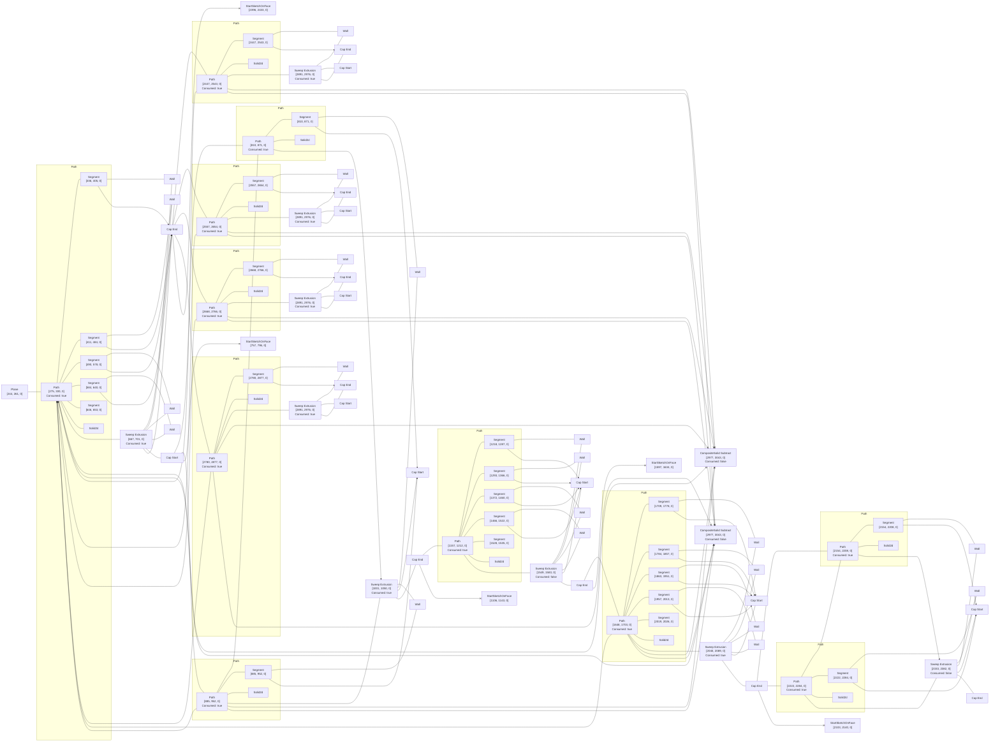

```mermaid
flowchart LR
  subgraph path2 [Path]
    2["Path<br>[275, 330, 0]<br>Consumed: true"]
      %% [ProgramBodyItem { index: 11 }, VariableDeclarationDeclaration, VariableDeclarationInit, PipeBodyItem { index: 0 }]
    3["Segment<br>[336, 405, 0]"]
      %% [ProgramBodyItem { index: 11 }, VariableDeclarationDeclaration, VariableDeclarationInit, PipeBodyItem { index: 1 }]
    4["Segment<br>[411, 484, 0]"]
      %% [ProgramBodyItem { index: 11 }, VariableDeclarationDeclaration, VariableDeclarationInit, PipeBodyItem { index: 2 }]
    5["Segment<br>[490, 578, 0]"]
      %% [ProgramBodyItem { index: 11 }, VariableDeclarationDeclaration, VariableDeclarationInit, PipeBodyItem { index: 3 }]
    6["Segment<br>[584, 640, 0]"]
      %% [ProgramBodyItem { index: 11 }, VariableDeclarationDeclaration, VariableDeclarationInit, PipeBodyItem { index: 4 }]
    7["Segment<br>[646, 653, 0]"]
      %% [ProgramBodyItem { index: 11 }, VariableDeclarationDeclaration, VariableDeclarationInit, PipeBodyItem { index: 5 }]
    8[Solid2d]
  end
  subgraph path16 [Path]
    16["Path<br>[810, 871, 0]<br>Consumed: true"]
      %% [ProgramBodyItem { index: 15 }, VariableDeclarationDeclaration, VariableDeclarationInit]
    17["Segment<br>[810, 871, 0]"]
      %% [ProgramBodyItem { index: 15 }, VariableDeclarationDeclaration, VariableDeclarationInit]
    18[Solid2d]
  end
  subgraph path19 [Path]
    19["Path<br>[885, 952, 0]<br>Consumed: true"]
      %% [ProgramBodyItem { index: 16 }, VariableDeclarationDeclaration, VariableDeclarationInit, PipeBodyItem { index: 0 }]
    20["Segment<br>[885, 952, 0]"]
      %% [ProgramBodyItem { index: 16 }, VariableDeclarationDeclaration, VariableDeclarationInit, PipeBodyItem { index: 0 }]
    21[Solid2d]
  end
  subgraph path27 [Path]
    27["Path<br>[1157, 1212, 0]<br>Consumed: true"]
      %% [ProgramBodyItem { index: 20 }, VariableDeclarationDeclaration, VariableDeclarationInit, PipeBodyItem { index: 0 }]
    28["Segment<br>[1218, 1287, 0]"]
      %% [ProgramBodyItem { index: 20 }, VariableDeclarationDeclaration, VariableDeclarationInit, PipeBodyItem { index: 1 }]
    29["Segment<br>[1293, 1366, 0]"]
      %% [ProgramBodyItem { index: 20 }, VariableDeclarationDeclaration, VariableDeclarationInit, PipeBodyItem { index: 2 }]
    30["Segment<br>[1372, 1460, 0]"]
      %% [ProgramBodyItem { index: 20 }, VariableDeclarationDeclaration, VariableDeclarationInit, PipeBodyItem { index: 3 }]
    31["Segment<br>[1466, 1522, 0]"]
      %% [ProgramBodyItem { index: 20 }, VariableDeclarationDeclaration, VariableDeclarationInit, PipeBodyItem { index: 4 }]
    32["Segment<br>[1528, 1535, 0]"]
      %% [ProgramBodyItem { index: 20 }, VariableDeclarationDeclaration, VariableDeclarationInit, PipeBodyItem { index: 5 }]
    33[Solid2d]
  end
  subgraph path41 [Path]
    41["Path<br>[1648, 1703, 0]<br>Consumed: true"]
      %% [ProgramBodyItem { index: 23 }, VariableDeclarationDeclaration, VariableDeclarationInit, PipeBodyItem { index: 0 }]
    42["Segment<br>[1709, 1778, 0]"]
      %% [ProgramBodyItem { index: 23 }, VariableDeclarationDeclaration, VariableDeclarationInit, PipeBodyItem { index: 1 }]
    43["Segment<br>[1784, 1857, 0]"]
      %% [ProgramBodyItem { index: 23 }, VariableDeclarationDeclaration, VariableDeclarationInit, PipeBodyItem { index: 2 }]
    44["Segment<br>[1863, 1951, 0]"]
      %% [ProgramBodyItem { index: 23 }, VariableDeclarationDeclaration, VariableDeclarationInit, PipeBodyItem { index: 3 }]
    45["Segment<br>[1957, 2013, 0]"]
      %% [ProgramBodyItem { index: 23 }, VariableDeclarationDeclaration, VariableDeclarationInit, PipeBodyItem { index: 4 }]
    46["Segment<br>[2019, 2026, 0]"]
      %% [ProgramBodyItem { index: 23 }, VariableDeclarationDeclaration, VariableDeclarationInit, PipeBodyItem { index: 5 }]
    47[Solid2d]
  end
  subgraph path55 [Path]
    55["Path<br>[2154, 2208, 0]<br>Consumed: true"]
      %% [ProgramBodyItem { index: 26 }, VariableDeclarationDeclaration, VariableDeclarationInit]
    56["Segment<br>[2154, 2208, 0]"]
      %% [ProgramBodyItem { index: 26 }, VariableDeclarationDeclaration, VariableDeclarationInit]
    57[Solid2d]
  end
  subgraph path58 [Path]
    58["Path<br>[2222, 2284, 0]<br>Consumed: true"]
      %% [ProgramBodyItem { index: 27 }, VariableDeclarationDeclaration, VariableDeclarationInit, PipeBodyItem { index: 0 }]
    59["Segment<br>[2222, 2284, 0]"]
      %% [ProgramBodyItem { index: 27 }, VariableDeclarationDeclaration, VariableDeclarationInit, PipeBodyItem { index: 0 }]
    60[Solid2d]
  end
  subgraph path66 [Path]
    66["Path<br>[2447, 2543, 0]<br>Consumed: true"]
      %% [ProgramBodyItem { index: 30 }, VariableDeclarationDeclaration, VariableDeclarationInit]
    67["Segment<br>[2447, 2543, 0]"]
      %% [ProgramBodyItem { index: 30 }, VariableDeclarationDeclaration, VariableDeclarationInit]
    68[Solid2d]
  end
  subgraph path69 [Path]
    69["Path<br>[2557, 2654, 0]<br>Consumed: true"]
      %% [ProgramBodyItem { index: 31 }, VariableDeclarationDeclaration, VariableDeclarationInit]
    70["Segment<br>[2557, 2654, 0]"]
      %% [ProgramBodyItem { index: 31 }, VariableDeclarationDeclaration, VariableDeclarationInit]
    71[Solid2d]
  end
  subgraph path72 [Path]
    72["Path<br>[2668, 2766, 0]<br>Consumed: true"]
      %% [ProgramBodyItem { index: 32 }, VariableDeclarationDeclaration, VariableDeclarationInit]
    73["Segment<br>[2668, 2766, 0]"]
      %% [ProgramBodyItem { index: 32 }, VariableDeclarationDeclaration, VariableDeclarationInit]
    74[Solid2d]
  end
  subgraph path75 [Path]
    75["Path<br>[2780, 2877, 0]<br>Consumed: true"]
      %% [ProgramBodyItem { index: 33 }, VariableDeclarationDeclaration, VariableDeclarationInit]
    76["Segment<br>[2780, 2877, 0]"]
      %% [ProgramBodyItem { index: 33 }, VariableDeclarationDeclaration, VariableDeclarationInit]
    77[Solid2d]
  end
  1["Plane<br>[244, 261, 0]"]
    %% [ProgramBodyItem { index: 10 }, VariableDeclarationDeclaration, VariableDeclarationInit]
  9["Sweep Extrusion<br>[667, 701, 0]<br>Consumed: true"]
    %% [ProgramBodyItem { index: 12 }, VariableDeclarationDeclaration, VariableDeclarationInit]
  10[Wall]
    %% face_code_ref=Missing NodePath
  11[Wall]
    %% face_code_ref=Missing NodePath
  12[Wall]
    %% face_code_ref=Missing NodePath
  13[Wall]
    %% face_code_ref=Missing NodePath
  14["Cap Start"]
    %% face_code_ref=[ProgramBodyItem { index: 14 }, VariableDeclarationDeclaration, VariableDeclarationInit]
  15["Cap End"]
    %% face_code_ref=[ProgramBodyItem { index: 29 }, VariableDeclarationDeclaration, VariableDeclarationInit]
  22["Sweep Extrusion<br>[1001, 1050, 0]<br>Consumed: true"]
    %% [ProgramBodyItem { index: 17 }, VariableDeclarationDeclaration, VariableDeclarationInit]
  23[Wall]
    %% face_code_ref=Missing NodePath
  24[Wall]
    %% face_code_ref=Missing NodePath
  25["Cap Start"]
    %% face_code_ref=Missing NodePath
  26["Cap End"]
    %% face_code_ref=[ProgramBodyItem { index: 19 }, VariableDeclarationDeclaration, VariableDeclarationInit]
  34["Sweep Extrusion<br>[1549, 1583, 0]<br>Consumed: false"]
    %% [ProgramBodyItem { index: 21 }, VariableDeclarationDeclaration, VariableDeclarationInit]
  35[Wall]
    %% face_code_ref=Missing NodePath
  36[Wall]
    %% face_code_ref=Missing NodePath
  37[Wall]
    %% face_code_ref=Missing NodePath
  38[Wall]
    %% face_code_ref=Missing NodePath
  39["Cap Start"]
    %% face_code_ref=Missing NodePath
  40["Cap End"]
    %% face_code_ref=[ProgramBodyItem { index: 22 }, VariableDeclarationDeclaration, VariableDeclarationInit]
  48["Sweep Extrusion<br>[2040, 2089, 0]<br>Consumed: true"]
    %% [ProgramBodyItem { index: 24 }, VariableDeclarationDeclaration, VariableDeclarationInit]
  49[Wall]
    %% face_code_ref=Missing NodePath
  50[Wall]
    %% face_code_ref=Missing NodePath
  51[Wall]
    %% face_code_ref=Missing NodePath
  52[Wall]
    %% face_code_ref=Missing NodePath
  53["Cap Start"]
    %% face_code_ref=Missing NodePath
  54["Cap End"]
    %% face_code_ref=[ProgramBodyItem { index: 25 }, VariableDeclarationDeclaration, VariableDeclarationInit]
  61["Sweep Extrusion<br>[2333, 2382, 0]<br>Consumed: false"]
    %% [ProgramBodyItem { index: 28 }, VariableDeclarationDeclaration, VariableDeclarationInit]
  62[Wall]
    %% face_code_ref=Missing NodePath
  63[Wall]
    %% face_code_ref=Missing NodePath
  64["Cap Start"]
    %% face_code_ref=Missing NodePath
  65["Cap End"]
    %% face_code_ref=Missing NodePath
  78["Sweep Extrusion<br>[2891, 2976, 0]<br>Consumed: true"]
    %% [ProgramBodyItem { index: 34 }, VariableDeclarationDeclaration, VariableDeclarationInit]
  79[Wall]
    %% face_code_ref=Missing NodePath
  80["Cap Start"]
    %% face_code_ref=Missing NodePath
  81["Cap End"]
    %% face_code_ref=Missing NodePath
  82["Sweep Extrusion<br>[2891, 2976, 0]<br>Consumed: true"]
    %% [ProgramBodyItem { index: 34 }, VariableDeclarationDeclaration, VariableDeclarationInit]
  83[Wall]
    %% face_code_ref=Missing NodePath
  84["Cap Start"]
    %% face_code_ref=Missing NodePath
  85["Cap End"]
    %% face_code_ref=Missing NodePath
  86["Sweep Extrusion<br>[2891, 2976, 0]<br>Consumed: true"]
    %% [ProgramBodyItem { index: 34 }, VariableDeclarationDeclaration, VariableDeclarationInit]
  87[Wall]
    %% face_code_ref=Missing NodePath
  88["Cap Start"]
    %% face_code_ref=Missing NodePath
  89["Cap End"]
    %% face_code_ref=Missing NodePath
  90["Sweep Extrusion<br>[2891, 2976, 0]<br>Consumed: true"]
    %% [ProgramBodyItem { index: 34 }, VariableDeclarationDeclaration, VariableDeclarationInit]
  91[Wall]
    %% face_code_ref=Missing NodePath
  92["Cap Start"]
    %% face_code_ref=Missing NodePath
  93["Cap End"]
    %% face_code_ref=Missing NodePath
  94["CompositeSolid Subtract<br>[2977, 3043, 0]<br>Consumed: false"]
    %% [ProgramBodyItem { index: 35 }, ExpressionStatementExpr]
  95["CompositeSolid Subtract<br>[2977, 3043, 0]<br>Consumed: false"]
    %% [ProgramBodyItem { index: 35 }, ExpressionStatementExpr]
  96["StartSketchOnFace<br>[757, 796, 0]"]
    %% [ProgramBodyItem { index: 14 }, VariableDeclarationDeclaration, VariableDeclarationInit]
  97["StartSketchOnFace<br>[1106, 1143, 0]"]
    %% [ProgramBodyItem { index: 19 }, VariableDeclarationDeclaration, VariableDeclarationInit]
  98["StartSketchOnFace<br>[1597, 1634, 0]"]
    %% [ProgramBodyItem { index: 22 }, VariableDeclarationDeclaration, VariableDeclarationInit]
  99["StartSketchOnFace<br>[2103, 2140, 0]"]
    %% [ProgramBodyItem { index: 25 }, VariableDeclarationDeclaration, VariableDeclarationInit]
  100["StartSketchOnFace<br>[2396, 2433, 0]"]
    %% [ProgramBodyItem { index: 29 }, VariableDeclarationDeclaration, VariableDeclarationInit]
  1 --- 2
  2 --- 3
  2 --- 4
  2 --- 5
  2 --- 6
  2 --- 7
  2 --- 8
  2 ---- 9
  19 <--x 2
  41 <--x 2
  66 <--x 2
  69 <--x 2
  72 <--x 2
  75 <--x 2
  2 <--x 94
  2 <--x 95
  3 --- 10
  3 x--> 15
  4 --- 11
  4 x--> 15
  5 --- 12
  5 x--> 15
  6 --- 13
  6 x--> 15
  9 --- 10
  9 --- 11
  9 --- 12
  9 --- 13
  9 --- 14
  9 --- 15
  14 --- 16
  14 --- 19
  14 <--x 96
  15 --- 66
  15 --- 69
  15 --- 72
  15 --- 75
  15 <--x 100
  16 --- 17
  16 --- 18
  19 --- 16
  16 x---> 22
  17 --- 24
  17 x--> 25
  19 --- 20
  19 --- 21
  19 ---- 22
  19 <--x 94
  19 <--x 95
  20 --- 23
  20 x--> 25
  22 --- 23
  22 --- 24
  22 --- 25
  22 --- 26
  26 --- 27
  26 <--x 97
  27 --- 28
  27 --- 29
  27 --- 30
  27 --- 31
  27 --- 32
  27 --- 33
  27 ---- 34
  28 --- 35
  28 x--> 39
  29 --- 36
  29 x--> 39
  30 --- 37
  30 x--> 39
  31 --- 38
  31 x--> 39
  34 --- 35
  34 --- 36
  34 --- 37
  34 --- 38
  34 --- 39
  34 --- 40
  40 --- 41
  40 <--x 98
  41 --- 42
  41 --- 43
  41 --- 44
  41 --- 45
  41 --- 46
  41 --- 47
  41 ---- 48
  41 <--x 94
  41 <--x 95
  42 --- 49
  42 x--> 53
  43 --- 50
  43 x--> 53
  44 --- 51
  44 x--> 53
  45 --- 52
  45 x--> 53
  48 --- 49
  48 --- 50
  48 --- 51
  48 --- 52
  48 --- 53
  48 --- 54
  54 --- 55
  54 --- 58
  54 <--x 99
  55 --- 56
  55 --- 57
  58 --- 55
  55 x---> 61
  56 --- 63
  56 x--> 64
  58 --- 59
  58 --- 60
  58 ---- 61
  59 --- 62
  59 x--> 64
  61 --- 62
  61 --- 63
  61 --- 64
  61 --- 65
  66 --- 67
  66 --- 68
  66 ---- 78
  66 <--x 94
  66 <--x 95
  67 --- 79
  67 x--> 81
  69 --- 70
  69 --- 71
  69 ---- 82
  69 <--x 94
  69 <--x 95
  70 --- 83
  70 x--> 85
  72 --- 73
  72 --- 74
  72 ---- 86
  72 <--x 94
  72 <--x 95
  73 --- 87
  73 x--> 89
  75 --- 76
  75 --- 77
  75 ---- 90
  75 <--x 94
  75 <--x 95
  76 --- 91
  76 x--> 93
  78 --- 79
  78 --- 80
  78 --- 81
  82 --- 83
  82 --- 84
  82 --- 85
  86 --- 87
  86 --- 88
  86 --- 89
  90 --- 91
  90 --- 92
  90 --- 93
```
