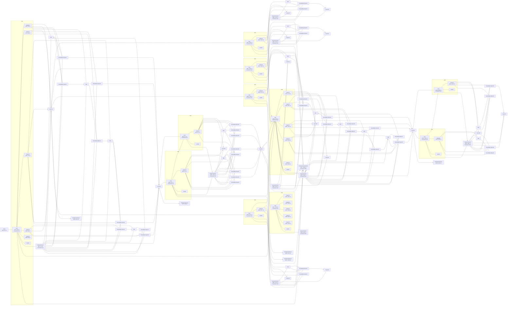

```mermaid
flowchart LR
  subgraph path2 [Path]
    2["Path<br>[275, 330, 0]<br>Consumed: true"]
      %% [ProgramBodyItem { index: 11 }, VariableDeclarationDeclaration, VariableDeclarationInit, PipeBodyItem { index: 0 }]
    3["Segment<br>[336, 405, 0]"]
      %% [ProgramBodyItem { index: 11 }, VariableDeclarationDeclaration, VariableDeclarationInit, PipeBodyItem { index: 1 }]
    4["Segment<br>[411, 484, 0]"]
      %% [ProgramBodyItem { index: 11 }, VariableDeclarationDeclaration, VariableDeclarationInit, PipeBodyItem { index: 2 }]
    5["Segment<br>[490, 578, 0]"]
      %% [ProgramBodyItem { index: 11 }, VariableDeclarationDeclaration, VariableDeclarationInit, PipeBodyItem { index: 3 }]
    6["Segment<br>[584, 640, 0]"]
      %% [ProgramBodyItem { index: 11 }, VariableDeclarationDeclaration, VariableDeclarationInit, PipeBodyItem { index: 4 }]
    7["Segment<br>[646, 653, 0]"]
      %% [ProgramBodyItem { index: 11 }, VariableDeclarationDeclaration, VariableDeclarationInit, PipeBodyItem { index: 5 }]
    8[Solid2d]
  end
  subgraph path24 [Path]
    24["Path<br>[810, 871, 0]<br>Consumed: true"]
      %% [ProgramBodyItem { index: 15 }, VariableDeclarationDeclaration, VariableDeclarationInit]
    25["Segment<br>[810, 871, 0]"]
      %% [ProgramBodyItem { index: 15 }, VariableDeclarationDeclaration, VariableDeclarationInit]
    26[Solid2d]
  end
  subgraph path27 [Path]
    27["Path<br>[885, 952, 0]<br>Consumed: true"]
      %% [ProgramBodyItem { index: 16 }, VariableDeclarationDeclaration, VariableDeclarationInit, PipeBodyItem { index: 0 }]
    28["Segment<br>[885, 952, 0]"]
      %% [ProgramBodyItem { index: 16 }, VariableDeclarationDeclaration, VariableDeclarationInit, PipeBodyItem { index: 0 }]
    29[Solid2d]
  end
  subgraph path39 [Path]
    39["Path<br>[1157, 1212, 0]<br>Consumed: true"]
      %% [ProgramBodyItem { index: 20 }, VariableDeclarationDeclaration, VariableDeclarationInit, PipeBodyItem { index: 0 }]
    40["Segment<br>[1218, 1287, 0]"]
      %% [ProgramBodyItem { index: 20 }, VariableDeclarationDeclaration, VariableDeclarationInit, PipeBodyItem { index: 1 }]
    41["Segment<br>[1293, 1366, 0]"]
      %% [ProgramBodyItem { index: 20 }, VariableDeclarationDeclaration, VariableDeclarationInit, PipeBodyItem { index: 2 }]
    42["Segment<br>[1372, 1460, 0]"]
      %% [ProgramBodyItem { index: 20 }, VariableDeclarationDeclaration, VariableDeclarationInit, PipeBodyItem { index: 3 }]
    43["Segment<br>[1466, 1522, 0]"]
      %% [ProgramBodyItem { index: 20 }, VariableDeclarationDeclaration, VariableDeclarationInit, PipeBodyItem { index: 4 }]
    44["Segment<br>[1528, 1535, 0]"]
      %% [ProgramBodyItem { index: 20 }, VariableDeclarationDeclaration, VariableDeclarationInit, PipeBodyItem { index: 5 }]
    45[Solid2d]
  end
  subgraph path51 [Path]
    51["Path<br>[1648, 1703, 0]<br>Consumed: true"]
      %% [ProgramBodyItem { index: 23 }, VariableDeclarationDeclaration, VariableDeclarationInit, PipeBodyItem { index: 0 }]
    52["Segment<br>[1709, 1778, 0]"]
      %% [ProgramBodyItem { index: 23 }, VariableDeclarationDeclaration, VariableDeclarationInit, PipeBodyItem { index: 1 }]
    53["Segment<br>[1784, 1857, 0]"]
      %% [ProgramBodyItem { index: 23 }, VariableDeclarationDeclaration, VariableDeclarationInit, PipeBodyItem { index: 2 }]
    54["Segment<br>[1863, 1951, 0]"]
      %% [ProgramBodyItem { index: 23 }, VariableDeclarationDeclaration, VariableDeclarationInit, PipeBodyItem { index: 3 }]
    55["Segment<br>[1957, 2013, 0]"]
      %% [ProgramBodyItem { index: 23 }, VariableDeclarationDeclaration, VariableDeclarationInit, PipeBodyItem { index: 4 }]
    56["Segment<br>[2019, 2026, 0]"]
      %% [ProgramBodyItem { index: 23 }, VariableDeclarationDeclaration, VariableDeclarationInit, PipeBodyItem { index: 5 }]
    57[Solid2d]
  end
  subgraph path73 [Path]
    73["Path<br>[2154, 2208, 0]<br>Consumed: true"]
      %% [ProgramBodyItem { index: 26 }, VariableDeclarationDeclaration, VariableDeclarationInit]
    74["Segment<br>[2154, 2208, 0]"]
      %% [ProgramBodyItem { index: 26 }, VariableDeclarationDeclaration, VariableDeclarationInit]
    75[Solid2d]
  end
  subgraph path76 [Path]
    76["Path<br>[2222, 2284, 0]<br>Consumed: true"]
      %% [ProgramBodyItem { index: 27 }, VariableDeclarationDeclaration, VariableDeclarationInit, PipeBodyItem { index: 0 }]
    77["Segment<br>[2222, 2284, 0]"]
      %% [ProgramBodyItem { index: 27 }, VariableDeclarationDeclaration, VariableDeclarationInit, PipeBodyItem { index: 0 }]
    78[Solid2d]
  end
  subgraph path88 [Path]
    88["Path<br>[2447, 2543, 0]<br>Consumed: true"]
      %% [ProgramBodyItem { index: 30 }, VariableDeclarationDeclaration, VariableDeclarationInit]
    89["Segment<br>[2447, 2543, 0]"]
      %% [ProgramBodyItem { index: 30 }, VariableDeclarationDeclaration, VariableDeclarationInit]
    90[Solid2d]
  end
  subgraph path91 [Path]
    91["Path<br>[2557, 2654, 0]<br>Consumed: true"]
      %% [ProgramBodyItem { index: 31 }, VariableDeclarationDeclaration, VariableDeclarationInit]
    92["Segment<br>[2557, 2654, 0]"]
      %% [ProgramBodyItem { index: 31 }, VariableDeclarationDeclaration, VariableDeclarationInit]
    93[Solid2d]
  end
  subgraph path94 [Path]
    94["Path<br>[2668, 2766, 0]<br>Consumed: true"]
      %% [ProgramBodyItem { index: 32 }, VariableDeclarationDeclaration, VariableDeclarationInit]
    95["Segment<br>[2668, 2766, 0]"]
      %% [ProgramBodyItem { index: 32 }, VariableDeclarationDeclaration, VariableDeclarationInit]
    96[Solid2d]
  end
  subgraph path97 [Path]
    97["Path<br>[2780, 2877, 0]<br>Consumed: true"]
      %% [ProgramBodyItem { index: 33 }, VariableDeclarationDeclaration, VariableDeclarationInit]
    98["Segment<br>[2780, 2877, 0]"]
      %% [ProgramBodyItem { index: 33 }, VariableDeclarationDeclaration, VariableDeclarationInit]
    99[Solid2d]
  end
  1["Plane<br>[244, 261, 0]"]
    %% [ProgramBodyItem { index: 10 }, VariableDeclarationDeclaration, VariableDeclarationInit]
  9["Sweep Extrusion<br>[667, 701, 0]<br>Consumed: true"]
    %% [ProgramBodyItem { index: 12 }, VariableDeclarationDeclaration, VariableDeclarationInit]
  10[Wall]
    %% face_code_ref=Missing NodePath
  11[Wall]
    %% face_code_ref=Missing NodePath
  12[Wall]
    %% face_code_ref=Missing NodePath
  13[Wall]
    %% face_code_ref=Missing NodePath
  14["Cap Start"]
    %% face_code_ref=[ProgramBodyItem { index: 14 }, VariableDeclarationDeclaration, VariableDeclarationInit]
  15["Cap End"]
    %% face_code_ref=[ProgramBodyItem { index: 29 }, VariableDeclarationDeclaration, VariableDeclarationInit]
  16["SweepEdge Opposite"]
  17["SweepEdge Adjacent"]
  18["SweepEdge Opposite"]
  19["SweepEdge Adjacent"]
  20["SweepEdge Opposite"]
  21["SweepEdge Adjacent"]
  22["SweepEdge Opposite"]
  23["SweepEdge Adjacent"]
  30["Sweep Extrusion<br>[1001, 1050, 0]<br>Consumed: true"]
    %% [ProgramBodyItem { index: 17 }, VariableDeclarationDeclaration, VariableDeclarationInit]
  31[Wall]
    %% face_code_ref=Missing NodePath
  32[Wall]
    %% face_code_ref=Missing NodePath
  33["Cap Start"]
    %% face_code_ref=Missing NodePath
  34["Cap End"]
    %% face_code_ref=[ProgramBodyItem { index: 19 }, VariableDeclarationDeclaration, VariableDeclarationInit]
  35["SweepEdge Opposite"]
  36["SweepEdge Adjacent"]
  37["SweepEdge Opposite"]
  38["SweepEdge Adjacent"]
  46["Sweep Extrusion<br>[1549, 1583, 0]<br>Consumed: false"]
    %% [ProgramBodyItem { index: 21 }, VariableDeclarationDeclaration, VariableDeclarationInit]
  47["SweepEdge Opposite"]
  48["SweepEdge Adjacent"]
  49["SweepEdge Opposite"]
  50["SweepEdge Adjacent"]
  58["Sweep Extrusion<br>[2040, 2089, 0]<br>Consumed: true"]
    %% [ProgramBodyItem { index: 24 }, VariableDeclarationDeclaration, VariableDeclarationInit]
  59[Wall]
    %% face_code_ref=Missing NodePath
  60[Wall]
    %% face_code_ref=Missing NodePath
  61[Wall]
    %% face_code_ref=Missing NodePath
  62[Wall]
    %% face_code_ref=Missing NodePath
  63["Cap Start"]
    %% face_code_ref=Missing NodePath
  64["Cap End"]
    %% face_code_ref=[ProgramBodyItem { index: 25 }, VariableDeclarationDeclaration, VariableDeclarationInit]
  65["SweepEdge Opposite"]
  66["SweepEdge Adjacent"]
  67["SweepEdge Opposite"]
  68["SweepEdge Adjacent"]
  69["SweepEdge Opposite"]
  70["SweepEdge Adjacent"]
  71["SweepEdge Opposite"]
  72["SweepEdge Adjacent"]
  79["Sweep Extrusion<br>[2333, 2382, 0]<br>Consumed: false"]
    %% [ProgramBodyItem { index: 28 }, VariableDeclarationDeclaration, VariableDeclarationInit]
  80[Wall]
    %% face_code_ref=Missing NodePath
  81[Wall]
    %% face_code_ref=Missing NodePath
  82["Cap Start"]
    %% face_code_ref=Missing NodePath
  83["Cap End"]
    %% face_code_ref=Missing NodePath
  84["SweepEdge Opposite"]
  85["SweepEdge Adjacent"]
  86["SweepEdge Opposite"]
  87["SweepEdge Adjacent"]
  100["Sweep Extrusion<br>[2891, 2976, 0]<br>Consumed: true"]
    %% [ProgramBodyItem { index: 34 }, VariableDeclarationDeclaration, VariableDeclarationInit]
  101[Wall]
    %% face_code_ref=Missing NodePath
  102["Cap Start"]
    %% face_code_ref=Missing NodePath
  103["Cap End"]
    %% face_code_ref=Missing NodePath
  104["SweepEdge Opposite"]
  105["SweepEdge Adjacent"]
  106["Sweep Extrusion<br>[2891, 2976, 0]<br>Consumed: true"]
    %% [ProgramBodyItem { index: 34 }, VariableDeclarationDeclaration, VariableDeclarationInit]
  107[Wall]
    %% face_code_ref=Missing NodePath
  108["Cap Start"]
    %% face_code_ref=Missing NodePath
  109["Cap End"]
    %% face_code_ref=Missing NodePath
  110["SweepEdge Opposite"]
  111["SweepEdge Adjacent"]
  112["Sweep Extrusion<br>[2891, 2976, 0]<br>Consumed: true"]
    %% [ProgramBodyItem { index: 34 }, VariableDeclarationDeclaration, VariableDeclarationInit]
  113[Wall]
    %% face_code_ref=Missing NodePath
  114["Cap Start"]
    %% face_code_ref=Missing NodePath
  115["Cap End"]
    %% face_code_ref=Missing NodePath
  116["SweepEdge Opposite"]
  117["SweepEdge Adjacent"]
  118["Sweep Extrusion<br>[2891, 2976, 0]<br>Consumed: true"]
    %% [ProgramBodyItem { index: 34 }, VariableDeclarationDeclaration, VariableDeclarationInit]
  119[Wall]
    %% face_code_ref=Missing NodePath
  120["Cap Start"]
    %% face_code_ref=Missing NodePath
  121["Cap End"]
    %% face_code_ref=Missing NodePath
  122["SweepEdge Opposite"]
  123["SweepEdge Adjacent"]
  124["CompositeSolid Subtract<br>[2977, 3043, 0]<br>Consumed: false"]
    %% [ProgramBodyItem { index: 35 }, ExpressionStatementExpr]
  125["StartSketchOnFace<br>[757, 796, 0]"]
    %% [ProgramBodyItem { index: 14 }, VariableDeclarationDeclaration, VariableDeclarationInit]
  126["StartSketchOnFace<br>[1106, 1143, 0]"]
    %% [ProgramBodyItem { index: 19 }, VariableDeclarationDeclaration, VariableDeclarationInit]
  127["StartSketchOnFace<br>[1597, 1634, 0]"]
    %% [ProgramBodyItem { index: 22 }, VariableDeclarationDeclaration, VariableDeclarationInit]
  128["StartSketchOnFace<br>[2103, 2140, 0]"]
    %% [ProgramBodyItem { index: 25 }, VariableDeclarationDeclaration, VariableDeclarationInit]
  129["StartSketchOnFace<br>[2396, 2433, 0]"]
    %% [ProgramBodyItem { index: 29 }, VariableDeclarationDeclaration, VariableDeclarationInit]
  1 --- 2
  2 --- 3
  2 --- 4
  2 --- 5
  2 --- 6
  2 --- 7
  2 --- 8
  2 ---- 9
  2 x--> 51
  2 <--x 124
  3 --- 10
  3 x--> 15
  3 --- 16
  3 --- 17
  4 --- 11
  4 x--> 15
  4 --- 18
  4 --- 19
  5 --- 12
  5 x--> 15
  5 --- 20
  5 --- 21
  6 --- 13
  6 x--> 15
  6 --- 22
  6 --- 23
  9 --- 10
  9 --- 11
  9 --- 12
  9 --- 13
  9 --- 14
  9 --- 15
  9 --- 16
  9 --- 17
  9 --- 18
  9 --- 19
  9 --- 20
  9 --- 21
  9 --- 22
  9 --- 23
  10 --- 16
  10 --- 17
  23 <--x 10
  17 <--x 11
  11 --- 18
  11 --- 19
  19 <--x 12
  12 --- 20
  12 --- 21
  21 <--x 13
  13 --- 22
  13 --- 23
  16 <--x 14
  18 <--x 14
  20 <--x 14
  22 <--x 14
  14 --- 24
  14 --- 27
  14 <--x 125
  15 --- 88
  15 --- 91
  15 --- 94
  15 --- 97
  15 <--x 129
  24 --- 25
  24 --- 26
  27 --- 24
  24 x---> 30
  25 --- 32
  25 x--> 33
  25 --- 37
  25 --- 38
  25 --- 49
  25 --- 50
  27 --- 28
  27 --- 29
  27 ---- 30
  27 x--> 51
  27 <--x 124
  28 --- 31
  28 x--> 33
  28 --- 35
  28 --- 36
  28 --- 47
  28 --- 48
  30 --- 31
  30 --- 32
  30 --- 33
  30 --- 34
  30 --- 35
  30 --- 36
  30 --- 37
  30 --- 38
  30 --- 47
  30 --- 48
  30 --- 49
  30 --- 50
  31 --- 35
  31 --- 36
  31 --- 47
  31 --- 48
  32 --- 37
  32 --- 38
  32 --- 49
  32 --- 50
  35 <--x 34
  37 <--x 34
  34 --- 39
  47 <--x 34
  49 <--x 34
  34 --- 51
  34 <--x 126
  34 <--x 127
  39 --- 40
  39 --- 41
  39 --- 42
  39 --- 43
  39 --- 44
  39 --- 45
  39 ---- 46
  51 --- 52
  51 --- 53
  51 --- 54
  51 --- 55
  51 --- 56
  51 --- 57
  51 ---- 58
  88 <--x 51
  91 <--x 51
  94 <--x 51
  97 <--x 51
  51 <--x 124
  52 --- 59
  52 x--> 63
  52 --- 65
  52 --- 66
  53 --- 60
  53 x--> 63
  53 --- 67
  53 --- 68
  54 --- 61
  54 x--> 63
  54 --- 69
  54 --- 70
  55 --- 62
  55 x--> 63
  55 --- 71
  55 --- 72
  58 --- 59
  58 --- 60
  58 --- 61
  58 --- 62
  58 --- 63
  58 --- 64
  58 --- 65
  58 --- 66
  58 --- 67
  58 --- 68
  58 --- 69
  58 --- 70
  58 --- 71
  58 --- 72
  59 --- 65
  59 --- 66
  72 <--x 59
  66 <--x 60
  60 --- 67
  60 --- 68
  68 <--x 61
  61 --- 69
  61 --- 70
  70 <--x 62
  62 --- 71
  62 --- 72
  65 <--x 64
  67 <--x 64
  69 <--x 64
  71 <--x 64
  64 --- 73
  64 --- 76
  64 <--x 128
  73 --- 74
  73 --- 75
  76 --- 73
  73 x---> 79
  74 --- 81
  74 x--> 82
  74 --- 86
  74 --- 87
  76 --- 77
  76 --- 78
  76 ---- 79
  77 --- 80
  77 x--> 82
  77 --- 84
  77 --- 85
  79 --- 80
  79 --- 81
  79 --- 82
  79 --- 83
  79 --- 84
  79 --- 85
  79 --- 86
  79 --- 87
  80 --- 84
  80 --- 85
  81 --- 86
  81 --- 87
  84 <--x 83
  86 <--x 83
  88 --- 89
  88 --- 90
  88 ---- 100
  88 <--x 124
  89 --- 101
  89 x--> 103
  89 --- 104
  89 --- 105
  91 --- 92
  91 --- 93
  91 ---- 106
  91 <--x 124
  92 --- 107
  92 x--> 109
  92 --- 110
  92 --- 111
  94 --- 95
  94 --- 96
  94 ---- 112
  94 <--x 124
  95 --- 113
  95 x--> 115
  95 --- 116
  95 --- 117
  97 --- 98
  97 --- 99
  97 ---- 118
  97 <--x 124
  98 --- 119
  98 x--> 121
  98 --- 122
  98 --- 123
  100 --- 101
  100 --- 102
  100 --- 103
  100 --- 104
  100 --- 105
  101 --- 104
  101 --- 105
  104 <--x 102
  106 --- 107
  106 --- 108
  106 --- 109
  106 --- 110
  106 --- 111
  107 --- 110
  107 --- 111
  110 <--x 108
  112 --- 113
  112 --- 114
  112 --- 115
  112 --- 116
  112 --- 117
  113 --- 116
  113 --- 117
  116 <--x 114
  118 --- 119
  118 --- 120
  118 --- 121
  118 --- 122
  118 --- 123
  119 --- 122
  119 --- 123
  122 <--x 120
```
