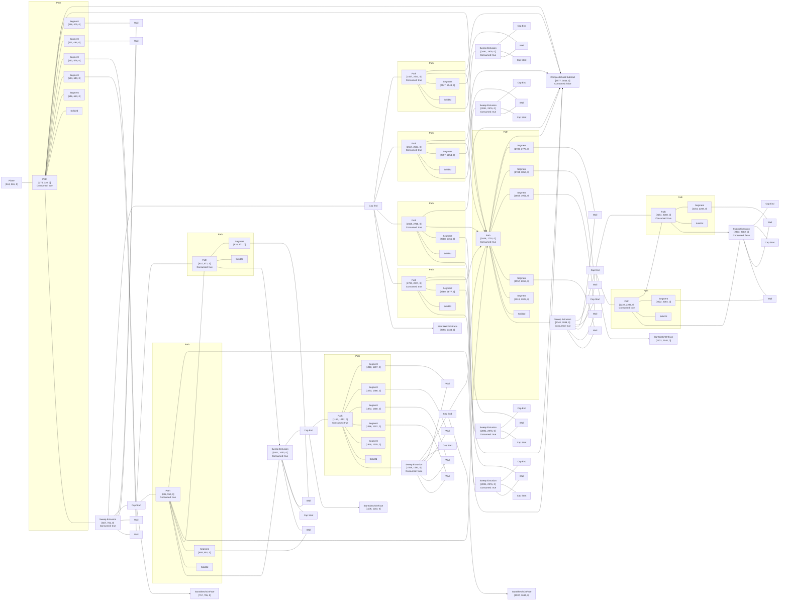

```mermaid
flowchart LR
  subgraph path20 [Path]
    20["Path<br>[1157, 1212, 0]<br>Consumed: true"]
      %% [ProgramBodyItem { index: 20 }, VariableDeclarationDeclaration, VariableDeclarationInit, PipeBodyItem { index: 0 }]
    32["Segment<br>[1218, 1287, 0]"]
      %% [ProgramBodyItem { index: 20 }, VariableDeclarationDeclaration, VariableDeclarationInit, PipeBodyItem { index: 1 }]
    33["Segment<br>[1293, 1366, 0]"]
      %% [ProgramBodyItem { index: 20 }, VariableDeclarationDeclaration, VariableDeclarationInit, PipeBodyItem { index: 2 }]
    34["Segment<br>[1372, 1460, 0]"]
      %% [ProgramBodyItem { index: 20 }, VariableDeclarationDeclaration, VariableDeclarationInit, PipeBodyItem { index: 3 }]
    35["Segment<br>[1466, 1522, 0]"]
      %% [ProgramBodyItem { index: 20 }, VariableDeclarationDeclaration, VariableDeclarationInit, PipeBodyItem { index: 4 }]
    36["Segment<br>[1528, 1535, 0]"]
      %% [ProgramBodyItem { index: 20 }, VariableDeclarationDeclaration, VariableDeclarationInit, PipeBodyItem { index: 5 }]
    55[Solid2d]
  end
  subgraph path21 [Path]
    21["Path<br>[1648, 1703, 0]<br>Consumed: true"]
      %% [ProgramBodyItem { index: 23 }, VariableDeclarationDeclaration, VariableDeclarationInit, PipeBodyItem { index: 0 }]
    37["Segment<br>[1709, 1778, 0]"]
      %% [ProgramBodyItem { index: 23 }, VariableDeclarationDeclaration, VariableDeclarationInit, PipeBodyItem { index: 1 }]
    38["Segment<br>[1784, 1857, 0]"]
      %% [ProgramBodyItem { index: 23 }, VariableDeclarationDeclaration, VariableDeclarationInit, PipeBodyItem { index: 2 }]
    39["Segment<br>[1863, 1951, 0]"]
      %% [ProgramBodyItem { index: 23 }, VariableDeclarationDeclaration, VariableDeclarationInit, PipeBodyItem { index: 3 }]
    40["Segment<br>[1957, 2013, 0]"]
      %% [ProgramBodyItem { index: 23 }, VariableDeclarationDeclaration, VariableDeclarationInit, PipeBodyItem { index: 4 }]
    41["Segment<br>[2019, 2026, 0]"]
      %% [ProgramBodyItem { index: 23 }, VariableDeclarationDeclaration, VariableDeclarationInit, PipeBodyItem { index: 5 }]
    56[Solid2d]
  end
  subgraph path22 [Path]
    22["Path<br>[2154, 2208, 0]<br>Consumed: true"]
      %% [ProgramBodyItem { index: 26 }, VariableDeclarationDeclaration, VariableDeclarationInit]
    42["Segment<br>[2154, 2208, 0]"]
      %% [ProgramBodyItem { index: 26 }, VariableDeclarationDeclaration, VariableDeclarationInit]
    57[Solid2d]
  end
  subgraph path23 [Path]
    23["Path<br>[2222, 2284, 0]<br>Consumed: true"]
      %% [ProgramBodyItem { index: 27 }, VariableDeclarationDeclaration, VariableDeclarationInit, PipeBodyItem { index: 0 }]
    43["Segment<br>[2222, 2284, 0]"]
      %% [ProgramBodyItem { index: 27 }, VariableDeclarationDeclaration, VariableDeclarationInit, PipeBodyItem { index: 0 }]
    58[Solid2d]
  end
  subgraph path24 [Path]
    24["Path<br>[2447, 2543, 0]<br>Consumed: true"]
      %% [ProgramBodyItem { index: 30 }, VariableDeclarationDeclaration, VariableDeclarationInit]
    44["Segment<br>[2447, 2543, 0]"]
      %% [ProgramBodyItem { index: 30 }, VariableDeclarationDeclaration, VariableDeclarationInit]
    59[Solid2d]
  end
  subgraph path25 [Path]
    25["Path<br>[2557, 2654, 0]<br>Consumed: true"]
      %% [ProgramBodyItem { index: 31 }, VariableDeclarationDeclaration, VariableDeclarationInit]
    45["Segment<br>[2557, 2654, 0]"]
      %% [ProgramBodyItem { index: 31 }, VariableDeclarationDeclaration, VariableDeclarationInit]
    60[Solid2d]
  end
  subgraph path26 [Path]
    26["Path<br>[2668, 2766, 0]<br>Consumed: true"]
      %% [ProgramBodyItem { index: 32 }, VariableDeclarationDeclaration, VariableDeclarationInit]
    46["Segment<br>[2668, 2766, 0]"]
      %% [ProgramBodyItem { index: 32 }, VariableDeclarationDeclaration, VariableDeclarationInit]
    61[Solid2d]
  end
  subgraph path27 [Path]
    27["Path<br>[275, 330, 0]<br>Consumed: true"]
      %% [ProgramBodyItem { index: 11 }, VariableDeclarationDeclaration, VariableDeclarationInit, PipeBodyItem { index: 0 }]
    48["Segment<br>[336, 405, 0]"]
      %% [ProgramBodyItem { index: 11 }, VariableDeclarationDeclaration, VariableDeclarationInit, PipeBodyItem { index: 1 }]
    49["Segment<br>[411, 484, 0]"]
      %% [ProgramBodyItem { index: 11 }, VariableDeclarationDeclaration, VariableDeclarationInit, PipeBodyItem { index: 2 }]
    50["Segment<br>[490, 578, 0]"]
      %% [ProgramBodyItem { index: 11 }, VariableDeclarationDeclaration, VariableDeclarationInit, PipeBodyItem { index: 3 }]
    51["Segment<br>[584, 640, 0]"]
      %% [ProgramBodyItem { index: 11 }, VariableDeclarationDeclaration, VariableDeclarationInit, PipeBodyItem { index: 4 }]
    52["Segment<br>[646, 653, 0]"]
      %% [ProgramBodyItem { index: 11 }, VariableDeclarationDeclaration, VariableDeclarationInit, PipeBodyItem { index: 5 }]
    62[Solid2d]
  end
  subgraph path28 [Path]
    28["Path<br>[2780, 2877, 0]<br>Consumed: true"]
      %% [ProgramBodyItem { index: 33 }, VariableDeclarationDeclaration, VariableDeclarationInit]
    47["Segment<br>[2780, 2877, 0]"]
      %% [ProgramBodyItem { index: 33 }, VariableDeclarationDeclaration, VariableDeclarationInit]
    63[Solid2d]
  end
  subgraph path29 [Path]
    29["Path<br>[810, 871, 0]<br>Consumed: true"]
      %% [ProgramBodyItem { index: 15 }, VariableDeclarationDeclaration, VariableDeclarationInit]
    53["Segment<br>[810, 871, 0]"]
      %% [ProgramBodyItem { index: 15 }, VariableDeclarationDeclaration, VariableDeclarationInit]
    64[Solid2d]
  end
  subgraph path30 [Path]
    30["Path<br>[885, 952, 0]<br>Consumed: true"]
      %% [ProgramBodyItem { index: 16 }, VariableDeclarationDeclaration, VariableDeclarationInit, PipeBodyItem { index: 0 }]
    54["Segment<br>[885, 952, 0]"]
      %% [ProgramBodyItem { index: 16 }, VariableDeclarationDeclaration, VariableDeclarationInit, PipeBodyItem { index: 0 }]
    65[Solid2d]
  end
  1["Cap End"]
    %% face_code_ref=[ProgramBodyItem { index: 19 }, VariableDeclarationDeclaration, VariableDeclarationInit]
  2["Cap End"]
    %% face_code_ref=[ProgramBodyItem { index: 22 }, VariableDeclarationDeclaration, VariableDeclarationInit]
  3["Cap End"]
    %% face_code_ref=[ProgramBodyItem { index: 25 }, VariableDeclarationDeclaration, VariableDeclarationInit]
  4["Cap End"]
    %% face_code_ref=[ProgramBodyItem { index: 29 }, VariableDeclarationDeclaration, VariableDeclarationInit]
  5["Cap End"]
    %% face_code_ref=Missing NodePath
  6["Cap End"]
    %% face_code_ref=Missing NodePath
  7["Cap End"]
    %% face_code_ref=Missing NodePath
  8["Cap End"]
    %% face_code_ref=Missing NodePath
  9["Cap End"]
    %% face_code_ref=Missing NodePath
  10["Cap Start"]
    %% face_code_ref=[ProgramBodyItem { index: 14 }, VariableDeclarationDeclaration, VariableDeclarationInit]
  11["Cap Start"]
    %% face_code_ref=Missing NodePath
  12["Cap Start"]
    %% face_code_ref=Missing NodePath
  13["Cap Start"]
    %% face_code_ref=Missing NodePath
  14["Cap Start"]
    %% face_code_ref=Missing NodePath
  15["Cap Start"]
    %% face_code_ref=Missing NodePath
  16["Cap Start"]
    %% face_code_ref=Missing NodePath
  17["Cap Start"]
    %% face_code_ref=Missing NodePath
  18["Cap Start"]
    %% face_code_ref=Missing NodePath
  19["CompositeSolid Subtract<br>[2977, 3043, 0]<br>Consumed: false"]
    %% [ProgramBodyItem { index: 35 }, ExpressionStatementExpr]
  31["Plane<br>[244, 261, 0]"]
    %% [ProgramBodyItem { index: 10 }, VariableDeclarationDeclaration, VariableDeclarationInit]
  66["StartSketchOnFace<br>[1106, 1143, 0]"]
    %% [ProgramBodyItem { index: 19 }, VariableDeclarationDeclaration, VariableDeclarationInit]
  67["StartSketchOnFace<br>[1597, 1634, 0]"]
    %% [ProgramBodyItem { index: 22 }, VariableDeclarationDeclaration, VariableDeclarationInit]
  68["StartSketchOnFace<br>[2103, 2140, 0]"]
    %% [ProgramBodyItem { index: 25 }, VariableDeclarationDeclaration, VariableDeclarationInit]
  69["StartSketchOnFace<br>[2396, 2433, 0]"]
    %% [ProgramBodyItem { index: 29 }, VariableDeclarationDeclaration, VariableDeclarationInit]
  70["StartSketchOnFace<br>[757, 796, 0]"]
    %% [ProgramBodyItem { index: 14 }, VariableDeclarationDeclaration, VariableDeclarationInit]
  71["Sweep Extrusion<br>[1001, 1050, 0]<br>Consumed: true"]
    %% [ProgramBodyItem { index: 17 }, VariableDeclarationDeclaration, VariableDeclarationInit]
  72["Sweep Extrusion<br>[1549, 1583, 0]<br>Consumed: false"]
    %% [ProgramBodyItem { index: 21 }, VariableDeclarationDeclaration, VariableDeclarationInit]
  73["Sweep Extrusion<br>[2040, 2089, 0]<br>Consumed: true"]
    %% [ProgramBodyItem { index: 24 }, VariableDeclarationDeclaration, VariableDeclarationInit]
  74["Sweep Extrusion<br>[2333, 2382, 0]<br>Consumed: false"]
    %% [ProgramBodyItem { index: 28 }, VariableDeclarationDeclaration, VariableDeclarationInit]
  75["Sweep Extrusion<br>[2891, 2976, 0]<br>Consumed: true"]
    %% [ProgramBodyItem { index: 34 }, VariableDeclarationDeclaration, VariableDeclarationInit]
  76["Sweep Extrusion<br>[2891, 2976, 0]<br>Consumed: true"]
    %% [ProgramBodyItem { index: 34 }, VariableDeclarationDeclaration, VariableDeclarationInit]
  77["Sweep Extrusion<br>[2891, 2976, 0]<br>Consumed: true"]
    %% [ProgramBodyItem { index: 34 }, VariableDeclarationDeclaration, VariableDeclarationInit]
  78["Sweep Extrusion<br>[2891, 2976, 0]<br>Consumed: true"]
    %% [ProgramBodyItem { index: 34 }, VariableDeclarationDeclaration, VariableDeclarationInit]
  79["Sweep Extrusion<br>[667, 701, 0]<br>Consumed: true"]
    %% [ProgramBodyItem { index: 12 }, VariableDeclarationDeclaration, VariableDeclarationInit]
  80[Wall]
    %% face_code_ref=Missing NodePath
  81[Wall]
    %% face_code_ref=Missing NodePath
  82[Wall]
    %% face_code_ref=Missing NodePath
  83[Wall]
    %% face_code_ref=Missing NodePath
  84[Wall]
    %% face_code_ref=Missing NodePath
  85[Wall]
    %% face_code_ref=Missing NodePath
  86[Wall]
    %% face_code_ref=Missing NodePath
  87[Wall]
    %% face_code_ref=Missing NodePath
  88[Wall]
    %% face_code_ref=Missing NodePath
  89[Wall]
    %% face_code_ref=Missing NodePath
  90[Wall]
    %% face_code_ref=Missing NodePath
  91[Wall]
    %% face_code_ref=Missing NodePath
  92[Wall]
    %% face_code_ref=Missing NodePath
  93[Wall]
    %% face_code_ref=Missing NodePath
  94[Wall]
    %% face_code_ref=Missing NodePath
  95[Wall]
    %% face_code_ref=Missing NodePath
  96[Wall]
    %% face_code_ref=Missing NodePath
  97[Wall]
    %% face_code_ref=Missing NodePath
  98[Wall]
    %% face_code_ref=Missing NodePath
  99[Wall]
    %% face_code_ref=Missing NodePath
  1 --- 20
  1 <--x 66
  71 --- 1
  2 --- 21
  2 <--x 67
  72 --- 2
  3 --- 22
  3 --- 23
  3 <--x 68
  73 --- 3
  4 --- 24
  4 --- 25
  4 --- 26
  4 --- 28
  4 <--x 69
  79 --- 4
  74 --- 5
  75 --- 6
  76 --- 7
  77 --- 8
  78 --- 9
  10 --- 29
  10 --- 30
  10 <--x 70
  79 --- 10
  71 --- 11
  72 --- 12
  73 --- 13
  74 --- 14
  75 --- 15
  76 --- 16
  77 --- 17
  78 --- 18
  21 x--> 19
  24 x--> 19
  25 x--> 19
  26 x--> 19
  27 x--> 19
  28 x--> 19
  30 x--> 19
  20 --- 32
  20 --- 33
  20 --- 34
  20 --- 35
  20 --- 36
  20 --- 55
  20 ---- 72
  24 <--x 21
  25 <--x 21
  26 <--x 21
  27 <--x 21
  28 <--x 21
  30 <--x 21
  21 --- 37
  21 --- 38
  21 --- 39
  21 --- 40
  21 --- 41
  21 --- 56
  21 ---- 73
  23 --- 22
  22 --- 42
  22 --- 57
  22 x---> 74
  23 --- 43
  23 --- 58
  23 ---- 74
  24 --- 44
  24 --- 59
  24 ---- 75
  25 --- 45
  25 --- 60
  25 ---- 76
  26 --- 46
  26 --- 61
  26 ---- 77
  31 --- 27
  27 --- 48
  27 --- 49
  27 --- 50
  27 --- 51
  27 --- 52
  27 --- 62
  27 ---- 79
  28 --- 47
  28 --- 63
  28 ---- 78
  30 --- 29
  29 --- 53
  29 --- 64
  29 x---> 71
  30 --- 54
  30 --- 65
  30 ---- 71
  32 --- 80
  33 --- 81
  34 --- 82
  35 --- 83
  37 --- 84
  38 --- 85
  39 --- 86
  40 --- 87
  42 --- 88
  43 --- 89
  44 --- 90
  45 --- 91
  46 --- 92
  47 --- 93
  48 --- 94
  49 --- 95
  50 --- 96
  51 --- 97
  53 --- 98
  54 --- 99
  71 --- 98
  71 --- 99
  72 --- 80
  72 --- 81
  72 --- 82
  72 --- 83
  73 --- 84
  73 --- 85
  73 --- 86
  73 --- 87
  74 --- 88
  74 --- 89
  75 --- 90
  76 --- 91
  77 --- 92
  78 --- 93
  79 --- 94
  79 --- 95
  79 --- 96
  79 --- 97
```
