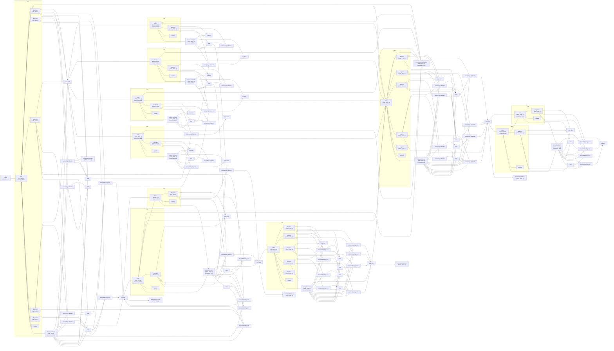

```mermaid
flowchart LR
  subgraph path27 [Path]
    27["Path<br>[275, 330, 0]<br>Consumed: true"]
      %% [ProgramBodyItem { index: 11 }, VariableDeclarationDeclaration, VariableDeclarationInit, PipeBodyItem { index: 0 }]
    48["Segment<br>[336, 405, 0]"]
      %% [ProgramBodyItem { index: 11 }, VariableDeclarationDeclaration, VariableDeclarationInit, PipeBodyItem { index: 1 }]
    49["Segment<br>[411, 484, 0]"]
      %% [ProgramBodyItem { index: 11 }, VariableDeclarationDeclaration, VariableDeclarationInit, PipeBodyItem { index: 2 }]
    50["Segment<br>[490, 578, 0]"]
      %% [ProgramBodyItem { index: 11 }, VariableDeclarationDeclaration, VariableDeclarationInit, PipeBodyItem { index: 3 }]
    51["Segment<br>[584, 640, 0]"]
      %% [ProgramBodyItem { index: 11 }, VariableDeclarationDeclaration, VariableDeclarationInit, PipeBodyItem { index: 4 }]
    52["Segment<br>[646, 653, 0]"]
      %% [ProgramBodyItem { index: 11 }, VariableDeclarationDeclaration, VariableDeclarationInit, PipeBodyItem { index: 5 }]
    62[Solid2d]
  end
  subgraph path29 [Path]
    29["Path<br>[810, 871, 0]<br>Consumed: true"]
      %% [ProgramBodyItem { index: 15 }, VariableDeclarationDeclaration, VariableDeclarationInit]
    53["Segment<br>[810, 871, 0]"]
      %% [ProgramBodyItem { index: 15 }, VariableDeclarationDeclaration, VariableDeclarationInit]
    64[Solid2d]
  end
  subgraph path30 [Path]
    30["Path<br>[885, 952, 0]<br>Consumed: true"]
      %% [ProgramBodyItem { index: 16 }, VariableDeclarationDeclaration, VariableDeclarationInit, PipeBodyItem { index: 0 }]
    54["Segment<br>[885, 952, 0]"]
      %% [ProgramBodyItem { index: 16 }, VariableDeclarationDeclaration, VariableDeclarationInit, PipeBodyItem { index: 0 }]
    65[Solid2d]
  end
  subgraph path20 [Path]
    20["Path<br>[1157, 1212, 0]<br>Consumed: true"]
      %% [ProgramBodyItem { index: 20 }, VariableDeclarationDeclaration, VariableDeclarationInit, PipeBodyItem { index: 0 }]
    32["Segment<br>[1218, 1287, 0]"]
      %% [ProgramBodyItem { index: 20 }, VariableDeclarationDeclaration, VariableDeclarationInit, PipeBodyItem { index: 1 }]
    33["Segment<br>[1293, 1366, 0]"]
      %% [ProgramBodyItem { index: 20 }, VariableDeclarationDeclaration, VariableDeclarationInit, PipeBodyItem { index: 2 }]
    34["Segment<br>[1372, 1460, 0]"]
      %% [ProgramBodyItem { index: 20 }, VariableDeclarationDeclaration, VariableDeclarationInit, PipeBodyItem { index: 3 }]
    35["Segment<br>[1466, 1522, 0]"]
      %% [ProgramBodyItem { index: 20 }, VariableDeclarationDeclaration, VariableDeclarationInit, PipeBodyItem { index: 4 }]
    36["Segment<br>[1528, 1535, 0]"]
      %% [ProgramBodyItem { index: 20 }, VariableDeclarationDeclaration, VariableDeclarationInit, PipeBodyItem { index: 5 }]
    55[Solid2d]
  end
  subgraph path21 [Path]
    21["Path<br>[1648, 1703, 0]<br>Consumed: true"]
      %% [ProgramBodyItem { index: 23 }, VariableDeclarationDeclaration, VariableDeclarationInit, PipeBodyItem { index: 0 }]
    37["Segment<br>[1709, 1778, 0]"]
      %% [ProgramBodyItem { index: 23 }, VariableDeclarationDeclaration, VariableDeclarationInit, PipeBodyItem { index: 1 }]
    38["Segment<br>[1784, 1857, 0]"]
      %% [ProgramBodyItem { index: 23 }, VariableDeclarationDeclaration, VariableDeclarationInit, PipeBodyItem { index: 2 }]
    39["Segment<br>[1863, 1951, 0]"]
      %% [ProgramBodyItem { index: 23 }, VariableDeclarationDeclaration, VariableDeclarationInit, PipeBodyItem { index: 3 }]
    40["Segment<br>[1957, 2013, 0]"]
      %% [ProgramBodyItem { index: 23 }, VariableDeclarationDeclaration, VariableDeclarationInit, PipeBodyItem { index: 4 }]
    41["Segment<br>[2019, 2026, 0]"]
      %% [ProgramBodyItem { index: 23 }, VariableDeclarationDeclaration, VariableDeclarationInit, PipeBodyItem { index: 5 }]
    56[Solid2d]
  end
  subgraph path22 [Path]
    22["Path<br>[2154, 2208, 0]<br>Consumed: true"]
      %% [ProgramBodyItem { index: 26 }, VariableDeclarationDeclaration, VariableDeclarationInit]
    42["Segment<br>[2154, 2208, 0]"]
      %% [ProgramBodyItem { index: 26 }, VariableDeclarationDeclaration, VariableDeclarationInit]
    57[Solid2d]
  end
  subgraph path23 [Path]
    23["Path<br>[2222, 2284, 0]<br>Consumed: true"]
      %% [ProgramBodyItem { index: 27 }, VariableDeclarationDeclaration, VariableDeclarationInit, PipeBodyItem { index: 0 }]
    43["Segment<br>[2222, 2284, 0]"]
      %% [ProgramBodyItem { index: 27 }, VariableDeclarationDeclaration, VariableDeclarationInit, PipeBodyItem { index: 0 }]
    58[Solid2d]
  end
  subgraph path24 [Path]
    24["Path<br>[2447, 2543, 0]<br>Consumed: true"]
      %% [ProgramBodyItem { index: 30 }, VariableDeclarationDeclaration, VariableDeclarationInit]
    44["Segment<br>[2447, 2543, 0]"]
      %% [ProgramBodyItem { index: 30 }, VariableDeclarationDeclaration, VariableDeclarationInit]
    59[Solid2d]
  end
  subgraph path25 [Path]
    25["Path<br>[2557, 2654, 0]<br>Consumed: true"]
      %% [ProgramBodyItem { index: 31 }, VariableDeclarationDeclaration, VariableDeclarationInit]
    45["Segment<br>[2557, 2654, 0]"]
      %% [ProgramBodyItem { index: 31 }, VariableDeclarationDeclaration, VariableDeclarationInit]
    60[Solid2d]
  end
  subgraph path26 [Path]
    26["Path<br>[2668, 2766, 0]<br>Consumed: true"]
      %% [ProgramBodyItem { index: 32 }, VariableDeclarationDeclaration, VariableDeclarationInit]
    46["Segment<br>[2668, 2766, 0]"]
      %% [ProgramBodyItem { index: 32 }, VariableDeclarationDeclaration, VariableDeclarationInit]
    61[Solid2d]
  end
  subgraph path28 [Path]
    28["Path<br>[2780, 2877, 0]<br>Consumed: true"]
      %% [ProgramBodyItem { index: 33 }, VariableDeclarationDeclaration, VariableDeclarationInit]
    47["Segment<br>[2780, 2877, 0]"]
      %% [ProgramBodyItem { index: 33 }, VariableDeclarationDeclaration, VariableDeclarationInit]
    63[Solid2d]
  end
  31["Plane<br>[244, 261, 0]"]
    %% [ProgramBodyItem { index: 10 }, VariableDeclarationDeclaration, VariableDeclarationInit]
  79["Sweep Extrusion<br>[667, 701, 0]<br>Consumed: true"]
    %% [ProgramBodyItem { index: 12 }, VariableDeclarationDeclaration, VariableDeclarationInit]
  134[Wall]
    %% face_code_ref=Missing NodePath
  135[Wall]
    %% face_code_ref=Missing NodePath
  136[Wall]
    %% face_code_ref=Missing NodePath
  137[Wall]
    %% face_code_ref=Missing NodePath
  10["Cap Start"]
    %% face_code_ref=[ProgramBodyItem { index: 14 }, VariableDeclarationDeclaration, VariableDeclarationInit]
  4["Cap End"]
    %% face_code_ref=[ProgramBodyItem { index: 29 }, VariableDeclarationDeclaration, VariableDeclarationInit]
  116["SweepEdge Opposite"]
  94["SweepEdge Adjacent"]
  117["SweepEdge Opposite"]
  95["SweepEdge Adjacent"]
  118["SweepEdge Opposite"]
  96["SweepEdge Adjacent"]
  119["SweepEdge Opposite"]
  97["SweepEdge Adjacent"]
  71["Sweep Extrusion<br>[1001, 1050, 0]<br>Consumed: true"]
    %% [ProgramBodyItem { index: 17 }, VariableDeclarationDeclaration, VariableDeclarationInit]
  139[Wall]
    %% face_code_ref=Missing NodePath
  138[Wall]
    %% face_code_ref=Missing NodePath
  11["Cap Start"]
    %% face_code_ref=Missing NodePath
  1["Cap End"]
    %% face_code_ref=[ProgramBodyItem { index: 19 }, VariableDeclarationDeclaration, VariableDeclarationInit]
  111["SweepEdge Opposite"]
  99["SweepEdge Adjacent"]
  110["SweepEdge Opposite"]
  98["SweepEdge Adjacent"]
  72["Sweep Extrusion<br>[1549, 1583, 0]<br>Consumed: false"]
    %% [ProgramBodyItem { index: 21 }, VariableDeclarationDeclaration, VariableDeclarationInit]
  120[Wall]
    %% face_code_ref=Missing NodePath
  121[Wall]
    %% face_code_ref=Missing NodePath
  122[Wall]
    %% face_code_ref=Missing NodePath
  123[Wall]
    %% face_code_ref=Missing NodePath
  12["Cap Start"]
    %% face_code_ref=Missing NodePath
  2["Cap End"]
    %% face_code_ref=[ProgramBodyItem { index: 22 }, VariableDeclarationDeclaration, VariableDeclarationInit]
  100["SweepEdge Opposite"]
  80["SweepEdge Adjacent"]
  101["SweepEdge Opposite"]
  81["SweepEdge Adjacent"]
  102["SweepEdge Opposite"]
  82["SweepEdge Adjacent"]
  103["SweepEdge Opposite"]
  83["SweepEdge Adjacent"]
  73["Sweep Extrusion<br>[2040, 2089, 0]<br>Consumed: true"]
    %% [ProgramBodyItem { index: 24 }, VariableDeclarationDeclaration, VariableDeclarationInit]
  124[Wall]
    %% face_code_ref=Missing NodePath
  125[Wall]
    %% face_code_ref=Missing NodePath
  126[Wall]
    %% face_code_ref=Missing NodePath
  127[Wall]
    %% face_code_ref=Missing NodePath
  13["Cap Start"]
    %% face_code_ref=Missing NodePath
  3["Cap End"]
    %% face_code_ref=[ProgramBodyItem { index: 25 }, VariableDeclarationDeclaration, VariableDeclarationInit]
  104["SweepEdge Opposite"]
  84["SweepEdge Adjacent"]
  105["SweepEdge Opposite"]
  85["SweepEdge Adjacent"]
  106["SweepEdge Opposite"]
  86["SweepEdge Adjacent"]
  107["SweepEdge Opposite"]
  87["SweepEdge Adjacent"]
  74["Sweep Extrusion<br>[2333, 2382, 0]<br>Consumed: false"]
    %% [ProgramBodyItem { index: 28 }, VariableDeclarationDeclaration, VariableDeclarationInit]
  129[Wall]
    %% face_code_ref=Missing NodePath
  128[Wall]
    %% face_code_ref=Missing NodePath
  14["Cap Start"]
    %% face_code_ref=Missing NodePath
  5["Cap End"]
    %% face_code_ref=Missing NodePath
  109["SweepEdge Opposite"]
  89["SweepEdge Adjacent"]
  108["SweepEdge Opposite"]
  88["SweepEdge Adjacent"]
  75["Sweep Extrusion<br>[2891, 2976, 0]<br>Consumed: true"]
    %% [ProgramBodyItem { index: 34 }, VariableDeclarationDeclaration, VariableDeclarationInit]
  130[Wall]
    %% face_code_ref=Missing NodePath
  15["Cap Start"]
    %% face_code_ref=Missing NodePath
  6["Cap End"]
    %% face_code_ref=Missing NodePath
  112["SweepEdge Opposite"]
  90["SweepEdge Adjacent"]
  76["Sweep Extrusion<br>[2891, 2976, 0]<br>Consumed: true"]
    %% [ProgramBodyItem { index: 34 }, VariableDeclarationDeclaration, VariableDeclarationInit]
  131[Wall]
    %% face_code_ref=Missing NodePath
  16["Cap Start"]
    %% face_code_ref=Missing NodePath
  7["Cap End"]
    %% face_code_ref=Missing NodePath
  113["SweepEdge Opposite"]
  91["SweepEdge Adjacent"]
  77["Sweep Extrusion<br>[2891, 2976, 0]<br>Consumed: true"]
    %% [ProgramBodyItem { index: 34 }, VariableDeclarationDeclaration, VariableDeclarationInit]
  132[Wall]
    %% face_code_ref=Missing NodePath
  17["Cap Start"]
    %% face_code_ref=Missing NodePath
  8["Cap End"]
    %% face_code_ref=Missing NodePath
  114["SweepEdge Opposite"]
  92["SweepEdge Adjacent"]
  78["Sweep Extrusion<br>[2891, 2976, 0]<br>Consumed: true"]
    %% [ProgramBodyItem { index: 34 }, VariableDeclarationDeclaration, VariableDeclarationInit]
  133[Wall]
    %% face_code_ref=Missing NodePath
  18["Cap Start"]
    %% face_code_ref=Missing NodePath
  9["Cap End"]
    %% face_code_ref=Missing NodePath
  115["SweepEdge Opposite"]
  93["SweepEdge Adjacent"]
  19["CompositeSolid Subtract<br>[2977, 3043, 0]<br>Consumed: false"]
    %% [ProgramBodyItem { index: 35 }, ExpressionStatementExpr]
  70["StartSketchOnFace<br>[757, 796, 0]"]
    %% [ProgramBodyItem { index: 14 }, VariableDeclarationDeclaration, VariableDeclarationInit]
  66["StartSketchOnFace<br>[1106, 1143, 0]"]
    %% [ProgramBodyItem { index: 19 }, VariableDeclarationDeclaration, VariableDeclarationInit]
  67["StartSketchOnFace<br>[1597, 1634, 0]"]
    %% [ProgramBodyItem { index: 22 }, VariableDeclarationDeclaration, VariableDeclarationInit]
  68["StartSketchOnFace<br>[2103, 2140, 0]"]
    %% [ProgramBodyItem { index: 25 }, VariableDeclarationDeclaration, VariableDeclarationInit]
  69["StartSketchOnFace<br>[2396, 2433, 0]"]
    %% [ProgramBodyItem { index: 29 }, VariableDeclarationDeclaration, VariableDeclarationInit]
  1 --- 20
  1 <--x 66
  71 --- 1
  110 <--x 1
  111 <--x 1
  2 --- 21
  2 <--x 67
  72 --- 2
  100 <--x 2
  101 <--x 2
  102 <--x 2
  103 <--x 2
  3 --- 22
  3 --- 23
  3 <--x 68
  73 --- 3
  104 <--x 3
  105 <--x 3
  106 <--x 3
  107 <--x 3
  4 --- 24
  4 --- 25
  4 --- 26
  4 --- 28
  48 <--x 4
  49 <--x 4
  50 <--x 4
  51 <--x 4
  4 <--x 69
  79 --- 4
  74 --- 5
  108 <--x 5
  109 <--x 5
  44 <--x 6
  75 --- 6
  45 <--x 7
  76 --- 7
  46 <--x 8
  77 --- 8
  47 <--x 9
  78 --- 9
  10 --- 29
  10 --- 30
  10 <--x 70
  79 --- 10
  116 <--x 10
  117 <--x 10
  118 <--x 10
  119 <--x 10
  53 <--x 11
  54 <--x 11
  71 --- 11
  32 <--x 12
  33 <--x 12
  34 <--x 12
  35 <--x 12
  72 --- 12
  37 <--x 13
  38 <--x 13
  39 <--x 13
  40 <--x 13
  73 --- 13
  42 <--x 14
  43 <--x 14
  74 --- 14
  75 --- 15
  112 <--x 15
  76 --- 16
  113 <--x 16
  77 --- 17
  114 <--x 17
  78 --- 18
  115 <--x 18
  21 x--> 19
  24 x--> 19
  25 x--> 19
  26 x--> 19
  27 x--> 19
  28 x--> 19
  30 x--> 19
  20 --- 32
  20 --- 33
  20 --- 34
  20 --- 35
  20 --- 36
  20 --- 55
  20 ---- 72
  24 <--x 21
  25 <--x 21
  26 <--x 21
  27 <--x 21
  28 <--x 21
  30 <--x 21
  21 --- 37
  21 --- 38
  21 --- 39
  21 --- 40
  21 --- 41
  21 --- 56
  21 ---- 73
  23 --- 22
  22 --- 42
  22 --- 57
  22 x---> 74
  23 --- 43
  23 --- 58
  23 ---- 74
  24 --- 44
  24 --- 59
  24 ---- 75
  25 --- 45
  25 --- 60
  25 ---- 76
  26 --- 46
  26 --- 61
  26 ---- 77
  31 --- 27
  27 --- 48
  27 --- 49
  27 --- 50
  27 --- 51
  27 --- 52
  27 --- 62
  27 ---- 79
  28 --- 47
  28 --- 63
  28 ---- 78
  30 --- 29
  29 --- 53
  29 --- 64
  29 x---> 71
  30 --- 54
  30 --- 65
  30 ---- 71
  32 --- 80
  32 --- 100
  32 --- 120
  33 --- 81
  33 --- 101
  33 --- 121
  34 --- 82
  34 --- 102
  34 --- 122
  35 --- 83
  35 --- 103
  35 --- 123
  37 --- 84
  37 --- 104
  37 --- 124
  38 --- 85
  38 --- 105
  38 --- 125
  39 --- 86
  39 --- 106
  39 --- 126
  40 --- 87
  40 --- 107
  40 --- 127
  42 --- 88
  42 --- 108
  42 --- 128
  43 --- 89
  43 --- 109
  43 --- 129
  44 --- 90
  44 --- 112
  44 --- 130
  45 --- 91
  45 --- 113
  45 --- 131
  46 --- 92
  46 --- 114
  46 --- 132
  47 --- 93
  47 --- 115
  47 --- 133
  48 --- 94
  48 --- 116
  48 --- 134
  49 --- 95
  49 --- 117
  49 --- 135
  50 --- 96
  50 --- 118
  50 --- 136
  51 --- 97
  51 --- 119
  51 --- 137
  53 --- 98
  53 --- 110
  53 --- 138
  54 --- 99
  54 --- 111
  54 --- 139
  71 --- 98
  71 --- 99
  71 --- 110
  71 --- 111
  71 --- 138
  71 --- 139
  72 --- 80
  72 --- 81
  72 --- 82
  72 --- 83
  72 --- 100
  72 --- 101
  72 --- 102
  72 --- 103
  72 --- 120
  72 --- 121
  72 --- 122
  72 --- 123
  73 --- 84
  73 --- 85
  73 --- 86
  73 --- 87
  73 --- 104
  73 --- 105
  73 --- 106
  73 --- 107
  73 --- 124
  73 --- 125
  73 --- 126
  73 --- 127
  74 --- 88
  74 --- 89
  74 --- 108
  74 --- 109
  74 --- 128
  74 --- 129
  75 --- 90
  75 --- 112
  75 --- 130
  76 --- 91
  76 --- 113
  76 --- 131
  77 --- 92
  77 --- 114
  77 --- 132
  78 --- 93
  78 --- 115
  78 --- 133
  79 --- 94
  79 --- 95
  79 --- 96
  79 --- 97
  79 --- 116
  79 --- 117
  79 --- 118
  79 --- 119
  79 --- 134
  79 --- 135
  79 --- 136
  79 --- 137
  120 --- 80
  80 x--> 120
  121 --- 81
  81 x--> 121
  122 --- 82
  82 x--> 122
  123 --- 83
  83 x--> 123
  124 --- 84
  84 x--> 124
  125 --- 85
  85 x--> 125
  126 --- 86
  86 x--> 126
  127 --- 87
  87 x--> 127
  128 --- 88
  129 --- 89
  130 --- 90
  131 --- 91
  132 --- 92
  133 --- 93
  134 --- 94
  94 x--> 134
  135 --- 95
  95 x--> 135
  136 --- 96
  96 x--> 136
  137 --- 97
  97 x--> 137
  138 --- 98
  139 --- 99
  120 --- 100
  121 --- 101
  122 --- 102
  123 --- 103
  124 --- 104
  125 --- 105
  126 --- 106
  127 --- 107
  128 --- 108
  129 --- 109
  130 --- 110
  131 --- 111
  132 --- 112
  133 --- 113
  134 --- 114
  135 --- 115
  136 --- 116
  137 --- 117
  138 --- 118
  139 --- 119
```
