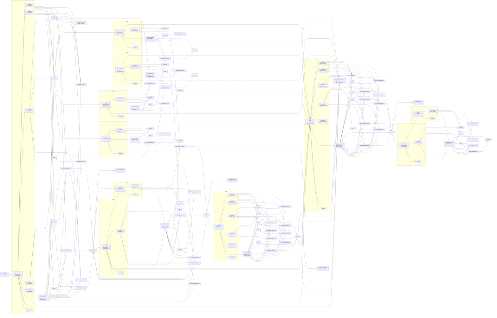

```mermaid
flowchart LR
  subgraph path35 [Path]
    35["Path<br>[275, 330, 0]<br>Consumed: true"]
      %% [ProgramBodyItem { index: 11 }, VariableDeclarationDeclaration, VariableDeclarationInit, PipeBodyItem { index: 0 }]
    36["Segment<br>[336, 405, 0]"]
      %% [ProgramBodyItem { index: 11 }, VariableDeclarationDeclaration, VariableDeclarationInit, PipeBodyItem { index: 1 }]
    37["Segment<br>[411, 484, 0]"]
      %% [ProgramBodyItem { index: 11 }, VariableDeclarationDeclaration, VariableDeclarationInit, PipeBodyItem { index: 2 }]
    38["Segment<br>[490, 578, 0]"]
      %% [ProgramBodyItem { index: 11 }, VariableDeclarationDeclaration, VariableDeclarationInit, PipeBodyItem { index: 3 }]
    39["Segment<br>[584, 640, 0]"]
      %% [ProgramBodyItem { index: 11 }, VariableDeclarationDeclaration, VariableDeclarationInit, PipeBodyItem { index: 4 }]
    40["Segment<br>[646, 653, 0]"]
      %% [ProgramBodyItem { index: 11 }, VariableDeclarationDeclaration, VariableDeclarationInit, PipeBodyItem { index: 5 }]
    96[Solid2d]
  end
  subgraph path44 [Path]
    44["Path<br>[810, 871, 0]<br>Consumed: true"]
      %% [ProgramBodyItem { index: 15 }, VariableDeclarationDeclaration, VariableDeclarationInit]
    45["Segment<br>[810, 871, 0]"]
      %% [ProgramBodyItem { index: 15 }, VariableDeclarationDeclaration, VariableDeclarationInit]
    98[Solid2d]
  end
  subgraph path46 [Path]
    46["Path<br>[885, 952, 0]<br>Consumed: true"]
      %% [ProgramBodyItem { index: 16 }, VariableDeclarationDeclaration, VariableDeclarationInit, PipeBodyItem { index: 0 }]
    47["Segment<br>[885, 952, 0]"]
      %% [ProgramBodyItem { index: 16 }, VariableDeclarationDeclaration, VariableDeclarationInit, PipeBodyItem { index: 0 }]
    99[Solid2d]
  end
  subgraph path51 [Path]
    51["Path<br>[1157, 1212, 0]<br>Consumed: true"]
      %% [ProgramBodyItem { index: 20 }, VariableDeclarationDeclaration, VariableDeclarationInit, PipeBodyItem { index: 0 }]
    52["Segment<br>[1218, 1287, 0]"]
      %% [ProgramBodyItem { index: 20 }, VariableDeclarationDeclaration, VariableDeclarationInit, PipeBodyItem { index: 1 }]
    53["Segment<br>[1293, 1366, 0]"]
      %% [ProgramBodyItem { index: 20 }, VariableDeclarationDeclaration, VariableDeclarationInit, PipeBodyItem { index: 2 }]
    54["Segment<br>[1372, 1460, 0]"]
      %% [ProgramBodyItem { index: 20 }, VariableDeclarationDeclaration, VariableDeclarationInit, PipeBodyItem { index: 3 }]
    55["Segment<br>[1466, 1522, 0]"]
      %% [ProgramBodyItem { index: 20 }, VariableDeclarationDeclaration, VariableDeclarationInit, PipeBodyItem { index: 4 }]
    56["Segment<br>[1528, 1535, 0]"]
      %% [ProgramBodyItem { index: 20 }, VariableDeclarationDeclaration, VariableDeclarationInit, PipeBodyItem { index: 5 }]
    89[Solid2d]
  end
  subgraph path60 [Path]
    60["Path<br>[1648, 1703, 0]<br>Consumed: true"]
      %% [ProgramBodyItem { index: 23 }, VariableDeclarationDeclaration, VariableDeclarationInit, PipeBodyItem { index: 0 }]
    61["Segment<br>[1709, 1778, 0]"]
      %% [ProgramBodyItem { index: 23 }, VariableDeclarationDeclaration, VariableDeclarationInit, PipeBodyItem { index: 1 }]
    62["Segment<br>[1784, 1857, 0]"]
      %% [ProgramBodyItem { index: 23 }, VariableDeclarationDeclaration, VariableDeclarationInit, PipeBodyItem { index: 2 }]
    63["Segment<br>[1863, 1951, 0]"]
      %% [ProgramBodyItem { index: 23 }, VariableDeclarationDeclaration, VariableDeclarationInit, PipeBodyItem { index: 3 }]
    64["Segment<br>[1957, 2013, 0]"]
      %% [ProgramBodyItem { index: 23 }, VariableDeclarationDeclaration, VariableDeclarationInit, PipeBodyItem { index: 4 }]
    65["Segment<br>[2019, 2026, 0]"]
      %% [ProgramBodyItem { index: 23 }, VariableDeclarationDeclaration, VariableDeclarationInit, PipeBodyItem { index: 5 }]
    90[Solid2d]
  end
  subgraph path69 [Path]
    69["Path<br>[2154, 2208, 0]<br>Consumed: true"]
      %% [ProgramBodyItem { index: 26 }, VariableDeclarationDeclaration, VariableDeclarationInit]
    70["Segment<br>[2154, 2208, 0]"]
      %% [ProgramBodyItem { index: 26 }, VariableDeclarationDeclaration, VariableDeclarationInit]
    91[Solid2d]
  end
  subgraph path71 [Path]
    71["Path<br>[2222, 2284, 0]<br>Consumed: true"]
      %% [ProgramBodyItem { index: 27 }, VariableDeclarationDeclaration, VariableDeclarationInit, PipeBodyItem { index: 0 }]
    72["Segment<br>[2222, 2284, 0]"]
      %% [ProgramBodyItem { index: 27 }, VariableDeclarationDeclaration, VariableDeclarationInit, PipeBodyItem { index: 0 }]
    92[Solid2d]
  end
  subgraph path76 [Path]
    76["Path<br>[2447, 2543, 0]<br>Consumed: true"]
      %% [ProgramBodyItem { index: 30 }, VariableDeclarationDeclaration, VariableDeclarationInit]
    77["Segment<br>[2447, 2543, 0]"]
      %% [ProgramBodyItem { index: 30 }, VariableDeclarationDeclaration, VariableDeclarationInit]
    93[Solid2d]
  end
  subgraph path78 [Path]
    78["Path<br>[2557, 2654, 0]<br>Consumed: true"]
      %% [ProgramBodyItem { index: 31 }, VariableDeclarationDeclaration, VariableDeclarationInit]
    79["Segment<br>[2557, 2654, 0]"]
      %% [ProgramBodyItem { index: 31 }, VariableDeclarationDeclaration, VariableDeclarationInit]
    94[Solid2d]
  end
  subgraph path80 [Path]
    80["Path<br>[2668, 2766, 0]<br>Consumed: true"]
      %% [ProgramBodyItem { index: 32 }, VariableDeclarationDeclaration, VariableDeclarationInit]
    81["Segment<br>[2668, 2766, 0]"]
      %% [ProgramBodyItem { index: 32 }, VariableDeclarationDeclaration, VariableDeclarationInit]
    95[Solid2d]
  end
  subgraph path82 [Path]
    82["Path<br>[2780, 2877, 0]<br>Consumed: true"]
      %% [ProgramBodyItem { index: 33 }, VariableDeclarationDeclaration, VariableDeclarationInit]
    83["Segment<br>[2780, 2877, 0]"]
      %% [ProgramBodyItem { index: 33 }, VariableDeclarationDeclaration, VariableDeclarationInit]
    97[Solid2d]
  end
  1["Cap End"]
    %% face_code_ref=Missing NodePath
  2["Cap End"]
    %% face_code_ref=Missing NodePath
  3["Cap End"]
    %% face_code_ref=Missing NodePath
  4["Cap End"]
    %% face_code_ref=Missing NodePath
  5["Cap End"]
    %% face_code_ref=Missing NodePath
  6["Cap Start"]
    %% face_code_ref=Missing NodePath
  7["Cap Start"]
    %% face_code_ref=Missing NodePath
  8["Cap Start"]
    %% face_code_ref=Missing NodePath
  9["Cap Start"]
    %% face_code_ref=Missing NodePath
  10["Cap Start"]
    %% face_code_ref=Missing NodePath
  11["Cap Start"]
    %% face_code_ref=Missing NodePath
  12["Cap Start"]
    %% face_code_ref=Missing NodePath
  13["Cap Start"]
    %% face_code_ref=Missing NodePath
  14[Wall]
    %% face_code_ref=Missing NodePath
  15[Wall]
    %% face_code_ref=Missing NodePath
  16[Wall]
    %% face_code_ref=Missing NodePath
  17[Wall]
    %% face_code_ref=Missing NodePath
  18[Wall]
    %% face_code_ref=Missing NodePath
  19[Wall]
    %% face_code_ref=Missing NodePath
  20[Wall]
    %% face_code_ref=Missing NodePath
  21[Wall]
    %% face_code_ref=Missing NodePath
  22[Wall]
    %% face_code_ref=Missing NodePath
  23[Wall]
    %% face_code_ref=Missing NodePath
  24[Wall]
    %% face_code_ref=Missing NodePath
  25[Wall]
    %% face_code_ref=Missing NodePath
  26[Wall]
    %% face_code_ref=Missing NodePath
  27[Wall]
    %% face_code_ref=Missing NodePath
  28[Wall]
    %% face_code_ref=Missing NodePath
  29[Wall]
    %% face_code_ref=Missing NodePath
  30[Wall]
    %% face_code_ref=Missing NodePath
  31[Wall]
    %% face_code_ref=Missing NodePath
  32[Wall]
    %% face_code_ref=Missing NodePath
  33[Wall]
    %% face_code_ref=Missing NodePath
  34["Plane<br>[244, 261, 0]"]
    %% [ProgramBodyItem { index: 10 }, VariableDeclarationDeclaration, VariableDeclarationInit]
  41["Sweep Extrusion<br>[667, 701, 0]<br>Consumed: true"]
    %% [ProgramBodyItem { index: 12 }, VariableDeclarationDeclaration, VariableDeclarationInit]
  42["Cap Start"]
    %% face_code_ref=[ProgramBodyItem { index: 14 }, VariableDeclarationDeclaration, VariableDeclarationInit]
  43["StartSketchOnFace<br>[757, 796, 0]"]
    %% [ProgramBodyItem { index: 14 }, VariableDeclarationDeclaration, VariableDeclarationInit]
  48["Sweep Extrusion<br>[1001, 1050, 0]<br>Consumed: true"]
    %% [ProgramBodyItem { index: 17 }, VariableDeclarationDeclaration, VariableDeclarationInit]
  49["Cap End"]
    %% face_code_ref=[ProgramBodyItem { index: 19 }, VariableDeclarationDeclaration, VariableDeclarationInit]
  50["StartSketchOnFace<br>[1106, 1143, 0]"]
    %% [ProgramBodyItem { index: 19 }, VariableDeclarationDeclaration, VariableDeclarationInit]
  57["Sweep Extrusion<br>[1549, 1583, 0]<br>Consumed: false"]
    %% [ProgramBodyItem { index: 21 }, VariableDeclarationDeclaration, VariableDeclarationInit]
  58["Cap End"]
    %% face_code_ref=[ProgramBodyItem { index: 22 }, VariableDeclarationDeclaration, VariableDeclarationInit]
  59["StartSketchOnFace<br>[1597, 1634, 0]"]
    %% [ProgramBodyItem { index: 22 }, VariableDeclarationDeclaration, VariableDeclarationInit]
  66["Sweep Extrusion<br>[2040, 2089, 0]<br>Consumed: true"]
    %% [ProgramBodyItem { index: 24 }, VariableDeclarationDeclaration, VariableDeclarationInit]
  67["Cap End"]
    %% face_code_ref=[ProgramBodyItem { index: 25 }, VariableDeclarationDeclaration, VariableDeclarationInit]
  68["StartSketchOnFace<br>[2103, 2140, 0]"]
    %% [ProgramBodyItem { index: 25 }, VariableDeclarationDeclaration, VariableDeclarationInit]
  73["Sweep Extrusion<br>[2333, 2382, 0]<br>Consumed: false"]
    %% [ProgramBodyItem { index: 28 }, VariableDeclarationDeclaration, VariableDeclarationInit]
  74["Cap End"]
    %% face_code_ref=[ProgramBodyItem { index: 29 }, VariableDeclarationDeclaration, VariableDeclarationInit]
  75["StartSketchOnFace<br>[2396, 2433, 0]"]
    %% [ProgramBodyItem { index: 29 }, VariableDeclarationDeclaration, VariableDeclarationInit]
  84["Sweep Extrusion<br>[2891, 2976, 0]<br>Consumed: true"]
    %% [ProgramBodyItem { index: 34 }, VariableDeclarationDeclaration, VariableDeclarationInit]
  85["Sweep Extrusion<br>[2891, 2976, 0]<br>Consumed: true"]
    %% [ProgramBodyItem { index: 34 }, VariableDeclarationDeclaration, VariableDeclarationInit]
  86["Sweep Extrusion<br>[2891, 2976, 0]<br>Consumed: true"]
    %% [ProgramBodyItem { index: 34 }, VariableDeclarationDeclaration, VariableDeclarationInit]
  87["Sweep Extrusion<br>[2891, 2976, 0]<br>Consumed: true"]
    %% [ProgramBodyItem { index: 34 }, VariableDeclarationDeclaration, VariableDeclarationInit]
  88["CompositeSolid Subtract<br>[2977, 3043, 0]<br>Consumed: false"]
    %% [ProgramBodyItem { index: 35 }, ExpressionStatementExpr]
  100["SweepEdge Adjacent"]
  101["SweepEdge Adjacent"]
  102["SweepEdge Adjacent"]
  103["SweepEdge Adjacent"]
  104["SweepEdge Adjacent"]
  105["SweepEdge Adjacent"]
  106["SweepEdge Adjacent"]
  107["SweepEdge Adjacent"]
  108["SweepEdge Adjacent"]
  109["SweepEdge Adjacent"]
  110["SweepEdge Adjacent"]
  111["SweepEdge Adjacent"]
  112["SweepEdge Adjacent"]
  113["SweepEdge Adjacent"]
  114["SweepEdge Adjacent"]
  115["SweepEdge Adjacent"]
  116["SweepEdge Adjacent"]
  117["SweepEdge Adjacent"]
  118["SweepEdge Adjacent"]
  119["SweepEdge Adjacent"]
  120["SweepEdge Opposite"]
  121["SweepEdge Opposite"]
  122["SweepEdge Opposite"]
  123["SweepEdge Opposite"]
  124["SweepEdge Opposite"]
  125["SweepEdge Opposite"]
  126["SweepEdge Opposite"]
  127["SweepEdge Opposite"]
  128["SweepEdge Opposite"]
  129["SweepEdge Opposite"]
  130["SweepEdge Opposite"]
  131["SweepEdge Opposite"]
  132["SweepEdge Opposite"]
  133["SweepEdge Opposite"]
  134["SweepEdge Opposite"]
  135["SweepEdge Opposite"]
  136["SweepEdge Opposite"]
  137["SweepEdge Opposite"]
  138["SweepEdge Opposite"]
  139["SweepEdge Opposite"]
  73 --- 1
  128 <--x 1
  129 <--x 1
  77 <--x 2
  84 --- 2
  79 <--x 3
  85 --- 3
  81 <--x 4
  86 --- 4
  83 <--x 5
  87 --- 5
  45 <--x 6
  47 <--x 6
  48 --- 6
  52 <--x 7
  53 <--x 7
  54 <--x 7
  55 <--x 7
  57 --- 7
  61 <--x 8
  62 <--x 8
  63 <--x 8
  64 <--x 8
  66 --- 8
  70 <--x 9
  72 <--x 9
  73 --- 9
  84 --- 10
  132 <--x 10
  85 --- 11
  133 <--x 11
  86 --- 12
  134 <--x 12
  87 --- 13
  135 <--x 13
  52 --- 14
  57 --- 14
  14 --- 100
  100 <--x 14
  14 --- 120
  53 --- 15
  57 --- 15
  15 --- 101
  101 <--x 15
  15 --- 121
  54 --- 16
  57 --- 16
  16 --- 102
  102 <--x 16
  16 --- 122
  55 --- 17
  57 --- 17
  17 --- 103
  103 <--x 17
  17 --- 123
  61 --- 18
  66 --- 18
  18 --- 104
  104 <--x 18
  18 --- 124
  62 --- 19
  66 --- 19
  19 --- 105
  105 <--x 19
  19 --- 125
  63 --- 20
  66 --- 20
  20 --- 106
  106 <--x 20
  20 --- 126
  64 --- 21
  66 --- 21
  21 --- 107
  107 <--x 21
  21 --- 127
  70 --- 22
  73 --- 22
  22 --- 108
  22 --- 128
  72 --- 23
  73 --- 23
  23 --- 109
  23 --- 129
  77 --- 24
  84 --- 24
  24 --- 110
  24 --- 130
  79 --- 25
  85 --- 25
  25 --- 111
  25 --- 131
  81 --- 26
  86 --- 26
  26 --- 112
  26 --- 132
  83 --- 27
  87 --- 27
  27 --- 113
  27 --- 133
  36 --- 28
  41 --- 28
  28 --- 114
  114 <--x 28
  28 --- 134
  37 --- 29
  41 --- 29
  29 --- 115
  115 <--x 29
  29 --- 135
  38 --- 30
  41 --- 30
  30 --- 116
  116 <--x 30
  30 --- 136
  39 --- 31
  41 --- 31
  31 --- 117
  117 <--x 31
  31 --- 137
  45 --- 32
  48 --- 32
  32 --- 118
  32 --- 138
  47 --- 33
  48 --- 33
  33 --- 119
  33 --- 139
  34 --- 35
  35 --- 36
  35 --- 37
  35 --- 38
  35 --- 39
  35 --- 40
  35 ---- 41
  35 x--> 60
  35 <--x 88
  35 --- 96
  36 x--> 74
  36 --- 114
  36 --- 136
  37 x--> 74
  37 --- 115
  37 --- 137
  38 x--> 74
  38 --- 116
  38 --- 138
  39 x--> 74
  39 --- 117
  39 --- 139
  41 --- 42
  41 --- 74
  41 --- 114
  41 --- 115
  41 --- 116
  41 --- 117
  41 --- 136
  41 --- 137
  41 --- 138
  41 --- 139
  42 <--x 43
  42 --- 44
  42 --- 46
  136 <--x 42
  137 <--x 42
  138 <--x 42
  139 <--x 42
  44 --- 45
  46 --- 44
  44 x---> 48
  44 --- 98
  45 --- 118
  45 --- 130
  46 --- 47
  46 ---- 48
  46 x--> 60
  46 <--x 88
  46 --- 99
  47 --- 119
  47 --- 131
  48 --- 49
  48 --- 118
  48 --- 119
  48 --- 130
  48 --- 131
  49 <--x 50
  49 --- 51
  130 <--x 49
  131 <--x 49
  51 --- 52
  51 --- 53
  51 --- 54
  51 --- 55
  51 --- 56
  51 ---- 57
  51 --- 89
  52 --- 100
  52 --- 120
  53 --- 101
  53 --- 121
  54 --- 102
  54 --- 122
  55 --- 103
  55 --- 123
  57 --- 58
  57 --- 100
  57 --- 101
  57 --- 102
  57 --- 103
  57 --- 120
  57 --- 121
  57 --- 122
  57 --- 123
  58 <--x 59
  58 --- 60
  120 <--x 58
  121 <--x 58
  122 <--x 58
  123 <--x 58
  60 --- 61
  60 --- 62
  60 --- 63
  60 --- 64
  60 --- 65
  60 ---- 66
  76 <--x 60
  78 <--x 60
  80 <--x 60
  82 <--x 60
  60 <--x 88
  60 --- 90
  61 --- 104
  61 --- 124
  62 --- 105
  62 --- 125
  63 --- 106
  63 --- 126
  64 --- 107
  64 --- 127
  66 --- 67
  66 --- 104
  66 --- 105
  66 --- 106
  66 --- 107
  66 --- 124
  66 --- 125
  66 --- 126
  66 --- 127
  67 <--x 68
  67 --- 69
  67 --- 71
  124 <--x 67
  125 <--x 67
  126 <--x 67
  127 <--x 67
  69 --- 70
  71 --- 69
  69 x---> 73
  69 --- 91
  70 --- 108
  70 --- 128
  71 --- 72
  71 ---- 73
  71 --- 92
  72 --- 109
  72 --- 129
  73 --- 108
  73 --- 109
  73 --- 128
  73 --- 129
  74 <--x 75
  74 --- 76
  74 --- 78
  74 --- 80
  74 --- 82
  76 --- 77
  76 ---- 84
  76 <--x 88
  76 --- 93
  77 --- 110
  77 --- 132
  78 --- 79
  78 ---- 85
  78 <--x 88
  78 --- 94
  79 --- 111
  79 --- 133
  80 --- 81
  80 ---- 86
  80 <--x 88
  80 --- 95
  81 --- 112
  81 --- 134
  82 --- 83
  82 ---- 87
  82 <--x 88
  82 --- 97
  83 --- 113
  83 --- 135
  84 --- 110
  84 --- 132
  85 --- 111
  85 --- 133
  86 --- 112
  86 --- 134
  87 --- 113
  87 --- 135
```
